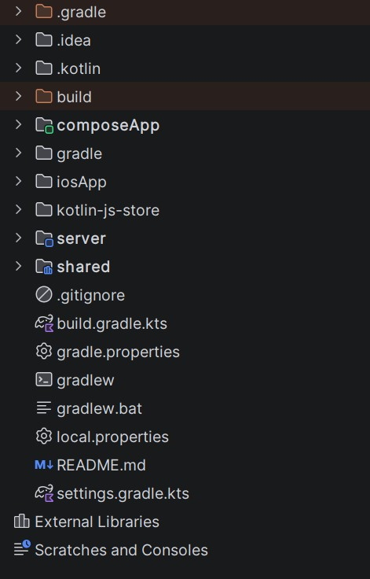
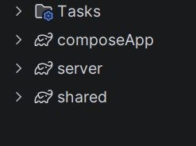
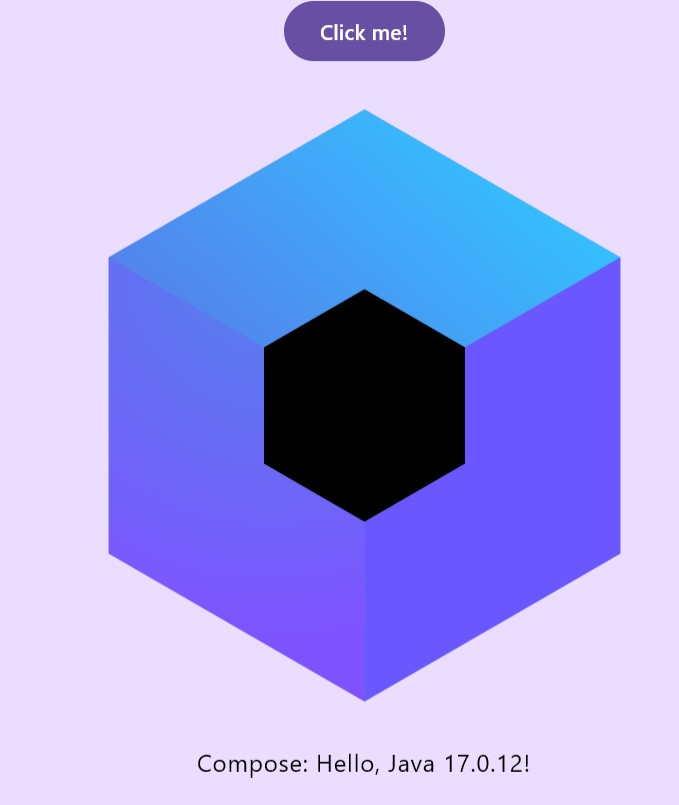

# Labor 1 - Kotlin Multiplatform alapok, környezet megismerése

## Bevezető

A labor során megismerjük a Kotlin Multiplatform (KMP) alapú alkalmazások fejlesztéséhez használandó környezetet és megvizsgáljuk azt egy egyszerű alkalmazáson keresztül. A labor célja, hogy a későbbiekhez alapul szolgáljon a fejlesztőkörnyezet és a KMP projektek felépítése, konfigurálása és futtatása szempontjából.


## Előkészületek

A feladatok megoldása során ne felejtsük el követni a [feladat beadás folyamatát](../../tudnivalok/github/GitHub.md).

### Git repository létrehozása és letöltése

1. Moodle-ben keressük meg a laborhoz tartozó meghívó URL-jét és annak segítségével hozzuk létre a saját repositoryt.

2. Várjuk meg, míg elkészül a repository, majd checkout-oljuk ki.

3. Hozzunk létre egy új ágat `megoldas` néven, és ezen az ágon dolgozzunk.

4. A `neptun.txt` fájlba írjuk bele a Neptun kódunkat. A fájlban semmi más ne szerepeljen, csak egyetlen sorban a Neptun kód 6 karaktere.

## Fejlesztői környezet kialakítása

Kotlin Multiplatform alkalmazások fejlesztéséhez a JetBrains hivatalosan az Android Studiot vagy az Intellij Ideat ajánlja. Funkcionalitásban ekvivalensek, az Android Studio kényelmesebb támogatást ad Android fejlesztéshez, az Intellij Idea pedig Java / Kotlin alapú JVM alkalmazások fejlesztéséhez áll jobban kézre.  Mivel Android platformra való futtatáshoz amúgy is szükség lesz emulátorra (vagy saját fizikai eszközre), ezért kényelmes választás az Android Studio (bár Idea-ban vagy akár parancssorból is megoldható az emulátorok kezelése és futtatása). A tárgyon az Android Studiot fogjuk használni ás a laborok útmutatója arra vonatkozik, de preferencia szerint az Intellij Idea is használható.

!!!info "Verziószámok"
		A későbbiekben problémákat okozhatnak a régebbi verziójú fejlesztőkörnyezetek a tárgyban kiadott segédanyagokkal és laborokkal kapcsolatban, ezért célszerű a legújabb stabil releaset használni. Ez jelenleg Android Studio Panda 1 (2025.3.1), illetve Intellij Community Edition 2025.3.2, (Build: 253.30387.90).

!!!note "Fleet"
        Régebben a Kotlin Multiplatform fejlesztéshez a JetBrains egy kifejezetten erre a célra fejlesztett standalone fejlesztőkörnyezetet, a _Fleet_-et javasolta. Ennek támogatottsága azonban nemrég megszűnt, ezért a jövőben Android Studio vagy Intellij Idea használata javasolt.


Amennyiben még nincs telepítve megfelelő verziójú fejlesztőkörnyezet, töltsük le és telepítsük az [_Android Studiot_](https://developer.android.com/studio/releases) vagy az [_Intellij Ideat_](https://www.jetbrains.com/idea/download/?section=windows).

 Akármelyiket is választottuk, telepítsük a _Kotlin Multiplatform_ plugint is.

## Android alapok (kiegészítő anyag)

A következőkben az Android alapjairól, a fordítás folyamatáról, az SDK telepítéséről, az AVD használatáról és az Android Studio felépítéséről és eszközeiről olvashatunk. Mindezek közül számunkra a továbbiakban közvetlenül az emulátorok használata a legfontosabb, hiszen ezen tudjuk elsősorban futtatni a Kotlin Multiplatform projektünket Android platformon, de ha nem találkoztunk még Androiddal, célszerű legalább egyszer átfutni a többi részét is. Amennyiben mindezt már ismerjük, ugorjuk át ezt a szekciót és folytassuk a _Kiinduló alkalmazás generálása_ pontnál.

### Fordítás menete Android platformon

Egy android projekt létrehozása után a forráskód az `src` könyvtárban van. A felhasználói felület leírására régebben XML-t használtak, manapság már Jetpack Compose használata javasolt, azonban előfordulhatnak még régebbi rendszerek vagy egyéb szélsőséges esetek miatt XML alapú felületleírók is. Ezek az esetleges XML állományok a `res` könyvtárban találhatók, amennyiben vannak ilyenek. Az erőforrás állományokat egy `R.java` állomány köti össze a forráskóddal, így könnyedén elérhetjük Java/Kotlin oldalról az XML-ben definiált felületi elemeket. Az Android projekt fordításának eredménye egy APK állomány, melyet közvetlenül telepíthetünk mobil eszközre.


*Fordítás menete Android platformon*

1.  A fejlesztő elkészíti a Kotlin forráskódot, valamint az esetleges XML alapú felhasználói felület leírást a szükséges erőforrás állományokkal.

2.  A fejlesztőkörnyezet az erőforrás állományokból folyamatosan naprakészen tartja az `R.java` erőforrás fájlt a fejlesztéshez és a fordításhoz. 

    !!! danger "FONTOS"
     	**Az `R.java` állomány generált, kézzel SOHA ne módosítsuk!** (Az Android Studio egyébként nem is hagyja.)

3.  A fejlesztő a Manifest állományban beállítja az alkalmazás hozzáférési jogosultságait (pl. Internet elérés, szenzorok használata, stb.), illetve ha futás idejű jogosultságok szükségesek, ezt kezeli.

4.  A fordító a forráskódból, az erőforrásokból és a külső könyvtárakból előállítja az [**ART**](https://source.android.com/docs/core/dalvik) virtuális gép gépi kódját.

5.  A gépi kódból és az erőforrásokból előáll a nem aláírt APK állomány.

6.  Végül a rendszer végrehajtja az aláírást és előáll a készülékekre telepíthető, aláírt APK.

Az Android Studio a [Gradle](https://gradle.org/) build rendszert használja ezeknek a lépéseknek az elvégézéséhez.

!!! note "Megjegyzések"
	*	A teljes folyamat a fejlesztői gépen megy végbe, a készülékekre már csak bináris állomány jut el.

	*   A külső könyvtárak általában JAR állományként, vagy egy másik projekt hozzáadásával illeszthetők az aktuális projekthez (de ezt nem kell kézzel megtennünk, a függőségek kezelésében is a Gradle fog segíteni).
	
	*   Az APK állomány leginkább a Java világban ismert JAR állományokhoz hasonlítható.
	
	*   A Manifest állományban meg kell adni a támogatni kívánt Android verziót, mely felfele kompatibilis az újabb verziókkal, ennél régebbi verzióra azonban az alkalmazás már nem telepíthető.
	
	*   Az Android folyamatosan frissülő verzióival folymatosan lépést kell tartaniuk a fejlesztőknek.
	
	*   Az Android alkalmazásokat tipikusan a Google Play Store-ban szokták publikálni, így az APK formátumban való terjesztés nem annyira elterjedt.


### SDK és könyvtárai

A [developer.android.com/studio](https://developer.android.com/studio) oldalról külön is letölthető az SDK. Ennek fontosabb mappáit, eszközeit tekintsük át!


SDK szerkezet:

*   `docs:` Dokumentáció
*   `extras:` Különböző extra szoftverek helye. Maven repository, support libes anyagok, analytics SDK, Google [Android USB driver](https://developer.android.com/studio/run/win-usb.html) (amennyiben SDK managerrel ezt is letöltöttük) stb.
*   `platform-tools:` Fastboot és ADB binárisok helye (legtöbbet használt eszközök)
*   `platforms`, `samples`, `sources`, `system-images:` Minden API levelhez külön almappában a platform anyagok, források, példaprojektek, OS image-ek
*   `tools:` Fordítást és tesztelést segítő eszközök, SDK manager, 9Patch drawer, emulátor binárisok stb.

### AVD és SDK manager

Az SDK kezelésére az SDK managert használjuk, ezzel lehet letölteni és frissen tartani az eszközeinket. Indítása az Android Studion keresztül lehetséges.

Az SDK Manager ikonja a fenti toolbaron (vagy Tools -> SDK Manager):


vagy


SDK manager felülete:


!!! note "Megjegyzés"
	Korábban létezett egy standalone SDK manager de ennek használata mára deprecated lett. Ha online forrásokban ilyet látunk ne lepődjünk meg.

Indítsuk el az AVD managert!

### AVD

Az AVD az Android Virtual Device rövidítése. Nem csak valódi eszközön futtathatjuk a kódunkat, hanem emulátoron is. Az AVD indítása a fejlesztői környezeten keresztül lehetséges, illetve parancssorból is.

Az AVD Manager ikonja:


vagy


A fenti képen jobb oldalon, a kinyíló panelben, a létező virtuális eszközök listáját találjuk, bal oldalon pedig az ún. eszköz definíciókét. Itt néhány előre elkészített sablon áll rendelkezésre. Magunk is készíthetünk ilyet, ha tipikusan egy adott eszközre szeretnénk fejleszteni (pl. Galaxy S4). Készítsünk új emulátort! Értelemszerűen csak olyan API szintű eszközt készíthetünk, amilyenek rendelkezésre állnak az SDK manageren keresztül.

1. A jobb oldali panelon kattintsunk a fent található *Create Virtual Device...* gombra!
2. Válasszunk az előre definiált készülék sablonokból (pl. *Pixel 7 Pro*), majd nyomjuk meg a *Next* gombot.
3. Döntsük el, hogy milyen Android verziójú emulátort kívánunk használni. CPU/ABI alapvetően x86_64 legyen, mivel ezekhez kapunk [hardveres gyorsítást](https://developer.android.com/studio/run/emulator-acceleration) is. Itt válasszunk a rendelkezésre állók közül egyet, majd *Next*.
4. Az eszköz részletes konfigurációja.

    - A virtuális eszköz neve legyen például `Labor_1`.
    - Válasszuk ki az alapértelmezett orientációt, tetszés szerint kapcsoljuk ki vagy be a készülék keretének megjelenítését.

    A *Show Advanced Settings* alatt további opciókat találunk:

    - Kamera opciók:
        - *WebcamX*, hardveres kamera, ami a számítógépre van csatlakoztatva
        - *Emulated*, egy egyszerű szoftveres megoldás, **most legalább az egyik kamera legyen ilyen**.
        - *VirtualScene*, egy kifinomultabb szoftveres megoldás, amelyben egy 3D világban mozgathatjuk a kamerát.
    - Hálózat: Állíthatjuk a sebességét és a késleltetését is kommunikációs technológiák szerint.
    - *Boot Option*: Nemrég jelent meg az Android emulátor állapotáról való pillanatkép elmentésének lehetősége. Ez azt takarja, hogy a virtuális operációs rendszer csak felfüggesztésre kerül az emulátor bezáráskor (például a megnyitott alkalmazás is megmarad, a teljes állapotával), és *Quick boot* esetben a teljes OS indítása helyett másodperceken belül elindul az emulált rendszer. *Cold Boot* esetben minden alkalommal leállítja és újra indítja a virtális eszköz teljes operációs rendszerét.
    - Memória és tárhely: 
        - RAM: Ha kevés a rendszermemóriánk, nem érdemes 768 MB-nál többet adni, mert könnyen futhatunk problémákba. Ha az emulátor lefagy, vagy az egész OS megáll működés közben, akkor állítsuk alacsonyabbra ezt az értéket. 16 GB vagy több rendszermemória mellett nyugodtan állíthatjuk az emulátor memóriáját jóval magasabb értékekre.
        - VM heap: az alkalmazások virtuális gépének szól, maradhat az alapérték. Tudni kell, hogy készülékek esetében gyártónként változik.
        - Belső flash memória és SD kártya mérete, alapvetően jók az alapértelmezett beállításai.

    - Ha mindent rendben talál az ablak, akkor *Finish*!


Az Android Virtual Device Manager-ben megjelent az imént létrehozott eszközünk. Itt lehetőség van a korábban megadott paraméterek szerkesztésére, a "készülékről" a felhasználói adatok törlésére (*Wipe Data* - Teljes visszaállítás), illetve az emulátor példány duplikálására vagy törlésére.

A Play gombbal indítsuk el az új emulátort!

Az elindított emulátoron próbáljuk ki az *API Demos* és *Dev Tools* alkalmazásokat!

!!! note "Megjegyzés"
	A gyári emulátoron kívül több alternatíva is létezik, mint pl. a [Genymotion](https://www.genymotion.com/fun-zone/) vagy a [BigNox](https://www.bignox.com/), viszont a Google féle emulátor a legelterjedtebb, így amennyiben ezzel nem jelentkeznek problémáink, maradjunk ennél.

Tesztelés céljából nagyon jól használható az emulátor, amely az alábbi képen látható plusz funkciókat is adja. Lehetőség van többek között egyedi hely beállítására, bejövő hívás szimulálására, stb. A panelt a futó emulátor jobb oldalán található vezérlő gombok közül a *...* gombbal lehet megnyitni:


### Android Studio hasznos tudnivalók

#### Android Studio

Tekintsük át az Android Studio alapvető funkcióit.

*   **Import régi projektekből:** Android Studioban lehetséges a projekt importálása régebbi verziójú projektekből és a régi Eclipse projektekből is.
*   **Projektstruktúra:** Az Android Studio Gradle-lel fordít. Projekten belül:
    *   `.idea`: IDE fájlok
    *   `app`: forrás
        *   `build`: fordított állományok
        *   `libs`: libraryk
        *   `src`: forráskód, azon belül is külön projekt a tesztnek, és azon belül pedig `res` könyvtár, illetve `java`. Utóbbin belül már a csomagok vannak.
    *   `gradle`: Gradle fájlok

*   **Hasznos funkciók:**
    *   IntelliSense, fejlett refaktorálás támogatás
    *   Ha egy sorban színre, vagy képi erőforrásra hivatkozunk, a sor elejére kitesz egy miniatűr változatot.
    *   Ha közvetve hivatkozott erőforrást (akár `resources.get...`, akár `R...`) adunk meg, összecsukja a hivatkozást és a tényleges értéket mutatja. Ha rávisszük az egeret felfedi, ha kattintunk kibontja a hivatkozást.
    *   Névtelen belső osztályokkal is hasonlót tud, javítva a kód olvashatóságát.
    *   Kódkiegészítésnél szabad a kereső, a szótöredéket keresi, nem pedig a szóval kezdődő lehetőségeket (lásd képen)
    *   Változónév ajánlás: amikor változónévre van szükségünk, nyomjunk *Ctrl+Space*-t. Ha adottak a körülmények, a Studio egész jó neveket tud felajánlani.
    *   Szigorú lint. A Studio megengedi a warningot. Ezért szigorúbb a lint, több mindenre figyelmeztet (olyan apróságra is, hogy egy View egyik oldalán van padding, a másikon nincs)
    *   Layout szerkesztés. A grafikus layout építés lehetséges.
    *   CTRL-t lenyomva navigálhatunk a kódban, pl. osztályra, metódushívásra kattintva. Ezt a navigációt (és az egyszerű másik osztályba kattintást is) rögzíti, és a historyban előre-hátra gombokkal lehet lépkedni. Ha van az egerünkön/billentyűzetünkön ilyen gomb, és netes böngészés közben aktívan használjuk, ezt a funkciót nagyon hasznosnak fogjuk találni.


*Szín ikonja a sor elején; kiemelve jobb oldalon, hogy melyik nézeten vagyunk; szabadszavas kiegészítés; a "Hello world" igazából `@string/very_very_very_long_hello_world`.*


#### Billentyűkombinációk

*   <kbd>CTRL</kbd> + <kbd>ALT</kbd> + <kbd>L</kbd>: Kódformázás
*   <kbd>CTRL</kbd> + <kbd>SPACE</kbd>: Kódkiegészítés
*   <kbd>SHIFT</kbd> + <kbd>F6</kbd> Átnevezés (Mindenhol)
*   <kbd>F2</kbd>: A következő error-ra ugrik. Ha nincs error, akkor warningra.
*   <kbd>CTRL</kbd> + <kbd>Z</kbd> illetve <kbd>CTRL</kbd> + <kbd>SHIFT</kbd> + <kbd>Z</kbd>: Visszavonás és Mégis
*   <kbd>CTRL</kbd> + <kbd>P</kbd>: Paraméterek mutatása
*   <kbd>ALT</kbd> + <kbd>INSERT</kbd>: Metódus generálása
*   <kbd>CTRL</kbd> + <kbd>O</kbd>: Metódus felüldefiniálása
*   <kbd>CTRL</kbd> + <kbd>F9</kbd>: Fordítás
*   <kbd>SHIFT</kbd> + <kbd>F10</kbd>: Fordítás és futtatás
*   <kbd>SHIFT</kbd> <kbd>SHIFT</kbd>: Keresés mindenhol
*   <kbd>CTRL</kbd> + <kbd>N</kbd>: Keresés osztályokban
*   <kbd>CTRL</kbd> + <kbd>SHIFT</kbd> + <kbd>N</kbd>: Keresés fájlokban
*   <kbd>CTRL</kbd> + <kbd>ALT</kbd> + <kbd>SHIFT</kbd> + <kbd>N</kbd>: Keresés szimbólumokban (például függvények, property-k)
*   <kbd>CTRL</kbd> + <kbd>SHIFT</kbd> + <kbd>A</kbd>: Keresés a beállításokban, kiadható parancsokban.

#### Eszközök, szerkesztők

A *View* menü *Tool Windows* menüpontjában lehetőség van különböző ablakok ki- és bekapcsolására. Próbáljuk ki és nézzük meg a következő ablakokat!

*   Project
*   Structure
*   TODO
*   Logcat
*   Terminal
*   Event Log
*   Gradle

Lehetőség van felosztani a szerkesztőablakot, ehhez kattinsunk egy megnyitott fájl tabfülére jobb gombbal, *Split Vertically/Horizontally*!

#### Hasznos beállítások

*   kis- nagybetű érzékenység kikapcsolása a kódkiegészítőben (settingsben keresés: *sensitive*)
*   "laptop mód" ki- és bekapcsolása (*File -> Power Save Mode*)
*   sorszámozás bekapcsolása (kód melletti részen bal oldalt: jobb egérgomb, *Show Line Numbers*)

#### Generálható elemek

A Studio sok sablont tartalmaz, röviden tekintsük át a lehetőségeket:

*   Projektfában, projektre jobb gombbal kattintva -> new -> module
*   Projektfában, modulon belül, "java"-ra kattintva jobb gombbal -> new
*   Forráskódban <kbd>ALT</kbd>+<kbd>INSERT</kbd> billentyűkombinációra

#### Android Profiler

A készülék erőforráshasználata [monitorozható](https://developer.android.com/studio/profile/android-profiler) ezen a felületen, amelyet az említett *View -> Tool Windows*-ból érhetünk el.


Például részletes információt kaphatunk a hálózati forgalomról:


#### Database Inspector

A készüléken debuggolt alkalmazásunknak az [adatbázisát](https://developer.android.com/studio/inspect/database) is meg tudjuk tekinteni.


#### Device File Explorer

A készüléken lévő fájlrendszert is [böngészhetjük](https://developer.android.com/studio/debug/device-file-explorer).


## Kiinduló alkalmazás generálása
Kotlin Multiplatform projektek generálására az ajánlott módszer a fejlesztőkörnyezetben, a Kotlin Multiplatform plugin által adott varázsló használata. Android Studioban a szükséges templatet a File > New > New Project > Generic > Kotlin Multiplatform pont alatt találjuk. Amennyiben nincs ilyen, úgy a plugin telepítése nem sikerült megfelelően. 

!!!note "Webes generátor használata KMP projekt létrehozásához"
	Amennyiben az IDE varázsló használata során probléma vagy hibásan generált projektbe ütköznénk (nem jellemző), használhatjuk az alábbi, webes generátort is: https://kmp.jetbrains.com/. 
	Android Studioban vagy Intellij IDEA-ban is van lehetőség a megfelelő pluginek telepítése után (lásd korábban) KMP projektek létrehozására. Android Studioban például a szokásos módon (File > New > New Project) választhatjuk a Kotlin Multiplatform projekt templatet.
	
Hozzuk létre a projektet az alábbiaknak megfelelően:

1. Az alkalmazás neve _KMPIntroduction_ legyen
2. A package name _hu.bme.aut_
3. A minimum SDK az Android platform SDK minimum verzióját jelenti, hagyhatjuk a defaulton (API 24 "Nougat")
4. Válasszuk ki a projekt lokációját a Git repositorynkban, majd > Next

Ezután kell kiválasztanunk, hogy milyen platformokat szeretnénk támogatni a projektünkben.

5. Pipáljuk be mindet: Android, iOS, Desktop és Web
6. Kiválaszthatjuk a mobilos és Desktop / Web platformokhoz, hogy szeretnénk-e megosztani a felhasználói felület kódját. Mindkettőre igent válaszoljunk (Share UI).
7. Pipáljuk be a Server és Include Tests opciókat is, ezek értlemszerűen egy szervert Ktor keretrendszerben, illetve default teszt modulokat is generálnak
8. Ha minden rendben, > Finish

!!!note "További templatek"
	Az alap, általános templaten túl további kiinduló projektek is elérhetők a webes generátorban, a https://kmp.jetbrains.com/templates/ linken. A megfelelő template kiinduló projektje letölthető.

## Projekt szerkezetének áttekintése

A letöltött projektet megnyitva automatikusan elindul a projekt Gradle importálása, amelynek sikeres lefutása után a következőhöz hasonlót kell látnunk. Fontos, hogy Android Studioban a szokásos _Android_ nézet helyett  a _Project_ nézetet válasszuk:

<p align="center">

</p>

!!! info "Gradle taskok futásideje"
	A gradle import és minden egyéb gradle taskok futása a legelső alkalommal lassú lehet, viszont a későbbi futtatások a gradle cachelési működése miatt már gyorsabbak lesznek.

Tekintsük most át a projekt felépítését! A fontosabb elemek a következők:

- A `.gradle` folder tartalmazza az importálás során letöltött függőségeket és egyéb metaadatokat.
- A `.idea` folder tartalmazza a projekt lokális IDE beállításait.
- A `composeApp` gradle almodul tartalmazza a projektünk felhasználói felületéhez tartozó forráskódot és erőforrásfájlokat. A `src` mappán belül láthatjuk a különböző platformokhoz tartozó Source Seteket: `commonMain`, `iosMain`, `jvmMain` és `webMain` (illetve `commonTest` a közös UI kódhoz tartozó teszteknek). Mindegyik modulon belül egy .kt kiterjesztésű fájlt találunk, ezekben található az alkalmazás belépési pontja az adott platformra. A közös UI a commonMain `App` függvényében van definiálva, ahol Compose Multiplatform segítségével egy gombot jelenítünk meg. Ennél többet jelenleg még nem kell tudnunk róla, a Composeról részletesebben a következő laboron (és a kapcsolódó előadásokon) hallunk majd.
- A  folder a Gradle beállításait és verzióinformációit tartalmazza.
- Az `iosApp` az iOS alkalmazás XCode projektje, ami közvetlenül megnyitható XCodeban. Swift kódot tartalmazhat, ami az IOS app futtatásához szükséges. Amennyiben nem shared UI-t használnánk az iOS alkalmazáshoz, itt kellene megírni annak UI kódját is.
- A `server` mappában található a Ktor szerverünkhöz tartozó forráskód, erőforrás állományok és a fordítás közben generált egyéb fájlok (függőségek, classfájlok, bat fájlok stb). Az `Application` fájlban van definiálva a szerver elindítása és egy default `get` végpont. Ennél többet jelenleg nem kell tudnunk róla.
- A `shared` modul szerepe ugyanaz, mint a `composeApp` volt, viszont ide minden más, a felhasználói felületet nem érintő kód (üzleti logika és adatmodellek) kerül. Ily módon a Kotlin Multiplatform a projekt felépítésének szintjén is elkülöníti a UI-hoz szükséges kódot az alkalmazás többi részétől.
- A `shared` és `composeApp` modulokban lévő `commonTest` az adott modul tesztjeit tartalmazza, egy `CommonTest` végződésű osztályon belül. Láthatjuk, hogy az osztályon belül a `@Test` annotációval ellátott metódusok lesznek a konkrét tesztesetek. Esetünkben egyetlen egyszerű teszt generálódott a kiinduló projekttel, amit futtatni is egyszerűen tudunk. Ha az osztály melletti dupla zöld nyílra kattintunk, akkor az osztályban lévő összes tesztet futtathatjuk egyszerre. Lehetőségünk van debug módban is futtatni, illetve lefedettségi metrikákat is generálni az adott tesztekre. Ugyanezt megtehetjük egyetlen tesztesetre is, az adott metódus melletti egyszeres zöld nyílra kattinta. Akármennyit is futtatunk, a kiválasztott konfiguráció után azt is meg kell mondanunk, hogy melyik platformon szeretnénk futtatni. A tesztelésről részletesebben később lesz szó.

!!!note "Shared modul használata"
	A `shared` modul használata természetesen nem kötelező, akár a `composeApp`-on belül is elhelyezhetnénk az üzleti logikáért és adatmodellért felelős részeket. A JetBrains és a Google best practice ajánlásai között viszont már erősen szerepel a _shared_ modulban való elkülönítés.

## Kotlin Multiplatform projektek konfigurálása Gradle-vel

Láthatjuk, hogy Android alkalmazásokhoz hasonlóan a KMP projektek kezelésére is a _Gradle_ keretrendszert használhatjuk. A _Gradle_ egy projektautomatizációs eszköz, ennek használatával végezhetjük el a függőségek kezelését, a fordítással és a futtatással kapcsolatos műveleteket.

A  `composeApp` és a `shared` modul gyökerében található az adott modul gradle konfigurációs fájlja (build.gradle.kts), nyissuk ezeket meg és tekintsük át a legfontosabb részeit!

A _plugins_ blokkban adjuk meg a használt Gradle pluginokat. Esetünkben:

- `kotlinMultiplatform`: Engedélyezi a Kotlin Multiplatform támogatást, lehetővé téve kód megosztását különböző platformok között. Segítségével definiálhatunk közös kódot, platform specifikus source seteket adhatunk meg (androidMain, iOSMain stb.), könnyedén konfigurálhatjuk a különböző targeteket, illetve lehetővé teszi az expect-actual mechanizmus használatát platformfüggő implementációkhoz.
- `androidApplication`: Az Android alkalmazás fordításához szükséges Gradle plugin.
- `composeMultiplatform`: Lehetővé teszi a felhasználói felület közös leírását a Jetpack Compose API segítségével.
- `composeCompiler`: A Compose komponensek megfelelő fordításához szükséges.
- `composeHotReload`: Compose Multiplatform Hot Reload funkcionalitását oldja meg, részletek későbbi laboron és előadáson.

A `kotlin` blokkban definiáljuk a támogatott platformokat és a hozzájuk tartozó konfigurációkat függőségeket. Itt adjuk meg az Android, iOS, jvm, js és wasmJs SourceSetjeinket. Ezeken belül tudnánk további beállításokat is eszközölni, pl. `js` `browser` blokkját kibontva beállíthatnánk, milyen böngészőt használjon automatikus tesztek futtatásakor. A `sourceSets` blokkon belül adjuk meg a közös kód modulját (`commonMain`), annak beállításait és függőségeit itt részleteznénk.
 
!!!note "Intermediate SourceSet"
	A projektünk SourceSetjei valójában úgynevezett intermediate (köztes) SourceSetek, mert különböző, elemi SourceSetekre vonatkozó közös kódot fognak össze. Például az iosMain intermediate source set, mert az iOS-specifikus kódot közös helyen tartja a különböző architektúrák számára (iosX64, iosArm64, iosSimulatorArm64). Ezek a SourceSetek "beépítetten", a Kotlin Multiplatform által ajánlottak. Ha valamilyen okból fogva ezeket külön akarnánk kezelni, azt is megtehetjük, ez esetben saját, csak az adott platformra vonatkozó SourceSetet kellene létrehoznunk. Saját SourceSetet szintén itt, a _sourceSets_ blokkon belül definiálhatunk az eddigiekhez hasonló módon, erre később látunk majd példát is.

Az `android` blokk tartalmazza az Android-specifikus konfigurációkat is:

- namespace: Az alkalmazás egyedi azonosítója.
- compileSdk, minSdk, targetSdk: A támogatott Android SDK verziók.
- buildTypes: A release és debug build konfigurációk.

A `compose.desktop` blokk a Desktop alkalmazások beállításait tartalmazza. Például megadhatjuk:

- Az alkalmazás belépési pontját (mainClass).
- A natív disztribúciós beállításokat, vagyis hogy milyen bináris formátumok generálását támogatja az alkalmazás (pl. .dmg, .msi, .deb fájlformátumokat a különböző operációs rendszerekhez).


Vessünk egy pillantást a gradle > libs.versions.toml fájlra is. Ez egy deklaratív módja a projektben használt függőségek és verziók áttekinhető kezelésének. Segítségével központilag kezelhetjük a verziókat, így könnyebb frissíteni azokat. A build.gradle.kts fájlok ezáltal tisztábbak és átláthatóbbak lesznek, illetve elejét vehetjük az eltérő verziók használatából adódó problémáknak is.

- A versions blokkban a különböző könyvtárak pontos verzióit adjuk meg.
- A libraries blokkban az egyes függőségeket definiáljuk, amelyek egy adott verzióra hivatkoznak a versions blokkból.
- A plugins blokkban a Gradle pluginokat és azok verzióit konfiguráljuk.

Nézzük végig a többi Gradle-höz kapcsolódó fájlt is:

* `gradle.properties`: Rendszerszintű beállításokat adhatunk meg a build-folyamattal, memória használattal és egyebekkel kapcsolatban.
* `gradlew`, `gradlew.bat`: Ezek biztosítják, hogy a Gradle megfelelően legyen telepítve a komponensek esetében és használhassunk hozzá kapcsolódó parancsokat (pl. _gradle build_ ), ezeket a parancsokat - pontosabban a parancsok futtatásához szükséges wrappert a gyökérben található `/gradle` könyvtár tartalmazza
* `settings.gradle.kts` Itt találhatóak a projekt alapvető beállításai (pl. a projekt neve)


## Gradle taskok

Az alkalmazás futtatását és binárisok / végrehajthatók generálását a Gradle segítségével tehetjük meg. A Gradle az ehhez hasonló feladatokhoz úgynevezett _Taskokat_ definiál, ezeket futtatva tudunk különböző műveleteket végrehajtani a projektünkön. A projekt Gradle importálásakor létrejöttek a megfelelő taskok, amiket használhatunk. Tekintsünk meg ezeket részletesebben!

!!! warning "JDK verzió"
       Ellenőrizzük, hogy rendelkezünk-e megfelelő verziójú JDK-val! Ennek legegyszerűbb módja parancssorban a `java -version` parancs kiadása. Amennyiben nem található JDK a pathen vagy 17.0-nál régebbi, telepítsünk egy legalább 17.0 vagy annál frissebb JDK-t, és frissítsük a környezeti változókat is:
	   
    * JAVA_HOME a JDK könyvtárra legyen állítva
    * PATH-ben pedig szerepeljen (a korábban már telepített java JDK-k előtt) a JDK `\bin` mappája

A Gradle taskokat kétféleképpen is használhatjuk, parancssorból vagy az Android Studio grafikus felületén keresztül. Parancssorból a projekt gyökeréből `./gradlew` parancson keresztül tudjuk a különböző Gradle parancsokat futtatni. Az összes taskot listázhatjuk a következő paranccsal:

`./gradlew tasks`,
vagy használhatjuk az `--all` flaget is, amely minden létező taskot listáz (azokat is, amikről szinte biztos, hogy nem kell tudnunk):
`./gradlew tasks --all

Parancssorból részletesebb információt is kaphatunk egy konkrét Gradle taskról az alábbi parancs kiadásával:

`./gradlew help --task <taskname>`

Android Studioban a _Gradle_ ablakon belül az alábbihoz hasonlót kell látnunk:

<p align="center">

</p>

!!! note "Hiányzó Gradle taskok a Gradle ablakban"
       Amennyiben nem látjuk a task kategóriákat, vagy azokat lenyitva nem látunk bennük semmit, próbálkozhatunk az alábbiakkal:
	   
    * File > Settings > Experimental, pipáljuk be a következőt: `Configure all Gradle tasks during Gradle Sync`
    * Indítsuk újra az IDE-t
	* File > Sync Project with Gradle Files (Ctrl+Shift+O)
	
A Gradle taskok minden modulhoz az adott modulban lévő `Tasks` mappán belül vannak. Sokféle kategóriát látunk, azokon belül rengeteg Gradle taskot. Láthatjuk, hogy az egyes platformokhoz tartozó taskok külön kategóriákban vannak kezelve: android, compose desktop (JVM alapú desktop), kotlin browser (web). 

!!! note "Hiányzó iOS taskok"
       Figyeljük meg, hogy iOS-hez tartozó taskokat többnyire nem látunk. Ennek oka az, hogy iOS-re való fordítás és futtatás csak macOS-en, XCode-on keresztül történhet, semmilyen más környezetből nem lehetséges. 

Tekintsük át a számunkra legfontosabbakat!

### Általános taskok: fordítás és tesztek futtatása

A következő taskok nem kifejezetten a Kotlin Multiplatform projektekhez léteznek, hanem általánosak, amelyek minden Gradle által kezelt projektben megtalálhatóak. Ezek közül is sokféle van, a legfontosabbak, amikre szükségünk lehet, a következők.

- Parancssorból: `./gradlew build`
- Android Studio Gradle ablakban: `Tasks` → `build` → `build`

A teljes projekt minden modulját fordítja (amennyiben a gyökér könyvtárban adjuk ki). Ez nem futtatható állományok előállítását jelenti,  csupán a teljes projekt kotlin kódját fogja lefordítani. Arra célszerű használni néha, hogy ellenőrizzük, minden megfelelően működik-e a projektben fordítási időben.

- Parancssorból: `./gradlew clean`
- Android Studio Gradle ablakban: `Tasks` → `build` → `clean`

Minden build során keletkezett fájlt (tipikusan a `build` folder tartalma, vagyis class fájlok, executablek stb.) eltávolít a projektből. Fordítás szempontjából friss, alapállapotba juttatja a projektet. Hasznos, ha furcsa fordítási hibákkal küzdünk.

- Parancssorból: `./gradlew compileKotlin<Platform>`
- Android Studio Gradle ablakban: `Tasks` → `build` → `compileKotlin<Platform>`

Csak az adott, konkrét platformra fordítja a Kotlin kódot, pl. `compileKotlinJvm`, `compileKotlinJs`. Ehhez hasonló egyéb kotlin fordítással kapcsolatos taszkot is találhatunk. Ezekkel tipikusan nem kell foglalkoznunk, mert a sima `build` task ezt mind magától kezeli.

- Parancssorból: `./gradlew allTests`
- Android Studio Gradle ablakban: `Tasks` → `verification` → `allTests`

Ahogy a neve is mutatja, a projekt összes tesztjét lefuttatja az összes platformon és egy összefoglaló jelentést is ad az eredményről.

### Az alkalmazás futtatása

Vegyük észre, hogy az Android Studio run configurationjei között automatikusan megjelentek a futtatáshoz szükséges konfigurációk! Az alábbiakat kell látnunk:

<p align="center">

</p>

Ily módon nem kell mást tennünk, mint a megfelelő platformra való konfigurációt futtatni, és máris elindul az alkalmazás. Az egyes konfigurációkat megnyitva és jobban szemügyre véve azonban láthatjuk, hogy ezek a háttérben Gradle (és még potenciálisan egyéb más) parancsokra vezetik vissza a futtatást, tehát csupán egy nagyon egyszerű absztrakciót adnak arra, hogy könnyen futtathassuk az alkalmazásunkat minden platformon. A gyakorlatban ezt használjuk, azonban a teljesség kedvéért nézzük meg kicsit részletesebben azt is, közvetlenül milyen Gradle parancsokat tudnánk használni!

Ahhoz, hogy Androidon futtassuk, szükségünk van egy csatlakoztatott emulátorra, vagy fizikailag csatlakoztatott Android eszközre. A futtatáshoz az `adb`-re lesz szükségünk, mindenekelőtt azonban telepítenünk kell az alkalmazást az emulátorra / csatlakoztatott eszközre. A korábbiak alapján hozzunk létre egy emulátort (amennyiben még nem volt). Az alkalmazás telepítéséhez a következő lehetőségeink vannak:

- Parancssorból: `./gradlew :composeApp:installDebug`: Csatlakoztatott eszközre / emulátorra telepíti az alkalmazást Debug módban. Ehhez előbb el kell indítanunk az emulátort.
- Android Studio Gradle ablakban: `composeApp` → `Tasks` → `install` → `installDebug`

Ezután: `adb shell am start -n hu.bme.aut.kmpintroduction/.MainActivity`

Mindezt összevonhatnánk egyetlen custom Gradle taskban is, ez azonban már túlmutat a labor keretein, ezért ezt most nem tesszük meg.

Láthatjuk, hogy a `gradlew` parancsainak futtatásakor a `:<modulnév>:` szintaxissal navigálhatunk a Gradle modulok között. Esetünkben a `:composeApp:installDebug` azt jelenti, hogy a főmodulból keressük meg a `composeApp` modult, és annak az `installDebug` taskját futtassuk Ez egyben arról is ad információt, hol keressük az adott taskot a grafikus felületen: amelyik modul szerepel közvetlenül a task előtt, annak a taskjai között fogjuk megtalálni az adott parancsot.

Desktop esetén a következő módon járunk el:

- Parancssorból: `./gradlew :composeApp:run`
- Android Studio Gradle ablakban: `composeApp` → `Tasks` → `compose desktop` → `run`

Webes futtatáshoz:

- Parancssorból: `./gradlew :composeApp:wasmJsBrowserDevelopmentRun`: Webassembly development módban (debug).
- Android Studio Gradle ablakban: `composeApp` → `Tasks` → `kotlin browser` → `wasmJsBrowserDevelopmentRun`
- Parancssorból: `./gradlew :composeApp:wasmJsBrowserProductionRun`: Webassembly production módban (release).
- Android Studio Gradle ablakban: `composeApp` → `Tasks` → `kotlin browser` → `wasmJsBrowserDevelopmentRun`
- Parancssorból: `./gradlew :composeApp:jsBrowserDevelopmentRun`: JS development módban (debug).
- Android Studio Gradle ablakban: `composeApp` → `Tasks` → `kotlin browser` → `jsBrowserDevelopmentRun`
- Parancssorból: `./gradlew :composeApp:jsBrowserProductionRun`: JS production módban (release).
- Android Studio Gradle ablakban: `composeApp` → `Tasks` → `kotlin browser` → `jsBrowserProductionRun`


!!! info "Futtatás iOS-en"
	iOS-en való futtatáshoz macOS-re, és azon telepített XCode-ra van szükség. Fontos, hogy ez nem a Kotlin Multiplatform limitációja, hanem tudatos döntés az _Apple_ részéről. Egy XCodeban létrehozott és elindított emulátoron lehet futtatni az alkalmazás iOS-verzióját az Androidos verzióhoz hasonlóan. Amennyiben van rá eszközünk, próbáljuk ki ezt is! Erre kétféle megközelítést is használhatunk, például az alábbiak szerint kell eljárnunk, ha lokálisan szeretnénk integrálni az iOS projektünket XCodeban. Részletesebben erről itt olvashatunk: https://kotlinlang.org/docs/multiplatform/multiplatform-ios-integration-overview.html
	
	- Nyissuk meg az iOS projektet XCodeban! Keressük meg az iosApp foldert, ebben megtaláljuk a projektfájlt: `iosApp.xcodeproj`. Nyissuk ezt meg XCodeban! (pl. jobb klikk > Open In > Open in Associated APplication)
	- Konfiguráljuk a projektet XCodeban! Jelöljük ki a projektet a projekt navigátorban, a _Targets_ alatt jelöljük ki a main app targetet. A _Build Phases_ taben kattintsunk a "+" gombra, majd válasszuk a _New Run Script Phase_ opciót. Húzzuk ezt be úgy, hogy a _Compile Sources_ fázis előtt legyen. Nyissuk ki az új _Run Script_ fázist, és másoljuk be a következő bash scriptet:
	```
	cd "$SRCROOT/.."
	./gradlew :shared:embedAndSignAppleFrameworkForXcode
	```
	Ezután navigáljunk a _Build Settings_ tabre, és a _Build Options_ alatt a _User Script Sandboxing_ opciót állítsuk "No"-ra. Ha ezt nem tesszük meg, nem fog megfelelően lefutni a scriptünk.
	- Válasszunk ki egy szimulátort vagy csatlakoztatott eszközt. Fordítsuk és futtassuk az alkalmazást (Build and Run)!
	
	
Futtassuk ezek alapján az alkalmazást, nézzük meg minden elérhető platformon! A gomb megnyomása után az alábbihoz hasonlót kell látnunk!

<p align="center">

</p>

### Az alkalmazás disztribúciója

Lássuk most, hogyan tudunk közvetlenül futtatható binárisokat / telepítőket készíteni a projektünkből az egyes platformokra. Minden esetben csupán annyit kell tennünk, hogy kiadjuk a megfelelő Gradle parancsot, majd megkeressük a generált állomány(oka)t a projektünkben. Minden esetben az adott modul `build` folderében fogjuk találni, hiszen ide kerülnek a fordítás során generált fájlok.

!!! note "Hiányzó vagy hiányos build folder"
	Amennyiben azt tapasztaljuk, hogy sikeres volt a fordítás és mégsem találjuk a kimenetet a `build` folder megfelelő alkönyvtárában, akkor jobb klikk a `build` folderen > Reload from Disk.

Android esetén egy _apk_ állományt szeretnénk előállítani, amit közvetlenül telepíthetünk emulátorra vagy fizikai eszközre is. Ehhez a következő parancsot használhatjuk:

- Parancssorból: `./gradlew :composeApp:assembleDebug` vagy `./gradlew :composeApp:assembleRelease`: Apk előállítása debug vagy release módban.
- Android Studio Gradle ablakban: `composeApp` → `Tasks` → `build` → `assemble`

A generált apk a következő elérésen található:
`composeApp/build/outputs/apk/debug/composeApp-debug.apk` a debug verzió,
`composeApp/build/outputs/apk/release/composeApp-release-unsigned.apk` a release verzió.

JVM desktop esetén többféleképpen járhatunk el. Az első variáció, hogy egy _jar_ állományt készítünk, ezt tudjuk közvetlenül JRE-n keresztül futtatni az adott céleszközön.

- Parancssorból: `./gradlew :composeApp:packageUberJarForCurrentOS`
- Android Studio Gradle ablakban: `composeApp` → `Tasks` → `compose desktop` → `packageUberJarForCurrentOS`

Ezt a következő módon futtathatjuk. Fontos, hogy ehhez telepítve kell lennie legalább 17-es JRE-nek az adott eszközön.

`java -jar <app-name>.jar`

A másik megközelítés, hogy nem Jar fájlt generálunk, hanem a JVM-et kikerülve közvetlenül végrehajtható állományt az adott operációs rendszerre (macOS, linux, windows). Fontos, hogy ezt a fordítást csak arra az OS-re tudjuk megtenni, amelyiken éppen fejlesztjük az adott Kotlin Multiplatform projektet. Ha pl. Windowson fejlesztünk, akkor csak windowsra tudjuk ezt megtenni, linuxra és macOS-re nem. Ha mégis a többire is szeretnénk, akkor célszerű inkább a JVM alapú megoldást választani.

- Parancssorból: `./gradlew :composeApp:packageDmg` macOS-re
- Parancssorból: `./gradlew :composeApp:packageMsi` windowsra
- Parancssorból: `./gradlew :composeApp:packageDeb` linuxra
- Android Studio Gradle ablakban: `composeApp` → `Tasks` → `compose desktop` → `packageReleaseDmg`
- Android Studio Gradle ablakban: `composeApp` → `Tasks` → `compose desktop` → `packageReleaseMsi`
- Android Studio Gradle ablakban: `composeApp` → `Tasks` → `compose desktop` → `packageReleaseDeb`

A generált végrehajtható állományunk a `composeApp/build/compose/binaries/main/[dmg | msi | deb]/` folderekben található.

Javascript alapú webes környezetben statikus web fájlokat állítunk elő (HTML, JS, erőforrások), amiket közvetlenül telepíthetünk webszerverre. A belépési pont tipikusan egy `index.html` fájl lesz.

- Parancssorból: `./gradlew :composeApp:jsBrowserDistribution`
- Android Studio Gradle ablakban: `composeApp` → `Tasks` → `kotlin browser` → `jsBrowserDistribution`

A generált fájlokat a `composeApp/build/dist/js/productionExecutable/` útvonalon találjuk.

Webassembly esetén .wasm binárisokat, Javascript "glue code"-ot és HTML kódot generálunk, amelyeket szintén közvetlenül telepíthetünk webszerverre.

- Parancssorból: `./gradlew :composeApp:wasmJsBrowserDistribution`
- Android Studio Gradle ablakban: `composeApp` → `Tasks` → `kotlin browser` → `wasmJsBrowserDistribution`

A generált fájlokat a `composeApp/build/dist/wasmJs/productionExecutable/` útvonalon találjuk.

Próbáljuk ki a fordításokat minden platformra, nézzük meg a generált állományokat is! Érdekességképpen futtassuk / telepítsük is a generált állományokon keresztül az alkalmazást, akár másik eszközön is! Ezt legegyszerűbben és legrövidebben desktopon tehetjük meg, akár JVM, akár közvetlenül generált bináris esetén.

## Forráskód áttekintése

Tekintsük át most röviden, milyen kiinduló kódot generált nekünk a varázsló. A korábbiaknak megfelelően az üzleti logika és adatmodell kódját a `shared` modulon belül,  az egyes SourceSetekben találjuk az adott platformhoz tartozó kódot, a közös kódot pedig a commonMain SourceSetben. Nézzük meg először ezt!

!!! info "Függőségek használata SourceSetekben"
	Fontos megjegyezni, hogy az egy adott SourceSetben használható függőségeket a Gradle-ben definiált függőségeken felül az határozza meg, hogy a SourceSet milyen platformokat céloz. Csak és kizárólag olyan API-kat használhatunk egy SourceSetben, ami minden targeten elérhető. Mivel a commonMain minden platformra közös kódot tartalmaz, ezért csak olyan függőségeket használhatunk, amik mindegyiken elérhetőek. Emiatt szigorúan véve nem használhatunk platform-specifikus függőségeket common kódban. Ha például megpróbáljuk a java.util.Random osztályt használni, a fejlesztőkörnyezet nem ismeri fel és automatikusan kijavítja nekünk egy másik, hasonló importra. Ahhoz, hogy tudjuk használni a megszokott sztenderd könyvtárak által szolgáltatott API-kat (pl. fájlkezelés, matematikai műveletek stb) common kódból, a kotlin package megfelelő API-jait használhatjuk (pl. java.util.Random helyett kotlin.random.Random).

A Platform.kt-ban találhatunk egy közös interfacet, amely egy platformot és annak nevét deklarálja. Találunk még itt egy `expect` kulcsszóval ellátott metódus deklarációt is, amelyen keresztül egy Platform objektumra szerezhetünk referenciát.

``` kotlin
expect fun getPlatform(): Platform
```

Kotlin Multiplatformon expect-actual függvényekkel tudunk platformspeficikus viselkedést leírni az alkalmazásban. Bár a platformspecifikus viselkedést nem tudjuk megvalósítani közös kódban (nem is szeretnénk), annak konkrét megvalósítását rábízhatjuk a platform-függő SourceSetekre és közös kódon belül úgy használhatjuk ezeket a függvényeket, mintha ismert lenne a megvalósítása. A közös kódban definiált, `expect` kulcsszóval ellátott függvény meghívható közös kódon belül bárhol, és futás közben a Kotlin Multiplatform automatikusan fogja a megfelelő platform által megvalósított implementációt meghívni.

Minden, expect kulcsszóval deklarált metódushoz tartoznia kell minden platformon egy olyan `actual` kulcsszóval ellátott metódusnak, amelynek megegyezik a szignatúrája az expect megfelelőjével. A platform-specifikus SourceSetjeinkben ezt meg is figyelhetjük, például android esetén (`androidMain`) a megvalósítása a következő, de minden más platformon is hasonlóan járunk el:

``` kotlin
class AndroidPlatform : Platform {
    override val name: String = "Android ${Build.VERSION.SDK_INT}"
}

actual fun getPlatform(): Platform = AndroidPlatform()
```

A platform-függő SourceSetjeink-ben természetesen fel tudunk használni minden olyan kódot, amit a common kódban valósítottunk meg. Ezt láthatjuk az előző példán is, ahol az _AndroidPlatform_ osztályunk a közös kódban definiált _Platform_ osztály leszármazottja.

Végezetül térjünk vissza a `composeApp` modulhoz. Ahogy azt korábban láttuk, a `commonMain` modul `App` függvénye felelős a közös UI megvalósításáért. Itt használjuk fel a `Greeting` osztályunkat is a következő módon:

``` kotlin
val greeting = remember { Greeting().greet() }
```

Majd azt az alábbi módon írjuk ki a felületre:

``` kotlin
Text("Compose: $greeting")
```

Módosítsuk az alkalmazásunkat úgy, hogy a Greeting által kiírt üdvözlő szöveghez fűzzük hozzá a neptun kódunkat! Ügyeljünk arra, hogy a megoldásunk minden platformon működjön, kódduplikáció nélkül! Például, AAA000 neptun kód esetén a következőt kell kapnunk:

``` kotlin
"Hello, {Platform} - AAA000!"
```

!!!example "BEADANDÓ (2 pont)"
	Készítsünk egy **képernyőképet**, amelyen a kiinduló alkalmazás fut tetszőleges platformon, és látszik a "Hello {Platform} - {Neptun-kód}" felirat. A kép a megoldásban a repositoryban f1.png néven szerepeljen! 
	
	Készítsünk egy **képernyőképet**, amelyen a módosított forráskód megfelelő része látszik. A kép a megoldásban a repositoryban f2.png néven szerepeljen!

???question "Melyik SourceSet melyik fájlját kell módosítanunk ahhoz, hogy minden platformon látszódjon a változás? Hogyan tudnánk elérni, ha csak például Android platformon szereténk látni a Neptun-kódot?"

## Forráskód bővítése

Bővítsük ki a kiinduló kódot úgy, hogy a Platform információ helyett jelenítsük meg a futtató eszköz tényleges operációs rendszerének nevét és verzióját!
Ehhez vegyünk fel a közös kódba egy _DeviceInfo_ osztályt, amely tartalmazni fogja ezt a két információt, majd hozzunk létre egy expect függvényt, amely visszaadja azokat:
``` kotlin
data class DeviceInfo(
    val osName: String,
    val osVersion: String
)

expect fun getDeviceInfo(): DeviceInfo
```
Vegyük észre, hogy a fejlesztőkörnyezet fordítási hibával jelzi, hogy az expect függvényünknek még nincs actual megvalósítása egyik platformon se. Ezt megkönnyíti nekünk azzal, hogy felajánlja automatikusan az actual függvény generálását a hiányzó platformokra, éljünk is ezzel a lehetőséggel.

A fejlesztőkörnyezet az expect-actual függvények közötti könnyű navigációban is segít minket. A függvény sorának száma melletti kis ikonra kattintva azonnal oda tudunk navigálni egy expect függvény actual megvalósításaihoz, vagy fordított irányban is egy actual függvény expect párjához.

Használjuk fel ezt a függvényt az App-ban úgy, hogy a korábbi Platform információk helyett a DeviceInfo által visszaadott adatokat jelenítsük meg.

``` kotlin
Text("OS name: ${deviceInfo.osName}, OS version: ${deviceInfo.osVersion}")
```

Végül töltsük ki a DeviceInfo actual függvényeit a különböző platformokon a megfelelő API felhasználásával.

Androidon:

``` kotlin
import android.os.Build

actual fun getDeviceInfo() = DeviceInfo(osName = "Android", osVersion = Build.VERSION.RELEASE)
```

iOS-en:

``` kotlin
import platform.UIKit.UIDevice

actual fun getDeviceInfo() = DeviceInfo(osName = UIDevice.currentDevice.systemName(), osVersion = UIDevice.currentDevice.systemVersion)
```

Desktopon:

``` kotlin
actual fun getDeviceInfo() = DeviceInfo (osName = System.getProperty("os.name") ?: "Unknown", osVersion = System.getProperty("os.version") ?: "Unknown")
```

Weben:
``` kotlin
// A böngészőben nincs közvetlen hozzáférés az operációs rendszer verziójához 
actual fun getDeviceInfo() = DeviceInfo(osName = "Web", osVersion = "Unknown")
```


Futtassuk az alkalmazást tetszőleges platformon! A gomb megnyomása után a kép alatt látszódnia kell az új feliratnak. Amennyiben a felirat egyáltalán nem látszódik, az nagyítási problémák miatt lehet, ekkor kijjebb kell zoomolni az alkalmazásban. Ezt legkönnyebben weben tudjuk megtenni, böngészőben.

!!!example "BEADANDÓ (1 pont)"
	Készítsünk egy **képernyőképet**, amelyen az alkalmazás fut tetszőleges platformon, és látszik az új, OS nevét és verzióját kiíró felirat!  A kép a megoldásban a repositoryban f3.png néven szerepeljen!
	
## Önálló feladat - Calculator osztály hozzáadása

1. Készítsünk egy Calculator osztályt a közös kódban, amely képes a 4 alapműveletet elvégezni 2 operanduson!
2. Az alkalmazás a korábbiakhoz hasonlóan jelenítsen meg minden platformon 1-1 feliratot, amely mindegyike a Calculator egy-egy műveletére mutat példát, tetszőleges paraméterekkel!
3. Minden platformon különböző műveletet használjunk! Az alkalmazás belépési pontját csak a közös kódban, az eddig is látott `App.kt` fájlban módosítsuk, a platform-specifikus belépési pontokat ne változtassuk meg!

A megoldás formátuma tehát a következőhöz hasonló legyen:

Weben:
```
2 * 3 = 6
```

Desktopon:
```
2 + 3 = 5
```

Androidon:
```
2 - 3 = -1
```

??? tip "Segítség"
	A platform-függő üzenetet a korábbiakhoz hasonlóan expect-actual függvényekkel meg tudjuk oldani, ahol az üzenet a Calculator osztályt használja fel.

!!!example "BEADANDÓ (2 pont)"
	Készítsünk 2 **képernyőképet**, amelyeken az alkalmazás fut tetszőleges, de különböző platformokon, és látszik a 2 különböző feirat! A képek a megoldásban a repositoryban f4.png és f5.png néven szerepeljenek!


