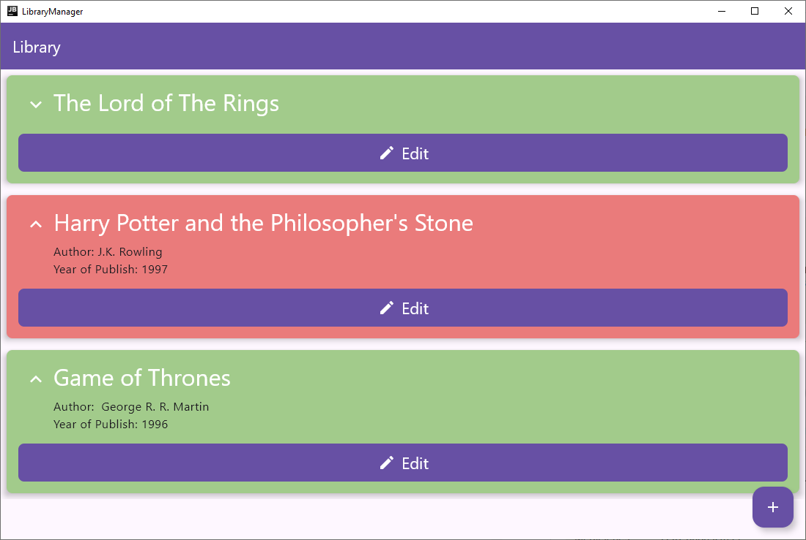
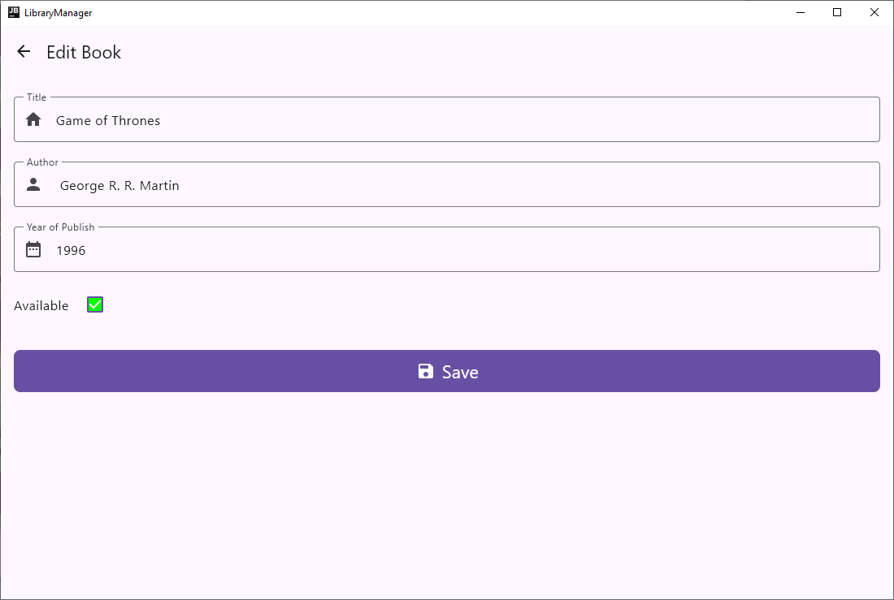
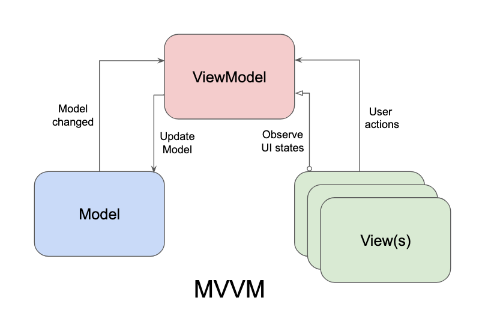

# Labor 2 - Egyszerű felhasználói felület fejlesztése Kotlin Multiplatformon

## Bevezető

A labor során egy könyvek adatait kezelni képes alkalmazást készítünk el desktop, Android, iOS és webassembly platformokra készítünk el Kotlin Multiplatformon technológiával. A felhasználói felület teljes egészében megosztott lesz minden támogatott platformon a Compose Multiplatform használatával. A labor egy része vezetett, a hátralévő részben pedig önálló feladatok megoldásával gyakorolhatjuk a cross-platform felhasználói felület fejlesztésének alapjait.

Az alkalmazásban fel tudunk venni új könyveket alapvető adataik megadásával, azokat listaszerűen meg tudjuk jeleníteni, illetve szerkeszteni tudjuk őket. Az alkalmazás a vezetett rész végére a következő(höz hasonló) módon fog kinézni desktop platformon:


<p align="center">

</p>


Az első képernyőn tekinthetjük meg a felvett könyveinket.

<p align="center">

</p>

A második képernyő könyvek felvételéért, illetve meglévő könyvek szerkesztéséért felel.

Az alkalmazásban az MVVM (de még nem MVI) architektúrát fogjuk használni.


## Előkészületek

A feladatok megoldása során ne felejtsük el követni a [feladat beadás folyamatát](../../tudnivalok/github/GitHub.md).


### Git repository létrehozása és letöltése

1. Moodle-ben keressük meg a laborhoz tartozó meghívó URL-jét és annak segítségével hozzuk létre a saját repositoryt.

2. Várjuk meg, míg elkészül a repository, majd checkout-oljuk ki.

3. Hozzunk létre egy új ágat `megoldas` néven, és ezen az ágon dolgozzunk.

4. A `neptun.txt` fájlba írjuk bele a Neptun kódunkat. A fájlban semmi más ne szerepeljen, csak egyetlen sorban a Neptun kód 6 karaktere.


## Projekt létrehozása

Hozzuk létre a projektet az alábbiaknak megfelelően:

1. Az alkalmazás neve legyen `LibraryManager`
2. A package name `hu.bme.aut.kmp.librarymanager`
3. Válasszuk ki a projekt lokációját a Git repositorynkban, majd > Next
4. A minimum SDK az Android platform SDK minimum verzióját jelenti, hagyhatjuk a defaulton (API 26 "Oreo")
5. A *Build configuration language* `Kotlin DSL` legyen.

Ezután kell kiválasztanunk, hogy milyen platformokat szeretnénk támogatni a projektünkben.

6. Pipáljuk be mindet: Android, iOS, Desktop és Web
7. Kiválaszthatjuk a mobilos és Web platformokhoz, hogy szeretnénk-e megosztani a felhasználói felület kódját. Mindkettőre igent válaszoljunk (Share UI).
8. Pipáljuk be a Server és Include Tests opciókat is, ezek értlemszerűen egy szervert Ktor keretrendszerben, illetve default teszt modulokat is generálnak
9. Ha minden rendben, > Finish
 
!!!warning
	Ugyan most nem fogunk backendet fejleszteni, így nem fogjuk használni a `server` modult, de ha a projekt létrehozásánál ezt nem pipáljuk be, akkor nem készül el a `shared` modul sem. Ez azért van így, mert korábban a `shared` modult a kliens és a backend közötti közös kód megosztására használták. Az újabb konvenció szerint azonban már a kliensek közötti kódmegosztást is így oldjuk meg. Ezért az egyszerűság kedvéért most legeneráltatunk mindent, és utólag nem használjuk. Megtehetnénk azt is, hogy a `shared` modult utólag adjuk hozzá, és kézzel állítjuk be a függőségeket. (New>Module>Kotlin Multiplatform Shared Module)

## Függőségek frissítése

!!!info "Gradle függőségek verziószámai"
		A projekt több olyan függőséget is használ (pl. navigation, lifecycle viewmodel), amelyek nem az elérhető legfrissebb verziót használják. Erre figyelmeztet is warning formájában az Android Studio. Vigyázat: nem minden függőség esetén célszerű mindig a legfrissebb verziót használni, amennyiben az nem stabil, alfa állapotban van, akkor fordítási, vagy akár futási idejű hibákat is okozhat.
 

## MVVM architektúra kialakítása (1 pont)

Mielőtt nekilátnánk a felhasználói felület elkészítésének, készítsük elő az adatainkat, amiken dolgozni fogunk.

A következőkben az MVVM architektúrát fogjuk használni. Az MVVM-ről részletesebben a vonatkozó előadás anyagában (is) tájékozódhatunk.

Az MVVM (Model-View-ViewModel) egy szoftvertervezési architektúra, amelyet elsősorban grafikus felhasználói felületek (GUI) fejlesztésére használnak. Az MVVM célja, hogy elválassza az üzleti logikát a felhasználói felülettől, megkönnyítve ezzel a kód karbantartását, tesztelhetőségét és újrafelhasználhatóságát.

Az MVVM architektúra három fő komponensből áll:

*   Model: Az alkalmazás adatmodellje, amely tartalmazza az üzleti logikát és az adatokat. Ez felelős az adatok kezeléséért és tárolásáért, gyakran egy adatbázisból vagy API-ból nyeri az információkat. Esetünkben ez egy, a könyvek adatait tároló data class lesz.
*   View: A felhasználói interfész (UI), amely a képernyőn megjelenő elemeket és azok elrendezését határozza meg. A View nem tartalmaz üzleti logikát, hanem kizárólag a megjelenítésért felelős műveleteket végzi. Esetünkben a Viewk a Composable Screen függvényeink.
*   ViewModel: A közvetítő réteg a Model és a View között. A ViewModel tartalmazza az alkalmazás logikáját, kezeli az adatok előkészítését és biztosítja a View számára szükséges adatokat, kezeli a View-hoz tartozó állapotot. Általában valamilyen formában adatkötést (data binding) használunk, amely lehetővé teszi, hogy a View automatikusan frissüljön, amikor a ViewModelben lévő adatok megváltoznak.


<p align="center">

</p>

!!!note "ViewModel-ek száma?"
        Felmerülhet a kérdés, hogy egy alkalmazáson belül mennyi ViewModel-re van szükségünk. Alapvetően minden View-hoz külön saját ViewModel tartozik, azonban logikailag összetartozó View-k esetén közös ViewModel használható (most mi is így jártunk el).


### Model

A könyveket reprezentáló osztályt a `shared` modulba készítsük el a `commonMain` *source set*-en belül egy `model` *package*-be:

```kotlin
package hu.bme.aut.kmp.librarymanager.model

data class Book(
    val id: Int,
    val title: String,
    val author: String,
    val year: Int,
    val isAvailable: Boolean
)

fun emptyBook(): Book = Book(0, "", "", 0, true)
```

Látható, hogy készítettünk egy függvényt is a könnyebb inicializáláshoz.


### ViewModel

Ezeket a könyveket egy komplexebb projektben egy *repository* tárolná, és a *ViewModel* attól kapná meg. Most az egyszerűség kedvéért a *ViewModel*-ünk fogja tartalmazni a konyv listánkat. Mivel a *ViewModel* is a megosztható logikához tartozik, ezt is a `shared` modulba fogjuk elkészíteni.

A *ViewModel*-hez azonban először szükségünk lesz egy függőségre. Vegyük fel a `shared` modulhoz tartozó `build.gradle.kts` fájlba az alábbi függőséget: (A verziók már szerepelnek a generált projektben a `libs.versions.toml` fájlban.):

```kotlin
sourceSets {
    commonMain.dependencies {
        //viewmodel
        implementation(libs.androidx.lifecycle.viewmodelCompose)
    }
	
	...
}
```

Ezek után készítsük el egy külön `viewmodel` *package*-be a `BookViewModel`-ünket:

```kotlin
package hu.bme.aut.kmp.librarymanager.viewmodel

class BookViewModel : ViewModel() {

    private val _books = MutableStateFlow<List<Book>>(emptyList())
    val books: StateFlow<List<Book>> = _books.asStateFlow()

    fun addBook(book: Book) {
        _books.value += book
    }

    fun updateBook(book: Book) {
        _books.value = _books.value.map {
            if (it.id == book.id) book else it
        }
    }

    companion object {
        val Factory: ViewModelProvider.Factory = viewModelFactory {
            initializer {
                BookViewModel()
            }
        }
    }
}
```

Ez a *ViewModel* fogja tárolni a könyvek kezeléséért felelős képernyőkhöz tartozó állapotot, nevezetesen az alkalmazásban lévő könyvek listáját, és biztosít azok módosítására műveleteket. A listát egy nem módosítható *StateFlow* segítségével teszi származtatottan elérhetővé a *View*-k számára, ugyanakkor csak a *ViewModel*-en belül ez a lista módosítható is (*private MutableStateFlow*).

A *ViewModel*-ek inicializálásához architekturális szempontból a legjobb megoldás, ha *Dependency Injection*-t használunk. A következő labortól így is fogunk eljárni, azonban most az alapok áttekintéséhez a `BookViewModel` inicializálását egy saját *factory* meódura bízzuk.

!!!example "BEADANDÓ (1 pont)"
	Készíts egy **képernyőképet**, amelyen látszik a `BookViewModel` kódja, és a neptun kódod valahol kommentként! A kép a megoldásban a repositoryban f1.png néven szerepeljen! 


## A felhasználó felület alapjai (1 pont)

Készítsük el az említett funkciókkal és felhasználói felülettel az alkalmazást Compose Multiplatform segítségével! A továbbiakban végig a `composeApp` modulban, a `commonMain` *source set*-en belül dolgozzunk.

### Függőségek felvétele

Először vegyünk föl még néhány függőséget: 

*   Navigation3 könyvtár: a navigációhoz
*   Serialization plugin: a navigációs elemek szerializálásához
*   Material Icons Extended: extra ikonokhoz

A `libs.versions.toml` verziókatalógusba:

```toml
[versions]
materialIconsExtended = "1.7.3"
multiplatform-nav3-ui = "1.0.0-alpha06"
serialization = "2.3.10"
...

[libraries]
jetbrains-navigation3-ui = { module = "org.jetbrains.androidx.navigation3:navigation3-ui", version.ref = "multiplatform-nav3-ui" }
material-icons-extended = { module = "org.jetbrains.compose.material:material-icons-extended", version.ref = "materialIconsExtended" }
...

[plugins]
kotlinx-serialization = { id = "org.jetbrains.kotlin.plugin.serialization", version.ref = "serialization" }
```

Először a plugint tiltsuk le a teljes projektünkben. Ehhez a projekt szintű `build.gradle.kts` fájl elejére írjuk ezt:

```kotlin
plugins {
    ...

    alias(libs.plugins.kotlinx.serialization) apply false
}
```

Majd engedélyezzük csak a `composeApp` modulba. Ehhez a modulhoz tartozó `build.gradle.kts` fájl elejére ezt írjuk:

```kotlin
plugins {
    ...

    alias(libs.plugins.kotlinx.serialization)
}
```

Ugyanebben a fájlban vegyük föl a két könyvtár függőséget is: 

```kotlin
sourceSets {
    ...
    commonMain.dependencies {
        ...

        //material icons extended
        implementation(libs.material.icons.extended)
        //navigation3
        implementation(libs.jetbrains.navigation3.ui)
    }
}
```

Ha ezzel megvagyunk, szinkronizáljuk a projektünket a fenti `Sync Now` gombbal.

Most már elérhetőek a könyvtáraink.

### Componensek

Az alkalmazásunkban használni fogunk néhány elemi építőelemet. Ezeket amennyire lehet, újrafelhasználható formában fogjuk megvalósítani egy `components` *package*-be.

#### IconTextButton

Először készísünk el egy olyan gombot, ami egy ikont és egy szöveget képes megjeleníteni egymás mellett:

`IconTextButton.kt`:

```kotlin
package hu.bme.aut.kmp.librarymanager.components

@Composable
fun IconTextButton(
    onClick: () -> Unit,
    text: String,
    leadingIcon: ImageVector,
    modifier: Modifier = Modifier,
    colors: ButtonColors = ButtonDefaults.buttonColors(),
) {
    Button(
        modifier = modifier,
        onClick = onClick,
        shape = RoundedCornerShape(8.dp),
        colors = colors
    ) {
        Row(
            modifier = Modifier.padding(4.dp),
            verticalAlignment = Alignment.CenterVertically
        ) {
            Icon(
                imageVector = leadingIcon,
                contentDescription = text,
                tint = colors.contentColor
            )
            Spacer(modifier = Modifier.size(8.dp))
            Text(
                text = text,
                color = colors.contentColor,
                style = MaterialTheme.typography.titleLarge
            )
        }

    }
}
```

Látható, hogy a gombunk több paramétert vesz át:

*   `onClick: () -> Unit`: Eseménykezelő a gomb megnyomásának kezelésére
*   `text: String`: a gombon megjelenő szöveg
*   `leadingIcon: ImageVector`: a gombon megjelenő ikon
*   `modifier: Modifier`: *modifier* az általános beállításokhoz
*   `colors: ButtonColors`: a gomb színei

Készítsünk ehhez a *Composable*-höz egy előnézetet is, hogy rögtön lássuk, hogyan néz ki. ezt megtehetjük közvetlenül itt alul:

```kotlin
@Preview(showBackground = true)
@Composable
fun IconTextButtonPreview() {
    IconTextButton(
        modifier = Modifier.fillMaxWidth(),
        onClick = {},
        leadingIcon = Icons.Default.Edit,
        text = "Edit"
    )
}
```

Ha buildeljük a projektünket, már meg is jelenik a *preview*.


#### BookCard

Készítsük el az egy könyv megjelenítéséért felelős *Composable* elemünket! Bár esetünkben erre csak a listázó képernyőn lesz szükségünk, ezt is egy újrafelhasználható *@Composable*-ként valósítjuk meg, mert később új képernyőkön szükségünk lehet rá.

Hozzunk létre egy `BookCard.kt` fájlt a `components` *package*-en belül az alábbi tartalommal:

```kotlin
package hu.bme.aut.kmp.librarymanager.components

@Composable
fun BookCard(
    book: Book,
    onEditButtonClick: (Int) -> Unit
) {
    Card(
        modifier = Modifier
            .fillMaxWidth()
            .padding(8.dp),
        elevation = CardDefaults.cardElevation(defaultElevation = 6.dp),
        shape = RoundedCornerShape(8.dp),
        colors = CardDefaults.cardColors(
            containerColor = if (book.isAvailable)
                Color(red = 162, green = 203, blue = 139, alpha = 255)
            else
                Color(red = 234, green = 123, blue = 123, alpha = 255)
        )
    ) {
        Column(
            Modifier
                .fillMaxWidth()
                .padding(16.dp)
        ) {
            Row {
                Icon(
                    modifier = Modifier
                        .padding(8.dp)
                        .size(32.dp),
                    imageVector = Icons.Filled.KeyboardArrowUp,
                    tint = MaterialTheme.colorScheme.onPrimary,
                    contentDescription = "Less"
                )

                Column() {
                    Text(
                        text = book.title,
                        style = MaterialTheme.typography.headlineLarge,
                        color = MaterialTheme.colorScheme.onPrimary
                    )

                    Spacer(modifier = Modifier.height(8.dp))
                    Text(
                        text = "Author: ${book.author}",
                        style = MaterialTheme.typography.bodyLarge
                    )
                    Text(
                        text = "Year of Publish: ${book.year}",
                        style = MaterialTheme.typography.bodyLarge
                    )

                }
            }
            Spacer(modifier = Modifier.height(16.dp))
            IconTextButton(
                onClick = {
                    onEditButtonClick(book.id)
                },
                modifier = Modifier.fillMaxWidth(),
                colors =
                    ButtonDefaults.buttonColors(
                        containerColor = MaterialTheme.colorScheme.primary,
                        contentColor = MaterialTheme.colorScheme.onPrimary
                    ),
                leadingIcon = Icons.Default.Edit,
                text = "Edit"
            )
        }
    }
}
```

A *composable* elemünk átveszi paraméterként a könyvet, amelynek az adatait megjeleníti, illetve egy callback metódust is, amelyet a szerkesztő gomb onClick eseményén használ fel.

Figyeljük meg, hogy hogyan változik a kártya háttérszíne a könyv elérhetőségétől függően!

!!!note "Szöveges erőforrások kezelése"
        Valós alkalmazásokban soha ne használjunk beégetett stringeket, azokat mindig szöveges erőforrásként kezeljük a projektünkben. Androidhoz hasonlóan Kotlin Multiplatform projektekben is lehetőségünk van erre, bár némivel bonyolultabban kell eljárnunk. Az egyszerűség kedvéért a labor során ezzel nem foglalkozunk, azonban részletesebben pl. itt olvashatunk róla: https://medium.com/@mohaberabi98/localization-in-compose-multiplatform-a53dccf49327
		
		A követendő lépések nagyvonalakban:
		
		1. Platform-specifikus erőforrások beállítása (android, iOS)
		2. Lokalizált sztring erőforrások használata a közös kódban
		3. Lokalizáció platform-specifikus kezelése
		

Készítsük el az előnézeteket is. Ezúttal kettőt készítünk különböző paraméterezéssel, hogy meg tudjuk nézni a kártyánk különböző állapotait:

```kotlin
@Preview
@Composable
fun BookCardAvailablePreview() {
    val book = Book(
        id = 1,
        title = "The Lord of the Rings",
        author = "J.R.R. Tolkien",
        year = 1954,
        isAvailable = true
    )
    BookCard(
        book = book,
        onEditButtonClick = {})
}

@Preview
@Composable
fun BookCardTakenPreview() {
    val book = Book(
        id = 1,
        title = "The Lord of the Rings",
        author = "J.R.R. Tolkien",
        year = 1954,
        isAvailable = false
    )
    BookCard(
        book = book,
        onEditButtonClick = {})
}
```

Egészítsük ki a `BookCard`-unkat, hogy a kis nyilacska ikon megnyomására a szerzői és megjelenési adatok eltűnjenek vagy megjelenjenek!

Ehhez először is vegyünk fel egy állapotot a függvényünk elejére:

```kotlin
var expanded by remember { mutableStateOf(false) }

Card(
	...
```

Majd az ikonunk megnyomásának hatására változtassuk meg az állapotát. Szintén itt tudjuk beállítani az állapontnak megfelelő ikont és leírást is:

```kotlin
Icon(
    modifier = Modifier
        .padding(8.dp)
        .clickable { expanded = !expanded }
        .size(32.dp),
    imageVector = if (expanded)
        Icons.Filled.KeyboardArrowUp else Icons.Filled.KeyboardArrowDown,
    tint = MaterialTheme.colorScheme.onPrimary,
    contentDescription = if (expanded) {
        "Less"
    } else {
        "More"
    }
)
```

A megfelelő sorok megjelenítését pedig kössük az `expanded` állapothoz:

```kotlin
Card
	...
	Column
		...
		Row
			...
			Column() {
			    Text(
			        text = book.title,
			        style = MaterialTheme.typography.headlineLarge,
			        color = MaterialTheme.colorScheme.onPrimary
			    )
			    if (expanded) {
			        Spacer(modifier = Modifier.height(8.dp))
			        Text(
			            text = "Author: ${book.author}",
			            style = MaterialTheme.typography.bodyLarge
			        )
			        Text(
			            text = "Year of Publish: ${book.year}",
			            style = MaterialTheme.typography.bodyLarge
			        )
			    }
			}
		...
```

Végül pedig animáljuk meg a *column* méretváltozását:

```kotlin
Card
	...
	Column(
    	Modifier
        	.fillMaxWidth()
            .padding(16.dp)
            .animateContentSize()
	) {
		...
```

???success "BookCard.kt"
	```kotlin
	package hu.bme.aut.kmp.librarymanager.components
	
	import androidx.compose.animation.animateContentSize
	import androidx.compose.foundation.clickable
	import androidx.compose.foundation.layout.Column
	import androidx.compose.foundation.layout.Row
	import androidx.compose.foundation.layout.Spacer
	import androidx.compose.foundation.layout.fillMaxWidth
	import androidx.compose.foundation.layout.height
	import androidx.compose.foundation.layout.padding
	import androidx.compose.foundation.layout.size
	import androidx.compose.foundation.shape.RoundedCornerShape
	import androidx.compose.material.icons.Icons
	import androidx.compose.material.icons.filled.Edit
	import androidx.compose.material.icons.filled.KeyboardArrowDown
	import androidx.compose.material.icons.filled.KeyboardArrowUp
	import androidx.compose.material3.ButtonDefaults
	import androidx.compose.material3.Card
	import androidx.compose.material3.CardDefaults
	import androidx.compose.material3.Icon
	import androidx.compose.material3.MaterialTheme
	import androidx.compose.material3.Text
	import androidx.compose.runtime.Composable
	import androidx.compose.runtime.getValue
	import androidx.compose.runtime.mutableStateOf
	import androidx.compose.runtime.remember
	import androidx.compose.runtime.setValue
	import androidx.compose.ui.Modifier
	import androidx.compose.ui.graphics.Color
	import androidx.compose.ui.tooling.preview.Preview
	import androidx.compose.ui.unit.dp
	import hu.bme.aut.kmp.librarymanager.model.Book
	
	@Composable
	fun BookCard(
	    book: Book,
	    onEditButtonClick: (Int) -> Unit
	) {
	
	    var expanded by remember { mutableStateOf(false) }
	
	    Card(
	        modifier = Modifier
	            .fillMaxWidth()
	            .padding(8.dp),
	        elevation = CardDefaults.cardElevation(defaultElevation = 6.dp),
	        shape = RoundedCornerShape(8.dp),
	        colors = CardDefaults.cardColors(
	            containerColor = if (book.isAvailable)
	                Color(red = 162, green = 203, blue = 139, alpha = 255)
	            else
	                Color(red = 234, green = 123, blue = 123, alpha = 255)
	        )
	    ) {
	        Column(
	            Modifier
	                .fillMaxWidth()
	                .padding(16.dp)
	                .animateContentSize()
	        ) {
	            Row {
	                Icon(
	                    modifier = Modifier
	                        .padding(8.dp)
	                        .clickable { expanded = !expanded }
	                        .size(32.dp),
	                    imageVector = if (expanded)
	                        Icons.Filled.KeyboardArrowUp else Icons.Filled.KeyboardArrowDown,
	                    tint = MaterialTheme.colorScheme.onPrimary,
	                    contentDescription = if (expanded) {
	                        "Less"
	                    } else {
	                        "More"
	                    }
	                )
	
	                Column() {
	                    Text(
	                        text = book.title,
	                        style = MaterialTheme.typography.headlineLarge,
	                        color = MaterialTheme.colorScheme.onPrimary
	                    )
	                    if (expanded) {
	                        Spacer(modifier = Modifier.height(8.dp))
	                        Text(
	                            text = "Author: ${book.author}",
	                            style = MaterialTheme.typography.bodyLarge
	                        )
	                        Text(
	                            text = "Year of Publish: ${book.year}",
	                            style = MaterialTheme.typography.bodyLarge
	                        )
	                    }
	                }
	            }
	            Spacer(modifier = Modifier.height(16.dp))
	            IconTextButton(
	                onClick = {
	                    onEditButtonClick(book.id)
	                },
	                modifier = Modifier.fillMaxWidth(),
	                colors =
	                    ButtonDefaults.buttonColors(
	                        containerColor = MaterialTheme.colorScheme.primary,
	                        contentColor = MaterialTheme.colorScheme.onPrimary
	                    ),
	                leadingIcon = Icons.Default.Edit,
	                text = "Edit"
	            )
	        }
	    }
	}
	
	@Preview
	@Composable
	fun BookCardAvailablePreview() {
	    val book = Book(
	        id = 1,
	        title = "The Lord of the Rings",
	        author = "J.R.R. Tolkien",
	        year = 1954,
	        isAvailable = true
	    )
	    BookCard(
	        book = book,
	        onEditButtonClick = {})
	}
	
	@Preview
	@Composable
	fun BookCardTakenPreview() {
	    val book = Book(
	        id = 1,
	        title = "The Lord of the Rings",
	        author = "J.R.R. Tolkien",
	        year = 1954,
	        isAvailable = false
	    )
	    BookCard(
	        book = book,
	        onEditButtonClick = {})
	}
	```


Miután elkészültünk az újrafelhasználható komponensekkel, már össze tudjuk rakni a képernyőinket. Ebből ezúttal kettő lesz: egy a listához, egy a részletek megjelenítéséhez. Ezeket a `commonMain` *sourceSet*-be, egy `screen` *package*-be készítsük el.


### BookListScreen

Az első képernyőnk a `BookListScreen`:

```kotlin
package hu.bme.aut.kmp.librarymanager.screen

@OptIn(ExperimentalMaterial3Api::class)
@Composable
fun BookListScreen(
    modifier: Modifier = Modifier,
    viewModel: BookViewModel = viewModel(factory = BookViewModel.Factory),
    onFabClick: () -> Unit,
    onEditButtonClick: (Int) -> Unit
) {
    val books by viewModel.books.collectAsState()

    Scaffold(
        modifier = modifier,
        topBar = {
            TopAppBar(
                colors = TopAppBarDefaults.topAppBarColors(
                    containerColor = MaterialTheme.colorScheme.primary,
                    titleContentColor = MaterialTheme.colorScheme.onPrimary
                ),
                title = { Text("Library") })
        },
        floatingActionButton = {
            FloatingActionButton(
                onClick = onFabClick,
                containerColor = MaterialTheme.colorScheme.primary
            ) {
                Icon(Icons.Default.Add, contentDescription = "Add Book", tint = Color.White)
            }
        }
    ) { padding ->
        LazyColumn(modifier = Modifier.padding(padding)) {
            items(books) { book ->
                BookCard(
                    book,
                    onEditButtonClick = onEditButtonClick
                )
            }
        }
    }
}

@Preview(showSystemUi = true)
@Composable
fun BookListScreenPreview() {
    BookListScreen(
        onFabClick = {},
        onEditButtonClick = {})
}
```

Figyeljük meg a következőket:

*   A képernyőnk a következő paramétereket veszi át:
	*   `modifier: Modifier`: *modifier* a megjelenítés testreszabásához.
	*   `viewModel: BookViewModel`: a könyvlistát tartalmazó *ViewModel*.
	*   `onFabClick: () -> Unit`: *callback* függvény a *FloatingActionButton*-re való kattintáshoz. Mivel itt navigációs eseményt szeretnénk végrehajtani, ezt az eseménykezelőt továbbadjuk felfelé.
	*   `onEditButtonClick: (Int) -> Unit`: *callback* függvény a szerkesztés gombra való kattintáshoz. Mivel itt navigációs eseményt szeretnénk végrehajtani, ezt az eseménykezelőt a paraméterrel együtt továbbadjuk felfelé.
*   A `Scaffold` *topBar* paraméterével jelenítjük meg a képernyő tetején az alkalmazás fejlécét. Ezen jelenleg a *Library* felirat szerepel.
*   A könyvek listáját kompozíciókor a *ViewModel*-től kérjük el. A *collectAsStateWithLifecycle* segítségével megfigyeljük a *StateFlow* változásait, így automatikusan értesülünk róla, ha megváltozik a könyvlista.
*   Új könyv felvételéhez egy `FloatingActionButton`-t használunk, amelynek *onClick* eseményében továbbhívjuk a paraméterként kapott eseménykezelőt.
*   LazyColumn segítségével jelenítjük meg a könyvek listáját, ahol felhasználjuk az előbb elkészített `BookCard` *Composable* elemünket. A gomb eseménykezelőjét itt is csak átadjuk.

Az előnézetben már láthatjuk is a teljes képernyőnket.


### BookDetailsScreen

```kotlin
package hu.bme.aut.kmp.librarymanager.screen

@OptIn(ExperimentalMaterial3Api::class)
@Composable
fun BookDetailsScreen(
    modifier: Modifier = Modifier,
    viewModel: BookViewModel = viewModel(factory = BookViewModel.Factory),
    bookId: Int?,
    onBackClick: () -> Unit
) {
    val book = remember { mutableStateOf(emptyBook()) }

    if (bookId != null) {
        LaunchedEffect(bookId) {
            viewModel.books.value.find { it.id == bookId }?.let {
                book.value = it
            }
        }
    }

    Scaffold(
        modifier = modifier,
        topBar = {
            TopAppBar(
                title = { Text(text = if (bookId == null) "New Book" else "Edit Book") },
                navigationIcon = {
                    IconButton(onClick = onBackClick) {
                        Icon(Icons.AutoMirrored.Filled.ArrowBack, contentDescription = "Back")
                    }
                }
            )
        }
    ) { padding ->
        Column(
            modifier = Modifier
                .padding(padding)
                .fillMaxSize()
                .padding(16.dp),
            verticalArrangement = Arrangement.spacedBy(16.dp)
        ) {
            // Title Field
            OutlinedTextField(
                value = book.value.title,
                onValueChange = { book.value = book.value.copy(title = it) },
                label = { Text("Title") },
                modifier = Modifier.fillMaxWidth(),
                singleLine = true,
                leadingIcon = { Icon(Icons.Default.Home, contentDescription = "Title") },
                keyboardOptions = KeyboardOptions(imeAction = ImeAction.Next)
            )

            // Author Field
            OutlinedTextField(
                value = book.value.author,
                onValueChange = { book.value = book.value.copy(author = it) },
                label = { Text("Author") },
                modifier = Modifier.fillMaxWidth(),
                singleLine = true,
                leadingIcon = { Icon(Icons.Default.Person, contentDescription = "Author") },
                keyboardOptions = KeyboardOptions(imeAction = ImeAction.Next)
            )

            // Year Field
            OutlinedTextField(
                value = book.value.year.toString(),
                onValueChange = { book.value = book.value.copy(year = it.toIntOrNull() ?: 0) },
                label = { Text("Year of Publish") },
                modifier = Modifier.fillMaxWidth(),
                singleLine = true,
                leadingIcon = { Icon(Icons.Default.DateRange, contentDescription = "Year") },
                keyboardOptions = KeyboardOptions(
                    imeAction = ImeAction.Next,
                    keyboardType = KeyboardType.Number
                )
            )

            // Availability Checkbox
            Row(
                modifier = Modifier.fillMaxWidth(),
                verticalAlignment = Alignment.CenterVertically
            ) {
                Text(
                    text = "Available",
                    style = MaterialTheme.typography.bodyLarge
                )
                Spacer(modifier = Modifier.size(8.dp))
                Checkbox(
                    checked = book.value.isAvailable,
                    onCheckedChange = { book.value = book.value.copy(isAvailable = it) },
                    colors = CheckboxDefaults.colors(
                        checkedBoxColor = Color.Green,
                        uncheckedBorderColor = Color.Red
                    )
                )
            }

            // Save Button
            IconTextButton(
                modifier = Modifier
                    .fillMaxWidth()
                    .padding(top = 16.dp),
                onClick = {
                    if (bookId == null) {
                        viewModel.addBook(book.value.copy(id = viewModel.books.value.size))
                    } else {
                        viewModel.updateBook(book.value)
                    }
                    onBackClick()
                },
                text = "Save",
                leadingIcon = Icons.Default.Save,
                colors = ButtonDefaults.buttonColors(containerColor = MaterialTheme.colorScheme.primary)
            )
        }
    }
}

@Preview
@Composable
fun BookDetailsScreenNewPreview() {
    BookDetailsScreen(
        bookId = null,
        onBackClick = {}
    )
}

@Preview
@Composable
fun BookDetailsScreenEditPreview() {
    BookDetailsScreen(
        bookId = 1,
        onBackClick = {}
    )
}
```

Figyeljük meg a következőket:

*   A képernyőnk a következő paramétereket veszi át:
	*   `modifier: Modifier`: *modifier* a megjelenítés testreszabásához.
	*   `viewModel: BookViewModel`: a könyvlistát tartalmazó *ViewModel*.
	*   `bookId: Int?`: a megjeleníteni kívánt könyv azonosítója. Amennyiben *null*, nem kell könyvet megjelenítenünk, hiszen űj könyv hozzáadása történik.
	*   `onBackClick: () -> Unit`: *callback* függvény a vissza gombra való kattintáshoz. Mivel itt navigációs eseményt szeretnénk végrehajtani, ezt az eseménykezelőt továbbadjuk a hívónak. 
*   A képernyőhöz tartozó, éppen szerkesztendő / létrehozott könyv adatait a Compose *remember* mechanizmusa segítségével jegyezzük meg rekompozíció esetén.
*   Amennyiben a kapott könyv azonosító létező könyvhöz tartozik (nem *null*), `LaunchedEffect` használatával inicializáljuk a szerkesztendő könyvet, ahol a *ViewModel*-től kérjük le a megadott azonosítóhoz tartozó könyv adatait.
*   A `Scaffold` *topBar*-jára elhelyezünk egy visszafelé vezető gombot (nyilat) is, amely megnyomása esetén a navigációs *callback*-et hívjuk.
*   A *topBar*-on megjelenő felirat attól függően változik, hogy szerkesztünk vagy őj könyvet veszünk fel.
*   A mentés gombra kattintva megvizsgáljuk, hogy szerkesztés módban voltunk-e vagy új könyvet vettünk fel, és ennek megfelelően hívjuk meg a *ViewModel* megfelelő metódusát a könyv módosítására vagy új könyv felvételére.

Ezzel elkészültünk mind a két képernyővel, már csak össze kell kötnünk őket egy navigációval.

!!!example "BEADANDÓ (1 pont)"
	Készíts egy **képernyőképet**, amelyen látszik a `BookListScreen` **előnézete és kódja**, valamint a neptun kódod valahol kommentként! A kép a megoldásban a repositoryban f2_1.png néven szerepeljen!

	Készíts egy **képernyőképet**, amelyen látszik a `BookDetailsScreen` **előnézete és kódja**, valamint a neptun kódod valahol kommentként! A kép a megoldásban a repositoryban f2_2.png néven szerepeljen! 

## Navigáció (1 pont)

A navigációhoz tartozó fájlokat a `commonMain` *sourceSet*-be, egy `navigation` nevű *package*-be készítsük el.

Az útvonalak áttekinthető kezeléséért először is gyűjtsük össze a navigációs állomásokat egy `Screen` nevű *sealed interface*-be:

```kotlin
sealed interface Screen : NavKey {
    @Serializable
    data object BookListScreenDestination : Screen

    @Serializable
    data class BookDetailsScreenDestination(val bookId: Int? = null) : Screen

	companion object {
        val config = SavedStateConfiguration {
            serializersModule = SerializersModule {
                polymorphic(NavKey::class) {
                    subclass(
                        BookListScreenDestination::class,
                        BookListScreenDestination.serializer()
                    )
                    subclass(
                        BookDetailsScreenDestination::class,
                        BookDetailsScreenDestination.serializer()
                    )
                }
            }
        }
    }
}
```

!!!info "Sealed interface"
	A Kotlin sealed interface-ei olyan interface-ek, amiket megvalósító osztályokból korlátozott az öröklés, és fordítási időben minden leszármazott osztálya ismert. Ezeket az osztályokat az enumokhoz hasonló módon tudjuk alkalmazni. Jelen esetben a BookDetailsScreenDestination valójában nem a Screen közvetlen leszármazottja, hanem anonim leszármazott osztálya, mivel a könyv id paraméterként történő kezelését is tartalmazza.

!!!info "@Serializable"
	A @Serializable annotáció a navigációs állomások *backStack*-ben történő tárolhatósága és menthetősége miatt szükséges.

!!!info "Polimorfizmus"
	Androidon a Navigation 3 a reflection alapú szerializálásra támaszkodik, de ez nem érhető el nem JVM platformok, például iOS esetén. Ennek a korlátozásnak a kiküszöbölésére a könyvtár két túlterhelést tartalmaz a rememberNavBackStack() függvényhez:

	*   Az első túlterhelés csak egy NavKey referenciák halmazát fogadja el, és egy reflexió alapú szerializálót igényel.
	*   A második túlterhelés egy SavedStateConfiguration paramétert is fogad el, amely lehetővé teszi egy SerializersModule megadását és a nyílt polimorfizmus kezelését minden platformon.

Fiugyeljük meg, hogyan veszi át a paramétert a `BookListScreenDestination`!

Miután megvagyunk az útvonalak kigyűjtésével, megvalósíthatjuk magát a navigációt is. Ehhez egy saját `AppNavigation` függvényt fogunk készíteni:

```kotlin
package hu.bme.aut.kmp.librarymanager.navigation

@Composable
fun AppNavigation(
    modifier: Modifier = Modifier
) {
    val backStack = rememberNavBackStack(
        configuration = Screen.config,
        Screen.BookListScreenDestination
    )

    NavDisplay(
        modifier = modifier,
        backStack = backStack,
        onBack = { backStack.removeLastOrNull() },
        entryProvider =
            entryProvider {

                entry<Screen.BookListScreenDestination> {
                    BookListScreen(
                        onFabClick = { backStack.add(Screen.BookDetailsScreenDestination()) },
                        onEditButtonClick = {
                            backStack.add(
                                Screen.BookDetailsScreenDestination(
                                    bookId = it
                                )
                            )
                        })
                }

                entry<Screen.BookDetailsScreenDestination> { key ->
                    BookDetailsScreen(
                        bookId = key.bookId,
                        onBackClick = { backStack.removeLastOrNull() }
                    )
                }
            }
    )
}
```

Itt először is létrehozzuk a *backStack*-et, amibe a kezdőképernyőnk, a `Screen.BookListScreenDestination` kerül.

Ez után pedig a `NavDisplay`-el megjelenítjük az oldalainkat. A `NavDisplay` a következő paramétereket veszi át:

*   `modifier`: *modifier* a megjelenítés testreszabásához.
*   `backStack`: az alkalmazás navigaciós állomásait tartalmazó *backStack*. Mindig a tetején lévő állomás által meghatározott képernyő látható.
*   `onBack`: az alapértelmezett *vissza* navigációs esemény
*   `entryProvider`: az a *lambda* függvény, ami a összerendeli a navigációs kulcsokat és a megjelenítendő *composable* függvényeket.
   
Figyeljük meg, hogy hogyan adjuk át könyv azonosítóját a `BookListScreen` *onEditButtonClick* paraméterében, és hogyan vesszük át a `BookDetailsScreen`-nél!

Ahhoz, hogy működjön az alkalmazásunk, már csak annyit kell tennünk, hogy megjelenítjük az `AppNavigation`-ünket. Tegyük is ezt meg az `App()` *composable* függvényünkben:

```kotlin
@Composable
@Preview
fun App() {
    MaterialTheme {
        AppNavigation(
            modifier = Modifier
                .fillMaxWidth()
                .safeDrawingPadding()
        )
    }
}
```

Próbáljuk ki az alkalmazást!

Egészítsük még ki az alkalmazást képernyők között animációval. Ehhez használjuk a `NavDisplay` paramétereit:

```kotlin
NavDisplay(
	modifier = modifier,
	backStack = backStack,
	onBack = { backStack.removeLastOrNull() },
	transitionSpec = { slideInHorizontally { it } + fadeIn() togetherWith slideOutHorizontally { -it } + fadeOut() },
	popTransitionSpec = { slideInHorizontally { -it } + fadeIn() togetherWith slideOutHorizontally { it } + fadeOut() },
	entryProvider =
		...
```
!!!example "BEADANDÓ (1 pont)"
	Készíts egy **képernyőképet**, amelyen a listázó nézet látszik tetszőleges platformon, rajta legalább 2 felvett könyvvel! Az egyik könyv címe legyen a Neptun kódunk. A kép a megoldásban a repositoryban f3_1.png néven szerepeljen! 
	
	Készíts egy **képernyőképet**, amelyen a részletező képernyő látszik tetszőleges platformon és minden beviteli vezérlő ki van töltve valamilyen értékkel! A címhez tartozó mező értéke legyen a Neptun kódunk.  A kép a megoldásban a repositoryban f3_2.png néven szerepeljen! 


## Önálló feladatok

A következőkben önállóan dolgozunk. Minden felsorolt feladat 1 pontot ér, tehát nem szükséges az összes feladatot megoldani 4-es vagy 5-ös érdemjegyért. Szándékosan több feladat szerepel annak érdekében, hogy gyakorlási lehetőséget biztosítson és bemutasson több olyan elemet is, amely a laboron eddig nem szerepelt.


### Keresési funkció (1 pont)

Valósítsunk meg keresési funkciót (tartalmazott kifejezés, nem pontos egyezés) a listázó képernyőn! Bővítsük ki a könyvlistát egy keresőmezővel a képernyő tetején a lista előtt, ami alapján szűrhető a könyvek listája cím vagy szerző alapján. Azt, hogy mi alapján keresünk, szintén a felhasználó adhassa meg egy alkalmas vezérlő használatával (pl. DropDownMenu, MultiChoiceButtonRow)!

??? tip "Segítség"
    A megoldás menete a következő:
	
	1. A `BookListScreen`-hez adjunk hozzá pl. egy `OutlinedTextField`-et!
	2. A keresés fajtájának kiválasztásához használhatunk pl. `ExposedDropdownMenuBox`-ot, vagy `MultiChoiceSegmentedButtonRow`-t! Ezek használatához a material3-at meg kell adnunk függőségként a Gradle konfigurációs fájlunkban.
	3. A `BookViewModel`-ben vegyünk fel egy `searchQuery`-t (mi legyen a típusa?).
	4. A books listát szűrjük a `searchQuery` alapján!
	
	
!!!example "BEADANDÓ (1 pont)"
	Készíts egy **képernyőképet**, amelyen látszik a keresőmező és a keresés fajtáját kiválasztó vezérlő és az **ahhoz tartozó kód**! A könyvlistában pontosan azok a könyvek jelenjenek meg, amelyek teljesítik a keresési feltételt, és legyen legalább 1 ilyen! A kép a megoldásban a repositoryban f4.png néven szerepeljen! 


### Kedvencek kezelése (1 pont)

Bővítsük ki a könyveket egy "kedvenc" funkcióval, és hozzunk létre egy külön képernyőt a kedvencek megjelenítéséhez! A könyveket lehessen kedvenc-nek jelölni, a listázó nézetről legyen lehetőség átnavigálni a kedvenceket megjelenítő képernyőre, ahol listázva láthatjuk őket! A kedvencnek jelöléshez és a navigáláshoz is tetszőleges UI megoldás elfogadható, tetszőleges vezérlőket használhatunk.

??? tip "Segítség"
    A megoldás menete a következő:
	
	1. Bővítsük ki a `Book` adatmodellünket egy `isFavorite: Boolean` mezővel.
	2. A `BookViewModel`-ben implementáljuk a kedvenc állapot váltását és a kedvencnek jelölt könyvek lekérdezését!
	3. Vegyük fel a megfelelő UI elemeket a listázó képernyőnkre (pl. csillag ikon a könyvön, ami színt vált ha megnyomják, kedvencekre navigáló gomb a képernyő alján stb).
	4. Készítsünk egy új képernyőt, ami mindig pontosan a kedvencnek jelölt könyveket mutatja! Itt felhasználhatjuk a korábban készített `BookCard` *Composable
	5. 
	6. * elemünket.
	5. Bővítsük ki a navigációt, hogy a kedvencek képernyőre megfelelően navigálhassunk a listázó képernyőről!
	
	
!!!example "BEADANDÓ (1 pont)"

	Készíts egy **képernyőképet**, amelyen látszik a listázó nézeten legalább 2 könyv, amely közül az egyik kedvencnek van jelölve, a másik pedig nem! A kép a megoldásban a repositoryban f5_1.png néven szerepeljen! 

	Készíts egy **képernyőképet**, amelyen látszik a kedvencek képernyő, ahol pontosan a kedvencnek jelölt könyvek vannak megjelenítve! A kép a megoldásban a repositoryban f5_2.png néven szerepeljen! 


### Swipe-to-dismiss törlés (1 pont)

Oldjuk meg, hogy könyveken való *Swipeolással* (oldalra tetszőlegesen választott irányban) lehessen törölni az adott könyvet a listából a listanézet képernyőn!

??? tip "Segítség"
    A megoldás menete a következő:
	
	1. Módosítsuk a `BookCard` *Composable*-t, csomagoljuk be egy `SwipeToDismiss` *Composable*-be!
	2. Vegyünk át a `BookCard`-ban egy *callback* metódust paraméterként, hívjuk meg ezt, ha *swipe* történt!
	3. Módosítsuk a `BookViewModel`-t, hogy lehessen könyvet törölni is!
	4. A `BookCard` *Composable* használatakor a listázó képernyőn paraméterként a *Swipe*-on hívott *callback* metódusnak adjunk át egy lambda kifejezést, amely meghívja a `BookViewModel` megfelelő törlő metódusát!
	
	
!!!example "BEADANDÓ (1 pont)"
	Készíts egy **képernyőképet**, amelyen látszik a `SwipeToDismiss` elem a törlés közben és az **ahhoz tartozó kód**. A kép a megoldásban a repositoryban f6.png néven szerepeljen! 
	

### Staggered Grid használata (1 pont)

Jelenítsük meg a könyveket a listázó képernyőn Pinterest-szerű, eltérő magasságú kártyákkal, 2 oszlopban! Amennyiben egy könyvnek a címe legalább 20 karakter hosszú, akkor a könyvhöz tartozó Card magassága legyen 50%-al nagyobb, mint a 20-nál kevesebb karaktert tartalmazó című könyveknek!

??? tip "Segítség"
    A megoldás menete a következő:
	
	1. `LazyColumn` helyett használjunk `LazyVerticalStaggeredGrid`-et! Az oszlopok számát állítsuk fix 2-re!
	2. A `BookCard`-ok magassága (*Modifier.height*) függjön a könyv címének hosszától! Használhatunk fix dp értékeket (pl. 150.dp és 100.dp).
	
!!!example "BEADANDÓ (1 pont)"
	Készíts egy **képernyőképet**, amelyen látszik listázó nézeten a 2 oszlopos, eltérő magasságú megjelenítés és az **ahhoz tartozó kód**! A kép a megoldásban a repositoryban f7.png néven szerepeljen! 