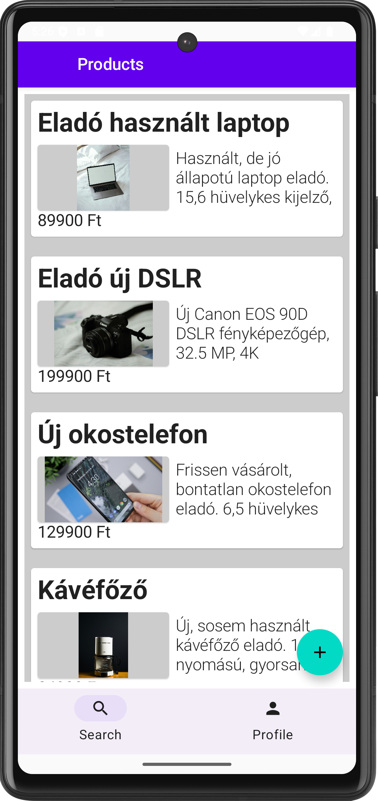
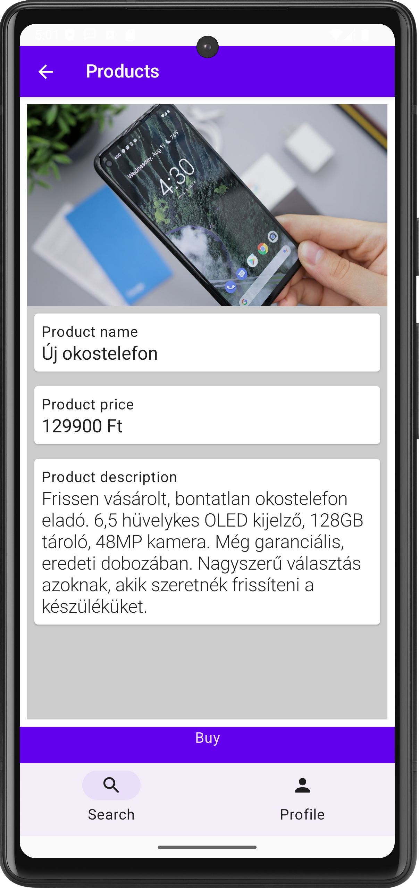
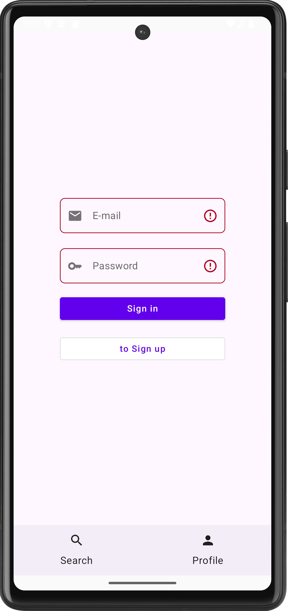
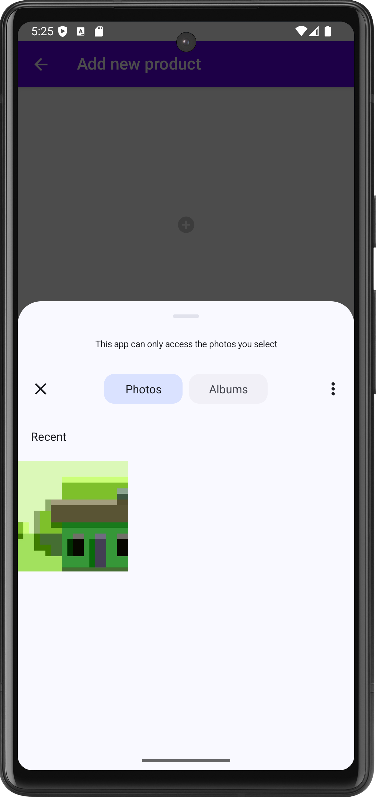
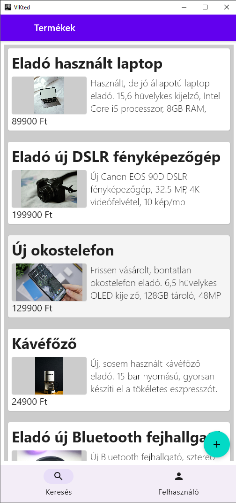
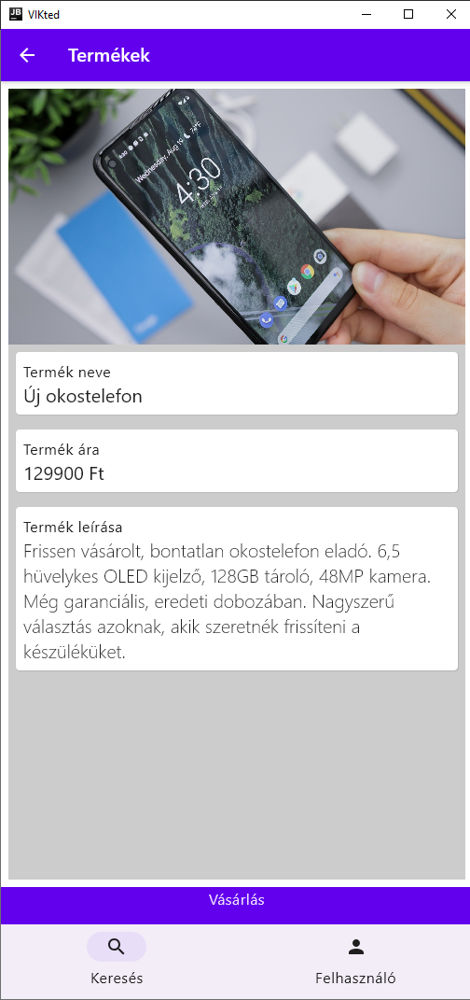
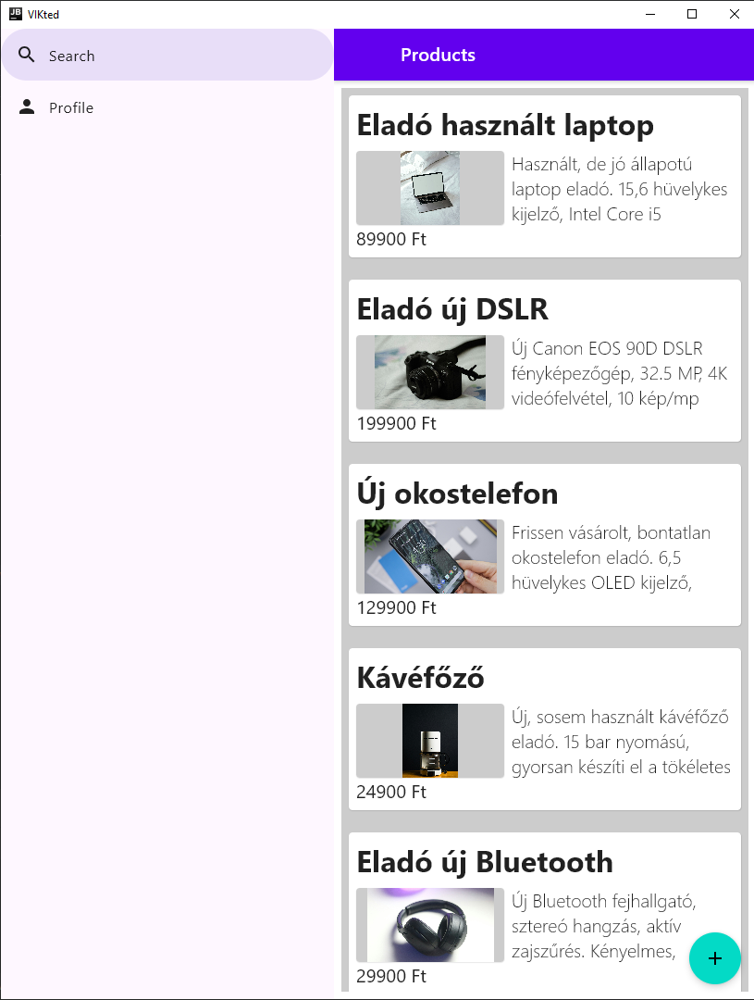
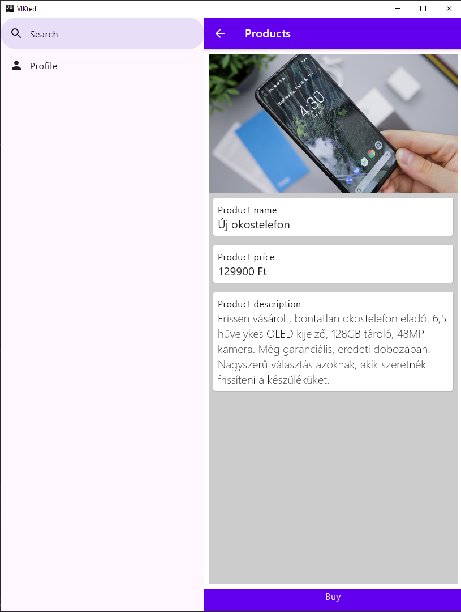
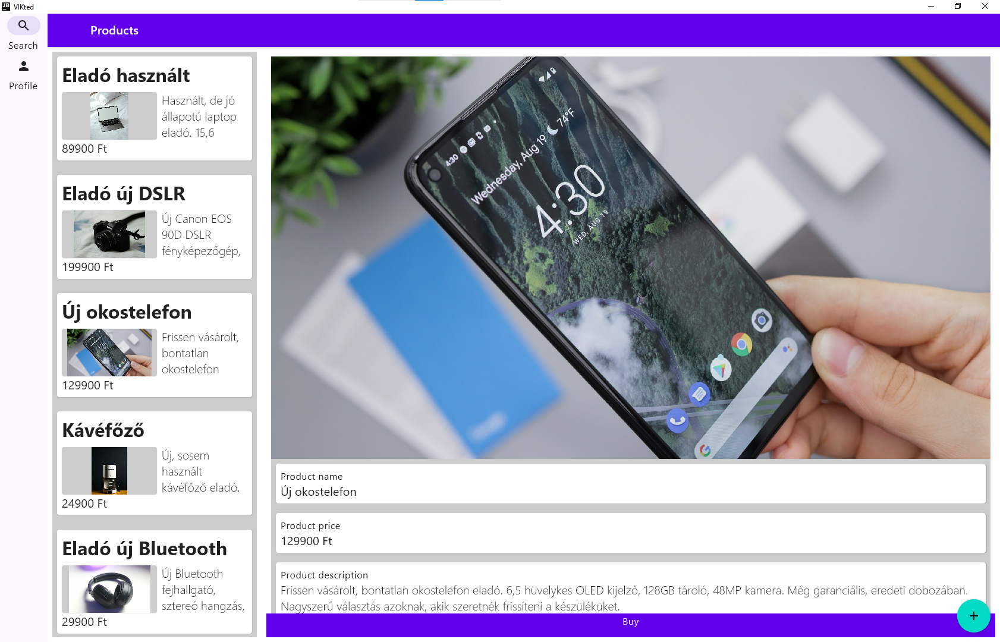
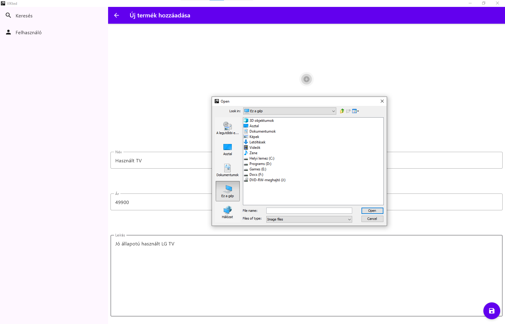

# Labor 3 - Adaptív UI, platformspecifikus kód és clean architecture

## Bevezető

A labor során egy apróhirdetés alkalmazást fogunk készíteni Android, Windows és Web platformokra. Az alkalmazásban lehetőség van apróhirdetéseket böngészni, és bejelentkezés után sajátot is közzétenni. A perzisztens tárolás megvalósítása nem része a jelenlegi anyagnak, azonban a projekt felépítésében, architektúrájában kiemelt figyelmet fordítunk arra, hogy ez a későbbiekben nagyon könnyen implementálható legyen. A felületet adaptítv eszközökkel fogjuk elkészíteni, hogy minden környezetben megfelelően nézzen ki. 


## Felhasznált technológiák:

- [`ViewModel`](https://www.jetbrains.com/help/kotlin-multiplatform-dev/compose-viewmodel.html)  
- [`Koin`](https://insert-koin.io/docs/reference/koin-mp/kmp/)   
- [`Coil`](https://github.com/coil-kt/coil)
- [`Ktor`](https://ktor.io/docs/client-create-multiplatform-application.html)
- [`Scene Strategies`](https://developer.android.com/guide/navigation/navigation-3/scenes)
- [`Adaptive Navigation`](https://developer.android.com/develop/ui/compose/layouts/adaptive/build-adaptive-navigation)


## Az alkalmazás specifikációja

Az alkalmazás navigációs menüjében két elem látható. A Kereső felületen az apróhirdetések listája található. Egy hirdetésre kattintáskor megjelenik a részletes nézete, képernyőméret függvényében a lista mellett vagy külön oldalon. A navigáció másik eleme a Profil oldal, ahol lehetőség van be- és kijelentkezésre. Ha a felhasználó bejelentkezett, akkor a lista oldalon lehetősége van új hirdetést feladni. Ehhez egy külön felület nyílik meg ahol az adatok megadása mellett kép is csatolható.

Fontos funkció, hogy a felhasználói felület a megjeleníthető mérettől függően adaptívan változik.

<p align="center">


</p>
<p align="center">


</p>
<p align="center">


</p>
<p align="center">


</p>
<p align="center">


</p>


## Előkészületek

A feladatok megoldása során ne felejtsük el követni a [feladat beadás folyamatát](../../tudnivalok/github/GitHub.md).

### Git repository létrehozása és letöltése

1. Moodle-ben keressük meg a laborhoz tartozó meghívó URL-jét és annak segítségével hozzuk létre a saját repositoryt.

2. Várjuk meg, míg elkészül a repository, majd checkout-oljuk ki.

3. Hozzunk létre egy új ágat `megoldas` néven, és ezen az ágon dolgozzunk.

4. A `neptun.txt` fájlba írjuk bele a Neptun kódunkat. A fájlban semmi más ne szerepeljen, csak egyetlen sorban a Neptun kód 6 karaktere.


## Projekt létrehozása

Hozzuk létre a projektet az alábbiaknak megfelelően:

1. Az alkalmazás neve legyen `VIKted`
2. A package name `hu.bme.aut.kmp.vikted`
3. Válasszuk ki a projekt lokációját a Git repositorynkban, majd > Next
4. A minimum SDK az Android platform SDK minimum verzióját jelenti, hagyhatjuk a defaulton (API 26 "Oreo")
5. A *Build configuration language* `Kotlin DSL` legyen.

Ezután kell kiválasztanunk, hogy milyen platformokat szeretnénk támogatni a projektünkben.

6. Pipáljuk be mindet: Android, Desktop és Web
7. Kiválaszthatjuk a Web platformhoz, hogy szeretnénk-e megosztani a felhasználói felület kódját. Igent válaszoljunk (Share UI).
8. Pipáljuk be a Server opciót is.
9. Ha minden rendben > Finish
 

### string erőforrások hozzáadása

A projekt során számos szöveges erőforrást fogunk használni. Azért, hogy a későbbiekben ezekkel ne legyen problémánk, adjuk hozzá őket most. Hozzunk létre a `composeApp` *sourceSet*-en belül egy `commonMain/composeResources/values` mappát, majd abba egy `strings.xml`-t. Ennek a tartalma legyen:

```xml
<?xml version="1.0" encoding="UTF-8" ?>
<resources>
    <string name="app_name">VIKted</string>
    <string name="some_error_message">Something went wrong.</string>
    <string name="text_not_yet">Not implemented yet.</string>
    <string name="text_empty_ad_list">No products yet.</string>
    <string name="label_add_new_product">Add new product</string>
    <string name="label_name">Name</string>
    <string name="label_price">Price</string>
    <string name="label_description">Description</string>
    <string name="label_products">Products</string>
    <string name="label_email">E-mail</string>
    <string name="label_password">Password</string>
    <string name="label_confirm_password">Confirm password</string>
    <string name="label_product_name">Product name</string>
    <string name="label_product_price">Product price</string>
    <string name="label_product_description">Product description</string>
    <string name="label_profile_info">Profile info</string>
    <string name="nav_label_profile">Profile</string>
    <string name="nav_label_search">Search</string>
    <string name="button_label_sign_in">Sign in</string>
    <string name="button_label_sign_up">Sign up</string>
    <string name="button_label_sign_out">Sign out</string>
    <string name="button_label_to_sign_up">to Sign up</string>
    <string name="button_label_back">Back</string>
    <string name="button_label_buy">Buy</string>
</resources>
```
!!!warning
	Erőforrások hozzáadása után mindenképpen indítsunk egy *build*-et, hogy elérhetőek és használhatóak legyenek az erőforrásaink.


### Függőségek felvétele - TODO

Először vegyünk föl még néhány függőséget: 

*   Material Icons Extended: extra ikonokhoz
*   Kotlin Extensions DateTime: a LocalDate használatához
*   Navigation3 könyvtár: a navigációhoz
*   Serialization plugin: a navigációs elemek szerializálásához
*   Multiplatform Coroutines: a korutinok használatához
*   Koin: a függőséginjektáláshoz
*   Coil: a képek dinamikus betöltéséhez
*   Adaptive Navigation: az adatpív megjelenítéshez

A `libs.versions.toml` verziókatalógusba:

```toml
[versions]
material3AdaptiveNavigationSuite = "1.9.0"
materialIconsExtended = "1.7.3"
kotlinxDatetime = "0.7.1"
multiplatform-nav3-ui = "1.0.0-alpha06"
compose-multiplatform-adaptive = "1.3.0-alpha06"
serialization = "2.3.20"
koin = "4.2.0"
coil = "3.4.0"
kotlinx-browser = "0.5.0"
...

[libraries]
material-icons-extended = { group = "org.jetbrains.compose.material", name = "material-icons-extended", version.ref = "materialIconsExtended" }
kotlinx-coroutines-core = { group = "org.jetbrains.kotlinx", name = "kotlinx-coroutines-core", version.ref = "kotlinx-coroutines" }
kotlinx-datetime = { group = "org.jetbrains.kotlinx", name = "kotlinx-datetime", version.ref = "kotlinxDatetime" }
jetbrains-navigation3-ui = { module = "org.jetbrains.androidx.navigation3:navigation3-ui", version.ref = "multiplatform-nav3-ui" }
jetbrains-material3-adaptiveNavigation3 = { module = "org.jetbrains.compose.material3.adaptive:adaptive-navigation3", version.ref = "compose-multiplatform-adaptive" }
material3-adaptive-navigation-suite = { module = "org.jetbrains.compose.material3:material3-adaptive-navigation-suite", version.ref = "material3AdaptiveNavigationSuite" }
koin-core = { group = "io.insert-koin", name = "koin-core", version.ref = "koin" }
koin-compose = { group = "io.insert-koin", name = "koin-compose", version.ref = "koin" }
koin-compose-viewmodel = { group = "io.insert-koin", name = "koin-compose-viewmodel", version.ref = "koin" }
coil-compose = { group = "io.coil-kt.coil3", name = "coil-compose", version.ref = "coil" }
coil-network-ktor = { group = "io.coil-kt.coil3", name = "coil-network-ktor3", version.ref = "coil" }
ktor-client-android = { group = "io.ktor", name = "ktor-client-android", version.ref = "ktor" }
ktor-client-java = { group = "io.ktor", name = "ktor-client-java", version.ref = "ktor" }
kotlinx-browser = { module = "org.jetbrains.kotlinx:kotlinx-browser", version.ref = "kotlinx-browser" }
...

[plugins]
kotlinx-serialization = { id = "org.jetbrains.kotlin.plugin.serialization", version.ref = "serialization" }
```

Először a plugint tiltsuk le a teljes projektünkben. Ehhez a projekt szintű `build.gradle.kts` fájl elejére írjuk ezt:

```kotlin
plugins {
    ...

    alias(libs.plugins.kotlinx.serialization) apply false
}
```

Majd engedélyezzük csak a `composeApp` modulban. Ehhez a modulhoz tartozó `build.gradle.kts` fájl elejére ezt írjuk:

```kotlin
plugins {
    ...

    alias(libs.plugins.kotlinx.serialization)
}
```

Ugyanebben a fájlban vegyük föl a könyvtári függőségeket is: 

```kotlin
sourceSets {
    androidMain.dependencies {
        implementation(libs.compose.uiToolingPreview)
        implementation(libs.androidx.activity.compose)

        // Ktor client dependency required for Android
        implementation(libs.ktor.client.android)
    }
    commonMain.dependencies {
        implementation(libs.compose.runtime)
        implementation(libs.compose.foundation)
        implementation(libs.compose.material3)
        implementation(libs.compose.ui)
        implementation(libs.compose.components.resources)
        implementation(libs.compose.uiToolingPreview)
        implementation(libs.androidx.lifecycle.viewmodelCompose)
        implementation(libs.androidx.lifecycle.runtimeCompose)
        implementation(projects.shared)

        //Material Icons Extended
        implementation(libs.material.icons.extended)
        //Kotlin Extensions DateTime - LocalDate
        implementation(libs.kotlinx.datetime)
        // Multiplatform Navigation 3
        implementation(libs.jetbrains.navigation3.ui)
        implementation (libs.jetbrains.material3.adaptiveNavigation3)
        //Adaptive Navigation
        implementation(libs.material3.adaptive.navigation.suite)
        // Multiplatform Coroutines
        implementation(libs.kotlinx.coroutines.core)
        // Koin
        implementation(libs.koin.core)
        implementation(libs.koin.compose)
        implementation(libs.koin.compose.viewmodel)
        //Coil
        implementation(libs.coil.compose)
        implementation(libs.coil.network.ktor)
    }
    commonTest.dependencies {
        implementation(libs.kotlin.test)
    }
    jvmMain.dependencies {
        implementation(compose.desktop.currentOs)
        implementation(libs.kotlinx.coroutinesSwing)

        // Ktor client dependency required for desktop
        implementation(libs.ktor.client.java)
    }
	webMain.dependencies {
		//Browser
		implementation(libs.kotlinx.browser)
	}
}
```

Mivel a modellek, *viewModel*-lek és a függőséginjektálás a *shared* modulba kerül, vegyük föl a megfelelő függőségeket oda is:

```kotlin
sourceSets {
    commonMain.dependencies {
        // put your Multiplatform dependencies here

        // Multiplatform Coroutines
        implementation(libs.kotlinx.coroutines.core)
        // ViewModel
        implementation(libs.androidx.lifecycle.viewmodelCompose)
        // Koin
        implementation(libs.koin.core)
        implementation(libs.koin.compose)
        implementation(libs.koin.compose.viewmodel)
    }
    commonTest.dependencies {
        implementation(libs.kotlin.test)
    }
}
```

Ha ezzel megvagyunk, szinkronizáljuk a projektünket a fenti `Sync Now` gombbal.

Most már elérhetőek a könyvtáraink.


## A domain réteg

!!!info "Domain réteg"
	A domain rétegben a projekt "technológiafüggetlen" része található, amelybe még nem vegyülnek a konkrét adattárolási technológiával vagy megjelenítéssel kapcsolatos részletek. Ezzel a közbülső réteggel az alkalmazásunk komponensei lazábban csatolttá válnak, és megkönnyítik, hogy kevés módosítással lecseréljük akár az adattárolásért felelős technológiánkat, akár a megjelenítést. Az itt megvalósított üzleti logika műveletek nem függenek közvetlen sem az adattárolástól, csak a reposiory komponensektől, és mivel a tennivalók független domainmodelljével dolgoznak, a megjelenítéstől is függetlenek. 
	
	Jelen esetben nem lesz komplex üzleti logikánk, így ez a réteg gyakorlatilag kimarad, csak a függőséginjektálás és a modellek kerülnek bele.

Először vegyük fel az adat osztályainkat. Mivel a teljes alkalmazáson belül ugyan azt az adat struktúrát fogjuk használni, ezért kerüljenek ezek `shared` modulban a `hu.bme.aut.kmp.vikted.domain.model` *package*-be. Természetesen amennyiben az adattároláshoz vagy a megjelenítéshez más struktúrára lenne szükségünk, azokban a rétegekben is vehetünk fel model osztályokat, majd átkonvertálhatjuk őket a megfelelő formátumra. 

A jelenlegi termékeinknek van id-ja, neve, leírása, ára, egy képe és tartoznak egy felhasználóhoz.

`Product.kt`:

```kotlin
package hu.bme.aut.kmp.vikted.domain.model

data class Product(
    val id: String = "",
    val name: String = "",
    val description: String = "",
    val price: Int = 0,
    val imageUrl: String = "",
    val userId: String = ""
)
```

Az egységes kezelés érdekében hozzunk létre egy felhasználó osztályt is ugyanide. Ennek jelenleg csak egy id mezője lesz, de később könnyen bővíthető egyéb adatokkal.

`User.kt`:

```kotlin
package hu.bme.aut.kmp.vikted.domain.model

data class User(
    val id: String = "",
)
```


## Adatelérési réteg

!!!info "Repository minta"
	A Repository minta lényege, hogy az adatelérést absztracháljuk, vagyis leválasztjuk a konkrét megvalósításról, így növelve a kód karbantarthatóságát, tesztelhetőségét és fliexibilitását. Ezzel mind a konkrét adatelérésünk mind az üzleti logikánk fükketlenné válik és nem függenek egymástól.

	Jelen helyzetben ezt úgy valósítjuk meg, hogy definiálunk egy *interface*-t, amin keresztül az adatainkat elérjük, majd ennek egy implementációja fogja végezni a valós adatmanipulációt.

Ez után készítsük el az adatelérési réteget a `shared` modulban a `hu.bme.aut.kmp.vikted.data` *package*-be. Itt a *Repository* mintát fogjuk követni. A termékekkel kapcsolatos *repository* kerüljön a `product` *package*-be:

`IProductRepository.kt`:

```kotlin
package hu.bme.aut.kmp.vikted.data.product

import hu.bme.aut.kmp.vikted.domain.model.Product
import kotlinx.coroutines.flow.Flow

interface IProductRepository {
    val products: Flow<List<Product>>

    suspend fun getProduct(id: String): Flow<Product?>

    suspend fun addProduct(product: Product)

    suspend fun updateProduct(product: Product)

    suspend fun deleteProduct(id: String)
}
```

Láthatjuk, hogy a termékeink listáját egy *Flow*-ban kapjuk vissza, illetve van néhány adatmanipulációs függvényünk is.

Készítsuk most el ennek az *interface*-nek egy konkrét megvalósítását, ami memóriában fogja tárolni az adatainkat. 

`MemoryProductRepository.kt`:

```kotlin
package hu.bme.aut.kmp.vikted.data.product

import hu.bme.aut.kmp.vikted.domain.model.Product
import kotlinx.coroutines.flow.Flow
import kotlinx.coroutines.flow.MutableStateFlow
import kotlinx.coroutines.flow.asStateFlow
import kotlinx.coroutines.flow.flow
import org.koin.core.KoinApplication.Companion.init

class MemoryProductRepository(
) : IProductRepository {
    private val productStateFlow = MutableStateFlow(emptyList<Product>())

    override val products: Flow<List<Product>>
        get() = productStateFlow.asStateFlow()

    override suspend fun getProduct(id: String): Flow<Product?> = flow {
        emit(productStateFlow.value.firstOrNull { it.id == id })
    }

    override suspend fun addProduct(product: Product) {
        val productList = productStateFlow.value.toMutableList()
        productList.removeAll { it.id == product.id }
        productList.add(
            product.copy(
                id = product.hashCode().toString(),
                userId = "TODO"
            )
        )
        productStateFlow.value = productList.toList()
    }

    override suspend fun updateProduct(product: Product) {
        productStateFlow.value = productStateFlow.value.map {
            if (it.id == product.id) product else it
        }
    }

    override suspend fun deleteProduct(id: String) {
        val adList = productStateFlow.value.toMutableList()
        adList.removeAll { it.id == id }
        productStateFlow.value = adList.toList()
    }


    init {
        val productList = productStateFlow.value.toMutableList()
        productList.add(
            Product(
                id = productList.hashCode().toString(),
                name = "Eladó használt laptop",
                price = 89900,
                description = "Használt, de jó állapotú laptop eladó. 15,6 hüvelykes kijelző, Intel Core i5 processzor, 8GB RAM, 256GB SSD. Ideális mindennapi használatra, tanuláshoz vagy munkához. Az akkumulátor is hosszú ideig bírja. Kérésre képeket tudok küldeni.",
                imageUrl = "https://plus.unsplash.com/premium_photo-1681160405580-a68e9c4707f9?q=80&w=1965&auto=format&fit=crop&ixlib=rb-4.1.0&ixid=M3wxMjA3fDB8MHxwaG90by1wYWdlfHx8fGVufDB8fHx8fA%3D%3D"
            )
        )
        productList.add(
            Product(
                id = productList.hashCode().toString(),
                name = "Eladó új DSLR fényképezőgép",
                price = 199900,
                description = "Új Canon EOS 90D DSLR fényképezőgép, 32.5 MP, 4K videófelvétel, 10 kép/mp sorozatfelvétel. Ideális kezdő és profi fotósoknak. Kit objektívvel és memóriakártyával együtt.",
                imageUrl = "https://images.unsplash.com/photo-1621958054700-7af166501105?q=80&w=2070&auto=format&fit=crop&ixlib=rb-4.1.0&ixid=M3wxMjA3fDB8MHxwaG90by1wYWdlfHx8fGVufDB8fHx8fA%3D%3D"
            )
        )
        productList.add(
            Product(
                id = productList.hashCode().toString(),
                name = "Új okostelefon",
                price = 129900,
                description = "Frissen vásárolt, bontatlan okostelefon eladó. 6,5 hüvelykes OLED kijelző, 128GB tároló, 48MP kamera. Még garanciális, eredeti dobozában. Nagyszerű választás azoknak, akik szeretnék frissíteni a készüléküket.",
                imageUrl = "https://images.unsplash.com/photo-1598965402089-897ce52e8355?q=80&w=1936&auto=format&fit=crop&ixlib=rb-4.1.0&ixid=M3wxMjA3fDB8MHxwaG90by1wYWdlfHx8fGVufDB8fHx8fA%3D%3D"
            )
        )
        productList.add(
            Product(
                id = productList.hashCode().toString(),
                name = "Kávéfőző",
                price = 24900,
                description = "Új, sosem használt kávéfőző eladó. 15 bar nyomású, gyorsan készíti el a tökéletes eszpresszót. Kiváló minőségű, rozsdamentes acél burkolat, és egyszerű kezelhetőség. Ideális választás minden kávérajongónak. Még a gyári garancia is érvényes rá.",
                imageUrl = "https://images.unsplash.com/photo-1565452344518-47faca79dc69?q=80&w=1935&auto=format&fit=crop&ixlib=rb-4.1.0&ixid=M3wxMjA3fDB8MHxwaG90by1wYWdlfHx8fGVufDB8fHx8fA%3D%3D"
            )

        )
        productList.add(
            Product(
                id = productList.hashCode().toString(),
                name = "Eladó új Bluetooth fejhallgató",
                price = 29900,
                description = "Új Bluetooth fejhallgató, sztereó hangzás, aktív zajszűrés. Kényelmes, állítható pánttal, hosszú akkumulátor élettartammal. Kiváló választás sportolóknak vagy utazóknak.",
                imageUrl = "https://images.unsplash.com/photo-1631281637573-14de1a1968fd?q=80&w=1990&auto=format&fit=crop&ixlib=rb-4.1.0&ixid=M3wxMjA3fDB8MHxwaG90by1wYWdlfHx8fGVufDB8fHx8fA%3D%3D"
            )
        )
        productList.add(
            Product(
                id = productList.hashCode().toString(),
                name = "Bicikli eladó",
                price = 45900,
                description = "Kiváló állapotú férfi városi bicikli eladó. 28 hüvelykes kerekek, Shimano váltó, kényelmes, puha ülés. Tökéletes a mindennapi közlekedéshez a városban. Alig használt, a fékek és váltók tökéletesen működnek.",
                imageUrl = "https://plus.unsplash.com/premium_photo-1678718713393-2b88cde9605b?q=80&w=2070&auto=format&fit=crop&ixlib=rb-4.1.0&ixid=M3wxMjA3fDB8MHxwaG90by1wYWdlfHx8fGVufDB8fHx8fA%3D%3D"
            )
        )
        productList.add(
            Product(
                id = productList.hashCode().toString(),
                name = "Eladó új okosóra",
                price = 49900,
                description = "Új okosóra, 1.4 hüvelykes AMOLED kijelző, szívritmus monitor, alvásfigyelés, vízálló, kompatibilis Android és iOS készülékekkel. Modern dizájn, többféle színből választható.",
                imageUrl = "https://images.unsplash.com/photo-1632794716789-42d9995fb5b6?q=80&w=2070&auto=format&fit=crop&ixlib=rb-4.1.0&ixid=M3wxMjA3fDB8MHxwaG90by1wYWdlfHx8fGVufDB8fHx8fA%3D%3D"
            )
        )
        productStateFlow.value = productList.toList()
    }
}
```

Ez egy elég egyszerű megvalósítása az adattárolásnak, de szerencsére a *Repository minta* alkalmazása miatt bármikor könnyen lecserélhető mondjuk egy adatbázis alapú tárolásra. Észrevehetjük azt is, hogy a *userId* jelenleg nincsen megfelelően kezelve. Ezt egy későbbi lépésben, az authentikáció hozzáadásánál fogjuk módosítani.


## A kereső felület kialakítása (1 pont)

A megjelenítési rétegben az MVI (Model-View-Intent) mintát fogjuk követni.

!!!Info "MVI"
	Az MVI minta  lényege, hogy külön választja a megjelenítéskor használt adatokat (Model), a vizuális megjelenítést (View) és a interakciókat (Intent), ezzel sokkal rugalmasabbá téve a megjelenítési réteget. 
	
	Ez esetünkben az alábbi módon néz ki: Az adatainkat a ViewModelek fogják tárolni, méghozzá egy külön állapotban (Model). A felhasználói felületünk, amiket a *Composable*-ök alkotnak (View),  a ViewModel állapotát csak megfigyeli. A View függévényhívások helyett eseményeket küld a ViewModel felé (Intent), illetve onnan is csak eseményeket kap vissza direkt vezérlés helyett.


### Lista felület

#### Model

Először készítsük el azt a modelt, ami a felületünk állapotát reprezentálja. A megjelenítési réteg modeljeit még mindig a *shared* modulna tegyük egy  `hu.bme.aut.kmp.vikted.feature` *package*-be. Ezen belül a terméklista képernyő kerüljön a `feature.product.list` csomagba.

`ProductSearchScreenState.kt`:

```kotlin
package hu.bme.aut.kmp.vikted.feature.product.list

import hu.bme.aut.kmp.vikted.domain.model.Product

data class ProductListScreenState(
    val isLoading: Boolean = false,
    val error: Throwable? = null,
    val products: List<Product> = emptyList(),
    val userId: String? = null
)
```

A felületünk alapvetően három állapotban lehet: *Loading*, *Error*, *Result*. Ennek a reprezentációja látható a `ProductSearchScreenState` osztályban, ahol az, hogy éppen töltünk-e csak egy *Boolean* érték, viszont a hibához már tartozik üzenet is, ahogyan az eredményhez a *product* lista. Ezen kívül tároljuk a listából éppen kiválasztott terméket valamint a *userId*-t is.


#### Intent


A felületünk felől a *ViewModel* felé jelenleg nem érkezhet interakció, mivel a listán az egyetlen művelet egy elem kiválasztása, ami navigációval jár, nem állapotmódosítással.


#### ViewModel

A Model és a lehetséges Intentek ismeretében már össze tudjuk rakni a ViewModelünket.

`ProductSearchViewModel.kt`:

```kotlin
package hu.bme.aut.kmp.vikted.feature.product.list

import androidx.lifecycle.ViewModel
import androidx.lifecycle.viewModelScope
import hu.bme.aut.kmp.vikted.data.product.IProductRepository
import kotlinx.coroutines.flow.MutableStateFlow
import kotlinx.coroutines.flow.asStateFlow
import kotlinx.coroutines.flow.update
import kotlinx.coroutines.launch

class ProductListViewModel(
    private val productRepository: IProductRepository
) : ViewModel() {

    private val _state = MutableStateFlow(ProductListScreenState())
    val state = _state.asStateFlow()

    init {
        loadProducts()
        _state.update {
            it.copy(userId = "TODO")
        }
    }

    private fun loadProducts() {
        viewModelScope.launch {
            try {
                _state.update { it.copy(isLoading = true) }
                productRepository.products.collect {
                    val products = it
                    _state.update {
                        it.copy(
                            isLoading = false,
                            products = products
                        )
                    }
                }
            } catch (e: Exception) {
                _state.update { it.copy(isLoading = false, error = e) }
            }
        }
    }
}
```

`ProductSearchViewModel` egy privát *MutableStateFlow*-ban tartalmazza az imént létrehozott `ProductSearchScreenState` állapotot, és azt egy megfigyelhető formában a *View* rendelkezésére bocsájtja. Ezen kívül az init blokkban elvégzi az adatok belöltését a repository-ból.


#### View

A Model és a ViewModel után már elkészíthetjük a View-t is.


##### Termék kártya

Mivel az alábbi *@Composable* függvények már tényleg szorosan  amegjelenítés részét képezik, ezeket a `composeApp` modulba tegyük.

A listában a termékeinket kártyákon fogjuk megjeleníteni. Mivel ezek univerzálisak, akár az alkalmazás több felületén is használhatóak lennének, külön *Composable*-ként fogjuk elkészíteni őket. A kártyánk egy `components` csomagba kerüljön.

`ProductCard.kt`:

```kotlin
package hu.bme.aut.kmp.vikted.components

import androidx.compose.foundation.background
import androidx.compose.foundation.layout.Column
import androidx.compose.foundation.layout.Row
import androidx.compose.foundation.layout.Spacer
import androidx.compose.foundation.layout.fillMaxWidth
import androidx.compose.foundation.layout.height
import androidx.compose.foundation.layout.padding
import androidx.compose.foundation.layout.width
import androidx.compose.material3.Card
import androidx.compose.material3.CardDefaults
import androidx.compose.material3.MaterialTheme
import androidx.compose.material3.Text
import androidx.compose.runtime.Composable
import androidx.compose.ui.Alignment
import androidx.compose.ui.Modifier
import androidx.compose.ui.graphics.Color
import androidx.compose.ui.layout.ContentScale
import androidx.compose.ui.text.TextStyle
import androidx.compose.ui.text.font.FontWeight
import androidx.compose.ui.unit.dp
import androidx.compose.ui.unit.sp
import coil3.ImageLoader
import coil3.compose.AsyncImage
import coil3.compose.LocalPlatformContext
import hu.bme.aut.kmp.vikted.domain.model.Product
import org.jetbrains.compose.resources.painterResource
import vikted.composeapp.generated.resources.Res
import vikted.composeapp.generated.resources.compose_multiplatform

@Composable
fun ProductCard(
    modifier: Modifier = Modifier,
    product: Product,
    backgroundColor: Color
) {
    Card(
        modifier = modifier
            .fillMaxWidth(),
        colors = CardDefaults.cardColors(
            containerColor = backgroundColor,
            contentColor = MaterialTheme.colorScheme.onBackground,
        )
    ) {
        Column(modifier = Modifier.padding(8.dp)) {
            Text(
                text = product.name,
                maxLines = 1,
                style = TextStyle.Default.copy(
                    fontWeight = FontWeight.Bold,
                    fontSize = 32.sp
                )
            )

            Spacer(modifier = Modifier.height(8.dp))

            Row(
                modifier = Modifier.fillMaxWidth(),
                verticalAlignment = Alignment.CenterVertically
            ) {
                Card {
                    AsyncImage(
                        model = product.imageUrl,
                        imageLoader = LocalPlatformContext.current.let {
                            ImageLoader.Builder(it).build()
                        },
                        placeholder = painterResource(Res.drawable.compose_multiplatform),
                        contentDescription = null,
                        contentScale = ContentScale.Fit,
                        clipToBounds = true,
                        modifier = Modifier
                            .width(160.dp)
                            .height(80.dp)
                            .background(Color.LightGray),
                    )
                }

                Spacer(modifier = Modifier.width(8.dp))

                Text(
                    text = product.description,
                    maxLines = 3,
                    style = TextStyle.Default.copy(
                        fontWeight = FontWeight.Light,
                        fontSize = 20.sp,
                    )
                )
            }

            Text(
                text = "${product.price} Ft",
                maxLines = 1,
                style = TextStyle.Default.copy(
                    fontSize = 20.sp
                )
            )
        }
    }
}
```

A termékhez tartozó kép megjelenítését a `Coil` könyvtárral oldjuk meg. Itt elég megadnunk a kép elérési útját (hálózatról, háttértárról vagy akár az erőforrások közül) és a könyvtár elvégzi az aszinkron betöltést. 

Figyeljük meg, hogy hogyan használjuk az erőforrásainkat, hogyan hivatkozunk a *drawable* mappában lévő képi erőforrásra.

Látható, hogy a kártyánkat felkészítettük egy esetleges háttér szín változásra. Erre azért van szükségünk, mert a listánkban a bejelentkezett felhasználóhoz tartozó bejegyzéseket majd más színnel szeretnénk jelölni.


#### A lista képernyő

Azt szeretnénk, hogy a felületünk a képernyő méretétől függően adaptívan, máshogy jelenjen meg. Ezért a listát és a részletes nézetet nem teljes *Screen*-ekként, hanem csak panelokként készítjük el, amik majd akár egymás mellett is megjelenhetnek.

Készítsük el a lista képernyőt a `feature.product.list` *package*-ben.

`ProductListScreen.kt`:

```kotlin
package hu.bme.aut.kmp.vikted.feature.product.list

import androidx.compose.foundation.background
import androidx.compose.foundation.clickable
import androidx.compose.foundation.layout.Box
import androidx.compose.foundation.layout.Spacer
import androidx.compose.foundation.layout.fillMaxSize
import androidx.compose.foundation.layout.height
import androidx.compose.foundation.layout.padding
import androidx.compose.foundation.lazy.LazyColumn
import androidx.compose.foundation.lazy.items
import androidx.compose.material.icons.Icons
import androidx.compose.material.icons.filled.Add
import androidx.compose.material3.CircularProgressIndicator
import androidx.compose.material3.ExperimentalMaterial3Api
import androidx.compose.material3.FloatingActionButton
import androidx.compose.material3.Icon
import androidx.compose.material3.MaterialTheme
import androidx.compose.material3.Scaffold
import androidx.compose.material3.Text
import androidx.compose.material3.TopAppBar
import androidx.compose.material3.adaptive.ExperimentalMaterial3AdaptiveApi
import androidx.compose.runtime.Composable
import androidx.compose.runtime.getValue
import androidx.compose.ui.Alignment
import androidx.compose.ui.Modifier
import androidx.compose.ui.graphics.Color
import androidx.compose.ui.tooling.preview.Preview
import androidx.compose.ui.unit.dp
import androidx.lifecycle.compose.collectAsStateWithLifecycle
import hu.bme.aut.kmp.vikted.components.ProductCard
import org.jetbrains.compose.resources.stringResource
import org.koin.compose.koinInject
import vikted.composeapp.generated.resources.Res
import vikted.composeapp.generated.resources.label_products
import vikted.composeapp.generated.resources.some_error_message
import vikted.composeapp.generated.resources.text_empty_ad_list

@OptIn(ExperimentalMaterial3AdaptiveApi::class, ExperimentalMaterial3Api::class)
@Preview
@Composable
fun ProductListScreen(
    modifier: Modifier = Modifier,
    viewModel: ProductListViewModel = koinInject(),
    onFabClick: () -> Unit,
    onListItemClick: (String) -> Unit
) {
    val state by viewModel.state.collectAsStateWithLifecycle()

    Scaffold(
        modifier = modifier.fillMaxSize(),
        topBar = {
            TopAppBar(
                title = { Text(text = stringResource(Res.string.label_products)) },
            )
        },
        floatingActionButton = {
            FloatingActionButton(
                onClick = onFabClick,
                containerColor = MaterialTheme.colorScheme.secondary,
                contentColor = MaterialTheme.colorScheme.onSecondary
            ) {
                Icon(imageVector = Icons.Default.Add, contentDescription = null)
            }
        }
    ) { paddingValues ->

        Box(
            modifier = Modifier
                .fillMaxSize()
                .padding(8.dp).padding(paddingValues)
                .background(Color.LightGray),
            contentAlignment = Alignment.Center
        ) {
            if (state.isLoading) {
                CircularProgressIndicator(
                    color = MaterialTheme.colorScheme.onBackground
                )
            } else if (state.error != null) {
                Text(
                    text = state.error?.message
                        ?: stringResource(resource = Res.string.some_error_message),
                    color = MaterialTheme.colorScheme.onBackground
                )
            } else {
                if (state.products.isEmpty()) {
                    Text(
                        text = stringResource(resource = Res.string.text_empty_ad_list)
                    )
                } else {

                    LazyColumn(
                        modifier = modifier
                            .fillMaxSize()
                    ) {
                        items(
                            items = state.products,
                            key = { product -> product.id }) { product ->

                            ProductCard(
                                modifier = Modifier
                                    .padding(8.dp)
                                    .clickable {
                                        onListItemClick(product.id)
                                    },
                                product = product,
                                backgroundColor =
                                    if (state.userId == product.userId) MaterialTheme.colorScheme.secondary
                                    else MaterialTheme.colorScheme.background
                            )

                            if (state.products.last() != product)
                                Spacer(modifier = Modifier.height(8.dp))

                        }
                    }
                }
            }
        }

    }
}
```

A lista képernyőnk a *viewModel*-től megkapja az állapotot, amit annak függvényében meg is jelenít. Ha *Loading* állapotban vagyunk, akkor egy `CircularProgressIndicator`-t mutatunk, ha *Error* állapotban vagyunk, akkor egy hibaüzenetet, ha pedig egyik sem, akkor megjelenítjük a listát a létrehozott `ProductCard`-okkal. Figyeljük meg, hogy a kártyák háttérszíne hogyan függ a userId-tól.

A `ProductListScreen` átveszi az `onListItemClick` *callback*-et is, mivel egy termékre kattintásnál navigációnak kell történnie, amit "felülről" vezérelnek.

Figyeljük meg, hogy hogyan használjuk az erőforrásainkat, hogyan hivatkozunk a *values/strings.xml* fájlban lévő szöveges erőforrásra.


### A részletes képernyő

A lista képernyő után készítsük el a részletes *screen*-t is a `feature.product.details` *package*-ben. (Ne felejtsük el szétválasztani a *shared* és a *composeApp* mudulok között a megfelelő állományokat.) Ez jóval egyszerűbb lesz, hiszen csak a megkapott `selectedProduct` adatait kell megjelenítenie.


#### Model

Itt az állapotunk hasonló lesz az előzőhöz, három állapotot különböztetünk meg.

`ProductDetailsScreenState.kt`:

```kotlin
package hu.bme.aut.kmp.vikted.feature.product.details

import hu.bme.aut.kmp.vikted.domain.model.Product

data class ProductDetailsScreenState(
    val isLoading: Boolean = false,
    val error: Throwable? = null,
    val product: Product? = null,
)
```


#### Intent

Intentünk itt sincs, hiszen egyelőre nem szeretnénk műveletet végezni a részletes nézeten.


#### ViewModel

A *viewModel*-lünk itt sem bonyolult, tárolja a fenti állapotot, illetve van egy függvénye a megfelelő termék betöltéséhez.

`ProductDetailsViewModel.kt`:

```kotlin
package hu.bme.aut.kmp.vikted.feature.product.details

import androidx.lifecycle.ViewModel
import androidx.lifecycle.viewModelScope
import hu.bme.aut.kmp.vikted.data.product.IProductRepository
import kotlinx.coroutines.flow.MutableStateFlow
import kotlinx.coroutines.flow.asStateFlow
import kotlinx.coroutines.flow.update
import kotlinx.coroutines.launch

class ProductDetailsViewModel(
    private val productRepository: IProductRepository
) : ViewModel() {

    private val _state = MutableStateFlow(ProductDetailsScreenState())
    val state = _state.asStateFlow()

    fun loadProduct(productId: String) {
        viewModelScope.launch {
            try {
                _state.update { it.copy(isLoading = true) }
                productRepository.getProduct(productId).collect {
                    val product = it
                    if (it != null)
                        _state.update {
                            it.copy(
                                isLoading = false,
                                product = product
                            )
                        }
                    else
                        _state.update {
                            it.copy(
                                isLoading = false,
                                error = Exception("Product not found")
                            )
                        }
                }
            } catch (e: Exception) {
                _state.update { it.copy(isLoading = false, error = e) }
            }
        }
    }
}
```


#### View

A képernyőnk (most már a `composeApp` modulba) nagyon egyszerű, a termék adatait jeleníti meg sorban, alul egy vásárlás gombbal.

`ProductDetailsScreen.kt`:

```kotlin
package hu.bme.aut.kmp.vikted.feature.product.details

import androidx.compose.foundation.background
import androidx.compose.foundation.clickable
import androidx.compose.foundation.layout.Box
import androidx.compose.foundation.layout.Column
import androidx.compose.foundation.layout.fillMaxSize
import androidx.compose.foundation.layout.fillMaxWidth
import androidx.compose.foundation.layout.height
import androidx.compose.foundation.layout.padding
import androidx.compose.foundation.rememberScrollState
import androidx.compose.foundation.verticalScroll
import androidx.compose.material.icons.Icons
import androidx.compose.material.icons.automirrored.filled.ArrowBack
import androidx.compose.material3.Card
import androidx.compose.material3.CircularProgressIndicator
import androidx.compose.material3.ExperimentalMaterial3Api
import androidx.compose.material3.Icon
import androidx.compose.material3.IconButton
import androidx.compose.material3.MaterialTheme
import androidx.compose.material3.Scaffold
import androidx.compose.material3.SnackbarHost
import androidx.compose.material3.SnackbarHostState
import androidx.compose.material3.Surface
import androidx.compose.material3.Text
import androidx.compose.material3.TopAppBar
import androidx.compose.runtime.Composable
import androidx.compose.runtime.LaunchedEffect
import androidx.compose.runtime.remember
import androidx.compose.runtime.rememberCoroutineScope
import androidx.compose.ui.Alignment
import androidx.compose.ui.Modifier
import androidx.compose.ui.graphics.Color
import androidx.compose.ui.layout.ContentScale
import androidx.compose.ui.text.TextStyle
import androidx.compose.ui.text.font.FontWeight
import androidx.compose.ui.text.style.TextAlign
import androidx.compose.ui.unit.dp
import androidx.compose.ui.unit.sp
import androidx.lifecycle.compose.collectAsStateWithLifecycle
import coil3.compose.AsyncImage
import hu.bme.aut.kmp.vikted.feature.product.details.ProductDetailsViewModel
import kotlinx.coroutines.launch
import org.jetbrains.compose.resources.getString
import org.jetbrains.compose.resources.painterResource
import org.jetbrains.compose.resources.stringResource
import org.koin.compose.koinInject
import vikted.composeapp.generated.resources.Res
import vikted.composeapp.generated.resources.button_label_buy
import vikted.composeapp.generated.resources.compose_multiplatform
import vikted.composeapp.generated.resources.label_product_description
import vikted.composeapp.generated.resources.label_product_price
import vikted.composeapp.generated.resources.some_error_message
import vikted.composeapp.generated.resources.text_not_yet

@OptIn(ExperimentalMaterial3Api::class)
@Composable
fun ProductDetailsScreen(
    modifier: Modifier = Modifier,
    viewModel: ProductDetailsViewModel = koinInject(),
    productId: String,
    onNavigateBack: () -> Unit
) {
    val state = viewModel.state.collectAsStateWithLifecycle().value

    val snacbarHostState = remember { SnackbarHostState() }
    val localCoroutineScope = rememberCoroutineScope()

    LaunchedEffect(key1 = productId) {
        viewModel.loadProduct(productId)
    }

    Scaffold(
        topBar = {
            TopAppBar(
                navigationIcon = {
                    IconButton(
                        onClick = onNavigateBack
                    ) {
                        Icon(
                            imageVector = Icons.AutoMirrored.Filled.ArrowBack,
                            contentDescription = ""
                        )
                    }
                },
                title = {
                    state.product?.name?.let {
                        Text(
                            text = it,
                            maxLines = 2,
                            style = TextStyle.Default.copy(
                                fontSize = 20.sp
                            )
                        )
                    }
                }
            )
        },
        snackbarHost = { SnackbarHost(snacbarHostState) }
    ) { paddingValues ->
        Box(
            modifier = Modifier
                .fillMaxSize()
                .padding(8.dp).padding(paddingValues)
                .background(Color.LightGray),
            contentAlignment = Alignment.Center
        ) {
            if (state.isLoading) {
                CircularProgressIndicator(
                    color = MaterialTheme.colorScheme.onBackground
                )
            } else if (state.error != null) {
                Text(
                    text = state.error?.message
                        ?: stringResource(resource = Res.string.some_error_message),
                    color = MaterialTheme.colorScheme.onBackground
                )
            } else {
                Column(modifier = Modifier.fillMaxSize()) {
                    Column(
                        modifier = Modifier
                            .fillMaxSize()
                            .verticalScroll(rememberScrollState())
                            .padding(8.dp)
                            .background(Color.LightGray)
                            .weight(1f)
                    ) {

                        AsyncImage(
                            model = state.product?.imageUrl,
                            placeholder = painterResource(Res.drawable.compose_multiplatform),
                            contentDescription = null,
                            contentScale = ContentScale.Fit,
                            clipToBounds = true,
                            modifier = Modifier
                                .fillMaxWidth(),
                        )

                        Card(
                            modifier = Modifier
                                .fillMaxWidth()
                                .padding(8.dp)
                        ) {
                            Column(
                                modifier = Modifier
                                    .fillMaxWidth()
                                    .padding(8.dp)
                            ) {
                                Text(text = stringResource(Res.string.label_product_price))

                                Text(
                                    text = "${state.product?.price} Ft",
                                    maxLines = 1,
                                    style = TextStyle.Default.copy(
                                        fontSize = 20.sp
                                    )
                                )
                            }
                        }

                        Card(
                            modifier = Modifier
                                .fillMaxWidth()
                                .padding(8.dp)
                        ) {
                            Column(
                                modifier = Modifier
                                    .fillMaxWidth()
                                    .padding(8.dp)
                            ) {

                                Text(text = stringResource(Res.string.label_product_description))

                                state.product?.description?.let {
                                    Text(
                                        text = it,
                                        style = TextStyle.Default.copy(
                                            fontWeight = FontWeight.Light,
                                            fontSize = 20.sp,
                                        )
                                    )
                                }
                            }
                        }
                    }

                    Surface(
                        modifier = Modifier
                            .fillMaxWidth()
                            .height(40.dp)
                            .clickable {
                                localCoroutineScope.launch {
                                    snacbarHostState.showSnackbar(getString(Res.string.text_not_yet))
                                }
                            },
                        color = MaterialTheme.colorScheme.primary,
                    ) {
                        Text(
                            modifier = Modifier
                                .fillMaxSize(),
                            text = stringResource(Res.string.button_label_buy),
                            textAlign = TextAlign.Center
                        )
                    }
                }
            }
        }
    }
}
```

Figyeljük meg, hogy hogyan valósítottuk meg a vásárlás gombot a képernyő alján! Egy *Surface*-t helyeztünk el, amire kattintáskor egy *Snackbar* üzenet jelenik meg. Fontos megjegyezni, hogy a *Snackbar* nem érhető el a UI szálról, így egy külön korutinnal kell megoldanunk a használatát.


### Függőséginjektálás 

Ezzel elkészültünk a terméklista felülettel. Ahhoz, hogy tesztelni tudjuk, meg kell oldanunk a *repository* és a *viewmodel* példányosítását. Bízzuk ezt a *Koin*-ra. Készítsük el a `shared` modulban a  `domain.di` *package*-ben az alábbi modulokat:

`RepositoryModule.kt`:

```kotlin
package hu.bme.aut.kmp.vikted.domain.di

import hu.bme.aut.kmp.vikted.data.product.IProductRepository
import hu.bme.aut.kmp.vikted.data.product.MemoryProductRepository
import org.koin.core.module.dsl.singleOf
import org.koin.dsl.bind
import org.koin.dsl.module

val repositoryModule = module {
    singleOf(::MemoryProductRepository).bind<IProductRepository>()
}
```

és

`ProductModule.kt`:

```kotlin
package hu.bme.aut.kmp.vikted.domain.di

import hu.bme.aut.kmp.vikted.feature.product.details.ProductDetailsViewModel
import hu.bme.aut.kmp.vikted.feature.product.list.ProductListViewModel
import org.koin.core.module.dsl.viewModelOf
import org.koin.dsl.module

val productModule = module {
    viewModelOf(::ProductListViewModel)
    viewModelOf(::ProductDetailsViewModel)
}
```


Már csak a navigációt kell megoldanunk ahhoz, hogy látható legyen a listánk és a részletes nézetünk.


### Navigáció

Először vegyük fel a két célállomásunkat a szokásos `Screen` *interface*-be. Ez kerüljön a `composeApp` modulba, egy `navigation` *package*-be.

`Screen.kt`:

```kotlin
package hu.bme.aut.kmp.vikted.navigation

import androidx.navigation3.runtime.NavKey
import androidx.savedstate.serialization.SavedStateConfiguration
import kotlinx.serialization.Serializable
import kotlinx.serialization.modules.SerializersModule
import kotlinx.serialization.modules.polymorphic

sealed interface Screen: NavKey {

    @Serializable
    data object ProductListScreenDestination: Screen

    @Serializable
    data class ProductDetailsScreenDestination(val productId: String): Screen

    companion object {
        val config = SavedStateConfiguration {
            serializersModule = SerializersModule {
                polymorphic(NavKey::class) {
                    subclass(
                        ProductListScreenDestination::class,
                        ProductListScreenDestination.serializer()
                    )
                    subclass(
                        ProductDetailsScreenDestination::class,
                        ProductDetailsScreenDestination.serializer()
                    )
                }
            }
        }
    }
}
```

Maga a navigáció pedig az `AppNavigation.kt`-ba kerüljön:

`AppNavigation.kt`:

```kotlin
package hu.bme.aut.kmp.vikted.navigation

import androidx.compose.material3.adaptive.ExperimentalMaterial3AdaptiveApi
import androidx.compose.material3.adaptive.navigation3.ListDetailSceneStrategy
import androidx.compose.runtime.Composable
import androidx.compose.ui.Modifier
import androidx.navigation3.runtime.entryProvider
import androidx.navigation3.runtime.rememberNavBackStack
import androidx.navigation3.ui.NavDisplay
import hu.bme.aut.kmp.vikted.feature.product.list.ProductListScreen
import hu.bme.aut.kmp.vikted.feature.product.details.ProductDetailsScreen

@OptIn(ExperimentalMaterial3AdaptiveApi::class)
@Composable
fun AppNavigation(
    modifier: Modifier = Modifier
) {
    val backStack = rememberNavBackStack(
        configuration = Screen.config,
        Screen.ProductListScreenDestination
    )

    NavDisplay(
        modifier = modifier,
        backStack = backStack,
        onBack = { backStack.removeLastOrNull() },
        entryProvider =
            entryProvider {

                entry<Screen.ProductListScreenDestination>(
                    metadata = ListDetailSceneStrategy.listPane()
                ) {
                    ProductListScreen(
                        modifier = modifier,
                        onListItemClick = {
                            backStack.add(
                                Screen.ProductDetailsScreenDestination(
                                    it
                                )
                            )
                        },
                        onFabClick = { },
                    )
                }

                entry<Screen.ProductDetailsScreenDestination>(
                    metadata = ListDetailSceneStrategy.detailPane()
                ) {

                    ProductDetailsScreen(
                        modifier = modifier,
                        productId = it.productId,
                        onNavigateBack = { backStack.removeLastOrNull() }
                    )
                }
            }
    )
}
```

Ha ezekkel megvagyunk, az alkalmazásunk már futtatható. Illesszük be az `App` függvényünkbe az `AppNavigation`-t a *koin* inicializálása után. A `KoinApplication` composable wrapper függvény elvégzi az inicializálást a megadott konfiguráció alapján.

`App.kt`:

```kotlin
package hu.bme.aut.kmp.vikted


import hu.bme.aut.kmp.vikted.domain.di.productModule
import hu.bme.aut.kmp.vikted.domain.di.repositoryModule
import androidx.compose.foundation.layout.safeDrawingPadding
import androidx.compose.material3.MaterialTheme
import androidx.compose.runtime.*
import androidx.compose.ui.Modifier
import androidx.compose.ui.tooling.preview.Preview
import hu.bme.vikted.navigation.AppNavigation
import org.koin.compose.KoinApplication
import org.koin.dsl.koinConfiguration


@Composable
@Preview
fun App() {
	KoinApplication(
		configuration = koinConfiguration(declaration = {
			modules(
				productModule,
				repositoryModule
			)
		})
	){
		MaterialTheme {
			AppNavigation(modifier = Modifier.safeDrawingPadding())
		}
	}
}
```


Futtassuk az alkalmazást! 

Most már látható a listánk.

!!!warning
	Ahhoz, hogy Androidon is megjelenjenek a képek a hálózatról, fel kell vennünk az internet engedélyt az AndroidManifest.xml-be (androidMain *sourceSet*):

	```xml
	<?xml version="1.0" encoding="utf-8"?>
	<manifest xmlns:android="http://schemas.android.com/apk/res/android">

    	<uses-permission android:name="android.permission.INTERNET"/>
    
    	<application
			...
	```

#### Adaptív felület

Oldjuk meg, hogy képernyőmérettől függően máshogyan jelenjen meg listánk és a részletes képernyőnk!

Ehhez csak a megfelelő *screenStrategy*-t kell beállítanunk az `AppNavigation`-ben.

```kotlin
@OptIn(ExperimentalMaterial3AdaptiveApi::class)
@Composable
fun AppNavigation(
    modifier: Modifier = Modifier
) {
    val backStack = rememberNavBackStack(
        configuration = Screen.config,
        Screen.ProductListScreenDestination
    )

    val windowAdaptiveInfo = currentWindowAdaptiveInfo()

    val directive = remember(windowAdaptiveInfo) {
        calculatePaneScaffoldDirective(windowAdaptiveInfo)
            .copy(horizontalPartitionSpacerSize = 0.dp)
    }
    val listDetailStrategy = rememberListDetailSceneStrategy<Any>(directive = directive)

    NavDisplay(
        modifier = modifier,
        backStack = backStack,
        onBack = { backStack.removeLastOrNull() },
        sceneStrategies = listOf(listDetailStrategy),
        entryProvider =
            entryProvider {

                entry<Screen.ProductListScreenDestination>(
                    metadata = ListDetailSceneStrategy.listPane()
                ) {
                    ProductListScreen(
                        modifier = modifier,
                        onListItemClick = {
                            backStack.add(
                                Screen.ProductDetailsScreenDestination(
                                    it
                                )
                            )
                        },
                        onFabClick = { },
                    )
                }

                entry<Screen.ProductDetailsScreenDestination>(
                    metadata = ListDetailSceneStrategy.detailPane()
                ) {

                    ProductDetailsScreen(
                        modifier = modifier,
                        productId = it.productId,
                        onNavigateBack = { backStack.removeLastOrNull() }
                    )
                }
            }
    )
}
```

Próbáljuk ki az alkalmazás! Most már egymás mellett jelenik meg a listánk és a részletes nézetünk, amennyiben kellően nagy a kijelző.

Az egyetlen szépséghiba, hogy a vissza navigációs gomb kétpanelos változatban is fent van a felületen. Oldjuk meg ezt is! Vegyünk fel egy új paramétert a `ProductDetailsScreen`-be, ami az ikon megjelenését befolyásolja:

`ProductDetailsScreen.kt`:

```kotlin
fun ProductDetailsScreen(
    modifier: Modifier = Modifier,
    viewModel: ProductDetailsViewModel = koinInject(),
    productId: String,
    canNavigateBack: Boolean,
    onNavigateBack: () -> Unit
) {
	...
	Scaffold(
        topBar = {
            TopAppBar(
                navigationIcon = {
                    if (canNavigateBack)
                        IconButton(
                            onClick = onNavigateBack
                        ) {
                            Icon(
                                imageVector = Icons.AutoMirrored.Filled.ArrowBack,
                                contentDescription = ""
                            )
                        }
                },
				...
```

Majd ez az `AppNavigation`-ben a megjelenő panelok száma alapján állítsuk be:

`AppNavigation.kt`:

```kotlin
ProductDetailsScreen(
    modifier = modifier,
    productId = it.productId,
    canNavigateBack = directive.maxHorizontalPartitions == 1,
    onNavigateBack = { backStack.removeLastOrNull() }
)
```

Futtassuk az alkalmazást! Most már a navigációs ikon is megfelelően működik.

!!!example "BEADANDÓ (1 pont)" 
	Készíts **két képernyőképet**, amelyen látszik az elkészített felület **egy- illetve kétpanelos** változatban! A képernyőképen az egyik **termék nevét cseréld le a saját nevedre**! 

	A képet a megoldásban a repository-ba f1a.png és f1b.png néven töltsd föl!
	
	A képernyőkép szükséges feltétele a pontszám megszerzésének.


## Új termék felvétele ( 1 pont)


### View

Miután már meg tudjuk jeleníteni a listánkat, oldjuk meg, hogy új terméket is fel tudjunk venni. Készítsük el a korábbiakhoz hasonlóan a `ProductCreateScreen`-t és a hozzá tartozó architekturális elemeket a `feature.product.create` *package*-be.

`ProductCreateScreen.kt`:

```kotlin
package hu.bme.aut.kmp.vikted.feature.product.create

import androidx.compose.foundation.background
import androidx.compose.foundation.layout.Arrangement
import androidx.compose.foundation.layout.Box
import androidx.compose.foundation.layout.Column
import androidx.compose.foundation.layout.Spacer
import androidx.compose.foundation.layout.fillMaxSize
import androidx.compose.foundation.layout.fillMaxWidth
import androidx.compose.foundation.layout.height
import androidx.compose.foundation.layout.padding
import androidx.compose.foundation.rememberScrollState
import androidx.compose.foundation.text.KeyboardOptions
import androidx.compose.foundation.verticalScroll
import androidx.compose.material.icons.Icons
import androidx.compose.material.icons.automirrored.filled.ArrowBack
import androidx.compose.material.icons.filled.AddCircle
import androidx.compose.material.icons.filled.Save
import androidx.compose.material3.ExperimentalMaterial3Api
import androidx.compose.material3.FloatingActionButton
import androidx.compose.material3.Icon
import androidx.compose.material3.IconButton
import androidx.compose.material3.MaterialTheme
import androidx.compose.material3.OutlinedTextField
import androidx.compose.material3.Scaffold
import androidx.compose.material3.Text
import androidx.compose.material3.TopAppBar
import androidx.compose.runtime.Composable
import androidx.compose.runtime.getValue
import androidx.compose.ui.Alignment
import androidx.compose.ui.Modifier
import androidx.compose.ui.draw.alpha
import androidx.compose.ui.layout.ContentScale
import androidx.compose.ui.text.input.KeyboardType
import androidx.compose.ui.tooling.preview.Preview
import androidx.compose.ui.unit.dp
import androidx.lifecycle.compose.collectAsStateWithLifecycle
import coil3.compose.AsyncImage
import org.jetbrains.compose.resources.painterResource
import org.jetbrains.compose.resources.stringResource
import org.koin.compose.koinInject
import vikted.composeapp.generated.resources.Res
import vikted.composeapp.generated.resources.compose_multiplatform
import vikted.composeapp.generated.resources.label_add_new_product
import vikted.composeapp.generated.resources.label_description
import vikted.composeapp.generated.resources.label_name
import vikted.composeapp.generated.resources.label_price

@OptIn(ExperimentalMaterial3Api::class)
@Preview
@Composable
fun ProductCreateScreen(
    onNavigateBack: (() -> Unit)? = null,
    viewModel: ProductCreateViewModel = koinInject(),
    modifier: Modifier = Modifier
) {
    val state by viewModel.state.collectAsStateWithLifecycle()

    Scaffold(
        modifier = modifier.fillMaxSize(),
        topBar = {
            TopAppBar(
                title = { Text(text = stringResource(Res.string.label_add_new_product)) },
                navigationIcon = {
                    if (onNavigateBack != null) {
                        IconButton(onClick = onNavigateBack) {
                            Icon(
                                imageVector = Icons.AutoMirrored.Filled.ArrowBack,
                                contentDescription = null
                            )
                        }
                    }
                }
            )
        },
        floatingActionButton = {
            FloatingActionButton(
                onClick = {
                    viewModel.onEvent(ProductCreateScreenEvent.SaveProduct)
                    onNavigateBack?.invoke()
                },
                containerColor = MaterialTheme.colorScheme.primary,
                contentColor = MaterialTheme.colorScheme.onPrimary
            ) {
                Icon(imageVector = Icons.Default.Save, contentDescription = null)
            }
        }
    ) {

        Column(
            modifier = modifier
                .fillMaxSize()
                .verticalScroll(rememberScrollState())
                .background(MaterialTheme.colorScheme.background)
                .padding(8.dp),
            horizontalAlignment = Alignment.CenterHorizontally,
            verticalArrangement = Arrangement.SpaceAround,
        ) {
            Box(
                modifier = modifier
                    .fillMaxWidth(),
                contentAlignment = Alignment.Center
            ) {
                AsyncImage(
                    model = state.product.imageUrl,
                    placeholder = painterResource(Res.drawable.compose_multiplatform),
                    contentDescription = null,
                    contentScale = ContentScale.Fit,
                    modifier = Modifier
                        .fillMaxWidth().height(320.dp)
                )
                IconButton(onClick = {
                    viewModel.onEvent(ProductCreateScreenEvent.AddImageButtonClicked)
                }) {
                    Icon(
                        imageVector = Icons.Default.AddCircle,
                        contentDescription = null,
                        modifier = modifier.alpha(0.25f)
                    )
                }
            }
            Spacer(modifier = Modifier.height(8.dp))
            OutlinedTextField(
                value = state.product.name,
                label = { Text(text = stringResource(Res.string.label_name)) },
                onValueChange = { viewModel.onEvent(ProductCreateScreenEvent.ChangeNameValue(it)) },
                singleLine = true,
                modifier = Modifier
                    .fillMaxWidth()
            )
            Spacer(modifier = Modifier.height(8.dp))
            OutlinedTextField(
                value = state.product.price.toString(),
                label = { Text(text = stringResource(Res.string.label_price)) },
                onValueChange = {
                    try {
                        val re = Regex("[^0-9 ]")
                        re.replace(it, "").toInt()
                        viewModel.onEvent(
                            ProductCreateScreenEvent.ChangePrice(
                                re.replace(it, "").toInt()
                            )
                        )
                    } catch (e: Exception) {
                    }
                },
                keyboardOptions = KeyboardOptions(keyboardType = KeyboardType.Decimal),
                singleLine = true,
                modifier = Modifier
                    .fillMaxWidth()
            )
            Spacer(modifier = Modifier.height(8.dp))
            OutlinedTextField(
                value = state.product.description,
                label = { Text(text = stringResource(Res.string.label_description)) },
                onValueChange = {
                    viewModel.onEvent(
                        ProductCreateScreenEvent.ChangeDescriptionValue(
                            it
                        )
                    )
                },
                minLines = 10,
                maxLines = 10,
                modifier = Modifier
                    .fillMaxWidth()
            )
        }

        if (state.isPickingImage) {
            //TODO
        }
    }
}
```

A képernyőnkön a beviteli mezők mellett található egy kép, (ha már hozzá lett adva) egy gomb a hozzáadáshoz és egy FloatingActionButton az új elem mentéséhez. A kép hozzáadását egy későbbi fázisban oldjuk meg.


### Model

`ProductCreateScreenState.kt`:

```kotlin
package hu.bme.aut.kmp.vikted.feature.product.create

import hu.bme.aut.kmp.vikted.domain.model.Product

data class ProductCreateScreenState(
    val product: Product = Product(),
    val isPickingImage: Boolean = false
)
```

Itt az állapotunk csak az újonnan felveendő terméket tartalmazza, illetve azt, hogy éppen képet akarunk-e kiválasztani.


### Intent

`ProductCreateScreenEvent.kt`:

```kotlin
sealed class ProductCreateScreenEvent {
    data class ChangeNameValue(val text: String) : ProductCreateScreenEvent()
    data class ChangeDescriptionValue(val text: String) : ProductCreateScreenEvent()
    data class ChangePrice(val price: Int) : ProductCreateScreenEvent()
    data class ImageSelected(val imageUrl: String) : ProductCreateScreenEvent()
    object AddImageButtonClicked : ProductCreateScreenEvent()
    object SaveProduct : ProductCreateScreenEvent()
}
```

Eseményként viszont jóval több dolgot küldhetünk, mint korábban. Minden változás a névben, leírásban vagy árban eseményként fog érkezni a *ViewModel*-be, ahogyan a kiválasztott kép is. Ezeken kívül a felületen lévő két gomb megnyomására is eseményeket küldünk.


### ViewModel

`ProductCreateViewModel.kt`:

```kotlin
package hu.bme.aut.kmp.vikted.feature.product.create

import androidx.lifecycle.ViewModel
import androidx.lifecycle.viewModelScope
import hu.bme.aut.kmp.vikted.data.product.IProductRepository
import kotlinx.coroutines.CoroutineScope
import kotlinx.coroutines.Dispatchers
import kotlinx.coroutines.flow.MutableStateFlow
import kotlinx.coroutines.flow.asStateFlow
import kotlinx.coroutines.flow.update
import kotlinx.coroutines.launch

class ProductCreateViewModel(
    private val productRepository: IProductRepository
) : ViewModel() {

    private val _state = MutableStateFlow(ProductCreateScreenState())
    val state = _state.asStateFlow()


    fun onEvent(event: ProductCreateScreenEvent) {
        when (event) {
            is ProductCreateScreenEvent.ChangeNameValue -> {
                val newValue = event.text
                _state.update {
                    it.copy(
                        product = it.product.copy(name = newValue)
                    )
                }
            }

            is ProductCreateScreenEvent.ChangeDescriptionValue -> {
                val newValue = event.text
                _state.update {
                    it.copy(
                        product = it.product.copy(description = newValue)
                    )
                }
            }

            is ProductCreateScreenEvent.ChangePrice -> {
                val newValue = event.price
                _state.update {
                    it.copy(
                        product = it.product.copy(price = newValue)
                    )
                }
            }

            is ProductCreateScreenEvent.ImageSelected -> {
                //TODO
            }

            ProductCreateScreenEvent.SaveProduct -> {
                saveProduct()
            }

            ProductCreateScreenEvent.AddImageButtonClicked -> {
                //TODO
            }
        }
    }

    private fun saveProduct() {
        viewModelScope.launch {
            try {
                CoroutineScope(coroutineContext).launch {
                    productRepository.addProduct(state.value.product)
                }
            } catch (e: Exception) {
                e.printStackTrace()
            }
        }
    }
}
```

A `ProductCreateViewModel`-ben az állapot tárolása mellett az események kezeléséért felelős `onEvent` függvény és az új termék mentése található.


### Függőséginjektálás

Már csak annyi dolgunk maradt, hogy a `ProductCreateViewModel`-t is megfelelően injektáljuk a `ProductCreateScreen`-be. Ehhez egészítsük ki a `ProductModult` a *domain.di* *package*-ben.

`ProductModule.kt`:

```kotlin
package hu.bme.aut.kmp.vikted.domain.di

import hu.bme.aut.kmp.vikted.feature.product.create.ProductCreateViewModel
import hu.bme.aut.kmp.vikted.feature.product.details.ProductDetailsViewModel
import hu.bme.aut.kmp.vikted.feature.product.list.ProductListViewModel
import org.koin.core.module.dsl.viewModelOf
import org.koin.dsl.module

val productModule = module {
    viewModelOf(::ProductListViewModel)
    viewModelOf(::ProductDetailsViewModel)
    viewModelOf(::ProductCreateViewModel)
}
```


### Navigáció

Egészítsük ki a navigációnkat a `ProductCreateScreen`-nel:

`Screen.kt`:

```kotlin
sealed interface Screen: NavKey {
	...
    @Serializable
    data object ProductCreateScreenDestination: Screen

	companion object {
        val config = SavedStateConfiguration {
            serializersModule = SerializersModule {
                polymorphic(NavKey::class) {
					...
                    subclass(
                        ProductCreateScreenDestination::class,
                        ProductCreateScreenDestination.serializer()
                    )
                }
            }
        }
    }
}
```

Majd vegyük fel az új *entry*-t:

`AppNavigation.kt`:

```kotlin
package hu.bme.aut.kmp.vikted.navigation

import androidx.compose.material3.adaptive.ExperimentalMaterial3AdaptiveApi
import androidx.compose.material3.adaptive.currentWindowAdaptiveInfo
import androidx.compose.material3.adaptive.layout.calculatePaneScaffoldDirective
import androidx.compose.material3.adaptive.navigation3.ListDetailSceneStrategy
import androidx.compose.material3.adaptive.navigation3.rememberListDetailSceneStrategy
import androidx.compose.runtime.Composable
import androidx.compose.runtime.remember
import androidx.compose.ui.Modifier
import androidx.compose.ui.unit.dp
import androidx.navigation3.runtime.entryProvider
import androidx.navigation3.runtime.rememberNavBackStack
import androidx.navigation3.ui.NavDisplay
import hu.bme.aut.kmp.vikted.feature.product.create.ProductCreateScreen
import hu.bme.aut.kmp.vikted.feature.product.details.ProductDetailsScreen
import hu.bme.aut.kmp.vikted.feature.product.list.ProductListScreen

@OptIn(ExperimentalMaterial3AdaptiveApi::class)
@Composable
fun AppNavigation(
    modifier: Modifier = Modifier
) {
    val backStack = rememberNavBackStack(
        configuration = Screen.config,
        Screen.ProductListScreenDestination
    )

    val windowAdaptiveInfo = currentWindowAdaptiveInfo()

    val directive = remember(windowAdaptiveInfo) {
        calculatePaneScaffoldDirective(windowAdaptiveInfo)
            .copy(horizontalPartitionSpacerSize = 0.dp)
    }
    val listDetailStrategy = rememberListDetailSceneStrategy<Any>(directive = directive)

    NavDisplay(
        modifier = modifier,
        backStack = backStack,
        onBack = { backStack.removeLastOrNull() },
        sceneStrategies = listOf(listDetailStrategy),
        entryProvider =
            entryProvider {

                entry<Screen.ProductListScreenDestination>(
                    metadata = ListDetailSceneStrategy.listPane()
                ) {
                    ProductListScreen(
                        modifier = modifier,
                        onListItemClick = {
                            backStack.add(
                                Screen.ProductDetailsScreenDestination(
                                    it
                                )
                            )
                        },
                        onFabClick = { backStack.add(Screen.ProductCreateScreenDestination) },
                    )
                }

                entry<Screen.ProductDetailsScreenDestination>(
                    metadata = ListDetailSceneStrategy.detailPane()
                ) {

                    ProductDetailsScreen(
                        modifier = modifier,
                        productId = it.productId,
                        canNavigateBack = directive.maxHorizontalPartitions == 1,
                        onNavigateBack = { backStack.removeLastOrNull() }
                    )
                }

                entry<Screen.ProductCreateScreenDestination> {
                    ProductCreateScreen(
                        modifier = modifier,
                        onNavigateBack = { backStack.removeLastOrNull() }
                    )
                }
            }
    )
}
```

Próbáljuk ki az alkalmazást! Most már tudunk új terméket felvenni, már csak a kép kiválasztása hiányzik.

### File picker

Természetesen a képek kiválasztására minden platformon más módszer használatos, így ezt platformspecifikusan kell megoldanunk. A `components` *package*-be készítsünk egy `ImagePicker` *Composable* függvényt.

`ImagePicker.kt`:

```kotlin
package hu.bme.aut.kmp.vikted.components

import androidx.compose.runtime.Composable

@Composable
expect fun ImagePicker(onResult: (Any?) -> Unit)
```

A fuggvényt elláttuk az **expect** kulcsszóval, ami az jelenti, hogy ennek a függvénynek kell, hogy legyen aktuális megvalósítása a célzott platformokon. Készítsük is el ezeket!

Először nézzük az Androidos változatot. Navigáljunk el az `androidMain` *sourceSet*-ben ugyanúgy a `hu.bme.aut.kmp.vikted.presentation.components` *package*-be, és adjuk hozzá az `ImagePicker.android.kt` fájlt.

`ImagePicker.android.kt`:

```kotlin
package hu.bme.aut.kmp.vikted.components

import androidx.activity.compose.rememberLauncherForActivityResult
import androidx.activity.result.PickVisualMediaRequest
import androidx.activity.result.contract.ActivityResultContracts
import androidx.compose.runtime.Composable
import androidx.compose.runtime.SideEffect

@Composable
actual fun ImagePicker(onResult: (Any?) -> Unit) {

    val launcher = rememberLauncherForActivityResult(
        contract = ActivityResultContracts.PickVisualMedia(),
        onResult = { uri -> onResult(uri) }
    )
    SideEffect {
        launcher.launch(PickVisualMediaRequest(ActivityResultContracts.PickVisualMedia.ImageOnly))
    }
}
```

Itt az Android rendszer által rendelkezésünkre bocsájtott [`Photo picker API`](https://developer.android.com/training/data-storage/shared/photopicker)-t fogjuk használni. A *Composable* függvényünkből egy *SideEffect*-en keresztül indítunk egy *PickVisualMedia* kérést. Így sem az engedélykérésekkel sem a tárhelykezeléssen nem kell foglalkoznunk, az eredményt egy uri paraméterben kapjuk vissza.

Az asztali megvalósításhoz a `jvmMain` *sourceSet*-ben ugyanúgy a `hu.bme.aut.kmp.vikted.components` *package*-ben, vegyük föl az `ImagePicker.jvm.kt` fájlt.

`ImagePicker.desktop.kt`:

```kotlin
package hu.bme.aut.kmp.vikted.components

import androidx.compose.runtime.Composable
import javax.swing.JFileChooser
import javax.swing.filechooser.FileNameExtensionFilter

@Composable
actual fun ImagePicker(onResult: (Any?) -> Unit) {
    val fileChooser = JFileChooser()
    fileChooser.fileFilter = FileNameExtensionFilter("Image files", "jpg", "jpeg")
    val result = fileChooser.showOpenDialog(null)
    if (result == JFileChooser.APPROVE_OPTION) {
        onResult(fileChooser.selectedFile)
    } else {
        onResult(null)
    }
}
```

Itt a klasszikus java-s fájlválasztót használjuk, ahol megadhatjuk a fájlok kiterjesztését is.

A webes megoldáshoz a `webMain` *sourceSet*-ben hozzuk létre az `ImagePicker.web.kt` fájlt.

```kotlin
package hu.bme.aut.kmp.vikted.components

import androidx.compose.runtime.Composable
import androidx.compose.runtime.LaunchedEffect
import kotlinx.browser.document
import org.w3c.dom.HTMLInputElement
import org.w3c.dom.url.URL

@Composable
actual fun ImagePicker(onResult: (Any?) -> Unit) {
    LaunchedEffect(Unit) {
        val input = document.createElement("input") as HTMLInputElement
        input.type = "file"
        input.accept = "image/*"

        input.onchange = {
            val file = input.files?.item(0)
            if (file != null) {
                // Create a local URL for the selected file
                val url = URL.createObjectURL(file)
                onResult(url)
            } else {
                onResult(null)
            }
            null
        }

        // Trigger the file picker dialog
        input.click()
    }
}
```


Miután a platformspecifikus megvalósításokkal megvagyunk, használjuk fel az `ImagePicker`-ünket a `ProductCreateScreen`-en. Egészítsük ki a képernyőt az állapot függvényében megjelenő képválasztóval:

```kotlin
...
if (state.isPickingImage)
            ImagePicker(onResult = { viewModel.onEvent(ProductCreateScreenEvent.ImageSelected(it.toString())) })
```

Ne felejtsük el a gombnyomás hatására az állapotot is átállítani. A `ProductCreateScreen`-ből az eseményt már elküldjük a `ProductCreateViewModel`-hez, csak ott kell kiegészíteni az `onEvent` függvényt:

```kotlin
fun onEvent(event: ProductCreateScreenEvent) {
    when (event) {
	     ...
		is ProductCreateScreenEvent.ImageSelected -> {
		    val newValue = event.imageUrl
		    _state.update {
		        it.copy(
		            product = it.product.copy(imageUrl = newValue),
		            isPickingImage = false
		        )
		    }
		}

        ProductCreateScreenEvent.AddImageButtonClicked -> {
            viewModelScope.launch(Dispatchers.IO) {
                _state.update {
                    it.copy(
                        isPickingImage = true
                    )
                }
            }
        }
    }
}
```

Próbáljuk ki az alkalmazást! Most már új elem felvételénél képet is csatolhatunk. Azt is megfigyelhetjük, hogy a *Coil* használatával a képek ugyan úgy megjelennek a háttértárakról, mint eddig a hálózatról.

!!!example "BEADANDÓ (1 pont)" 
	Készíts **két képernyőképet**, amelyen látszik az elkészített új termék hozzáadása felület **egy- illetve kétpanelos** változatban! A képernyőképen az **új termék neve legyen a saját neptun-kódod**! 

	A képeket a megoldásban a repository-ba f2a.png és f2b.png néven töltsd föl!
	
	A képernyőkép szükséges feltétele a pontszám megszerzésének.


## A felhasználókezelés megvalósítása (1 pont)

Az alkalmazásunk jelenleg csak egy felhasználót támogat. Ha a memória adatbázist lecserélnénk hálózat alapúra, akkor sem tudnánk felhasználóhoz kötni a hirdetéseket. Valósítsunk meg tehát egy egyszerű authentikációt és a hozzá valófelületet a korábbiakhoz hasonlóan, majd ezt illesszük be a navigációba.


### Repository

A termékek kezeléséhez hasonlóan készítsük el az authentikációt megvalósító osztályokat is a `data.authentication` *package*-ben.

`IAuthenticationRepository.kt`:

```kotlin
package hu.bme.aut.kmp.vikted.data.authentication

import hu.bme.aut.kmp.vikted.domain.model.User
import kotlinx.coroutines.flow.Flow

interface IAuthenticationRepository {
    val currentUserId: String?

    val hasUser: Boolean

    val currentUser: Flow<User?>

    suspend fun signUp(
        email: String, password: String,
    )

    suspend fun authenticate(
        email: String,
        password: String
    )

    suspend fun sendRecoveryEmail(email: String)

    suspend fun deleteAccount()

    suspend fun signOut()
}
```

és 

`MemoryAuthenticationRepository.kt`:

```kotlin
package hu.bme.aut.kmp.vikted.data.authentication

import hu.bme.aut.kmp.vikted.domain.model.User
import kotlinx.coroutines.flow.Flow
import kotlinx.coroutines.flow.MutableStateFlow
import kotlinx.coroutines.flow.asStateFlow

class MemoryAuthenticationRepository : IAuthenticationRepository {
    override val currentUserId: String? get() = currentUserMutableFlow.value?.id
    override val hasUser: Boolean get() = currentUserMutableFlow.value != null
    override val currentUser: Flow<User?> get() = currentUserMutableFlow.asStateFlow()

    private val currentUserMutableFlow = MutableStateFlow<User?>(null)

    override suspend fun signUp(email: String, password: String) {
        currentUserMutableFlow.value = User(email.hashCode().toString())
    }

    override suspend fun authenticate(email: String, password: String) {
        currentUserMutableFlow.value = User(email.hashCode().toString())
    }

    override suspend fun sendRecoveryEmail(email: String) = Unit

    override suspend fun deleteAccount() {
        currentUserMutableFlow.value = null
    }

    override suspend fun signOut() {
        currentUserMutableFlow.value = null
    }
}
```

Láthatjuk, hogy a jelenlegi megvalósításban mind a regisztráció mind a bejelentkezés csak annyit csinál, hogy a felhasználó e-mail címéből generál egy egyedi userId-t, amit elment. De nekünk most ennyi pont elég. Természetesen egy valós megvalósítás ennél komplexebb lenne.

Ne felejtsük el az *AuthenticationRepository* injektálását sem. Egészítsük ki tehát az eddigi `RepositoryModule`-unkat:

`RepositoryModule.kt`:

```kotlin
package hu.bme.aut.kmp.vikted.domain.di

import hu.bme.aut.kmp.vikted.data.authentication.IAuthenticationRepository
import hu.bme.aut.kmp.vikted.data.authentication.MemoryAuthenticationRepository
import hu.bme.aut.kmp.vikted.data.product.IProductRepository
import hu.bme.aut.kmp.vikted.data.product.MemoryProductRepository
import org.koin.core.module.dsl.singleOf
import org.koin.dsl.bind
import org.koin.dsl.module

val repositoryModule = module {
    singleOf(::MemoryAuthenticationRepository).bind<IAuthenticationRepository>()
    singleOf(::MemoryProductRepository).bind<IProductRepository>()
}
```


### Az authentikációs felület

A termék lista és részletes nézethez hasonlóan az authentikációhoz is közös *ViewModel*-t készítünk a `feature.authentication` *package*-be.


#### Model

`AuthenticationState.kt`:

```kotlin
package hu.bme.aut.kmp.vikted.feature.authentication

data class AuthenticationState(
    val email: String = "",
    val password: String = "",
    val confirmPassword: String = "",
    val isPasswordVisible: Boolean = false,
    val isConfirmPasswordVisible: Boolean = false,
    val isEmailError: Boolean = true,
    val isPasswordError: Boolean = true,
    val isConfirmPasswordError: Boolean = true,
    val isLoggedIn: Boolean = false
)
```

Az `AuthenticationState`-ben az e-mail cím, jelszó és jelszó megerősítés mellett ezeknek a láthatóságát és esetleges hibáit tároljuk. Az *isLoggedIn* állapot azért lesz felelős, hogy a bejelentkezés vagy a kijelentkezés gombot jelenítsük-e meg a felhasználónak.


#### Intent

`AuthenticationEvent.kt`:

```kotlin
package hu.bme.aut.kmp.vikted.feature.authentication

sealed class AuthenticationEvent {
    data class EmailChanged(val email: String) : AuthenticationEvent()
    data class PasswordChanged(val password: String) : AuthenticationEvent()
    data class ConfirmPasswordChanged(val password: String) : AuthenticationEvent()
    object PasswordVisibilityChanged : AuthenticationEvent()
    object ConfirmPasswordVisibilityChanged : AuthenticationEvent()
    object LoginButtonClicked : AuthenticationEvent()
    object SignUpButtonClicked : AuthenticationEvent()
}
```

Az események között a beviteli mezők értékének változása, a láthatósági ikonok megnyomása, valamint a bejelentkezés és a regisztráció gombok megnyomása szerepel.


#### ViewModel

Ezek alapján az `AuthenticationViewModel`-ünk így néz ki:

`AuthenticationViewModel.kt`:

```kotlin
package hu.bme.aut.kmp.vikted.feature.authentication

import androidx.lifecycle.ViewModel
import androidx.lifecycle.viewModelScope
import hu.bme.aut.kmp.vikted.data.authentication.IAuthenticationRepository
import hu.bme.aut.kmp.vikted.util.UiEvent
import kotlinx.coroutines.channels.Channel
import kotlinx.coroutines.flow.MutableStateFlow
import kotlinx.coroutines.flow.asStateFlow
import kotlinx.coroutines.flow.receiveAsFlow
import kotlinx.coroutines.flow.update
import kotlinx.coroutines.launch

class AuthenticationViewModel(
    private val authenticationRepository: IAuthenticationRepository
) : ViewModel() {

    private val _state = MutableStateFlow(AuthenticationState())
    val state = _state.asStateFlow()

    private val _uiEvent = Channel<UiEvent>()
    val uiEvent = _uiEvent.receiveAsFlow()

    fun onEvent(event: AuthenticationEvent) {
        when (event) {
            is AuthenticationEvent.EmailChanged -> {
                val newEmail = event.email.trim()
                _state.update {
                    it.copy(
                        email = newEmail,
                        isEmailError = !isEmailValid(email = newEmail)
                    )
                }

            }

            is AuthenticationEvent.PasswordChanged -> {
                val newPassword = event.password.trim()
                _state.update {
                    it.copy(
                        password = newPassword,
                        isPasswordError = !isPasswordValid(newPassword)
                    )
                }
            }

            is AuthenticationEvent.ConfirmPasswordChanged -> {
                val newPassword = event.password.trim()
                _state.update {
                    it.copy(
                        confirmPassword = newPassword,
                        isConfirmPasswordError = !isPasswordValid(newPassword)
                    )
                }
            }


            AuthenticationEvent.ConfirmPasswordVisibilityChanged -> {
                _state.update { it.copy(isConfirmPasswordVisible = !_state.value.isConfirmPasswordVisible) }
            }

            AuthenticationEvent.PasswordVisibilityChanged -> {
                _state.update { it.copy(isPasswordVisible = !_state.value.isPasswordVisible) }
            }

            AuthenticationEvent.LoginButtonClicked -> onSignIn()

            AuthenticationEvent.SignUpButtonClicked -> onSignUp()
        }
    }

    private fun onSignIn() {
        viewModelScope.launch {
            try {
                if (!isEmailValid(_state.value.email)) {
                    _state.update { it.copy(isEmailError = true) }
                } else {
                    if (!isPasswordValid(_state.value.password)) {
                        _state.update { it.copy(isPasswordError = true) }
                    } else {
                        authenticationRepository.authenticate(
                            email = _state.value.email,
                            password = _state.value.password
                        )
                        _uiEvent.send(UiEvent.Success)
                    }
                }
            } catch (e: Exception) {
                _uiEvent.send(UiEvent.Failure(e.message.toString()))
            }
        }
    }

    private fun onSignUp() {
        viewModelScope.launch {
            try {
                if (isPasswordValid(_state.value.password)
                    && arePasswordsMatch(
                        password = _state.value.password,
                        confirmPassword = _state.value.confirmPassword
                    )
                ) {
                    authenticationRepository.signUp(_state.value.email, _state.value.password)
                    _uiEvent.send(UiEvent.Success)
                } else if (!isEmailValid(_state.value.email)) {
                    _state.update { it.copy(isEmailError = true) }
                } else {
                    _state.update {
                        it.copy(
                            isPasswordError = true,
                            isConfirmPasswordError = true
                        )
                    }
                }
            } catch (e: Exception) {
                _uiEvent.send(UiEvent.Failure(e.message.toString()))
            }
        }
    }

    private fun isEmailValid(email: String): Boolean {
        return email.contains('@')
    }

    private fun isPasswordValid(password: String): Boolean {
        return password.length >= 6
    }

    private fun arePasswordsMatch(password: String, confirmPassword: String): Boolean {
        return password == confirmPassword
    }
}
```

A bejelentkezési folyamatnál szükségünk lesz egy eddig nem használt módszerre. A felhasználó a felületen rákattint a *Bejelentkezés* gombra, az esemény elmegy a *VoewModel*-hez, ami meghívja a *Repository* megfelelő függvényét. Ez eddig is hasonló módon történt, most viszont szükségünk van arra is, hogy a *Repository* által visszadott választ megjelenítsük a feületen. 

Attól függően, hogy a bejelentkezés sikeres volt-e vagy nem, vagy el kell navigálnunk a felületről vagy hibaüzenetet kell mutatnunk. Erre nem jó módszer az állapot frissítése, mert az nem csak egy pillanatnyi eseményt vált ki. Ezért tehát azt csináljuk, hogy a válasz hatására létrehozunk egy *UIEvent* eseményt, aminek *Success* vagy *Failure* példánya lehet. Ezt az eseményt egy *Channel*-re küldjük, amit az állapothoz hasonlóan egy *Flow*-ban a felület rendelkezésére bocsájtunk.

Készítsük is el ezt a `UiEvent` osztályt a `util` *package*-ben (shared modul).

`UiEvent.kt`:

```kotlin
package hu.bme.aut.kmp.vikted.util

sealed class UiEvent {
    object Success: UiEvent()

    data class Failure(val message: String): UiEvent()
}
```

Látható, hogy itt is a már jól ismert *sealed class*-t használjuk, mivel pontosan kétféle eseményünk lehet, amik közül az egyiknek adattagja is van.

A *State*, az *Event*-ek és a *ViewModel* után készítsük is el a felületeinket a `feature.authentication` *package*-be.


#### View

`LoginScreen.kt`:

```kotlin
package hu.bme.aut.kmp.vikted.feature.authentication

import androidx.compose.foundation.layout.Arrangement
import androidx.compose.foundation.layout.Column
import androidx.compose.foundation.layout.fillMaxSize
import androidx.compose.foundation.layout.padding
import androidx.compose.foundation.layout.width
import androidx.compose.foundation.shape.RoundedCornerShape
import androidx.compose.foundation.text.KeyboardOptions
import androidx.compose.material.icons.Icons
import androidx.compose.material.icons.filled.Email
import androidx.compose.material.icons.filled.ErrorOutline
import androidx.compose.material.icons.filled.Key
import androidx.compose.material.icons.filled.Visibility
import androidx.compose.material.icons.filled.VisibilityOff
import androidx.compose.material3.Button
import androidx.compose.material3.Icon
import androidx.compose.material3.IconButton
import androidx.compose.material3.OutlinedButton
import androidx.compose.material3.OutlinedTextField
import androidx.compose.material3.SnackbarHostState
import androidx.compose.material3.Text
import androidx.compose.material3.TextFieldDefaults
import androidx.compose.runtime.Composable
import androidx.compose.runtime.LaunchedEffect
import androidx.compose.runtime.getValue
import androidx.compose.runtime.rememberCoroutineScope
import androidx.compose.ui.Alignment
import androidx.compose.ui.Modifier
import androidx.compose.ui.text.input.ImeAction
import androidx.compose.ui.text.input.KeyboardType
import androidx.compose.ui.text.input.PasswordVisualTransformation
import androidx.compose.ui.text.input.VisualTransformation
import androidx.compose.ui.unit.dp
import androidx.lifecycle.compose.collectAsStateWithLifecycle
import hu.bme.aut.kmp.vikted.util.UiEvent
import kotlinx.coroutines.launch
import org.jetbrains.compose.resources.stringResource
import org.koin.compose.koinInject
import vikted.composeapp.generated.resources.Res
import vikted.composeapp.generated.resources.button_label_sign_in
import vikted.composeapp.generated.resources.button_label_to_sign_up
import vikted.composeapp.generated.resources.label_email
import vikted.composeapp.generated.resources.label_password

@Composable
fun LoginScreen(
    viewModel: AuthenticationViewModel = koinInject(),
    modifier: Modifier = Modifier,
    onSignUpButtonClick: () -> Unit,
    onSignIn: () -> Unit
) {

    val state by viewModel.state.collectAsStateWithLifecycle()

    val scope = rememberCoroutineScope()

    val snackbarHostState = SnackbarHostState()

    LaunchedEffect(key1 = true) {
        viewModel.uiEvent.collect { event ->
            when (event) {
                is UiEvent.Success -> {
                    onSignIn()
                }

                is UiEvent.Failure -> {
                    scope.launch {
                        snackbarHostState.showSnackbar(
                            message = event.message
                        )
                    }
                }
            }
        }
    }

    Column(
        modifier = modifier
            .padding(8.dp)
            .fillMaxSize(),
        verticalArrangement = Arrangement.Center,
        horizontalAlignment = Alignment.CenterHorizontally
    )
    {
        OutlinedTextField(
            modifier = Modifier
                .width(TextFieldDefaults.MinWidth)
                .padding(8.dp),
            value = state.email,
            onValueChange = { viewModel.onEvent(AuthenticationEvent.EmailChanged(it)) },
            label = { Text(text = stringResource(Res.string.label_email)) },
            leadingIcon = { Icon(imageVector = Icons.Default.Email, contentDescription = null) },
            trailingIcon = {
                if (state.isPasswordError) Icon(
                    imageVector = Icons.Default.ErrorOutline,
                    contentDescription = null
                )
            },
            isError = state.isEmailError,
            keyboardOptions = KeyboardOptions(
                keyboardType = KeyboardType.Email,
                imeAction = ImeAction.Next
            ),
            shape = RoundedCornerShape(8.dp)
        )

        OutlinedTextField(
            modifier = Modifier
                .width(TextFieldDefaults.MinWidth)
                .padding(8.dp),
            value = state.password,
            onValueChange = { viewModel.onEvent(AuthenticationEvent.PasswordChanged(it)) },
            label = { Text(text = stringResource(Res.string.label_password)) },
            leadingIcon = { Icon(imageVector = Icons.Default.Key, contentDescription = null) },
            trailingIcon = {
                val icon =
                    if (state.isPasswordError)
                        Icons.Default.ErrorOutline
                    else if (state.isPasswordVisible)
                        Icons.Default.VisibilityOff
                    else
                        Icons.Default.Visibility
                IconButton(
                    onClick = { viewModel.onEvent(AuthenticationEvent.PasswordVisibilityChanged) }
                ) {
                    Icon(
                        imageVector = icon,
                        contentDescription = null
                    )
                }
            },
            isError = state.isPasswordError,
            keyboardOptions = KeyboardOptions(
                keyboardType = KeyboardType.Password,
                imeAction = ImeAction.Next
            ),
            shape = RoundedCornerShape(8.dp),
            visualTransformation = if (state.isPasswordVisible) VisualTransformation.None else PasswordVisualTransformation()
        )

        Button(
            modifier = Modifier
                .width(TextFieldDefaults.MinWidth)
                .padding(8.dp),
            onClick = { viewModel.onEvent(AuthenticationEvent.LoginButtonClicked) }
        ) {
            Text(text = stringResource(Res.string.button_label_sign_in))
        }

        OutlinedButton(
            modifier = Modifier
                .width(TextFieldDefaults.MinWidth)
                .padding(8.dp),
            onClick = onSignUpButtonClick
        ) {
            Text(text = stringResource(Res.string.button_label_to_sign_up))
        }

    }
}
```

és

`RegistrationScreen.kt`:

```kotlin
package hu.bme.aut.kmp.vikted.feature.authentication

import androidx.compose.foundation.layout.Arrangement
import androidx.compose.foundation.layout.Column
import androidx.compose.foundation.layout.fillMaxSize
import androidx.compose.foundation.layout.padding
import androidx.compose.foundation.layout.width
import androidx.compose.foundation.shape.RoundedCornerShape
import androidx.compose.foundation.text.KeyboardOptions
import androidx.compose.material.icons.Icons
import androidx.compose.material.icons.filled.Email
import androidx.compose.material.icons.filled.ErrorOutline
import androidx.compose.material.icons.filled.Key
import androidx.compose.material.icons.filled.Visibility
import androidx.compose.material.icons.filled.VisibilityOff
import androidx.compose.material3.Button
import androidx.compose.material3.Icon
import androidx.compose.material3.IconButton
import androidx.compose.material3.OutlinedButton
import androidx.compose.material3.OutlinedTextField
import androidx.compose.material3.SnackbarHostState
import androidx.compose.material3.Text
import androidx.compose.material3.TextFieldDefaults
import androidx.compose.runtime.Composable
import androidx.compose.runtime.LaunchedEffect
import androidx.compose.runtime.getValue
import androidx.compose.runtime.rememberCoroutineScope
import androidx.compose.ui.Alignment
import androidx.compose.ui.Modifier
import androidx.compose.ui.text.input.ImeAction
import androidx.compose.ui.text.input.KeyboardType
import androidx.compose.ui.text.input.PasswordVisualTransformation
import androidx.compose.ui.text.input.VisualTransformation
import androidx.compose.ui.unit.dp
import androidx.lifecycle.compose.collectAsStateWithLifecycle
import hu.bme.aut.kmp.vikted.util.UiEvent
import kotlinx.coroutines.launch
import org.jetbrains.compose.resources.stringResource
import org.koin.compose.koinInject
import vikted.composeapp.generated.resources.Res
import vikted.composeapp.generated.resources.button_label_back
import vikted.composeapp.generated.resources.button_label_sign_up
import vikted.composeapp.generated.resources.label_confirm_password
import vikted.composeapp.generated.resources.label_email
import vikted.composeapp.generated.resources.label_password

@Composable
fun RegistrationScreen(
    viewModel: AuthenticationViewModel = koinInject(),
    modifier: Modifier = Modifier,
    onSignUp: () -> Unit,
    onNavigateBack: () -> Unit
) {

    val state by viewModel.state.collectAsStateWithLifecycle()

    val scope = rememberCoroutineScope()

    val snackbarHostState = SnackbarHostState()

    LaunchedEffect(key1 = true) {
        viewModel.uiEvent.collect { event ->
            when (event) {
                is UiEvent.Success -> {
                    onSignUp()
                }

                is UiEvent.Failure -> {
                    scope.launch {
                        snackbarHostState.showSnackbar(
                            message = event.message
                        )
                    }
                }
            }
        }
    }

    Column(
        modifier = modifier
            .padding(8.dp)
            .fillMaxSize(),
        verticalArrangement = Arrangement.Center,
        horizontalAlignment = Alignment.CenterHorizontally
    )
    {
        OutlinedTextField(
            modifier = Modifier
                .width(TextFieldDefaults.MinWidth)
                .padding(8.dp),
            value = state.email,
            onValueChange = { viewModel.onEvent(AuthenticationEvent.EmailChanged(it)) },
            label = { Text(text = stringResource(Res.string.label_email)) },
            leadingIcon = { Icon(imageVector = Icons.Default.Email, contentDescription = null) },
            trailingIcon = {
                if (state.isPasswordError) Icon(
                    imageVector = Icons.Default.ErrorOutline,
                    contentDescription = null
                )
            },
            isError = state.isEmailError,
            keyboardOptions = KeyboardOptions(
                keyboardType = KeyboardType.Email,
                imeAction = ImeAction.Next
            ),
            shape = RoundedCornerShape(8.dp)
        )

        OutlinedTextField(
            modifier = Modifier
                .width(TextFieldDefaults.MinWidth)
                .padding(8.dp),
            value = state.password,
            onValueChange = { viewModel.onEvent(AuthenticationEvent.PasswordChanged(it)) },
            label = { Text(text = stringResource(Res.string.label_password)) },
            leadingIcon = { Icon(imageVector = Icons.Default.Key, contentDescription = null) },
            trailingIcon = {
                val icon =
                    if (state.isPasswordError)
                        Icons.Default.ErrorOutline
                    else if (state.isPasswordVisible)
                        Icons.Default.VisibilityOff
                    else
                        Icons.Default.Visibility
                IconButton(
                    onClick = { viewModel.onEvent(AuthenticationEvent.PasswordVisibilityChanged) }
                ) {
                    Icon(
                        imageVector = icon,
                        contentDescription = null
                    )
                }
            },
            isError = state.isPasswordError,
            keyboardOptions = KeyboardOptions(
                keyboardType = KeyboardType.Password,
                imeAction = ImeAction.Next
            ),
            shape = RoundedCornerShape(8.dp),
            visualTransformation = if (state.isPasswordVisible) VisualTransformation.None else PasswordVisualTransformation()
        )

        OutlinedTextField(
            modifier = Modifier
                .width(TextFieldDefaults.MinWidth)
                .padding(8.dp),
            value = state.confirmPassword,
            onValueChange = { viewModel.onEvent(AuthenticationEvent.ConfirmPasswordChanged(it)) },
            label = { Text(text = stringResource(Res.string.label_confirm_password)) },
            leadingIcon = { Icon(imageVector = Icons.Default.Key, contentDescription = null) },
            trailingIcon = {
                val icon =
                    if (state.isConfirmPasswordError)
                        Icons.Default.ErrorOutline
                    else if (state.isConfirmPasswordVisible)
                        Icons.Default.VisibilityOff
                    else
                        Icons.Default.Visibility
                IconButton(
                    onClick = { viewModel.onEvent(AuthenticationEvent.ConfirmPasswordVisibilityChanged) }
                ) {
                    Icon(
                        imageVector = icon,
                        contentDescription = null
                    )
                }
            },
            isError = state.isConfirmPasswordError,
            keyboardOptions = KeyboardOptions(
                keyboardType = KeyboardType.Password,
                imeAction = ImeAction.Done
            ),
            shape = RoundedCornerShape(8.dp),
            visualTransformation = if (state.isConfirmPasswordVisible) VisualTransformation.None else PasswordVisualTransformation()
        )

        Button(
            modifier = Modifier
                .width(TextFieldDefaults.MinWidth)
                .padding(8.dp),
            onClick = { viewModel.onEvent(AuthenticationEvent.SignUpButtonClicked) }
        ) {
            Text(text = stringResource(Res.string.button_label_sign_up))
        }

        OutlinedButton(
            modifier = Modifier
                .width(TextFieldDefaults.MinWidth)
                .padding(8.dp),
            onClick = onNavigateBack
        ) {
            Text(text = stringResource(Res.string.button_label_back))
        }

    }
}
```

Figyeljük meg, hogy hogyan kezeljül a *ViewModel* felől érkező *UIEvent*-eket. Egy `LaunchedEffent`-ben folyamatosan figyelünk, és ha a *Channel* *Flow*-n új esemény érkezik, akkor az esemény típusától függően reagálunk rá.


#### Függőséginjektálás

Ezek után ne felejtsük el az `AuthenticationViewModel` injektálását sem.

`AuthenticationModule.kt`:

```kotlin
package hu.bme.aut.kmp.vikted.domain.di

import hu.bme.aut.kmp.vikted.feature.authentication.AuthenticationViewModel
import org.koin.core.module.dsl.viewModelOf
import org.koin.dsl.module

val authenticationModule = module {
    viewModelOf(::AuthenticationViewModel)
}
```

`App.kt`:

```kotlin
@Composable
@Preview
fun App() {
	KoinApplication(
		configuration = koinConfiguration(declaration = {
			modules(
				productModule,
				repositoryModule,
				authenticationModule
			)
		})
	){
		MaterialTheme {
			AppNavigation(modifier = Modifier.safeDrawingPadding())
		}
	}
}
```

Elkészültünk az authentikációs felülettel. 


### A profil felület

Ezt illesszük be egy egyszerű profil képernyőbe, ahol a későbbiekben komplexebb felhasználói adatokat is ki lehet majd írni. Készítsük tehát el a `ProfileScreen`-t és a hozzá tartozó dolgokat a `feature.profile` *package*-ben.


#### Model

`ProfileScreenState.kt`:

```kotlin
package hu.bme.aut.kmp.vikted.feature.profile

data class ProfileScreenState(
    val hasUser: Boolean = false,
    val userId: String? = null
)
```


#### Intent

`ProfileScreenEvent.kt`:

```kotlin
package hu.bme.aut.kmp.vikted.feature.profile

sealed class ProfileScreenEvent {
    object LogoutButtonClicked : ProfileScreenEvent()
}
```


#### ViewModel

`ProfileViewModel.kt`:

```kotlin
package hu.bme.aut.kmp.vikted.feature.profile

import androidx.lifecycle.ViewModel
import androidx.lifecycle.viewModelScope
import hu.bme.aut.kmp.vikted.data.authentication.IAuthenticationRepository
import kotlinx.coroutines.CoroutineScope
import kotlinx.coroutines.Dispatchers
import kotlinx.coroutines.flow.MutableStateFlow
import kotlinx.coroutines.flow.asStateFlow
import kotlinx.coroutines.flow.update
import kotlinx.coroutines.launch

class ProfileViewModel(
    private val authenticationRepository: IAuthenticationRepository
) : ViewModel() {

    private val _state = MutableStateFlow(ProfileScreenState())
    val state = _state.asStateFlow()


    init {
        _state.update {
            it.copy(
                hasUser = authenticationRepository.hasUser,
                userId = authenticationRepository.currentUserId
                )
        }
    }

    fun onEvent(event: ProfileScreenEvent) {
        when (event) {
            is ProfileScreenEvent.LogoutButtonClicked -> {
                logOut()
            }
        }
    }

    private fun logOut() {
        viewModelScope.launch {
            try {
                CoroutineScope(coroutineContext).launch {
                    authenticationRepository.signOut()
                    _state.update { it.copy(hasUser = authenticationRepository.hasUser) }
                }
            } catch (e: Exception) {
                e.printStackTrace()
            }
        }
    }
}
```


#### View

`ProfileScreen.kt`:

```kotlin
package hu.bme.aut.kmp.vikted.feature.profile

import androidx.compose.foundation.layout.Box
import androidx.compose.foundation.layout.Column
import androidx.compose.foundation.layout.Spacer
import androidx.compose.foundation.layout.fillMaxSize
import androidx.compose.foundation.layout.height
import androidx.compose.material3.Button
import androidx.compose.material3.ExperimentalMaterial3Api
import androidx.compose.material3.Scaffold
import androidx.compose.material3.Text
import androidx.compose.material3.TopAppBar
import androidx.compose.runtime.Composable
import androidx.compose.runtime.getValue
import androidx.compose.ui.Alignment
import androidx.compose.ui.Modifier
import androidx.compose.ui.unit.dp
import androidx.lifecycle.compose.collectAsStateWithLifecycle
import org.jetbrains.compose.resources.stringResource
import org.koin.compose.koinInject
import vikted.composeapp.generated.resources.Res
import vikted.composeapp.generated.resources.button_label_sign_in
import vikted.composeapp.generated.resources.button_label_sign_out
import vikted.composeapp.generated.resources.label_profile_info

@OptIn(ExperimentalMaterial3Api::class)
@Composable
fun ProfileScreen(
    modifier: Modifier = Modifier,
    viewModel: ProfileViewModel = koinInject(),
    onLoginButtonClicked: () -> Unit
) {
    val state by viewModel.state.collectAsStateWithLifecycle()

    Scaffold(
        modifier = modifier.fillMaxSize(),
        topBar = {
            TopAppBar(
                title = { Text(text = stringResource(Res.string.label_profile_info)) }
            )
        }) {
        Box(
            modifier = modifier.fillMaxSize(),
            contentAlignment = Alignment.Center
        ) {
            if (state.hasUser) {
                Column(
                    horizontalAlignment = Alignment.CenterHorizontally
                ) {
                    Text(text = "Hello ${state.userId.toString()} user!")
                    Spacer(modifier = Modifier.height(16.dp))
                    Button(
                        onClick = { viewModel.onEvent(ProfileScreenEvent.LogoutButtonClicked) }
                    ) {
                        Text(text = stringResource(Res.string.button_label_sign_out))
                    }
                }

            } else {
                Button(
                    onClick = onLoginButtonClicked
                ) {
                    Text(text = stringResource(Res.string.button_label_sign_in))
                }
            }
        }
    }
}
```


#### Függőséginjektálás

Itt se felejtsül el az injektálást:

`ProfileModule.kt`:

```kotlin
package hu.bme.aut.kmp.vikted.domain.di

import hu.bme.aut.kmp.vikted.feature.profile.ProfileViewModel
import org.koin.core.module.dsl.viewModelOf
import org.koin.dsl.module

val profileModule = module {
    viewModelOf(::ProfileViewModel)
}
```

`initKoin.kt`:

```kotlin
package hu.bme.aut.kmp.vikted.domain.di

import org.koin.core.context.startKoin

fun initKoin () {
    startKoin {
        modules(repositoryModule, authenticationModule, productModule, profileModule)
    }
}
```


### Navigáció

Miután megvagyunk a `ProfileScreen`-nel, illesszük be ezt is az alkalmazásba egy komplexebb navigációval. Szeretnénk, ha ez is adaptívan működne, így egy `NavigationSuiteScaffold`-ot fogunk használni. Ezzel kis képernyőn *BottomNavigationBar*-unk, nagy képernyőn viszont *NavigationRail*-ünk lesz.

Először egészítsük ki a `Screen` osztályunkat az újonnan létrehozott képernyőinkkel a `navigation` *package*-ben.

`Screen.kt`:

```kotlin
package hu.bme.aut.kmp.vikted.navigation

import androidx.navigation3.runtime.NavKey
import androidx.savedstate.serialization.SavedStateConfiguration
import kotlinx.serialization.Serializable
import kotlinx.serialization.modules.SerializersModule
import kotlinx.serialization.modules.polymorphic

sealed interface Screen: NavKey {
    @Serializable
    data object ProductCreateScreenDestination: Screen

    @Serializable
    data object ProductListScreenDestination: Screen

    @Serializable
    data class ProductDetailsScreenDestination(val productId: String): Screen

    @Serializable
    data object ProfileScreenDestination: Screen

    @Serializable
    data object LoginScreenDestination: Screen

    @Serializable
    data object RegistrationScreenDestination: Screen

    companion object {
        val config = SavedStateConfiguration {
            serializersModule = SerializersModule {
                polymorphic(NavKey::class) {
                    subclass(
                        ProductCreateScreenDestination::class,
                        ProductCreateScreenDestination.serializer()
                    )
                    subclass(
                        ProductListScreenDestination::class,
                        ProductListScreenDestination.serializer()
                    )
                    subclass(
                        ProductDetailsScreenDestination::class,
                        ProductDetailsScreenDestination.serializer()
                    )
                    subclass(
                        ProfileScreenDestination::class,
                        ProfileScreenDestination.serializer()
                    )
                    subclass(
                        LoginScreenDestination::class,
                        LoginScreenDestination.serializer()
                    )
                    subclass(
                        RegistrationScreenDestination::class,
                        RegistrationScreenDestination.serializer()
                    )
                }
            }
        }
    }
}
```

Vegyük fel az *entry*-jeinket az `AppNavigation`-be is.

`AppNavigation.kt`:

```kotlin
...
NavDisplay(
    modifier = modifier,
    backStack = backStack,
    onBack = { backStack.removeLastOrNull() },
    sceneStrategies = listOf(listDetailStrategy),
    entryProvider =
        entryProvider {

            entry<Screen.ProductListScreenDestination>(
                metadata = ListDetailSceneStrategy.listPane()
            ) {
                ProductListScreen(
                    modifier = modifier,
                    onListItemClick = {
                        backStack.add(
                            Screen.ProductDetailsScreenDestination(
                                it
                            )
                        )
                    },
                    onFabClick = { backStack.add(Screen.ProductCreateScreenDestination) },
                )
            }

            entry<Screen.ProductDetailsScreenDestination>(
                metadata = ListDetailSceneStrategy.detailPane()
            ) {

                ProductDetailsScreen(
                    modifier = modifier,
                    productId = it.productId,
                    canNavigateBack = directive.maxHorizontalPartitions == 1,
                    onNavigateBack = { backStack.removeLastOrNull() }
                )
            }

            entry<Screen.ProductCreateScreenDestination> {
                ProductCreateScreen(
                    modifier = modifier,
                    onNavigateBack = { backStack.removeLastOrNull() }
                )
            }

            entry<Screen.ProfileScreenDestination> {
                ProfileScreen(
                    modifier = modifier,
                    onLoginButtonClicked = { backStack.add(Screen.LoginScreenDestination) }
                )
            }

            entry<Screen.LoginScreenDestination> {
                LoginScreen(
                    modifier = modifier,
                    onSignUpButtonClick = { backStack.add(Screen.RegistrationScreenDestination) },
                    onSignIn = {
                        backStack.clear()
                        backStack.add(Screen.ProductListScreenDestination)
                    }
                )
            }

            entry<Screen.RegistrationScreenDestination> {
                RegistrationScreen(
                    modifier = modifier,
                    onSignUp = {
                        backStack.clear()
                        backStack.add(Screen.ProductListScreenDestination)
                    },
                    onNavigateBack = { backStack.removeLastOrNull() }
                )
            }
        }
)
```

Itt vannak tehát meghívva a konkrét képernyőink *Composable*-jei. Vagyis, amikor a *backStack*  tetejére ilyen célállomás kerül, innen fogja tudni, hogy milyen képernyőt töltsön be.

A navigációs "menü" akár az oldal alján van, akár a bal oldalán, "menüpontokból" épül fel. Készítsük el ezeket a egy `NavigationItems` osztályba.

`NavigationItems.kt`:

```kotlin
package hu.bme.aut.kmp.vikted.navigation

import androidx.compose.material.icons.Icons
import androidx.compose.material.icons.filled.Person
import androidx.compose.material.icons.filled.Search
import androidx.compose.ui.graphics.vector.ImageVector
import org.jetbrains.compose.resources.StringResource
import vikted.composeapp.generated.resources.Res
import vikted.composeapp.generated.resources.nav_label_profile
import vikted.composeapp.generated.resources.nav_label_search

enum class NavigationItems(
    val title:  StringResource,
    val destination: Screen,
    val icon: ImageVector
) {
    SearchItem (
        title = Res.string.nav_label_search,
        destination = Screen.ProductListScreenDestination,
        icon = Icons.Default.Search
    ),

    ProfileItem (
        title = Res.string.nav_label_profile,
        destination = Screen.ProfileScreenDestination,
        icon = Icons.Default.Person
    )
}
```

Itt egy *enum class*-ba gyűjtjük össze a navigációs elemeket, amiknek van neve, útvonala és ikonja is. Figyeljük meg, hogy hogyan hivatkozzuk a szöveges erőforrásokat a menüpont nevéhez!

Készítsük el a navigációs sávot egy `NavScaffold` *@Composable*-be.

```kotlin
package hu.bme.aut.kmp.vikted.navigation

import androidx.compose.material3.Icon
import androidx.compose.material3.Text
import androidx.compose.material3.adaptive.navigationsuite.NavigationSuiteScaffold
import androidx.compose.material3.adaptive.navigationsuite.NavigationSuiteType
import androidx.compose.runtime.Composable
import androidx.compose.ui.Modifier
import androidx.navigation3.runtime.NavKey
import org.jetbrains.compose.resources.stringResource

@Composable
fun NavScaffold(
    modifier: Modifier = Modifier,
    layoutType: NavigationSuiteType,
    activeDestination: NavKey? = null,
    onItemClick: (NavKey) -> Unit,
    content: @Composable () -> Unit
) {

    NavigationSuiteScaffold(
        modifier = modifier,
        navigationSuiteItems = {
            NavigationItems.entries.forEach { navItem ->
                item(
                    selected = activeDestination == navItem.destination,
                    onClick = {onItemClick(navItem.destination)},
                    icon = {
                        Icon(
                            imageVector = navItem.icon,
                            contentDescription = null
                        )
                    },
                    label = { Text(text = stringResource(navItem.title)) }
                )
            }
        },
        layoutType = layoutType
    ) {
        content()
    }
}
```

Itt a `NavigationSuiteScaffold` elemei az imént létrehozott `NavigationItems` enum elemei. Láthatjuk, hogy jelen esetben a `NavigationSuiteScaffold` az elemre kattintáskor csak a navigációs parancsot adja ki, és a *content*-ként megjelenített `NavGraph` végzi majd a valós megjelenítést. 

Figyeljük meg, hogy annak érdekében, hogy a *Scaffold*-unk kellően általános legyen, a legtöbb paramétert és *callBack*-et átvesszük: 

- modifier: Modifier - modifier
- layoutType: NavigationSuiteType - annak eldöntése, hogy alsó vagy oldalsó menüként jelenjen meg
- activeDestination: NavKey? = null - annak eldöntésére, hogy melyik az aktív elem, hogyan kell azt megjeleníteni
- onItemClick: (NavKey) -> Unit - navigáció a menüelem kattintásakor
- content: @Composable () -> Unit - a *Scaffold* tartalma *@Composable*-ként

Végül illesszük be a `NavScaffold`-unkat az `AppNavigation`-be úgy, hogy körbevegye a `NavDisplay`-t.

`AppNavigation.kt`:

```kotlin
fun AppNavigation(
    modifier: Modifier = Modifier
) {
	...
	NavScaffold(
        modifier = modifier,
        layoutType =
            if (windowAdaptiveInfo.windowSizeClass.isWidthAtLeastBreakpoint(300))
                NavigationSuiteType.NavigationDrawer
            else
                NavigationSuiteScaffoldDefaults.calculateFromAdaptiveInfo(
                    windowAdaptiveInfo
                ),
        activeDestination = backStack.last(),
        onItemClick = { destination ->
            backStack.clear()
            backStack.add(destination)
        }
    ) {
		NavDisplay(
			...
```

Szintén érdemes megfigyelni, hogy hogyan állítjuk be, hogy legalább 300 dp szélesség esetén teljes *NavigationDrawer*-ként jelenjen meg a navigáció, míg egyéb esetben az automatikusat használjuk.

Próbáljuk ki az alkalmazást! Most már a bejelentkezésünk és a navigációnk is működik.

!!!example "BEADANDÓ (1 pont)" 
	Készíts **három képernyőképet**, amelyen látszik az elkészített bejelentkező felület a navigációval együtt **mind a három** változatban! A képernyőképen az **e-mail cím helyén legyen a saját neptun-kódod**! 

	A képeket a megoldásban a repository-ba f3a.png és f3b.png és f3c.png néven töltsd föl!
	
	A képernyőkép szükséges feltétele a pontszám megszerzésének.


## Önálló feladat - Bejelentkezés függő hozzáadás gomb (1 pont)

Valósítsuk meg, hogy a termék lista felületen csak akkor jelenjen meg az új termék hozzáadása gomb, ha a felhasználó be van jelentkezve!

!!!example "BEADANDÓ (1 pont)" 
	Készíts **egy képernyőképet**, amelyen látszik, hogy a gomb el van rejtve akkor, amikor a felhasználó nincs bejelentkezve, illetve az **ehhez tartozó kódrészlet**! Ne felejtsük, hogy ehhez bejelentkezéskor be kell állítanunk a megfelelő userId-t is!

	A képet a megoldásban a repository-ba f4.png néven töltsd föl!
	
	A képernyőkép szükséges feltétele a pontszám megszerzésének.


## Önálló feladat - Lokalizáció támogatása (1 pont)

Adjuk hozzá a projektünkhöz a magyar nyelvet erőforrások használatával!

!!!example "BEADANDÓ (1 pont)" 
	Készíts **egy képernyőképet**, amelyen látszik, hogy a **felület magyar**, illetve az **ehhez tartozó kódrészlet**!! 

	A képet a megoldásban a repository-ba f5.png néven töltsd föl!
	
	A képernyőkép szükséges feltétele a pontszám megszerzésének.