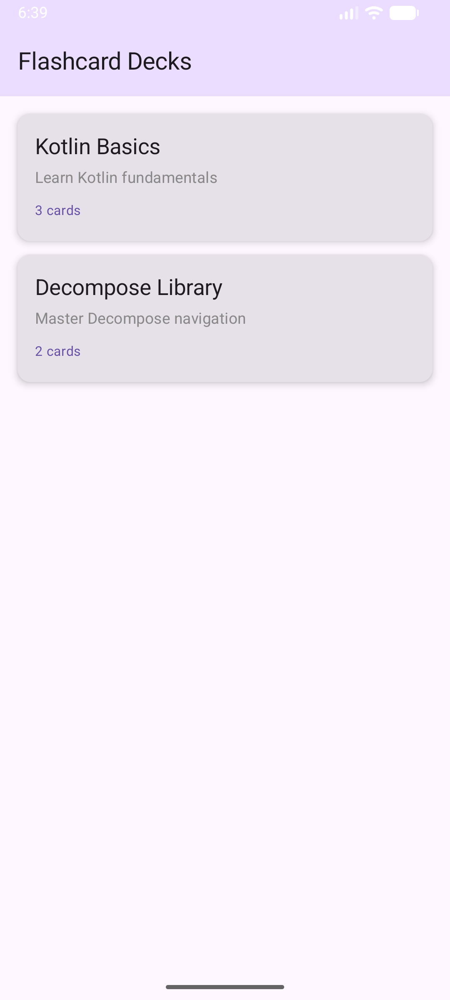
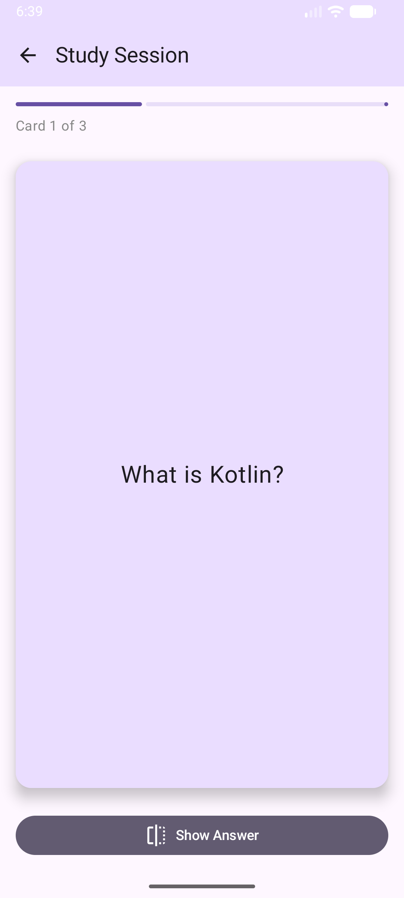
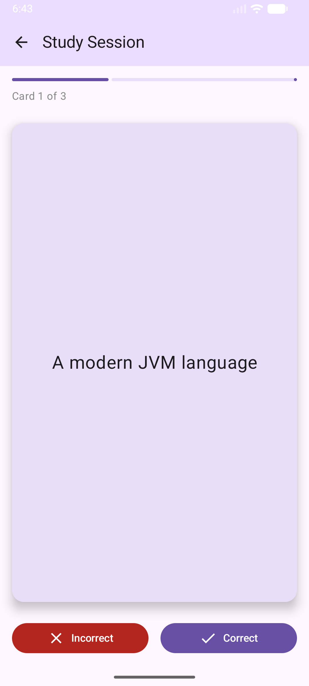
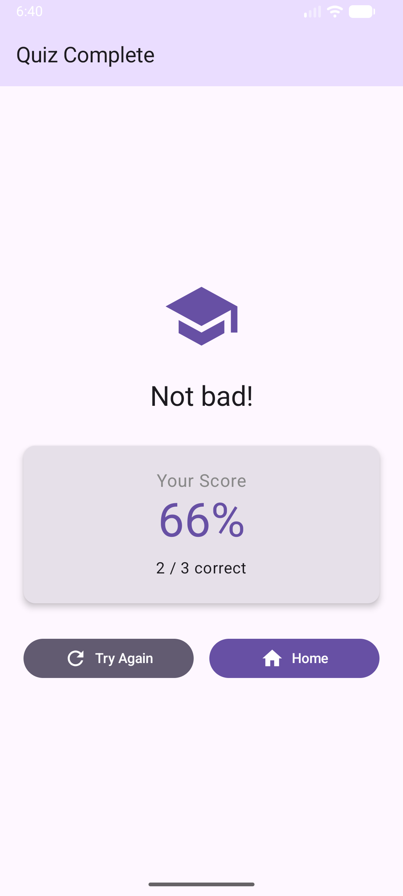
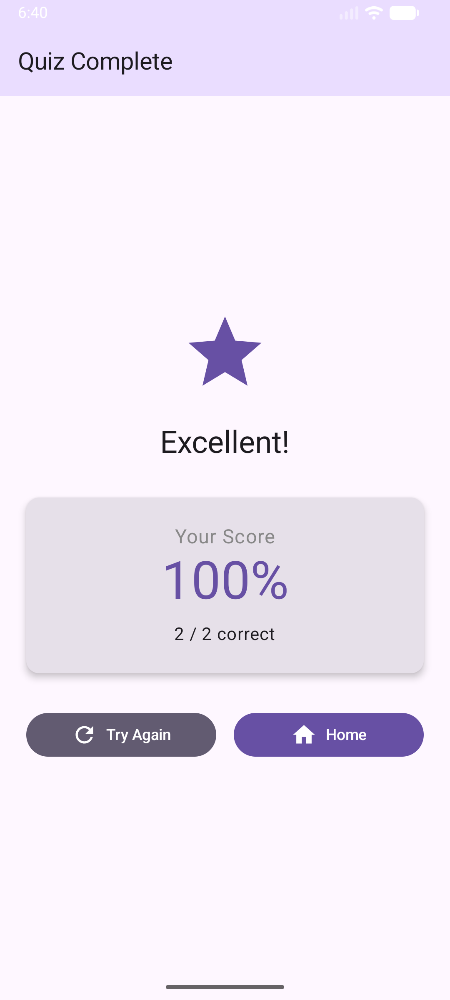

# 4. Labor - Decompose

## Bevezető


A labor során egy kártya-alapú, tanuláshoz használható kvíz alkalmazást fogunk elkészíteni Android, iOS és Desktop platformokra. Az egyszerűség kedvéért a webes platformmal most nem foglalkozunk, azonban ez csak kényelmi szempont miatt van, az alkalmazás fordulna és futna webes környezetben is. Az alkalmazásban lehetőség lesz kvízkártyákat tartalmazó paklik kiválasztására, amely során a pakliban lévő kártyák kérdéseit tudjuk böngészni. Miután mindre válaszoltunk, az alkalmazás megjeleníti a helyes válaszaink számát és értékeli az eredményt. Az alkalmazás komponens-alapú architektúrában, a Decompose könyvtár segítségével készül el. Az  alkalmazás az alábbiakhoz hasonlóan fog kinézni mobilos környezetben:

<p align="center">

</p>
<p align="center">


</p>
<p align="center">


</p>

A labor csak a megértéshez szükséges minimális magyarázatokat tartalmazza, részletesebben a vonatkozó előadásokban (5. és 6.) tájékozódhatunk.

## Előkészületek

A feladatok megoldása során ne felejtsük el követni a [feladat beadás folyamatát](../../tudnivalok/github/GitHub.md).

### Git repository létrehozása és letöltése

1. Moodle-ben keressük meg a laborhoz tartozó meghívó URL-jét és annak segítségével hozzuk létre a saját repositoryt.

2. Várjuk meg, míg elkészül a repository, majd checkout-oljuk ki.

3. Hozzunk létre egy új ágat `megoldas` néven, és ezen az ágon dolgozzunk.

4. A `neptun.txt` fájlba írjuk bele a Neptun kódunkat. A fájlban semmi más ne szerepeljen, csak egyetlen sorban a Neptun kód 6 karaktere.


## Projekt létrehozása

Hozzuk létre a projektet az alábbiaknak megfelelően:

1. Az alkalmazás neve legyen `FlashcardStudy`
2. A package name `hu.bme.aut.flashcardstudy`
3. Válasszuk ki a projekt lokációját a Git repositorynkban, majd > Next
4. A minimum SDK az Android platform SDK minimum verzióját jelenti, hagyhatjuk a defaulton (API 26 "Oreo")
5. A *Build configuration language* `Kotlin DSL` legyen.

Ezután kell kiválasztanunk, hogy milyen platformokat szeretnénk támogatni a projektünkben.

6. Pipáljuk be az Android, iOS és Desktop platformokat.
7. A felhasználói felület kódjait is osszuk meg.
8. Servert most sem fogunk használni, de az előző laborokban látott okok miatt célszerű bepipálnunk azt is, vagy kihagyhatjuk, de akkor kézzel kell majd felvennünk a _shared_ gradle modult.
9. Tesztekre nem lesz szükségünk.
10. Ha minden rendben > Finish.

### Függőségek felvétele

Az előző laboron látott módon vegyük fel az alábbi függőségeket. Ha teljesen korrektek akarunk lenni, akkor használjuk a `libs.versions.toml` katalógust is.

A `composeApp` modulban a Decomposera és annak compose extensionjeire, illetve multiplatform ikonokat tartalmazú könyvtárakra lesz szükségünk a commonMain-ben:

```
implementation("com.arkivanov.decompose:decompose:3.5.0")
implementation("com.arkivanov.decompose:extensions-compose:3.5.0")
implementation("org.jetbrains.compose.material:material-icons-core:1.7.3")
implementation("org.jetbrains.compose.material:material-icons-extended:1.7.3")
```


A shared modulban a következők fognak kelleni a commonMain-ben. A középső 2 a generált projektben benne kell, hogy legyen a katalógusban is: 

*   Ugyanazok, mint az előbb a composeApp-ban
*   A kotlinx.coroutines.core a korutinokhoz
*   A compose multiplatform megfelelő részei
*   Egy pluginre is szükségünk lesz a szerializációhoz tartozó kódgeneráláshoz

```
implementation("com.arkivanov.decompose:decompose:3.5.0")
implementation("com.arkivanov.decompose:extensions-compose:3.5.0")
implementation("org.jetbrains.compose.material:material-icons-core:1.7.3")
implementation("org.jetbrains.compose.material:material-icons-extended:1.7.3")

implementation(libs.kotlinx.coroutines.core)
implementation(libs.compose.runtime)
implementation(libs.compose.foundation)
implementation(libs.compose.material3)
implementation(libs.compose.ui)
```

Szükségünk lesz egy android specifikus függőségre is az életciklus-kezeléshez:

```
androidMain.dependencies {
	implementation("com.arkivanov.essenty:lifecycle-android:2.5.0")
}
```


A plugin blokkba pedig:
```
plugins {
    ...
    kotlin("plugin.serialization") version libs.versions.kotlin.get()
}
```

Szinkronizáljuk a projektünket, aminek sikeresen le kell futnia.


## Az üzleti logika és modell megvalósítása

Kezdjük az alkalmazásunk megvalósítását a `shared` modulban. Ide fogjuk elhelyezni a modell osztályainkat, és az üzleti logikát, illetve adatokat tartalmazó Decompose komponenseinket.

Először vegyük fel az adat osztályainkat. Hozzuk létre a `model` packaget, majd abban vegyük fel és valósítsuk meg a következő modell osztályokat:

*   Flashcard: egy kérdés adatai 
*   Deck: több Flashcard-ból épül fel, így egy kérdéseket tartalmazó paklit alkot
*   QuizResult: egy adott Deck során kitöltött kvíz eredménye

```kotlin
import kotlinx.serialization.Serializable

@Serializable
data class Flashcard(
    val id: String,
    val question: String,
    val answer: String,
    val deckId: String
)
```

```kotlin
import kotlinx.serialization.Serializable

@Serializable
data class Deck(
    val id: String,
    val name: String,
    val description: String,
    val flashcards:  List<Flashcard> = emptyList()
)
```

```kotlin
import kotlinx.serialization.Serializable

@Serializable
data class QuizResult(
    val deckId: String,
    val totalCards: Int,
    val correctAnswers: Int,
    val score: Double
)
```

A modell osztályainknak szerializálhatónak kell lenniük ahhoz, hogy a Decompose komponenseiben megfelelően tudjuk majd használni őket. Figyeljük meg, hogy a `kotlinx.serializer` plugin segítségével (amit korábban felvettünk) automatikusan generálódik az osztályokhoz tartozó `serializer()` metódus.

Vegyünk fel egy _FlashcardRepository_ packaget, abba egy  _FlashcardRepository_ osztályt, amely az alkalmazásunk adatait szolgáltatja. Esetünkben természetesen csak beégetett adatokkal fogunk dolgozni, valós környezetben az adatokat lokális adatbázisból vagy egy szervertől kérdeznénk le. A repository a paklik listáját, illetve azok lekérdezését tartalmazza.


```kotlin
import hu.bme.aut.flashcardstudy.model.Deck
import hu.bme.aut.flashcardstudy.model.Flashcard
import kotlinx.coroutines.flow.MutableStateFlow
import kotlinx.coroutines.flow.StateFlow
import kotlinx.coroutines.flow.asStateFlow

class FlashcardRepository {
    private val _decks = MutableStateFlow(getInitialDecks())
    val decks: StateFlow<List<Deck>> = _decks.asStateFlow()
    private fun getInitialDecks(): List<Deck> {
        val deck1Flashcards = listOf(
            Flashcard("f1", "What is Kotlin?", "A modern JVM language", "d1"),
            Flashcard("f2", "What is Decompose?", "A KMP navigation library", "d1"),
            Flashcard("f3", "What is Compose?", "A UI framework", "d1")
        )

        val deck2Flashcards = listOf(
            Flashcard("f4", "What is a Component?", "A lifecycle-aware BLoC", "d2"),
            Flashcard("f5", "What is the Child Stack for?", "Back stack navigation", "d2")
        )

        return listOf(
            Deck("d1", "Kotlin Basics", "Learn Kotlin fundamentals", deck1Flashcards),
            Deck("d2", "Decompose Library", "Master Decompose navigation", deck2Flashcards)
        )
    }

    fun getDeckById(deckId: String): Deck? {
        return decks.value.find { it.id == deckId }
    }
}
```

A következő lépés a komponenseink létrehozása lesz. Ehhez vegyük fel a _components_ packaget, azon belül a szükséges komponenseket.

Az első komponensünk a `RootComponent` lesz. Ez áll a hierarchia tetején, tulajdonképpen a komponens-hierarchia 'belépési pontja'-ként tekinthetünk rá. Itt fogjuk megvalósítani a navigációt, amely a komponenseink között váltogat annak fényében, hogy éppen mi történik az alkalmazásban.

```kotlin
import com.arkivanov.decompose.ComponentContext
import com.arkivanov.decompose.DelicateDecomposeApi
import com.arkivanov.decompose.router.stack.ChildStack
import com.arkivanov.decompose.router.stack.StackNavigation
import com.arkivanov.decompose.router.stack.childStack
import com.arkivanov.decompose.router.stack.pop
import com.arkivanov.decompose.router.stack.push
import com.arkivanov.decompose.value.Value
import hu.bme.aut.flashcardstudy.repository.FlashcardRepository
import kotlinx.serialization.Serializable

class RootComponent(
    componentContext: ComponentContext,
    private val repository: FlashcardRepository
) : ComponentContext by componentContext {

    sealed class Child {
        // Each subclass wraps a specific component type
        data class DeckList(val component: DeckListComponent) : Child()
        data class StudySession(val component: StudySessionComponent) : Child()
        data class QuizResult(val component: QuizResultComponent) : Child()
    }
    private val navigation = StackNavigation<Config>()

    val stack: Value<ChildStack<Config, Child>> = childStack(
        source = navigation,
        serializer = Config.serializer(),
        initialStack = { listOf(Config.DeckList) },
        handleBackButton = true,
        childFactory = ::createChild
    )

    private fun createChild(config: Config, context: ComponentContext): Child {
        return when (config) {
            is Config.DeckList -> Child.DeckList(
                DeckListComponent(context, repository) { event ->
                    handleDeckListEvent(event)  // ← Lambda that calls handler
                }
            )
            is Config.StudySession -> Child.StudySession(
                StudySessionComponent(context, repository, config.deckId) { event ->
                    handleStudySessionEvent(event)  // ← Lambda that calls handler
                }
            )
            is Config.QuizResult -> Child.QuizResult(
                QuizResultComponent(context, Config.QuizResult(config.result)) { event ->
                    handleQuizResultEvent(event)  // ← Lambda that calls handler
                }
            )
        }
    }

    // Event handlers in RootComponent
    private fun handleDeckListEvent(event: DeckListComponent.Event) {
        when (event) {
            is DeckListComponent.Event.SelectDeck -> {
                navigateToStudySession(event.deckId)
            }
        }
    }

    private fun handleStudySessionEvent(event: StudySessionComponent.Event) {
        when (event) {
            is StudySessionComponent.Event.CompleteQuiz -> {
                navigateToQuizResult(Config.QuizResult(result = event.result))
            }
            is StudySessionComponent.Event.Exit -> {
                navigateBack()
            }
        }
    }

    private fun handleQuizResultEvent(event: QuizResultComponent.Event) {
        when (event) {
            is QuizResultComponent.Event.TryAgain -> {
                navigateBack()  // Go back to study session
            }
            is QuizResultComponent.Event.BackToDecks -> {
                // Pop back to deck list (may need multiple pops)
                navigateBack()
                navigateBack()  // Pop twice: result -> study -> list
            }
        }
    }

    @OptIn(DelicateDecomposeApi::class)
    fun navigateToStudySession(deckId: String) {
        navigation.push(Config.StudySession(deckId))
    }

    @OptIn(DelicateDecomposeApi::class)
    fun navigateToQuizResult(result: Config.QuizResult) {
        navigation.push(Config.QuizResult(result.result))
    }

    fun navigateBack() {
        navigation.pop()
    }

    @Serializable
    sealed class Config {
        @Serializable
        data object DeckList : Config()

        @Serializable
        data class StudySession(val deckId: String) : Config()

        @Serializable
        data class QuizResult(val result: hu.bme.aut.flashcardstudy.domain.model.QuizResult) : Config()
    }
}
```

Minden komponens paraméterként egy `ComponentContext` objektumot vesz át, ez a szülő komponens kontextusa. Ezen felül meg is valósítja ezt az interfészt, ettől lesz saját kontextusa, amibe a `by` kulcsszó segítségével át is másolja a szülőtől kapott információkat. Ezen felül paraméterként a repositorynkat is átveszi.

A `Child` osztály az alkomponensek wrappereiként szolgál. Fontos, hogy az alkalmazásban a Decompose saját navigációs megoldását használjuk, nem a megszokott `androidx`-es Navigation3-at. Ennek oka, hogy Decompose-ban a navigáció nem közvetlenük UI screenek között, hanem a komponensek között navigál. Az alkalmazásban a `Stack` navigációs modellt használjuk, amely nagyon hasonló az eddig látott navigációhoz. A `Child`-ok egy stacken tárolódnak, a stack tetején lévő az aktuálisan aktív. A navigációhoz a stacken a `push` hívással tudunk egy adott komponensre navigálni, a `pop` a megszokott módon vissza lép egyet a hierarchián. 

A `RootComponent` osztályunk tartalmaz még egy `Config` osztályt is, amely az egyes komponensek konfigurációs adatait fogja össze. Fontos, hogy a `QuizResult` modell osztályon felül a `Config` osztályunk is tartalmaz egy `QuizResult` belső data classt. Ez reprezentálja az eredmény konfigurációját, ez alapján fogunk tudni navigálni és a megfelelő adatokat szolgáltatni a komponensek között. Ezért ez a data class paraméterben kapja a modellosztály egy példányát.

A `RootComponent` természetesen még nem fordul, hiszen hiányzik még a többi komponens megvalósítása. Valósítsuk meg ezeket is ugyanebben a packageben (components).

A DeckListComponent felelős a paklik listájának kezeléséért. Egy inicializációs blokkban betölti a repositoryból az éppen aktuális paklik listáját, illetve kezeli, ha ráklikkelünk valamelyik paklira. Ebben az esetben ugyanis el kell indítanunk az adott pakli kvízjét. A listák betöltését korutinon végezzük, amihez szükségünk van egy Scope-ra is. Ehhez egy segédmetódusra lesz szükségünk, ami még egyelőre nem fordul, hiszen még nem hoztuk létre.

Minden komponens a rajta keletkezett és végrehajtható eseményeket egy `Event` osztályon belül fogja össze. Esetünkben csak egy ilyen esemény van: egy paklin való kattintás, ami annak kiválasztását jelenti.

```kotlin
import androidx.compose.runtime.getValue
import androidx.compose.runtime.mutableStateOf
import androidx.compose.runtime.setValue
import com.arkivanov.decompose.ComponentContext
import hu.bme.aut.flashcardstudy.model.Deck
import hu.bme.aut.flashcardstudy.repository.FlashcardRepository
import hu.bme.aut.flashcardstudy.utils.coroutineScope
import kotlinx.coroutines.Dispatchers
import kotlinx.coroutines.flow.launchIn
import kotlinx.coroutines.flow.onEach
import kotlinx.coroutines.launch
import kotlin.collections.emptyList

class DeckListComponent(
    componentContext: ComponentContext,
    private val repository: FlashcardRepository,
    private val onEvent: (Event) -> Unit
) : ComponentContext by componentContext {
    private val componentScope = coroutineScope(Dispatchers.Main)

    var decks by mutableStateOf<List<Deck>>(emptyList())
        private set

    var isLoading by mutableStateOf(true)
        private set

    init {
        loadDecks()
    }

    private fun loadDecks() {
        componentScope.launch {
            isLoading = true
            repository.decks
                .onEach { decksList ->
                    decks = decksList
                    isLoading = false
                }
                .launchIn(componentScope)
        }
    }

    fun onDeckSelected(deckId: String) {
        onEvent(Event.SelectDeck(deckId))
    }

    sealed class Event {
        data class SelectDeck(val deckId: String) : Event()
    }
}
```

Vegyük fel a `utils` packaget és azon belül egy `Extensions.kt` fájlt, benne az alábbi extension metódussal, amely a Scope inicializálásáért felel.

```kotlin
import com.arkivanov.essenty.lifecycle.LifecycleOwner
import com.arkivanov.essenty.lifecycle.doOnDestroy
import kotlinx.coroutines.CoroutineScope
import kotlinx.coroutines.cancel
import kotlin.coroutines.CoroutineContext

fun LifecycleOwner.coroutineScope(context: CoroutineContext): CoroutineScope {
    val scope = CoroutineScope(context)
    lifecycle.doOnDestroy(scope::cancel)
    return scope
}
```


A QuizResultComponent meglehetősen egyszerű, csupán egy kvíz eredményéért felel, ehhez átveszi paraméterként a kvíz eredményét. Az előző komponenshez hasonlóan itt is egy lambda segítségével juttatjuk vissza a `RootComponent` felé, hogy mi történjen. Itt 2 eseményünk is van: vagy újrapróbálkozunk a kvízzel, vagy visszatérünk a paklik listájához.

```kotlin
import com.arkivanov.decompose.ComponentContext

class QuizResultComponent(
    componentContext: ComponentContext,
    val result: RootComponent.Config.QuizResult,
    private val onEvent: (Event) -> Unit
) : ComponentContext by componentContext {

    fun tryAgain() {
        onEvent(Event.TryAgain)
    }

    fun backToDecks() {
        onEvent(Event.BackToDecks)
    }

    sealed class Event {
        data object TryAgain : Event()
        data object BackToDecks : Event()
    }
}
```

A StudySessionComponent felel a kvízek lebonyolításáért. Átveszi az adott pakli ID-ját, amit felhasználva a repositorytól lekérdezi az ahhoz tartozó kártyákat. Kezeli a kvíz menetének logikáját, ahol számolja a pontokat, és elkészíti az eredményt, amennyiben minden kérdésre válaszoltunk már. Az előző 2 komponenshez hasonlóan a lambda segítségével az adott végrehajtandó eseményt, és annak paramétereit visszajuttatja a `RootComponent` felé, aki ezt megkapva végrehajtja a megfelelő eseményt a megfelelő paraméterekkel.

```kotlin
import androidx.compose.runtime.getValue
import androidx.compose.runtime.mutableStateOf
import androidx.compose.runtime.setValue
import com.arkivanov.decompose.ComponentContext
import hu.bme.aut.flashcardstudy.model.Flashcard
import hu.bme.aut.flashcardstudy.model.QuizResult
import hu.bme.aut.flashcardstudy.repository.FlashcardRepository

class StudySessionComponent(
    componentContext: ComponentContext,
    private val repository: FlashcardRepository,
    private val deckId: String,
    private val onEvent: (Event) -> Unit
) : ComponentContext by componentContext {

    var flashcards by mutableStateOf<List<Flashcard>>(emptyList())
        private set
    var currentIndex by mutableStateOf(0)
        private set
    var showAnswer by mutableStateOf(false)
        private set
    var score by mutableStateOf(0)
        private set

    init {
        loadFlashcards()
    }

    private fun loadFlashcards() {
        val deck = repository.getDeckById(deckId)
        flashcards = deck?.flashcards ?: emptyList()
    }

    val currentCard: Flashcard?
        get() = flashcards.getOrNull(currentIndex)

    val isLastCard: Boolean
        get() = currentIndex == flashcards.lastIndex

    val progress: Float
        get() = if (flashcards.isNotEmpty()) {
            (currentIndex + 1).toFloat() / flashcards.size
        } else 0f

    fun flipCard() {
        showAnswer = !showAnswer
    }

    fun markAsCorrect() {
        score++
        moveToNextCard()
    }

    fun markAsIncorrect() {
        moveToNextCard()
    }

    private fun moveToNextCard() {
        if (isLastCard) {
            finishQuiz()
        } else {
            currentIndex++
            showAnswer = false
        }
    }

    private fun finishQuiz() {
        val result = QuizResult(
            deckId = deckId,
            totalCards = flashcards.size,
            correctAnswers = score,
            score = if (flashcards.isNotEmpty()) {
                (score.toDouble() / flashcards.size) * 100
            } else 0.0
        )
        onEvent(Event.CompleteQuiz(result))
    }

    fun exitQuiz() {
        onEvent(Event.Exit)
    }

    sealed class Event {
        data class CompleteQuiz(val result: QuizResult) : Event()
        data object Exit : Event()
    }
}
```

## Felhasználói felület kialakítása

Ahogy azt bizonyára észrevettük, a komponensek nem tartalmazzák közvetlenül a megjelenítésükhez tartozó kódot. A felhasználói felületet tetszőleges módon megvalósíthatjuk, és az elkészített komponenseinket beágyazhatjuk az adott keretrendszerben, hasonlóan, mintha csak egy `ViewModel` lenne. Megfigyelhetjük az adatait, felhasználhatjuk a publikus metódusait stb.

A felhasználói felületet a korábbiaknak megfelelően a `composeApp` packageben valósítjuk meg, Compose Multiplatform segítségével. Ehhez el kell készítenünk az alkalmazás közös felhasználói felületének kódját, illetve a platform-specifikus belépési pontokat. Kezdjük az előbbivel.

A `commonMain`-en belül vegyünk fel egy `components` packaget, ide helyezzük el a composable elemeinket.

*   DeckCard: egy kérdés kártyája
*   DeckListScreen: a paklik listája
*   StudySessionScreen: az adott pakli kérdéseinek kvízje
*   QuizResultScreen: az adott kvíz eredménye

Készítsük most el ezeket! Vegyük szemügyre a megvalósításukat, a korábbiak alapján elemezzük és értelmezzük a látottakat!

`DeckCard.kt`:

```kotlin
import androidx.compose.foundation.clickable
import androidx.compose.foundation.layout.Column
import androidx.compose.foundation.layout.Spacer
import androidx.compose.foundation.layout.fillMaxWidth
import androidx.compose.foundation.layout.height
import androidx.compose.foundation.layout.padding
import androidx.compose.material3.Card
import androidx.compose.material3.CardDefaults
import androidx.compose.material3.MaterialTheme
import androidx.compose.material3.Text
import androidx.compose.runtime.Composable
import androidx.compose.ui.Modifier
import androidx.compose.ui.graphics.Color
import androidx.compose.ui.unit.dp
import androidx.compose.ui.unit.sp
import hu.bme.aut.flashcardstudy.model.Deck

@Composable
fun DeckCard(deck: Deck, onClick: () -> Unit) {
    Card(
        modifier = Modifier
            .fillMaxWidth()
            .clickable(onClick = onClick),
        elevation = CardDefaults.cardElevation(defaultElevation = 4.dp)
    ) {
        Column(
            modifier = Modifier
                .fillMaxWidth()
                .padding(16.dp)
        ) {
            Text(
                text = deck.name,
                fontSize = 20.sp,
                style = MaterialTheme.typography.titleLarge
            )
            Spacer(modifier = Modifier.height(4.dp))
            Text(
                text = deck.description,
                fontSize = 14.sp,
                style = MaterialTheme.typography.bodyMedium,
                color = Color.Gray
            )
            Spacer(modifier = Modifier.height(8.dp))
            Text(
                text = "${deck.flashcards.size} cards",
                fontSize = 12.sp,
                color = MaterialTheme.colorScheme.primary
            )
        }
    }
}
```

`DeckListScreen.kt`:

```kotlin
import androidx.compose.foundation.layout.Arrangement
import androidx.compose.foundation.layout.Box
import androidx.compose.foundation.layout.PaddingValues
import androidx.compose.foundation.layout.fillMaxSize
import androidx.compose.foundation.layout.padding
import androidx.compose.foundation.lazy.LazyColumn
import androidx.compose.foundation.lazy.items
import androidx.compose.material3.CircularProgressIndicator
import androidx.compose.material3.ExperimentalMaterial3Api
import androidx.compose.material3.MaterialTheme
import androidx.compose.material3.Scaffold
import androidx.compose.material3.Text
import androidx.compose.material3.TopAppBar
import androidx.compose.material3.TopAppBarDefaults
import androidx.compose.runtime.Composable
import androidx.compose.ui.Alignment
import androidx.compose.ui.Modifier
import androidx.compose.ui.unit.dp
import hu.bme.aut.flashcardstudy.DeckCard
import hu.bme.aut.flashcardstudy.components.DeckListComponent

@OptIn(ExperimentalMaterial3Api::class)
@Composable
fun DeckListScreen(component: DeckListComponent) {
    Scaffold(
        topBar = {
            TopAppBar(
                title = { Text("Flashcard Decks") },
                colors = TopAppBarDefaults.topAppBarColors(
                    containerColor = MaterialTheme.colorScheme.primaryContainer
                )
            )
        }
    ) { paddingValues ->
        when {
            component.isLoading -> {
                Box(
                    modifier = Modifier.fillMaxSize(),
                    contentAlignment = Alignment.Center
                ) {
                    CircularProgressIndicator()
                }
            }
            component.decks.isEmpty() -> {
                Box(
                    modifier = Modifier.fillMaxSize(),
                    contentAlignment = Alignment.Center
                ) {
                    Text("No decks available")
                }
            }
            else -> {
                LazyColumn(
                    modifier = Modifier
                        .fillMaxSize()
                        .padding(paddingValues),
                    contentPadding = PaddingValues(16.dp),
                    verticalArrangement = Arrangement.spacedBy(12.dp)
                ) {
                    items(component.decks) { deck ->
                        DeckCard(
                            deck = deck,
                            onClick = { component.onDeckSelected(deck.id) }
                        )
                    }
                }
            }
        }
    }
}

```


`StudySessionScreen.kt`:

```kotlin
import androidx.compose.foundation.background
import androidx.compose.foundation.clickable
import androidx.compose.foundation.layout.Arrangement
import androidx.compose.foundation.layout.Box
import androidx.compose.foundation.layout.Column
import androidx.compose.foundation.layout.Row
import androidx.compose.foundation.layout.Spacer
import androidx.compose.foundation.layout.fillMaxSize
import androidx.compose.foundation.layout.fillMaxWidth
import androidx.compose.foundation.layout.height
import androidx.compose.foundation.layout.padding
import androidx.compose.foundation.layout.width
import androidx.compose.foundation.shape.RoundedCornerShape
import androidx.compose.material.icons.Icons
import androidx.compose.material.icons.automirrored.filled.ArrowBack
import androidx.compose.material.icons.filled.Check
import androidx.compose.material.icons.filled.Close
import androidx.compose.material.icons.filled.Flip
import androidx.compose.material3.Button
import androidx.compose.material3.ButtonDefaults
import androidx.compose.material3.Card
import androidx.compose.material3.CardDefaults
import androidx.compose.material3.ExperimentalMaterial3Api
import androidx.compose.material3.Icon
import androidx.compose.material3.IconButton
import androidx.compose.material3.LinearProgressIndicator
import androidx.compose.material3.MaterialTheme
import androidx.compose.material3.ProgressIndicatorDefaults
import androidx.compose.material3.Scaffold
import androidx.compose.material3.Text
import androidx.compose.material3.TopAppBar
import androidx.compose.material3.TopAppBarDefaults
import androidx.compose.runtime.Composable
import androidx.compose.ui.Alignment
import androidx.compose.ui.Modifier
import androidx.compose.ui.graphics.Color
import androidx.compose.ui.text.style.TextAlign
import androidx.compose.ui.unit.dp
import androidx.compose.ui.unit.sp
import hu.bme.aut.flashcardstudy.components.StudySessionComponent

@OptIn(ExperimentalMaterial3Api::class)
@Composable
fun StudySessionScreen(component: StudySessionComponent) {
    val currentCard = component.currentCard

    Scaffold(
        topBar = {
            TopAppBar(
                title = { Text("Study Session") },
                navigationIcon = {
                    IconButton(onClick = { component.exitQuiz() }) {
                        Icon(Icons.AutoMirrored.Filled.ArrowBack, contentDescription = "Back")
                    }
                },
                colors = TopAppBarDefaults.topAppBarColors(
                    containerColor = MaterialTheme.colorScheme.primaryContainer
                )
            )
        }
    ) { paddingValues ->
        if (currentCard == null) {
            Box(
                modifier = Modifier
                    .fillMaxSize()
                    .padding(paddingValues),
                contentAlignment = Alignment.Center
            ) {
                Text("No flashcards in this deck")
            }
        } else {
            Column(
                modifier = Modifier
                    .fillMaxSize()
                    .padding(paddingValues)
                    .padding(16.dp)
            ) {
                // Progress indicator
                LinearProgressIndicator(
                    progress = { component.progress },
                    modifier = Modifier.fillMaxWidth(),
                    color = MaterialTheme.colorScheme.primary,
                    trackColor = ProgressIndicatorDefaults.linearTrackColor,
                    strokeCap = ProgressIndicatorDefaults.LinearStrokeCap,
                )

                Spacer(modifier = Modifier.height(8.dp))

                Text(
                    text = "Card ${component.currentIndex + 1} of ${component.flashcards.size}",
                    fontSize = 14.sp,
                    color = Color.Gray
                )

                Spacer(modifier = Modifier.height(24.dp))

                // Flashcard
                Card(
                    modifier = Modifier
                        .fillMaxWidth()
                        .weight(1f)
                        .clickable { component.flipCard() },
                    elevation = CardDefaults.cardElevation(defaultElevation = 8.dp),
                    shape = RoundedCornerShape(16.dp)
                ) {
                    Box(
                        modifier = Modifier
                            .fillMaxSize()
                            .background(
                                if (component.showAnswer)
                                    MaterialTheme.colorScheme.secondaryContainer
                                else
                                    MaterialTheme.colorScheme.primaryContainer
                            ),
                        contentAlignment = Alignment.Center
                    ) {
                        Text(
                            text = if (component.showAnswer) currentCard.answer else currentCard.question,
                            fontSize = 24.sp,
                            textAlign = TextAlign.Center,
                            modifier = Modifier.padding(24.dp),
                            style = MaterialTheme.typography.bodyLarge
                        )
                    }
                }

                Spacer(modifier = Modifier.height(24.dp))

                // Action buttons
                if (component.showAnswer) {
                    Row(
                        modifier = Modifier.fillMaxWidth(),
                        horizontalArrangement = Arrangement.spacedBy(16.dp)
                    ) {
                        Button(
                            onClick = { component.markAsIncorrect() },
                            modifier = Modifier.weight(1f),
                            colors = ButtonDefaults.buttonColors(
                                containerColor = MaterialTheme.colorScheme.error
                            )
                        ) {
                            Icon(Icons.Default.Close, contentDescription = "Incorrect")
                            Spacer(modifier = Modifier.width(8.dp))
                            Text("Incorrect")
                        }

                        Button(
                            onClick = { component.markAsCorrect() },
                            modifier = Modifier.weight(1f),
                            colors = ButtonDefaults.buttonColors(
                                containerColor = MaterialTheme.colorScheme.primary
                            )
                        ) {
                            Icon(Icons.Default.Check, contentDescription = "Correct")
                            Spacer(modifier = Modifier.width(8.dp))
                            Text("Correct")
                        }
                    }
                } else {
                    Button(
                        onClick = { component.flipCard() },
                        modifier = Modifier.fillMaxWidth(),
                        colors = ButtonDefaults.buttonColors(
                            containerColor = MaterialTheme.colorScheme.secondary
                        )
                    ) {
                        Icon(Icons.Default.Flip, contentDescription = "Flip")
                        Spacer(modifier = Modifier.width(8.dp))
                        Text("Show Answer")
                    }
                }
            }
        }
    }
}

```

`QuizResultScreen.kt`:

```kotlin
import androidx.compose.foundation.layout.Arrangement
import androidx.compose.foundation.layout.Column
import androidx.compose.foundation.layout.Row
import androidx.compose.foundation.layout.Spacer
import androidx.compose.foundation.layout.fillMaxSize
import androidx.compose.foundation.layout.fillMaxWidth
import androidx.compose.foundation.layout.height
import androidx.compose.foundation.layout.padding
import androidx.compose.foundation.layout.size
import androidx.compose.foundation.layout.width
import androidx.compose.material.icons.Icons
import androidx.compose.material.icons.filled.Home
import androidx.compose.material.icons.filled.Refresh
import androidx.compose.material.icons.filled.School
import androidx.compose.material.icons.filled.Star
import androidx.compose.material3.Button
import androidx.compose.material3.ButtonDefaults
import androidx.compose.material3.Card
import androidx.compose.material3.CardDefaults
import androidx.compose.material3.ExperimentalMaterial3Api
import androidx.compose.material3.Icon
import androidx.compose.material3.MaterialTheme
import androidx.compose.material3.Scaffold
import androidx.compose.material3.Text
import androidx.compose.material3.TopAppBar
import androidx.compose.material3.TopAppBarDefaults
import androidx.compose.runtime.Composable
import androidx.compose.ui.Alignment
import androidx.compose.ui.Modifier
import androidx.compose.ui.graphics.Color
import androidx.compose.ui.unit.dp
import androidx.compose.ui.unit.sp
import hu.bme.aut.flashcardstudy.components.QuizResultComponent

@OptIn(ExperimentalMaterial3Api::class)
@Composable
fun QuizResultScreen(component: QuizResultComponent) {
    val result = component.result.result
    val grade = when {
        result.score >= 90 -> "Excellent!"
        result.score >= 70 -> "Good job!"
        result.score >= 50 -> "Not bad!"
        else -> "Keep practicing!"
    }

    Scaffold(
        topBar = {
            TopAppBar(
                title = { Text("Quiz Complete") },
                colors = TopAppBarDefaults.topAppBarColors(
                    containerColor = MaterialTheme.colorScheme.primaryContainer
                )
            )
        }
    ) { paddingValues ->
        Column(
            modifier = Modifier
                .fillMaxSize()
                .padding(paddingValues)
                .padding(24.dp),
            horizontalAlignment = Alignment.CenterHorizontally,
            verticalArrangement = Arrangement.Center
        ) {
            Icon(
                imageVector = when {
                    result.score >= 70 -> Icons.Default.Star
                    else -> Icons.Default.School
                },
                contentDescription = null,
                modifier = Modifier.size(80.dp),
                tint = MaterialTheme.colorScheme.primary
            )

            Spacer(modifier = Modifier.height(24.dp))

            Text(
                text = grade,
                fontSize = 28.sp,
                style = MaterialTheme.typography.headlineMedium
            )

            Spacer(modifier = Modifier.height(32.dp))

            Card(
                modifier = Modifier.fillMaxWidth(),
                elevation = CardDefaults.cardElevation(defaultElevation = 4.dp)
            ) {
                Column(
                    modifier = Modifier
                        .fillMaxWidth()
                        .padding(24.dp),
                    horizontalAlignment = Alignment.CenterHorizontally
                ) {
                    Text(
                        text = "Your Score",
                        fontSize = 18.sp,
                        color = Color.Gray
                    )
                    Text(
                        text = "${result.score.toInt()}%",
                        fontSize = 48.sp,
                        style = MaterialTheme.typography.displayMedium,
                        color = MaterialTheme.colorScheme.primary
                    )
                    Spacer(modifier = Modifier.height(8.dp))
                    Text(
                        text = "${result.correctAnswers} / ${result.totalCards} correct",
                        fontSize = 16.sp
                    )
                }
            }

            Spacer(modifier = Modifier.height(32.dp))

            Row(
                modifier = Modifier.fillMaxWidth(),
                horizontalArrangement = Arrangement.spacedBy(16.dp)
            ) {
                Button(
                    onClick = { component.tryAgain() },
                    modifier = Modifier.weight(1f),
                    colors = ButtonDefaults.buttonColors(
                        containerColor = MaterialTheme.colorScheme.secondary
                    )
                ) {
                    Icon(Icons.Default.Refresh, contentDescription = "Try Again")
                    Spacer(modifier = Modifier.width(8.dp))
                    Text("Try Again")
                }

                Button(
                    onClick = { component.backToDecks() },
                    modifier = Modifier.weight(1f)
                ) {
                    Icon(Icons.Default.Home, contentDescription = "Back to Decks")
                    Spacer(modifier = Modifier.width(8.dp))
                    Text("Home")
                }
            }
        }
    }
}

```
Ezzel a képernyőink készen vannak. Lássuk most az alkalmazás belépési pontját. Ennek, a megszokottaknak megfelelően, lesz egy közös kódban megvalósított része, és lesznek platform-specifikus részek is.

A belépési pont közös részét egy `FlashcardApplication.kt` fájlban valósítjuk meg. A komponens-hierarchia tetején a `RootComponent` van, ezt az alkalmazás indulásakor létre kell hoznunk az adott platformnak megfelelő módon. Ezért ezt konstruktor paraméterben vesszük át, inicializáljuk a komponens `Child` stackjét (némi animációval együtt), majd az egyes `Child`-okhoz bekötjük az általa reprezentált képernyőket.

```kotlin
import androidx.compose.material3.ExperimentalMaterial3Api
import hu.bme.aut.flashcardstudy.domain.components.RootComponent

import androidx.compose.material3.MaterialTheme
import androidx.compose.runtime.Composable
import com.arkivanov.decompose.extensions.compose.stack.Children
import com.arkivanov.decompose.extensions.compose.stack.animation.fade
import com.arkivanov.decompose.extensions.compose.stack.animation.plus
import com.arkivanov.decompose.extensions.compose.stack.animation.scale
import com.arkivanov.decompose.extensions.compose.stack.animation.stackAnimation
import hu.bme.aut.flashcardstudy.components.DeckListScreen
import hu.bme.aut.flashcardstudy.components.QuizResultScreen
import hu.bme.aut.flashcardstudy.components.StudySessionScreen

@OptIn(ExperimentalMaterial3Api::class)
@Composable
fun FlashcardApp(rootComponent: RootComponent) {
    Children(
        stack = rootComponent.stack,
        animation = stackAnimation(fade() + scale())
    ) { child ->
        when (val instance = child.instance) {
            is RootComponent.Child.DeckList -> DeckListScreen(instance.component)
            is RootComponent.Child.StudySession -> StudySessionScreen(instance.component)
            is RootComponent.Child.QuizResult -> QuizResultScreen(instance.component)
        }
    }
}

@Composable
fun FlashcardApplication(rootComponent: RootComponent) {
    MaterialTheme {
        FlashcardApp(rootComponent = rootComponent)
    }
}
```

Nemsokára kipróbálhatjuk az alkalmazásunkat, már csak a platform-specifikus belépési pontok maradtak. Mindegyiknek ugyanaz a célja: inicializáljuk a `RootComponent`-et, a repositoryt, illetve annak életciklusát, majd az adott platformon megfelelő API felhasználásával meghívjuk az előbb létrehozott belépési pontot.

!!!Info "Dependency Injection Decomposeban"
	Észrevehetjük, hogy ezen a ponton az előző laboron már Dependency Injection keretrendszert használtunk. Decompose esetén is van erre lehetőségünk, viszont annak készítője nem feltétlenül ajánlja DI framework használatát, hanem, különösen egyszerűbb esetekben, a szükséges függőségeket mindenhol kézzel példányosítjuk és adjuk át azokat konstruktorban. Az egyszerűség kedvéért ezen a laboron még interfészeket se használtunk ehhez, ha teljesen korrektek akarnánk lenni, azt még megtehetnénk.

`MainActivity`:

```kotlin
import android.os.Bundle
import androidx.activity.ComponentActivity
import androidx.activity.compose.setContent
import com.arkivanov.decompose.DefaultComponentContext
import com.arkivanov.essenty.lifecycle.essentyLifecycle
import hu.bme.aut.flashcardstudy.components.RootComponent
import hu.bme.aut.flashcardstudy.repository.FlashcardRepository

class MainActivity : ComponentActivity() {
    override fun onCreate(savedInstanceState: Bundle?) {
        super.onCreate(savedInstanceState)

        val lifecycle = essentyLifecycle()
        val repository = FlashcardRepository()
        val rootComponent = RootComponent(
            componentContext = DefaultComponentContext(lifecycle = lifecycle),
            repository = repository
        )

        setContent {
            FlashcardApplication(rootComponent = rootComponent)
        }
    }
}
```

`MainViewController`:

```kotlin
import androidx.compose.ui.window.ComposeUIViewController
import hu.bme.aut.flashcardstudy.repository.FlashcardRepository
import com.arkivanov.decompose.DefaultComponentContext
import com.arkivanov.essenty.lifecycle.LifecycleRegistry
import hu.bme.aut.flashcardstudy.components.RootComponent

fun MainViewController() = ComposeUIViewController {
    val lifecycle = LifecycleRegistry()
    val repository = FlashcardRepository()
    val rootComponent = RootComponent(
        componentContext = DefaultComponentContext(lifecycle = lifecycle),
        repository = repository
    )

    FlashcardApplication(rootComponent = rootComponent)
}
```

`main (Desktop)`:

```kotlin
import androidx.compose.ui.window.Window
import androidx.compose.ui.window.application
import androidx.compose.ui.window.rememberWindowState
import com.arkivanov.decompose.DefaultComponentContext
import com.arkivanov.decompose.extensions.compose.lifecycle.LifecycleController
import com.arkivanov.essenty.lifecycle.LifecycleRegistry
import hu.bme.aut.flashcardstudy.domain.components.RootComponent
import hu.bme.aut.flashcardstudy.domain.repository.FlashcardRepository

fun main() = application {
    val lifecycle = LifecycleRegistry()

    val repository = FlashcardRepository()
    val rootComponent = RootComponent(
        componentContext = DefaultComponentContext(lifecycle = lifecycle),
        repository = repository
    )

    val windowState = rememberWindowState()

    LifecycleController(lifecycle, windowState)

    Window(
        onCloseRequest = ::exitApplication,
        state = windowState,
        title = "Flashcard Study App"
    ) {
        FlashcardApplication(rootComponent = rootComponent)
    }
}
```

Ezzel elkészültünk, futtassuk az alkalmazást! Próbáljuk ki Android és Desktop (és ha tehetjük, iOS) platformokon is! Futtatás előtt töröljünk mindent, amit a projekt generálásakor kaptunk és nincs rá szükségünk! Ide tartozik A Greeting.kt és minden hozadéka, a default belépési pontok közös és platform-specifikus részei, illetve a szerver (ha volt) is!

!!!example "BEADANDÓ (1 pont)" 
	Készítsünk **3 képernyőképet**, amelyen látszik az elkészített összes felület: a paklik listája, egy tetszőleges kérdés kártyája kvíz közben, és a kvíz eredményét mutató képernyő! 

	A képeket a megoldásban a repositoryba f1a.png, f1b.png és f1c.png néven töltsük fel!


##  Az alkalmazás továbbfejlesztése - életciklus kezelése

Módosítsuk az alkalmazásunkat úgy, hogy az alkalmazás érzékelje, hogy a felhasználó mikor van éppen egy kvíz kitöltése közben, illetve mennyi időt tölt el ott!

A megoldást a komponensek életciklus eseményein keresztül célszerű megközelíteni. Arról van szó, hogy megkülönböztessük azt, mikor aktív egy adott komponens (StudySessionComponent), és mikor aktív valamelyik másik, hiszen a felhasználó akkor tölt épp ki egy kvízt, amikor ez a komponens aktív.

Egészítsük ki tehát ezt a komponenst úgy, hogy megfigyeljük annak életciklusát is. Vegyük fel a timerünk működéséhez szükséges tagváltozókat. Az egyik az eltelt időt mutatja, a másik egy korutin Job-on keresztül elvégzi magát az időzített számlálást.

```kotlin
...
    var studyTimeSeconds by mutableStateOf(0)
    private var timerJob: Job? = null
...
```

Iratkozzunk fel a releváns életciklus eseményekre, például az alábbi módon! Amikor a komponens előtérben van (OnResume), indítsuk el a számlálót! Amikor nincs (OnStop), állítsuk le!

```kotlin
init {
	...
	lifecycle.doOnResume {
		startTimer()
	}

	lifecycle.doOnStop {
		stopTimer()
	}
}

   private fun startTimer() {
        timerJob = componentScope.launch {
            while (true) {
                delay(1000)
                studyTimeSeconds++
            }
        }
    }

    private fun stopTimer() {
        timerJob?.cancel()
        timerJob = null
    }


```

Végül jelenítsük meg a számlálót a kvíz felületén!


`StudySessionScreen`:

```kotlin
@OptIn(ExperimentalMaterial3Api::class)
@Composable
fun StudySessionScreen(component: StudySessionComponent) {
    val currentCard = component.currentCard

    Scaffold(
        topBar = {
            TopAppBar(
                title = { Text("Study Session") },
                navigationIcon = {
                    IconButton(onClick = { component.exitQuiz() }) {
                        Icon(Icons.AutoMirrored.Filled.ArrowBack, contentDescription = "Back")
                    }
                },
                colors = TopAppBarDefaults.topAppBarColors(
                    containerColor = MaterialTheme.colorScheme.primaryContainer
                )
            )
        }
    ) { paddingValues ->

        Column(
            modifier = Modifier
                .fillMaxSize()
                .padding(paddingValues)
        ) {
            Card(
                modifier = Modifier
                    .fillMaxWidth()
                    .padding(16.dp),
                colors = CardDefaults.cardColors(
                    containerColor = MaterialTheme.colorScheme.primaryContainer
                )
            ) {
                Column(
                    modifier = Modifier.padding(12.dp)
                ) {
                    Text(
                        text = "⏱️ Study Time: ${component.studyTimeSeconds}s",
                        fontSize = 18.sp,
                        color = MaterialTheme.colorScheme.primary
                    )
                    Text(
                        text = "Timer runs while screen is visible",
                        fontSize = 12.sp,
                        color = Color.Gray
                    )
                }
            }

            // Rest of the content
            if (currentCard == null) {
                Box(
                    modifier = Modifier
                        .fillMaxSize()
                        .weight(1f),
                    contentAlignment = Alignment.Center
                ) {
                    Text("No flashcards in this deck")
                }
            } else {
                Column(
                    modifier = Modifier
                        .fillMaxSize()
                        .padding(16.dp)
                ) {
                    // Progress indicator
                    LinearProgressIndicator(
                        progress = { component.progress },
                        modifier = Modifier.fillMaxWidth(),
                        color = MaterialTheme.colorScheme.primary,
                        trackColor = ProgressIndicatorDefaults.linearTrackColor,
                    )

                    Spacer(modifier = Modifier.height(8.dp))

                    Text(
                        text = "Card ${component.currentIndex + 1} of ${component.flashcards.size}",
                        fontSize = 14.sp,
                        color = Color.Gray
                    )

                    Spacer(modifier = Modifier.height(24.dp))

                    // Flashcard
                    Card(
                        modifier = Modifier
                            .fillMaxWidth()
                            .weight(1f)
                            .clickable { component.flipCard() },
                        elevation = CardDefaults.cardElevation(defaultElevation = 8.dp),
                        shape = RoundedCornerShape(16.dp)
                    ) {
                        Box(
                            modifier = Modifier
                                .fillMaxSize()
                                .background(
                                    if (component.showAnswer)
                                        MaterialTheme.colorScheme.secondaryContainer
                                    else
                                        MaterialTheme.colorScheme.primaryContainer
                                ),
                            contentAlignment = Alignment.Center
                        ) {
                            Text(
                                text = if (component.showAnswer) currentCard.answer else currentCard.question,
                                fontSize = 24.sp,
                                textAlign = TextAlign.Center,
                                modifier = Modifier.padding(24.dp),
                                style = MaterialTheme.typography.bodyLarge
                            )
                        }
                    }

                    Spacer(modifier = Modifier.height(24.dp))

                    // Action buttons
                    if (component.showAnswer) {
                        Row(
                            modifier = Modifier.fillMaxWidth(),
                            horizontalArrangement = Arrangement.spacedBy(16.dp)
                        ) {
                            Button(
                                onClick = { component.markAsIncorrect() },
                                modifier = Modifier.weight(1f),
                                colors = ButtonDefaults.buttonColors(
                                    containerColor = MaterialTheme.colorScheme.error
                                )
                            ) {
                                Icon(Icons.Default.Close, contentDescription = "Incorrect")
                                Spacer(modifier = Modifier.width(8.dp))
                                Text("Incorrect")
                            }

                            Button(
                                onClick = { component.markAsCorrect() },
                                modifier = Modifier.weight(1f),
                                colors = ButtonDefaults.buttonColors(
                                    containerColor = MaterialTheme.colorScheme.primary
                                )
                            ) {
                                Icon(Icons.Default.Check, contentDescription = "Correct")
                                Spacer(modifier = Modifier.width(8.dp))
                                Text("Correct")
                            }
                        }
                    } else {
                        Button(
                            onClick = { component.flipCard() },
                            modifier = Modifier.fillMaxWidth(),
                            colors = ButtonDefaults.buttonColors(
                                containerColor = MaterialTheme.colorScheme.secondary
                            )
                        ) {
                            Icon(Icons.Default.Flip, contentDescription = "Flip")
                            Spacer(modifier = Modifier.width(8.dp))
                            Text("Show Answer")
                        }
                    }
                }
            }
        }
    }
}
```

Készen is vagyunk, futtassuk az alkalmazást és próbáljuk ki! Azt kell tapasztalnunk, hogy amíg egy kvíz aktív, addig folyamatosan számol a számláló. Amint a képernyő nem látható tovább, a komponens leáll, és így a számláló is! Ezt telefonon leginkább úgy tudjuk előidézni, hogy megnyomjuk a home gombot, várunk néhány másodpercet, majd visszanavigálunk az alkalmazásba! Desktopon elég, ha minimalizáljuk az alkalmazást! 

!!!example "BEADANDÓ (1 pont)" 
	Készítsünk **1 képernyőképet**, amelyen látszik a számláló, 0-tól különböző értékkel!

	A képet a megoldásban a repositoryba f2.png néven töltsük fel!

## Önálló feladat - CreateDeckComponent

Valósítsuk meg, hogy lehessen új paklit (Deck) létrehozni az alkalmazásban! A felugró dialógus ablak kezeléséhez használjunk ChildSlot navigációs modellt! Pakliba új kártya felvételével nem kell foglalkoznunk.


??? tip "Segítség"
	A megoldás menete például a következő lehet:
	
	*   Módosítsuk a RootComponent-et egy SlotNavigation-el és a hozzá tartozó metódusokkal / tagváltozókkal!
	*   Valósítsuk meg az új CreateDeckComponent-et!
	*   Bővítsük a DeckListComponent eseményeit és kezeljük azt a RootComponent-ben! Itt kell használnunk a Slot navigációt!
	*   Frissítsük a FlashcardApp-ot a slot kezelésével!
	*   Frissítsük a DeckListScreen-t (pl. Floating action button) és valósítsuk meg a dialógus ablak felületét is!

	

!!!example "BEADANDÓ (2 pont)" 
	Készítsünk **egy képernyőképet**, amelyen látszik a felugró dialógus ablak!

	A képet a megoldásban a repositoryba f3.png néven töltsük fel!

## Önálló feladat - Timer Break Reminder

Valósítsuk meg, hogy a kvíz számláló adott időnyi távollét után annak tényét üzenetben jelezze! Ha az alkalmazás több, mint 10 másodpercig nem volt fókuszban kvíz kitöltése közben, akkor amikor újra fókuszba kerül, egy üzenetben jelezze a felhasználónak, mennyi ideig volt távol! Amennyiben 10 mp-nél nem tovább volt távol, ne jelenítsen meg üzenetet!

??? tip "Segítség"
	A megoldás menete például a következő lehet:
	
	*   Amikor a felhasználó elnavigál, jegyezzük meg az aktuális timestampet!
	*   Amikor visszatér, hasonlítsuk össze a mostanit a megjegyzettel!
	*   Ha 10 mp-nél nem több a különbség, ne csináljunk semmit! 
	*   Ha 10 mp-nél több, jelezzünk egy felugró üzenetben, hogy mennyi volt!
	*   Mindkét esetben reseteljük a timestampet!

!!!example "BEADANDÓ (1 pont)" 
	Készítsünk **egy képernyőképet**, amelyen látszik az üzenet!

	A képet a megoldásban a repositoryba f4.png néven töltsük fel!
