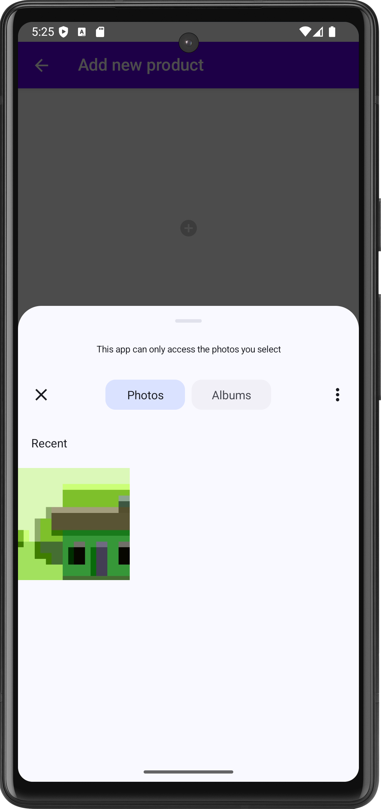
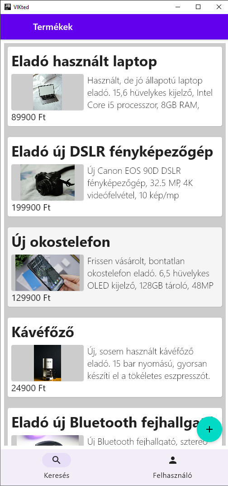
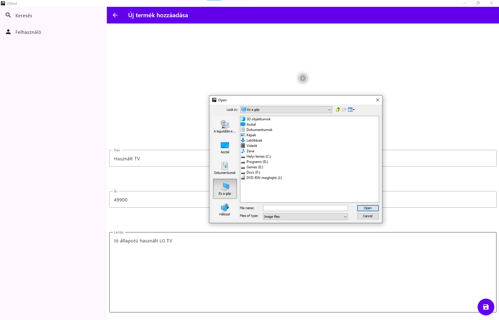

# Labor 4 - Adaptív UI, platformspecifikus kód és clean architecture

## Bevezető

A labor során egy apróhirdetés alkalmazást fogunk készíteni Android és Windows platformokra. Az alkalmazásban lehetőség van apróhirdetéseket böngészni, és bejelentkezés után sajátot is közzétenni. A perzisztens tárolás megvalósítása nem része a jelenlegi anyagnak, azonban a projekt felépítésében, architektúrájában kiemelt figyelmet fordítunk arra, hogy ez a későbbiekben nagyon könnyen implementálható legyen. A felületet adaptítv eszközökkel fogjuk elkészíteni, hogy minden környezetben megfelelően nézzen ki. 


## Felhasznált technológiák:

- [`ViewModel`](https://www.jetbrains.com/help/kotlin-multiplatform-dev/compose-viewmodel.html)  
- [`Koin`](https://insert-koin.io/docs/reference/koin-mp/kmp/)   
- [`Coil`](https://github.com/coil-kt/coil)
- [`Ktor`](https://ktor.io/docs/client-create-multiplatform-application.html)
- [`Adaptive Layout`](https://developer.android.com/develop/ui/compose/layouts/adaptive/list-detail)
- [`Adaptive Navigation`](https://developer.android.com/develop/ui/compose/layouts/adaptive/build-adaptive-navigation)


## Az alkalmazás specifikációja

Az alkalmazás navigációs menüjében két elem látható. A Kereső felületen az apróhirdetések listája található. Egy hirdetésre kattintáskor megjelenik a részletes nézete, képernyőméret függvényében a lista mellett vagy külön oldalon. A navigáció másik eleme a Profil oldal, ahol lehetőség van be- és kijelentkezésre. Ha a felhasználó bejelentkezett, akkor a lista oldalon lehetősége van új hirdetést feladni. Ehhez egy külön felület nyílik meg ahol az adatok megadása mellett kép is csatolható.

Fontos funkció, hogy a felhasználói felület a megjeleníthető mérettől függően adaptívan változik.

<p align="center">


</p>
<p align="center">


</p>
<p align="center">


</p>
<p align="center">


</p>
<p align="center">


</p>


## Előkészületek

A feladatok megoldása során ne felejtsük el követni a [feladat beadás folyamatát](../../tudnivalok/github/GitHub.md).

### Git repository létrehozása és letöltése

1. Moodle-ben keressük meg a laborhoz tartozó meghívó URL-jét és annak segítségével hozzuk létre a saját repositoryt.

2. Várjuk meg, míg elkészül a repository, majd checkout-oljuk ki.

3. Hozzunk létre egy új ágat `megoldas` néven, és ezen az ágon dolgozzunk.

4. A `neptun.txt` fájlba írjuk bele a Neptun kódunkat. A fájlban semmi más ne szerepeljen, csak egyetlen sorban a Neptun kód 6 karaktere.

5. Indítsuk el az Android Studio-t vagy az Intellij-t, majd nyissuk meg a kapott kezdőprojektet.

6. Ellenőrizzük, hogy a létrejött projekt lefordul és futtatható mobil és desktop platformokon.

### Projekt megnyitása

Ezen a laboron nem új projektet fogunk létrehozni, hanem egy már létezőből indulunk ki, ez megtalálható a kicheckoutolt repositoryban `VIKted` néven. Nyissuk meg a projektet és nézzük át a felépítését.

A megnyitott projekt tartalmazza a labor során szükséges könyvtárakat és függőségeket a `libs.versions.toml` és a `build.gradle.kts` fájlokban. Ezen kívül elő van készítve benne a függőséginjektáláshoz a Koin, már csak a modulokat kell felvenni a megfelelő helyre. 

Szintén szerepel a fájlok között a res/values mappában egy strings.xml fájl, ami az alkalmazásban használt szövegeket gyűjti össze. Fontos, hogy ezen a ponton mindenképpen lefordítsuk a projektet, ugyanis Kotlin Multiplatform esetén az erőforrások csak akkor állnak rendelkezésre, ha egyszer már lefordítottuk őket.


## A domain réteg

!!!info "Domain réteg"
	A domain rétegben a projekt "technológiafüggetlen" része található, amelybe még nem vegyülnek a konkrét adattárolási technológiával vagy megjelenítéssel kapcsolatos részletek. Ezzel a közbülső réteggel az alkalmazásunk komponensei lazábban csatolttá válnak, és megkönnyítik, hogy kevés módosítással lecseréljük akár az adattárolásért felelős technológiánkat, akár a megjelenítést. Az itt megvalósított üzleti logika műveletek nem függenek közvetlen sem az adattárolástól, csak a reposiory komponensektől, és mivel a tennivalók független domainmodelljével dolgoznak, a megjelenítéstől is függetlenek. 
	
	Jelen esetben nem lesz komplex üzleti logikánk, így ez a réteg gyakorlatilag kimarad, csak a függőséginjektálás és a modellek kerülnek bele.

Először vegyük fel az adat osztályainkat. Mivel a teljes alkalmazáson belül ugyan azt az adat struktúrát fogjuk használni, ezért kerüljenek ezek a `hu.bme.aut.kmp.vikted.domain.model` *package*-be. Természetesen amennyiben az adattároláshoz vagy a megjelenítéshez más struktúrára lenne szükségünk, azokban a rétegekben is vehetünk fel model osztályokat, majd átkonvertálhatjuk őket a megfelelő formátumra. 

A jelenlegi termékeinknek van id-ja, neve, leírása, ára, egy képe és tartoznak egy felhasználóhoz.

`Product.kt`:

```kotlin
package hu.bme.aut.kmp.vikted.domain.model

data class Product(
    val id: String = "",
    val name: String = "",
    val description: String = "",
    val price: Int = 0,
    val imageUrl: String = "",
    val userId: String = ""
)
```

Az egységes kezelés érdekében hozzunk létre egy felhasználó osztályt is ugyanide. Ennek jelenleg csak egy id mezője lesz, de később könnyen bővíthető egyéb adatokkal.

`User.kt`:

```kotlin
package hu.bme.aut.kmp.vikted.domain.model

data class User(
    val id: String = "",
)
```


## Adatelérési réteg

!!!info "Repository minta"
	A Repository minta lényege, hogy az adatelérést absztracháljuk, vagyis leválasztjuk a konkrét megvalósításról, így növelve a kód karbantarthatóságát, tesztelhetőségét és fliexibilitását. Ezzel mind a konkrét adatelérésünk mind az üzleti logikánk fükketlenné válik és nem függenek egymástól.

	Jelen helyzetben ezt úgy valósítjuk meg, hogy definiálunk egy *interface*-t, amin keresztül az adatainkat elérjük, majd ennek egy implementációja fogja végezni a valós adatmanipulációt.

Ez után készítsük el az adatelérési réteget a `hu.bme.aut.kmp.vikted.data` *package*-be. Itt a *Repository* mintát fogjuk követni. A termékekkel kapcsolatos *repository* kerüljön a `product` *package*-be:

`IProductRepository.kt`:

```kotlin
package hu.bme.aut.kmp.vikted.data.product

import hu.bme.aut.kmp.vikted.domain.model.Product
import kotlinx.coroutines.flow.Flow

interface IProductRepository {
    val products: Flow<List<Product>>

    suspend fun getProduct(id: String): Product?

    suspend fun addProduct(product: Product)

    suspend fun updateProduct(product: Product)

    suspend fun deleteProduct(id: String)
}
```

Láthatjuk, hogy a termékeink listáját egy *Flow*-ban kapjuk vissza, illetve van néhány adatmanipulációs függvényünk is.

Készítsuk most el ennek az *interface*-nek egy konkrét megvalósítását, ami memóriában fogja tárolni az adatainkat. 

`MemoryProductRepository.kt`:

```kotlin
package hu.bme.aut.kmp.vikted.data.product

import hu.bme.aut.kmp.vikted.domain.model.Product
import kotlinx.coroutines.flow.Flow
import kotlinx.coroutines.flow.MutableStateFlow
import kotlinx.coroutines.flow.asStateFlow

class MemoryProductRepository(
) : IProductRepository {
    private val productStateFlow = MutableStateFlow(emptyList<Product>())

    init {
        val productList = productStateFlow.value.toMutableList()
        productList.add(
            Product(
                id = productList.hashCode().toString(),
                name = "Eladó használt laptop",
                price = 89900,
                description = "Használt, de jó állapotú laptop eladó. 15,6 hüvelykes kijelző, Intel Core i5 processzor, 8GB RAM, 256GB SSD. Ideális mindennapi használatra, tanuláshoz vagy munkához. Az akkumulátor is hosszú ideig bírja. Kérésre képeket tudok küldeni.",
                imageUrl = "https://plus.unsplash.com/premium_photo-1681160405580-a68e9c4707f9?q=80&w=1965&auto=format&fit=crop&ixlib=rb-4.1.0&ixid=M3wxMjA3fDB8MHxwaG90by1wYWdlfHx8fGVufDB8fHx8fA%3D%3D"
            )
        )
        productList.add(
            Product(
                id = productList.hashCode().toString(),
                name = "Eladó új DSLR fényképezőgép",
                price = 199900,
                description = "Új Canon EOS 90D DSLR fényképezőgép, 32.5 MP, 4K videófelvétel, 10 kép/mp sorozatfelvétel. Ideális kezdő és profi fotósoknak. Kit objektívvel és memóriakártyával együtt.",
                imageUrl = "https://images.unsplash.com/photo-1621958054700-7af166501105?q=80&w=2070&auto=format&fit=crop&ixlib=rb-4.1.0&ixid=M3wxMjA3fDB8MHxwaG90by1wYWdlfHx8fGVufDB8fHx8fA%3D%3D"
            )
        )
        productList.add(
            Product(
                id = productList.hashCode().toString(),
                name = "Új okostelefon",
                price = 129900,
                description = "Frissen vásárolt, bontatlan okostelefon eladó. 6,5 hüvelykes OLED kijelző, 128GB tároló, 48MP kamera. Még garanciális, eredeti dobozában. Nagyszerű választás azoknak, akik szeretnék frissíteni a készüléküket.",
                imageUrl = "https://images.unsplash.com/photo-1598965402089-897ce52e8355?q=80&w=1936&auto=format&fit=crop&ixlib=rb-4.1.0&ixid=M3wxMjA3fDB8MHxwaG90by1wYWdlfHx8fGVufDB8fHx8fA%3D%3D"
            )
        )
        productList.add(
            Product(
                id = productList.hashCode().toString(),
                name = "Kávéfőző",
                price = 24900,
                description = "Új, sosem használt kávéfőző eladó. 15 bar nyomású, gyorsan készíti el a tökéletes eszpresszót. Kiváló minőségű, rozsdamentes acél burkolat, és egyszerű kezelhetőség. Ideális választás minden kávérajongónak. Még a gyári garancia is érvényes rá.",
                imageUrl = "https://images.unsplash.com/photo-1565452344518-47faca79dc69?q=80&w=1935&auto=format&fit=crop&ixlib=rb-4.1.0&ixid=M3wxMjA3fDB8MHxwaG90by1wYWdlfHx8fGVufDB8fHx8fA%3D%3D"
            )

        )
        productList.add(
            Product(
                id = productList.hashCode().toString(),
                name = "Eladó új Bluetooth fejhallgató",
                price = 29900,
                description = "Új Bluetooth fejhallgató, sztereó hangzás, aktív zajszűrés. Kényelmes, állítható pánttal, hosszú akkumulátor élettartammal. Kiváló választás sportolóknak vagy utazóknak.",
                imageUrl = "https://images.unsplash.com/photo-1631281637573-14de1a1968fd?q=80&w=1990&auto=format&fit=crop&ixlib=rb-4.1.0&ixid=M3wxMjA3fDB8MHxwaG90by1wYWdlfHx8fGVufDB8fHx8fA%3D%3D"
            )
        )
        productList.add(
            Product(
                id = productList.hashCode().toString(),
                name = "Bicikli eladó",
                price = 45900,
                description = "Kiváló állapotú férfi városi bicikli eladó. 28 hüvelykes kerekek, Shimano váltó, kényelmes, puha ülés. Tökéletes a mindennapi közlekedéshez a városban. Alig használt, a fékek és váltók tökéletesen működnek.",
                imageUrl = "https://plus.unsplash.com/premium_photo-1678718713393-2b88cde9605b?q=80&w=2070&auto=format&fit=crop&ixlib=rb-4.1.0&ixid=M3wxMjA3fDB8MHxwaG90by1wYWdlfHx8fGVufDB8fHx8fA%3D%3D"
            )
        )
        productList.add(
            Product(
                id = productList.hashCode().toString(),
                name = "Eladó új okosóra",
                price = 49900,
                description = "Új okosóra, 1.4 hüvelykes AMOLED kijelző, szívritmus monitor, alvásfigyelés, vízálló, kompatibilis Android és iOS készülékekkel. Modern dizájn, többféle színből választható.",
                imageUrl = "https://images.unsplash.com/photo-1632794716789-42d9995fb5b6?q=80&w=2070&auto=format&fit=crop&ixlib=rb-4.1.0&ixid=M3wxMjA3fDB8MHxwaG90by1wYWdlfHx8fGVufDB8fHx8fA%3D%3D"
            )
        )
        productStateFlow.value = productList.toList()
    }

    override val products: Flow<List<Product>>
        get() = productStateFlow.asStateFlow()

    override suspend fun getProduct(id: String): Product? {
        return productStateFlow.value.firstOrNull { it.id == id }
    }

    override suspend fun addProduct(product: Product) {
        val productList = productStateFlow.value.toMutableList()
        productList.removeAll { it.id == product.id }
        productList.add(
            product.copy(
                id = product.hashCode().toString(),
                userId = "TODO"
            )
        )
        productStateFlow.value = productList.toList()
    }

    override suspend fun updateProduct(product: Product) {
        productStateFlow.value = productStateFlow.value.map {
            if (it.id == product.id) product else it
        }
    }

    override suspend fun deleteProduct(id: String) {
        val adList = productStateFlow.value.toMutableList()
        adList.removeAll { it.id == id }
        productStateFlow.value = adList.toList()
    }
}
```

Ez egy elég egyszerű megvalósítása az adattárolásnak, de szerencsére a *Repository minta* alkalmazása miatt bármikor könnyen lecserélhető mondjuk egy adatbázis alapú tárolásra. Észrevehetjük azt is, hogy a *userId* jelenleg nincsen megfelelően kezelve. Ezt egy későbbi lépésben, az authentikáció hozzáadásánál fogjuk módosítani.


## A terméklista felület kialakítása (1 pont)

A megjelenítési rétegben az MVI (Model-View-Intent) mintát fogjuk követni.

!!!Info "MVI"
	Az MVI minta  lényege, hogy külön választja a megjelenítéskor használt adatokat (Model), a vizuális megjelenítést (View) és a interakciókat (Intent), ezzel sokkal rugalmasabbá téve a megjelenítési réteget. 
	
	Ez esetünkben az alábbi módon néz ki: Az adatainkat a ViewModelek fogják tárolni, méghozzá egy külön állapotban (Model). A felhasználói felületünk, amiket a *Composable*-ök alkotnak (View),  a ViewModel állapotát csak megfigyeli. A View függévényhívások helyett eseményeket küld a ViewModel felé (Intent), illetve onnan is csak eseményeket kap vissza direkt vezérlés helyett.

A terméklista valamint a részletes nézet szorosan összekapcsolódik, néhol egy felületen is lesz, így közös ViewModel-t készítünk neki.


### Model

Először készítsük el azt a modelt, ami a felületünk állapotát reprezentálja. A megjelenítési réteg forrását tegyük a `hu.bme.aut.kmp.vikted.presentation` *package*-be. Ezen belül a terméklista képernyő kerüljön a `screen.product.search` csomagba.

`ProductSearchScreenState.kt`:

```kotlin
package hu.bme.aut.kmp.vikted.presentation.screen.product.search

import hu.bme.aut.kmp.vikted.domain.model.Product

data class ProductSearchScreenState(
    val isLoading: Boolean = false,
    val error: Throwable? = null,
    val products: List<Product> = emptyList(),
    val selectedProduct: Product? = null,
    val userId: String? = null
)
```

A felületünk alapvetően három állapotban lehet: *Loading*, *Error*, *Result*. Ennek a reprezentációja látható a `ProductSearchScreenState` osztályban, ahol az, hogy éppen töltünk-e csak egy *Boolean* érték, viszont a hibához már tartozik üzenet is, ahogyan az eredményhez a *product* lista. Ezen kívül tároljuk a listából éppen kiválasztott terméket valamint a *userId*-t is.


###Intent


A felületünk felől a *ViewModel* felé jelenleg egyetlen interakció érkezhet, ami a termék kiválasztása. Ezeket az interakciókat egy `ProductSearchScreenEvent` osztályba foglaljuk össze.

`ProductSearchScreenEvent.kt`:

```kotlin
package hu.bme.aut.kmp.vikted.presentation.screen.product.search

import hu.bme.aut.kmp.vikted.domain.model.Product

sealed class ProductSearchScreenEvent {
    data class ProductSelected(val product: Product) : ProductSearchScreenEvent()
}
```

!!!info "sealed class"
	A Kotlin sealed class-ai olyan osztályok, amelyekből korlátozott az öröklés, és fordítási időben minden leszármazott osztálya ismert. Ezeket az osztályokat az enumokhoz hasonló módon tudjuk alkalmazni. Jelen esetben a ProductSelected valójában nem a ProductSearchScreenEvent közvetlen leszármazottja, hanem anonim leszármazott osztálya, mivel a termék paraméterként történő kezelését is tartalmazza.


### ViewModel

A Model és a lehetséges Intentek ismeretében már össze tudjuk rakni a ViewModelünket.

`ProductSearchViewModel.kt`:

```kotlin
package hu.bme.aut.kmp.vikted.presentation.screen.product.search

import androidx.lifecycle.ViewModel
import androidx.lifecycle.viewModelScope
import hu.bme.aut.kmp.vikted.data.product.IProductRepository
import hu.bme.aut.kmp.vikted.domain.model.Product
import kotlinx.coroutines.flow.MutableStateFlow
import kotlinx.coroutines.flow.asStateFlow
import kotlinx.coroutines.flow.update
import kotlinx.coroutines.launch

class ProductSearchViewModel(
    private val productRepository: IProductRepository
) : ViewModel() {

    private val _state = MutableStateFlow(ProductSearchScreenState())
    val state = _state.asStateFlow()

    init {
        loadProducts()
        _state.update {
            it.copy(userId = "TODO")
        }
    }

    fun onEvent(event: ProductSearchScreenEvent) {
        when (event) {
            is ProductSearchScreenEvent.ProductSelected -> {
                selectProduct(event.product)
            }
        }
    }

    private fun loadProducts() {
        viewModelScope.launch {
            try {
                _state.update { it.copy(isLoading = true) }
                productRepository.products.collect {
                    val currentSelected = _state.value.selectedProduct
                    val products = it
                    _state.update {
                        it.copy(
                            isLoading = false,
                            products = products,
                            selectedProduct = currentSelected ?: null
                        )
                    }
                }
            } catch (e: Exception) {
                _state.update { it.copy(isLoading = false, error = e) }
            }
        }
    }

    private fun selectProduct(product: Product) {
        _state.update { it.copy(selectedProduct = product) }
    }
}
```

`ProductSearchViewModel` egy privát *MutableStateFlow*-ban tartalmazza az imént létrehozott `ProductSearchScreenState` állapotot, és azt egy megfigyelhető formában a *View* rendelkezésére bocsájtja. Ezen kívül az init blokkban elvégzi az adatok belöltését a repository-ból, valamint az `onEvent` függvénnyel lekezeli a *View* felől érkező eseményt.


### View

A Model, az Intent és a ViewModel után már elkészíthetjük a View-t is.


#### Termék kártya

A listában a termékeinket kártyákon fogjuk megjeleníteni. Mivel ezek univerzálisak, akár az alkalmazás több felületén is használhatóak lennének, külön *Composable*-ként fogjuk elkészíteni őket. A felhasználói felületet tegyük a `presentation` *package*-be. Ezen belül a kártyánk egy `components` csomagba kerüljön.

`ProductCard.kt`:

```kotlin
package hu.bme.aut.kmp.vikted.presentation.components

import androidx.compose.foundation.background
import androidx.compose.foundation.layout.Column
import androidx.compose.foundation.layout.Row
import androidx.compose.foundation.layout.Spacer
import androidx.compose.foundation.layout.fillMaxWidth
import androidx.compose.foundation.layout.height
import androidx.compose.foundation.layout.padding
import androidx.compose.foundation.layout.width
import androidx.compose.material.Card
import androidx.compose.material.MaterialTheme
import androidx.compose.material.Text
import androidx.compose.runtime.Composable
import androidx.compose.ui.Alignment
import androidx.compose.ui.Modifier
import androidx.compose.ui.graphics.Color
import androidx.compose.ui.layout.ContentScale
import androidx.compose.ui.text.TextStyle
import androidx.compose.ui.text.font.FontWeight
import androidx.compose.ui.unit.dp
import androidx.compose.ui.unit.sp
import coil3.compose.AsyncImage
import hu.bme.aut.kmp.vikted.domain.model.Product
import org.jetbrains.compose.resources.painterResource
import vikted.composeapp.generated.resources.Res
import vikted.composeapp.generated.resources.compose_multiplatform

@Composable
fun ProductCard(
    modifier: Modifier = Modifier,
    product: Product,
    backgroundColor:Color
) {
    Card(
        modifier = modifier
            .fillMaxWidth(),
        backgroundColor = backgroundColor,
        contentColor = MaterialTheme.colors.onBackground
    ) {
        Column(modifier = Modifier.padding(8.dp)) {
            Text(
                text = product.name,
                maxLines = 1,
                style = TextStyle.Default.copy(
                    fontWeight = FontWeight.Bold,
                    fontSize = 32.sp
                )
            )

            Spacer(modifier = Modifier.height(8.dp))

            Row(
                modifier = Modifier.fillMaxWidth(),
                verticalAlignment = Alignment.CenterVertically
            ) {
                Card {
                    AsyncImage(
                        model = product.imageUrl,
                        placeholder = painterResource(Res.drawable.compose_multiplatform),
                        contentDescription = null,
                        contentScale = ContentScale.Fit,
                        clipToBounds = true,
                        modifier = Modifier
                            .width(160.dp)
                            .height(80.dp)
                            .background(Color.LightGray),
                    )
                }

                Spacer(modifier = Modifier.width(8.dp))

                Text(
                    text = product.description,
                    maxLines = 3,
                    style = TextStyle.Default.copy(
                        fontWeight = FontWeight.Light,
                        fontSize = 20.sp,
                    )
                )
            }

            Text(
                text = "${product.price} Ft",
                maxLines = 1,
                style = TextStyle.Default.copy(
                    fontSize = 20.sp
                )
            )
        }
    }
}
```

A termékhez tartozó kép megjelenítését a `Coil` könyvtárral oldjuk meg. Itt elég megadnunk a kép elérési útját (hálózatról, háttértárról vagy akár az erőforrások közül) és a könyvtár elvégzi az aszinkron betöltést. 

Figyeljük meg, hogy hogyan használjuk az erőforrásainkat, hogyan hivatkozunk a *drawable* mappában lévő képi erőforrásra.

Látható, hogy a kártyánkat felkészítettük egy esetleges háttér szín változásra. Erre azért van szükségünk, mert a listánkban a bejelentkezett felhasználóhoz tartozó bejegyzéseket majd más színnel szeretnénk jelölni.


### A lista panel

Azt szeretnénk, hogy a felületünk a képernyő méretétől függően adaptívan, máshogy jelenjen meg. Ezért a listát és a részletes nézetet nem teljes *Screen*-ekként, hanem csak panelokként készítjük el, amik majd akár egymás mellett is megjelenhetnek.

Készítsük el tehát a lista panelt a `search.pane.list` *package*-ben.

`ProductListPane.kt`:

```kotlin
package hu.bme.aut.kmp.vikted.presentation.screen.product.search.pane.list

import androidx.compose.foundation.background
import androidx.compose.foundation.clickable
import androidx.compose.foundation.layout.Box
import androidx.compose.foundation.layout.Spacer
import androidx.compose.foundation.layout.fillMaxSize
import androidx.compose.foundation.layout.height
import androidx.compose.foundation.layout.padding
import androidx.compose.foundation.lazy.LazyColumn
import androidx.compose.foundation.lazy.items
import androidx.compose.material.CircularProgressIndicator
import androidx.compose.material.MaterialTheme
import androidx.compose.material.Text
import androidx.compose.runtime.Composable
import androidx.compose.ui.Alignment
import androidx.compose.ui.Modifier
import androidx.compose.ui.graphics.Color
import androidx.compose.ui.unit.dp
import hu.bme.aut.kmp.vikted.domain.model.Product
import hu.bme.aut.kmp.vikted.presentation.components.ProductCard
import hu.bme.aut.kmp.vikted.presentation.screen.product.search.ProductSearchScreenState
import org.jetbrains.compose.resources.stringResource
import org.jetbrains.compose.ui.tooling.preview.Preview
import vikted.composeapp.generated.resources.Res
import vikted.composeapp.generated.resources.some_error_message
import vikted.composeapp.generated.resources.text_empty_ad_list

@Preview
@Composable
fun ProductListPane(
    state: ProductSearchScreenState,
    modifier: Modifier = Modifier,
    onListItemClick: (Product) -> Unit
) {

    Box(
        modifier = Modifier
            .fillMaxSize()
            .padding(8.dp)
            .background(Color.LightGray),
        contentAlignment = Alignment.Center
    ) {
        if (state.isLoading) {
            CircularProgressIndicator(
                color = MaterialTheme.colors.onBackground
            )
        } else if (state.error != null) {
            Text(
                text = state.error?.message
                    ?: stringResource(resource = Res.string.some_error_message),
                color = MaterialTheme.colors.onBackground
            )
        } else {
            if (state.products.isEmpty()) {
                Text(
                    text = stringResource(resource = Res.string.text_empty_ad_list)
                )
            } else {

                LazyColumn(
                    modifier = modifier
                        .fillMaxSize()
                ) {
                    items(items = state.products,
                        key = { product -> product.id }) { product ->

                        ProductCard(
                            modifier = Modifier
                                .padding(8.dp)
                                .clickable {
                                    onListItemClick(product)
                                },
                            product = product,
                            backgroundColor =
                            if (state.userId == product.userId) MaterialTheme.colors.secondary
                            else MaterialTheme.colors.background
                        )

                        if (state.products.last() != product)
                            Spacer(modifier = Modifier.height(8.dp))

                    }
                }
            }
        }
    }
}
```

A lista panelünk megkapja az állapotot amit annak függvényében meg is jelenít. Ha *Loading* állapotban vagyunk, akkor egy `CircularProgressIndicator`-t mutatunk, ha *Error* állapotban vagyunk, akkor egy hibaüzenetet, ha pedig egyik sem, akkor megjelenítjük a listát a létrehozott `ProductCard`-okkal. Figyeljük meg, hogy a kártyák háttérszíne hogyan függ a userId-tól.

A `ProductListPane` átveszi az `onListItemClick` *callback*-et is, mivel egy termékre kattintásnál navigációnak kell történnie, amit "felülről" vezérelnek.

Figyeljük meg, hogy hogyan használjuk az erőforrásainkat, hogyan hivatkozunk a *values/strings.xml* fájlban lévő szöveges erőforrásra.


### A részletes panel

A lista panel után készítsük el a részletes panelt is a `pane.details` *package*-ben. Ez jóval egyszerűbb lesz, hiszen csak a megkapott `selectedProduct` adatait kell megjelenítenie.

`ProductDetailsPane.kt`:

```kotlin
package hu.bme.aut.kmp.vikted.presentation.screen.product.search.pane.details

import androidx.compose.foundation.background
import androidx.compose.foundation.clickable
import androidx.compose.foundation.layout.Column
import androidx.compose.foundation.layout.fillMaxSize
import androidx.compose.foundation.layout.fillMaxWidth
import androidx.compose.foundation.layout.height
import androidx.compose.foundation.layout.padding
import androidx.compose.foundation.rememberScrollState
import androidx.compose.foundation.verticalScroll
import androidx.compose.material.Card
import androidx.compose.material.MaterialTheme
import androidx.compose.material.Scaffold
import androidx.compose.material.SnackbarHost
import androidx.compose.material.SnackbarHostState
import androidx.compose.material.Surface
import androidx.compose.material.Text
import androidx.compose.runtime.Composable
import androidx.compose.runtime.remember
import androidx.compose.runtime.rememberCoroutineScope
import androidx.compose.ui.Modifier
import androidx.compose.ui.graphics.Color
import androidx.compose.ui.layout.ContentScale
import androidx.compose.ui.text.TextStyle
import androidx.compose.ui.text.font.FontWeight
import androidx.compose.ui.text.style.TextAlign
import androidx.compose.ui.unit.dp
import androidx.compose.ui.unit.sp
import coil3.compose.AsyncImage
import hu.bme.aut.kmp.vikted.domain.model.Product
import kotlinx.coroutines.launch
import org.jetbrains.compose.resources.getString
import org.jetbrains.compose.resources.painterResource
import org.jetbrains.compose.resources.stringResource
import vikted.composeapp.generated.resources.Res
import vikted.composeapp.generated.resources.button_label_buy
import vikted.composeapp.generated.resources.compose_multiplatform
import vikted.composeapp.generated.resources.label_product_description
import vikted.composeapp.generated.resources.label_product_name
import vikted.composeapp.generated.resources.label_product_price
import vikted.composeapp.generated.resources.label_products
import vikted.composeapp.generated.resources.text_not_yet
import java.awt.SystemColor.text

@Composable
fun ProductDetailsPane(
    selectedProduct: Product
) {
    val snacbarHostState = remember { SnackbarHostState() }
    val localCoroutineScope = rememberCoroutineScope()

    Scaffold(
        snackbarHost = { SnackbarHost(snacbarHostState) }
    ) {
        Column(modifier = Modifier.fillMaxSize()) {
            Column(
                modifier = Modifier
                    .fillMaxSize()
                    .verticalScroll(rememberScrollState())
                    .padding(8.dp)
                    .background(Color.LightGray)
                    .weight(1f)
            ) {

                AsyncImage(
                    model = selectedProduct.imageUrl,
                    placeholder = painterResource(Res.drawable.compose_multiplatform),
                    contentDescription = null,
                    contentScale = ContentScale.Fit,
                    clipToBounds = true,
                    modifier = Modifier
                        .fillMaxWidth(),
                )

                Card(
                    modifier = Modifier
                        .fillMaxWidth()
                        .padding(8.dp)
                ) {
                    Column(
                        modifier = Modifier
                            .fillMaxWidth()
                            .padding(8.dp)
                    ) {
                        Text(text = stringResource(Res.string.label_product_name))

                        Text(
                            text = selectedProduct.name,
                            maxLines = 2,
                            style = TextStyle.Default.copy(
                                fontSize = 20.sp
                            )
                        )
                    }
                }

                Card(
                    modifier = Modifier
                        .fillMaxWidth()
                        .padding(8.dp)
                ) {
                    Column(
                        modifier = Modifier
                            .fillMaxWidth()
                            .padding(8.dp)
                    ) {
                        Text(text = stringResource(Res.string.label_product_price))

                        Text(
                            text = "${selectedProduct.price} Ft",
                            maxLines = 1,
                            style = TextStyle.Default.copy(
                                fontSize = 20.sp
                            )
                        )
                    }
                }

                Card(
                    modifier = Modifier
                        .fillMaxWidth()
                        .padding(8.dp)
                ) {
                    Column(
                        modifier = Modifier
                            .fillMaxWidth()
                            .padding(8.dp)
                    ) {

                        Text(text = stringResource(Res.string.label_product_description))

                        Text(
                            text = selectedProduct.description,
                            style = TextStyle.Default.copy(
                                fontWeight = FontWeight.Light,
                                fontSize = 20.sp,
                            )
                        )
                    }
                }
            }

            Surface(
                modifier = Modifier
                    .fillMaxWidth()
                    .height(40.dp)
                    .clickable {
                        localCoroutineScope.launch {
                            snacbarHostState.showSnackbar(getString(Res.string.text_not_yet))
                        }
                    },
                color = MaterialTheme.colors.primary,
            ) {
                Text(
                    modifier = Modifier
                        .fillMaxSize(),
                    text = stringResource(Res.string.button_label_buy),
                    textAlign = TextAlign.Center
                )
            }
        }
    }
}
```

Figyeljük meg, hogy hogyan valósítottuk meg a vásárlás gombot a képernyő alján! Egy *Surface*-t helyeztünk el, amire kattintáskor egy *Snackbar* üzenet jelenik meg. Fontos megjegyezni, hogy a *Snackbar* nem érhető el a UI szálról, így egy külön korutinnal kell megoldanunk a használatát.


### A kereső oldal

A panelek elkészítése után készítsük el az őket összefogó `ProductSearchScreen` képernyőt. 

`ProductSearchScreen.kt`:

```kotlin
package hu.bme.aut.kmp.vikted.presentation.screen.product.search

import androidx.compose.foundation.layout.Box
import androidx.compose.foundation.layout.fillMaxSize
import androidx.compose.foundation.layout.padding
import androidx.compose.material.FloatingActionButton
import androidx.compose.material.Icon
import androidx.compose.material.IconButton
import androidx.compose.material.MaterialTheme
import androidx.compose.material.Scaffold
import androidx.compose.material.Text
import androidx.compose.material.TopAppBar
import androidx.compose.material.icons.Icons
import androidx.compose.material.icons.automirrored.filled.ArrowBack
import androidx.compose.material.icons.filled.Add
import androidx.compose.material3.adaptive.ExperimentalMaterial3AdaptiveApi
import androidx.compose.material3.adaptive.layout.AnimatedPane
import androidx.compose.material3.adaptive.layout.ListDetailPaneScaffold
import androidx.compose.material3.adaptive.layout.ListDetailPaneScaffoldRole
import androidx.compose.material3.adaptive.layout.PaneAdaptedValue
import androidx.compose.material3.adaptive.layout.PaneScaffoldDirective
import androidx.compose.material3.adaptive.navigation.rememberListDetailPaneScaffoldNavigator
import androidx.compose.runtime.Composable
import androidx.compose.runtime.getValue
import androidx.compose.runtime.rememberCoroutineScope
import androidx.compose.ui.Modifier
import androidx.compose.ui.unit.dp
import androidx.lifecycle.compose.collectAsStateWithLifecycle
import hu.bme.aut.kmp.vikted.domain.model.Product
import hu.bme.aut.kmp.vikted.presentation.screen.product.search.pane.details.ProductDetailsPane
import hu.bme.aut.kmp.vikted.presentation.screen.product.search.pane.list.ProductListPane
import kotlinx.coroutines.launch
import org.jetbrains.compose.resources.getString
import org.jetbrains.compose.resources.stringResource
import org.jetbrains.compose.ui.tooling.preview.Preview
import org.koin.compose.koinInject
import vikted.composeapp.generated.resources.Res
import vikted.composeapp.generated.resources.label_products

@OptIn(ExperimentalMaterial3AdaptiveApi::class)
@Preview
@Composable
fun ProductSearchScreen(
    modifier: Modifier = Modifier,
    viewModel: ProductSearchViewModel = koinInject(),
    onFabClick: () -> Unit
) {
    val state by viewModel.state.collectAsStateWithLifecycle()

    val scope = rememberCoroutineScope()

    val scaffoldNavigator = rememberListDetailPaneScaffoldNavigator<Product>()

    val twoPane =
        scaffoldNavigator.scaffoldValue[ListDetailPaneScaffoldRole.List] != PaneAdaptedValue.Hidden

    Scaffold(
        modifier = modifier.fillMaxSize(),
        topBar = {
            TopAppBar(
                title = { Text(text = stringResource(Res.string.label_products)) },
                navigationIcon = {
                    if (!twoPane) {
                        IconButton(onClick = { scaffoldNavigator.navigateBack() }) {
                            Icon(
                                Icons.AutoMirrored.Default.ArrowBack,
                                null
                            )
                        }
                    }
                }
            )
        },
        floatingActionButton = {
            if (twoPane) {
                FloatingActionButton(
                    onClick = onFabClick,
                    backgroundColor = MaterialTheme.colors.secondary,
                    contentColor = MaterialTheme.colors.onSecondary
                ) {
                    Icon(imageVector = Icons.Default.Add, contentDescription = null)
                }
            }
        }
    ) { paddingValues ->

        ListDetailPaneScaffold(
            value = scaffoldNavigator.scaffoldValue,
            directive = PaneScaffoldDirective.Default,
            listPane = {
                AnimatedPane {
                    ProductListPane(
                        state = state,
                        onListItemClick = {
                            viewModel.onEvent(ProductSearchScreenEvent.ProductSelected(it))
                            scope.launch {
                                scaffoldNavigator.navigateTo(
                                    ListDetailPaneScaffoldRole.Detail,
                                    it
                                )
                            }
                        }
                    )
                }
            },
            detailPane = {
                AnimatedPane {
                    val content = @Composable {
                        scaffoldNavigator.currentDestination?.content?.let {
                            ProductDetailsPane(selectedProduct = it)
                        }
                    }
                    if (twoPane) {
                        Box(
                            modifier = modifier.fillMaxSize().padding(8.dp)
                        ) {
                            content()
                        }
                    } else {
                        content()
                    }
                }
            }
        )
    }
}
```

Itt azt szeretnénk, hogy a felületünk a képernyő méretétől függően adaptívan, máshogy jelenjen meg. Ehhez a `ListDetailPaneScaffold`-ot fogjuk használni. Az állapot meghatározását és a panelok kezelését egy `ListDetailPaneScaffoldNavigator`-ra bízzuk. Ettől tudjuk elkérni, hogy az egyes paneljeink milyen állapotban vannak, így például meg tudjuk határozni, hogy mikor vagyunk egy és mikor kétpanelos (twoPane) állapotban.

Ettől a *twoPane* állapottól függően jelenítjük meg a *TopAppBar*-on a navigációs ikont vagy éppen a *FloatingActionButton*-t.

A `ListDetailPaneScaffold` lista peneljénél megjelenítjük a `ProductListPane` panelunkat, aminek átadjuk az állapotot, valamint listaelemre kattintás esetén a navigáció előtt `ProductSearchScreenEvent.ProductSelected` eseményt küldünk.

Figyeljük meg, hogy hogyan valósítjuk meg a *detailPane*-t. *twoPane* állapot esetén egy *Box*-ba behelyezve *modifier*-ekkel jelenítjük meg, míg ellenkező esetben *Box nélkül*.

### Függőséginjektálás 

Ezzel elkészültünk a terméklista felülettel. Ahhoz, hogy tesztelni tudjuk, meg kell oldanunk a *repository* és a *viewmodel* példányosítását. Bízzuk ezt a *Koin*-ra. Készítsük el a `domain.di` *package*-ben az alábbi modulokat:

`RepositoryModule.kt`:

```kotlin
package hu.bme.aut.kmp.vikted.domain.di

import hu.bme.aut.kmp.vikted.data.product.IProductRepository
import hu.bme.aut.kmp.vikted.data.product.MemoryProductRepository
import org.koin.core.module.dsl.singleOf
import org.koin.dsl.bind
import org.koin.dsl.module

val repositoryModule = module {
    singleOf(::MemoryProductRepository).bind<IProductRepository>()
}
```

és

`ProductModule.kt`:

```kotlin
package hu.bme.aut.kmp.vikted.domain.di

import hu.bme.aut.kmp.vikted.presentation.screen.product.search.ProductSearchViewModel
import org.koin.core.module.dsl.viewModelOf
import org.koin.dsl.module

val productModule = module {
    viewModelOf(::ProductSearchViewModel)
}
```

Majd indítsuk is el őket az `initKoin` függvényben:

`initKoin.kt`:

```kotlin
fun initKoin () {
    startKoin {
        modules(repositoryModule, productModule)
    }
}
```

Ha ezekkel megvagyunk, az alkalmazásunk már futtatható. Ideiglenesen illesszük be a7 `App` függvényünkbe a `ProductSearchScreen`-t.

`App.kt`:

```kotlin
@Composable
@Preview
fun App() {
    initKoin()

    MaterialTheme {
        ProductSearchScreen(onFabClick = {})
    }
}
```

Futtassuk az alkalmazást! Most már látható a listánk, és képernyőmérettől függően máshogyan jelenik meg.

!!!example "BEADANDÓ (1 pont)" 
	Készíts **két képernyőképet**, amelyen látszik az elkészített felület **egy- illetve kétpanelos** változatban! A képernyőképen az egyik **termék nevét cseréld le a saját nevedre**! 

	A képet a megoldásban a repository-ba f1a.png és f1b.png néven töltsd föl!
	
	A képernyőkép szükséges feltétele a pontszám megszerzésének.


## Új termék felvétele ( 1 pont)


### Prezentációs réteg

Miután már meg tudjuk jeleníteni a listánkat, oldjuk meg, hogy új terméket is fel tudjunk venni. Készítsük el a korábbiakhoz hasonlóan a `ProductCreateScreen`-t és a hozzá tartozó architekturális elemeket a `screen.product.create` *package*-be.

`ProductCreateScreen.kt`:

```kotlin
package hu.bme.aut.kmp.vikted.presentation.screen.product.create

import androidx.compose.foundation.background
import androidx.compose.foundation.layout.Arrangement
import androidx.compose.foundation.layout.Box
import androidx.compose.foundation.layout.Column
import androidx.compose.foundation.layout.Spacer
import androidx.compose.foundation.layout.fillMaxSize
import androidx.compose.foundation.layout.fillMaxWidth
import androidx.compose.foundation.layout.height
import androidx.compose.foundation.layout.padding
import androidx.compose.foundation.rememberScrollState
import androidx.compose.foundation.text.KeyboardOptions
import androidx.compose.foundation.verticalScroll
import androidx.compose.material.FloatingActionButton
import androidx.compose.material.Icon
import androidx.compose.material.IconButton
import androidx.compose.material.MaterialTheme
import androidx.compose.material.OutlinedTextField
import androidx.compose.material.Scaffold
import androidx.compose.material.Text
import androidx.compose.material.TopAppBar
import androidx.compose.material.icons.Icons
import androidx.compose.material.icons.automirrored.filled.ArrowBack
import androidx.compose.material.icons.filled.AddCircle
import androidx.compose.material.icons.filled.Save
import androidx.compose.runtime.Composable
import androidx.compose.runtime.getValue
import androidx.compose.ui.Alignment
import androidx.compose.ui.Modifier
import androidx.compose.ui.draw.alpha
import androidx.compose.ui.layout.ContentScale
import androidx.compose.ui.text.input.KeyboardType
import androidx.compose.ui.unit.dp
import androidx.lifecycle.compose.collectAsStateWithLifecycle
import coil3.compose.AsyncImage
import org.jetbrains.compose.resources.painterResource
import org.jetbrains.compose.resources.stringResource
import org.jetbrains.compose.ui.tooling.preview.Preview
import org.koin.compose.koinInject
import vikted.composeapp.generated.resources.Res
import vikted.composeapp.generated.resources.compose_multiplatform
import vikted.composeapp.generated.resources.label_add_new_product
import vikted.composeapp.generated.resources.label_description
import vikted.composeapp.generated.resources.label_name
import vikted.composeapp.generated.resources.label_price

@Preview
@Composable
fun ProductCreateScreen(
    onNavigateBack: (() -> Unit)? = null,
    viewModel: ProductCreateViewModel = koinInject(),
    modifier: Modifier = Modifier
) {
    val state by viewModel.state.collectAsStateWithLifecycle()

    Scaffold(
        modifier = modifier.fillMaxSize(),
        topBar = {
            TopAppBar(
                title = { Text(text = stringResource(Res.string.label_add_new_product)) },
                navigationIcon = {
                    if (onNavigateBack != null) {
                        IconButton(onClick = onNavigateBack) {
                            Icon(
                                imageVector = Icons.AutoMirrored.Filled.ArrowBack,
                                contentDescription = null
                            )
                        }
                    }
                }
            )
        },
        floatingActionButton = {
            FloatingActionButton(
                onClick = {
                    viewModel.onEvent(ProductCreateScreenEvent.SaveProduct)
                    onNavigateBack?.invoke()
                },
                backgroundColor = MaterialTheme.colors.primary,
                contentColor = MaterialTheme.colors.onPrimary
            ) {
                Icon(imageVector = Icons.Default.Save, contentDescription = null)
            }
        }
    ) {

        Column(
            modifier = modifier
                .fillMaxSize()
                .verticalScroll(rememberScrollState())
                .background(MaterialTheme.colors.background)
                .padding(8.dp),
            horizontalAlignment = Alignment.CenterHorizontally,
            verticalArrangement = Arrangement.SpaceAround,
        ) {
            Box(
                modifier = modifier
                    .fillMaxWidth(),
                contentAlignment = Alignment.Center
            ) {
                AsyncImage(
                    model = state.product.imageUrl,
                    placeholder = painterResource(Res.drawable.compose_multiplatform),
                    contentDescription = null,
                    contentScale = ContentScale.Fit,
                    modifier = Modifier
                        .fillMaxWidth().height(320.dp)
                )
                IconButton(onClick = {
                    viewModel.onEvent(ProductCreateScreenEvent.AddImageButtonClicked)
                }) {
                    Icon(
                        imageVector = Icons.Default.AddCircle,
                        contentDescription = null,
                        modifier = modifier.alpha(0.25f)
                    )
                }
            }
            Spacer(modifier = Modifier.height(8.dp))
            OutlinedTextField(
                value = state.product.name,
                label = { Text(text = stringResource(Res.string.label_name)) },
                onValueChange = { viewModel.onEvent(ProductCreateScreenEvent.ChangeNameValue(it)) },
                singleLine = true,
                modifier = Modifier
                    .fillMaxWidth()
            )
            Spacer(modifier = Modifier.height(8.dp))
            OutlinedTextField(
                value = state.product.price.toString(),
                label = { Text(text = stringResource(Res.string.label_price)) },
                onValueChange = {
                    try {
                        val re = Regex("[^0-9 ]")
                        re.replace(it, "").toInt()
                        viewModel.onEvent(
                            ProductCreateScreenEvent.ChangePrice(
                                re.replace(it, "").toInt()
                            )
                        )
                    } catch (e: Exception) {
                    }
                },
                keyboardOptions = KeyboardOptions(keyboardType = KeyboardType.Decimal),
                singleLine = true,
                modifier = Modifier
                    .fillMaxWidth()
            )
            Spacer(modifier = Modifier.height(8.dp))
            OutlinedTextField(
                value = state.product.description,
                label = { Text(text = stringResource(Res.string.label_description)) },
                onValueChange = {
                    viewModel.onEvent(
                        ProductCreateScreenEvent.ChangeDescriptionValue(
                            it
                        )
                    )
                },
                minLines = 10,
                maxLines = 10,
                modifier = Modifier
                    .fillMaxWidth()
            )
        }

        if (state.isPickingImage) {
            //TODO
        }
    }
}
```

A képernyőnkön a beviteli mezők mellett található egy kép, (ha már hozzá lett adva) egy gomb a hozzáadáshoz és egy FloatingActionButton az új elem mentéséhez. A kép hozzáadását egy későbbi fázisban oldjuk meg.

`ProductCreateScreenState.kt`:

```kotlin
package hu.bme.aut.kmp.vikted.presentation.screen.product.create

import hu.bme.aut.kmp.vikted.domain.model.Product

data class ProductCreateScreenState(
    val product: Product = Product(),
    val isPickingImage: Boolean = false
)
```

Itt az állapotunk csak az újonnan felveendő terméket tartalmazza, illetve azt, hogy éppen képet akarunk-e kiválasztani.

`ProductCreateScreenEvent.kt`:

```kotlin
package hu.bme.aut.kmp.vikted.presentation.screen.product.create

sealed class ProductCreateScreenEvent {
    data class ChangeNameValue(val text: String) : ProductCreateScreenEvent()
    data class ChangeDescriptionValue(val text: String) : ProductCreateScreenEvent()
    data class ChangePrice(val price: Int) : ProductCreateScreenEvent()
    data class ImageSelected(val imageUrl: String) : ProductCreateScreenEvent()
    object AddImageButtonClicked : ProductCreateScreenEvent()
    object SaveProduct : ProductCreateScreenEvent()
}
```

Eseményként viszont jóval több dolgot küldhetünk, mint korábban. Minden változás a névben, leírásban vagy árban eseményként fog érkezni a *ViewModel*-be, ahogyan a kiválasztott kép is. Ezeken kívül a felületen lévő két gomb megnyomására is eseményeket küldünk.

`ProductCreateViewModel.kt`:

```kotlin
package hu.bme.aut.kmp.vikted.presentation.screen.product.create

import androidx.lifecycle.ViewModel
import androidx.lifecycle.viewModelScope
import hu.bme.aut.kmp.vikted.data.product.IProductRepository
import kotlinx.coroutines.CoroutineScope
import kotlinx.coroutines.Dispatchers
import kotlinx.coroutines.flow.MutableStateFlow
import kotlinx.coroutines.flow.asStateFlow
import kotlinx.coroutines.flow.update
import kotlinx.coroutines.launch

class ProductCreateViewModel(
    private val productRepository: IProductRepository
) : ViewModel() {

    private val _state = MutableStateFlow(ProductCreateScreenState())
    val state = _state.asStateFlow()


    fun onEvent(event: ProductCreateScreenEvent) {
        when (event) {
            is ProductCreateScreenEvent.ChangeNameValue -> {
                val newValue = event.text
                _state.update {
                    it.copy(
                        product = it.product.copy(name = newValue)
                    )
                }
            }

            is ProductCreateScreenEvent.ChangeDescriptionValue -> {
                val newValue = event.text
                _state.update {
                    it.copy(
                        product = it.product.copy(description = newValue)
                    )
                }
            }

            is ProductCreateScreenEvent.ChangePrice -> {
                val newValue = event.price
                _state.update {
                    it.copy(
                        product = it.product.copy(price = newValue)
                    )
                }
            }

            is ProductCreateScreenEvent.ImageSelected -> {
                val newValue = event.imageUrl
                _state.update {
                    it.copy(
                        product = it.product.copy(imageUrl = newValue)
                    )
                }
            }

            ProductCreateScreenEvent.SaveProduct -> {
                saveProduct()
            }

            ProductCreateScreenEvent.AddImageButtonClicked -> {
                viewModelScope.launch(Dispatchers.IO) {
                    //TODO
                }
            }
        }
    }

    private fun saveProduct() {
        viewModelScope.launch {
            try {
                CoroutineScope(coroutineContext).launch(Dispatchers.IO) {
                    productRepository.addProduct(state.value.product)
                }
            } catch (e: Exception) {
                e.printStackTrace()
            }
        }
    }
}
```

A `ProductCreateViewModel`-ben az állapot tárolása mellett az események kezeléséért felelős `onEvent` függvény és az új termék mentése található.

Már csak annyi dolgunk maradt, hogy a `ProductCreateViewModel`-t is megfelelően injektáljuk a `ProductCreateScreen`-be. Ehhez egészítsük ki a `ProductModult` a *domain.di* *package*-ben.

`ProductModule.kt`:

```kotlin
package hu.bme.aut.kmp.vikted.domain.di

import hu.bme.aut.kmp.vikted.presentation.screen.product.search.ProductSearchViewModel
import hu.bme.aut.kmp.vikted.presentation.screen.product.create.ProductCreateViewModel
import org.koin.core.module.dsl.viewModelOf
import org.koin.dsl.module

val productModule = module {
    viewModelOf(::ProductCreateViewModel)
    viewModelOf(::ProductSearchViewModel)
}
```


### Navigáció

Készítsük el a navigációt a fent megvalósított két képernyőhöz. Ezt a `hu.bme.aut.kmp.vikted.navigation` *package*-be fogjuk megtenni.

Először is vegyük föl a képernyőket egy `Screen` osztályba. Ahhoz, hogy ne sztring összehasonlítás alapján navigáljunk, ebben az osztályban felvesszük az egyes képernyőink navigációs útvonalát "konstansként". sealed class-t alkalmazunk a lehetséges képernyők leírására, mert csak előre megadott számú képernyőnk van. 

`Screen.kt`:

```kotlin
package hu.bme.aut.kmp.vikted.navigation

sealed class Screen(val route: String) {
    object ProductCreate: Screen("product_create")
    object ProductSearch: Screen("product_search")
}
```

Ez után készítsük el a navigációs gráfot ezekkel az elemekkel. Ez egyszerű lesz, hiszen a `ProductSearchScreen`-ről indulva csak a `ProductCreateScreen`-re navigálhatunk és vissza. Itt kapnak értéket az egyes képernyők navigáció *callback*-jei.

`NavGraph.kt`:

```kotlin
package hu.bme.aut.kmp.vikted.navigation

import androidx.compose.runtime.Composable
import androidx.navigation.NavHostController
import androidx.navigation.compose.NavHost
import androidx.navigation.compose.composable
import hu.bme.aut.kmp.vikted.presentation.screen.product.search.ProductSearchScreen
import hu.bme.aut.kmp.vikted.presentation.screen.product.create.ProductCreateScreen

@Composable
fun NavGraph(
    navHostController: NavHostController
) {
    NavHost(
        navController = navHostController,
        startDestination = Screen.ProductSearch.route
    ) {
        composable(route = Screen.ProductSearch.route) {
            ProductSearchScreen(
                onFabClick = { navHostController.navigate(Screen.ProductCreate.route) }
            )
        }
        composable(route = Screen.ProductCreate.route) {
            ProductCreateScreen(
                onNavigateBack = {
                    navHostController.popBackStack(
                        route = Screen.ProductSearch.route,
                        inclusive = true
                    )
                    navHostController.navigate(Screen.ProductSearch.route)
                }
            )
        }
    }
}
```

Próba képpen most a `NavGraph`-ot illesszük be az alkalmazásunk belépési pontjára:

`App.kt`:

```kotlin
@Composable
@Preview
fun App() {
    initKoin()

    MaterialTheme {
        NavGraph(navHostController = rememberNavController())
    }
}
```

Próbáljuk ki az alkalmazást! Most már tudunk új terméket felvenni, már csak a kép kiválasztása hiányzik.

### File picker

Természetesen a képek kiválasztására minden platformon más módszer használatos, így ezt platformspecifikusan kell megoldanunk. A `presentation.components` *package*-be készítsünk egy `ImagePicker` *Composable* függvényt.

`ImagePicker.kt`:

```kotlin
package hu.bme.aut.kmp.vikted.presentation.components

import androidx.compose.runtime.Composable

@Composable
expect fun ImagePicker(onResult: (Any?) -> Unit)
```

A fuggvényt elláttuk az **expect** kulcsszóval, ami az jelenti, hogy ennek a függvénynek kell, hogy legyen aktuális megvalósítása a célzott platformokon. Készítsük is el ezeket!

Először nézzük az Androidos változatot. Navigáljunk el az `androidMain` modulban ugyanúgy a `hu.bme.aut.kmp.vikted.presentation.components` *package*-be, és adjuk hozzá az `ImagePicker.android.kt` fájlt.

`ImagePicker.android.kt`:

```kotlin
package hu.bme.aut.kmp.vikted.presentation.components

import androidx.activity.compose.rememberLauncherForActivityResult
import androidx.activity.result.PickVisualMediaRequest
import androidx.activity.result.contract.ActivityResultContracts
import androidx.compose.runtime.Composable
import androidx.compose.runtime.SideEffect

@Composable
actual fun ImagePicker(onResult: (Any?) -> Unit) {

    val launcher = rememberLauncherForActivityResult(
        contract = ActivityResultContracts.PickVisualMedia(),
        onResult = { uri -> onResult(uri) }
    )
    SideEffect {
        launcher.launch(PickVisualMediaRequest(ActivityResultContracts.PickVisualMedia.ImageOnly))
    }
}
```

Itt az Android rendszer által rendelkezésünkre bocsájtott [`Photo picker API`](https://developer.android.com/training/data-storage/shared/photopicker)-t fogjuk használni. A *Composable* függvényünkből egy *SideEffect*-en keresztül indítunk egy *PickVisualMedia* kérést. Így sem az engedélykérésekkel sem a tárhelykezeléssen nem kell foglalkoznunk, az eredményt egy uri paraméterben kapjuk vissza.

Az asztali megvalósításhoz a `desktopMain` modulban ugyanúgy a `hu.bme.aut.kmp.vikted.presentation.components` *package*-ben, vegyük föl az `ImagePicker.desktop.kt` fájlt.

`ImagePicker.desktop.kt`:

```kotlin
package hu.bme.aut.kmp.vikted.presentation.components

import androidx.compose.runtime.Composable
import javax.swing.JFileChooser
import javax.swing.filechooser.FileNameExtensionFilter

@Composable
actual fun ImagePicker(onResult: (Any?) -> Unit) {
    val fileChooser = JFileChooser()
    fileChooser.fileFilter = FileNameExtensionFilter("Image files", "jpg", "jpeg")
    val result = fileChooser.showOpenDialog(null)
    if (result == JFileChooser.APPROVE_OPTION) {
        onResult(fileChooser.selectedFile)
    } else {
        onResult(null)
    }
}
```

Itt a klasszikus java-s fájlválasztót használjuk, ahol megadhatjuk a fájlok kiterjesztését is.

Miután a platformspecifikus megvalósításokkal megvagyunk, használjuk fel az `ImagePicker`-ünket a `ProductCreateScreen`-en. Egészítsük ki a képernyőt az állapot függvényében megjelenő képválasztóval:

```kotlin
...
if (state.isPickingImage)
            ImagePicker(onResult = { viewModel.onEvent(ProductCreateScreenEvent.ImageSelected(it.toString())) })
```

Ne felejtsük el a gombnyomás hatására az állapotot is átállítani. A `ProductCreateScreen`-ből az eseményt már elküldjük a `ProductCreateViewModel`-hez, csak ott kell kiegészíteni az `onEvent` függvényt:

```kotlin
fun onEvent(event: ProductCreateScreenEvent) {
    when (event) {
	     ...
		is ProductCreateScreenEvent.ImageSelected -> {
		    val newValue = event.imageUrl
		    _state.update {
		        it.copy(
		            product = it.product.copy(imageUrl = newValue),
		            isPickingImage = false
		        )
		    }
		}

        ProductCreateScreenEvent.AddImageButtonClicked -> {
            viewModelScope.launch(Dispatchers.IO) {
                _state.update {
                    it.copy(
                        isPickingImage = true
                    )
                }
            }
        }
    }
}
```

Próbáljuk ki az alkalmazást! Most már új elem felvételénél képet is csatolhatunk. Azt is megfigyelhetjük, hogy a *Coil* használatával a képek ugyan úgy megjelennek a háttértárakról, mint eddig a hálózatról.

!!!example "BEADANDÓ (1 pont)" 
	Készíts **két képernyőképet**, amelyen látszik az elkészített új termék hozzáadása felület **egy- illetve kétpanelos** változatban! A képernyőképen az **új termék neve legyen a saját neptun-kódod**! 

	A képeket a megoldásban a repository-ba f2a.png és f2b.png néven töltsd föl!
	
	A képernyőkép szükséges feltétele a pontszám megszerzésének.


## A felhasználókezelés megvalósítása (1 pont)

Az alkalmazásunk jelenleg csak egy felhasználót támogat. Ha a memória adatbázist lecserélnénk hálózat alapúra, akkor sem tudnánk felhasználóhoz kötni a hirdetéseket. Valósítsunk meg tehát egy egyszerű authentikációt és a hozzá valófelületet a korábbiakhoz hasonlóan, majd ezt illesszük be a navigációba.


### Repository

A termékek kezeléséhez hasonlóan készítsük el az authentikációt megvalósító osztályokat is a `data.authentication` *package*-ben.

`IAuthenticationRepository.kt`:

```kotlin
package hu.bme.aut.kmp.vikted.data.authentication

import hu.bme.aut.kmp.vikted.domain.model.User
import kotlinx.coroutines.flow.Flow

interface IAuthenticationRepository {
    val currentUserId: String?

    val hasUser: Boolean

    val currentUser: Flow<User?>

    suspend fun signUp(
        email: String, password: String,
    )

    suspend fun authenticate(
        email: String,
        password: String
    )

    suspend fun sendRecoveryEmail(email: String)

    suspend fun deleteAccount()

    suspend fun signOut()
}
```

és 

`MemoryAuthenticationRepository.kt`:

```kotlin
package hu.bme.aut.kmp.vikted.data.authentication

import hu.bme.aut.kmp.vikted.domain.model.User
import kotlinx.coroutines.flow.Flow
import kotlinx.coroutines.flow.MutableStateFlow
import kotlinx.coroutines.flow.asStateFlow

class MemoryAuthenticationRepository : IAuthenticationRepository {
    override val currentUserId: String? get() = currentUserMutableFlow.value?.id
    override val hasUser: Boolean get() = currentUserMutableFlow.value != null
    override val currentUser: Flow<User?> get() = currentUserMutableFlow.asStateFlow()

    private val currentUserMutableFlow = MutableStateFlow<User?>(null)

    override suspend fun signUp(email: String, password: String) {
        currentUserMutableFlow.value = User(email.hashCode().toString())
    }

    override suspend fun authenticate(email: String, password: String) {
        currentUserMutableFlow.value = User(email.hashCode().toString())
    }

    override suspend fun sendRecoveryEmail(email: String) = Unit

    override suspend fun deleteAccount() {
        currentUserMutableFlow.value = null
    }

    override suspend fun signOut() {
        currentUserMutableFlow.value = null
    }
}
```

Láthatjuk, hogy a jelenlegi megvalósításban mind a regisztráció mind a bejelentkezés csak annyit csinál, hogy a felhasználó e-mail címéből generál egy egyedi userId-t, amit elment. De nekünk most ennyi pont elég. Természetesen egy valós megvalósítás ennél komplexebb lenne.

Ne felejtsük el az *AuthenticationRepository* injektálását sem. Egészítsük ki tehát az eddigi `RepositoryModule`-unkat:

`RepositoryModule.kt`:

```kotlin
package hu.bme.aut.kmp.vikted.domain.di

import hu.bme.aut.kmp.vikted.data.authentication.IAuthenticationRepository
import hu.bme.aut.kmp.vikted.data.authentication.MemoryAuthenticationRepository
import hu.bme.aut.kmp.vikted.data.product.MemoryProductRepository
import hu.bme.aut.kmp.vikted.data.product.IProductRepository
import org.koin.core.module.dsl.singleOf
import org.koin.dsl.bind
import org.koin.dsl.module

val repositoryModule = module {
    singleOf(::MemoryAuthenticationRepository).bind<IAuthenticationRepository>()
    singleOf(::MemoryProductRepository).bind<IProductRepository>()
}
```


### Az authentikációs felület

A termék lista és részletes nézethez hasonlóan az authentikációhoz is közös *ViewModel*-t készítünk a `presentation.screen.authentication` *package*-be.

`AuthenticationState.kt`:

```kotlin
package hu.bme.aut.kmp.vikted.presentation.screen.authentication

data class AuthenticationState(
    val email: String = "",
    val password: String = "",
    val confirmPassword: String = "",
    val isPasswordVisible: Boolean = false,
    val isConfirmPasswordVisible: Boolean = false,
    val isEmailError: Boolean = true,
    val isPasswordError: Boolean = true,
    val isConfirmPasswordError: Boolean = true,
    val isLoggedIn: Boolean = false
)
```

Az `AuthenticationState`-ben az e-mail cím, jelszó és jelszó megerősítés mellett ezeknek a láthatóságát és esetleges hibáit tároljuk. Az *isLoggedIn* állapot azért lesz felelős, hogy a bejelentkezés vagy a kijelentkezés gombot jelenítsük-e meg a felhasználónak.

`AuthenticationEvent.kt`:

```kotlin
package hu.bme.aut.kmp.vikted.presentation.screen.authentication

sealed class AuthenticationEvent {
    data class EmailChanged(val email: String) : AuthenticationEvent()
    data class PasswordChanged(val password: String) : AuthenticationEvent()
    data class ConfirmPasswordChanged(val password: String) : AuthenticationEvent()
    object PasswordVisibilityChanged : AuthenticationEvent()
    object ConfirmPasswordVisibilityChanged : AuthenticationEvent()
    object LoginButtonClicked : AuthenticationEvent()
    object SignUpButtonClicked : AuthenticationEvent()
}
```

Az események között a beviteli mezők értékének változása, a láthatósági ikonok megnyomása, valamint a bejelentkezés és a regisztráció gombok megnyomása szerepel.

Ezek alapján az `AuthenticationViewModel`-ünk így néz ki:

`AuthenticationViewModel.kt`:

```kotlin
package hu.bme.aut.kmp.vikted.presentation.screen.authentication

import androidx.lifecycle.ViewModel
import androidx.lifecycle.viewModelScope
import hu.bme.aut.kmp.vikted.data.authentication.IAuthenticationRepository
import hu.bme.aut.kmp.vikted.presentation.util.UiEvent
import kotlinx.coroutines.Dispatchers
import kotlinx.coroutines.channels.Channel
import kotlinx.coroutines.flow.MutableStateFlow
import kotlinx.coroutines.flow.asStateFlow
import kotlinx.coroutines.flow.receiveAsFlow
import kotlinx.coroutines.flow.update
import kotlinx.coroutines.launch

class AuthenticationViewModel(
    private val authenticationRepository: IAuthenticationRepository
) : ViewModel() {

    private val _state = MutableStateFlow(AuthenticationState())
    val state = _state.asStateFlow()

    private val _uiEvent = Channel<UiEvent>()
    val uiEvent = _uiEvent.receiveAsFlow()

    fun onEvent(event: AuthenticationEvent) {
        when (event) {
            is AuthenticationEvent.EmailChanged -> {
                val newEmail = event.email.trim()
                _state.update {
                    it.copy(
                        email = newEmail,
                        isEmailError = !isEmailValid(email = newEmail)
                    )
                }

            }

            is AuthenticationEvent.PasswordChanged -> {
                val newPassword = event.password.trim()
                _state.update {
                    it.copy(
                        password = newPassword,
                        isPasswordError = !isPasswordValid(newPassword)
                    )
                }
            }

            is AuthenticationEvent.ConfirmPasswordChanged -> {
                val newPassword = event.password.trim()
                _state.update {
                    it.copy(
                        confirmPassword = newPassword,
                        isConfirmPasswordError = !isPasswordValid(newPassword)
                    )
                }
            }


            AuthenticationEvent.ConfirmPasswordVisibilityChanged -> {
                _state.update { it.copy(isConfirmPasswordVisible = !_state.value.isConfirmPasswordVisible) }
            }

            AuthenticationEvent.PasswordVisibilityChanged -> {
                _state.update { it.copy(isPasswordVisible = !_state.value.isPasswordVisible) }
            }

            AuthenticationEvent.LoginButtonClicked -> onSignIn()

            AuthenticationEvent.SignUpButtonClicked -> onSignUp()
        }
    }

    private fun onSignIn() {
        viewModelScope.launch(Dispatchers.IO) {
            try {
                if (!isEmailValid(_state.value.email)) {
                    _state.update { it.copy(isEmailError = true) }
                } else {
                    if (!isPasswordValid(_state.value.password)) {
                        _state.update { it.copy(isPasswordError = true) }
                    } else {
                        authenticationRepository.authenticate(
                            email = _state.value.email,
                            password = _state.value.password
                        )
                        _uiEvent.send(UiEvent.Success)
                    }
                }
            } catch (e: Exception) {
                _uiEvent.send(UiEvent.Failure(e.message.toString()))
            }
        }
    }

    private fun onSignUp() {
        viewModelScope.launch(Dispatchers.IO) {
            try {
                if (isPasswordValid(_state.value.password)
                    && arePasswordsMatch(
                        password = _state.value.password,
                        confirmPassword = _state.value.confirmPassword
                    )
                ) {
                    authenticationRepository.signUp(_state.value.email, _state.value.password)
                    _uiEvent.send(UiEvent.Success)
                } else if (!isEmailValid(_state.value.email)) {
                    _state.update { it.copy(isEmailError = true) }
                } else {
                    _state.update {
                        it.copy(
                            isPasswordError = true,
                            isConfirmPasswordError = true
                        )
                    }
                }
            } catch (e: Exception) {
                _uiEvent.send(UiEvent.Failure(e.message.toString()))
            }
        }
    }

    private fun isEmailValid(email: String): Boolean {
        return email.contains('@')
    }

    private fun isPasswordValid(password: String): Boolean {
        return password.length >= 6
    }

    private fun arePasswordsMatch(password: String, confirmPassword: String): Boolean {
        return password == confirmPassword
    }
}
```

A bejelentkezési folyamatnál szükségünk lesz egy eddig nem használt módszerre. A felhasználó a felületen rákattint a *Bejelentkezés* gombra, az esemény elmegy a *VoewModel*-hez, ami meghívja a *Repository* megfelelő függvényét. Ez eddig is hasonló módon történt, most viszont szükségünk van arra is, hogy a *Repository* által visszadott választ megjelenítsük a feületen. 

Attól függően, hogy a bejelentkezés sikeres volt-e vagy nem, vagy el kell navigálnunk a felületről vagy hibaüzenetet kell mutatnunk. Erre nem jó módszer az állapot frissítése, mert az nem csak egy pillanatnyi eseményt vált ki. Ezért tehát azt csináljuk, hogy a válasz hatására létrehozunk egy *UIEvent* eseményt, aminek *Success* vagy *Failure* példánya lehet. Ezt az eseményt egy *Channel*-re küldjük, amit az állapothoz hasonlóan egy *Flow*-ban a felület rendelkezésére bocsájtunk.

Készítsük is el ezt a `UiEvent` osztályt a `presentation.util` *package*-ben.

`UiEvent.kt`:

```kotlin
package hu.bme.aut.kmp.vikted.presentation.util

sealed class UiEvent {
    object Success: UiEvent()

    data class Failure(val message: String): UiEvent()
}
```

Látható, hogy itt is a már jól ismert *sealed class*-t használjuk, mivel pontosan kétféle eseményünk lehet, amik közül az egyiknek adattagja is van.

A *State*, az *Event*-ek és a *ViewModel* után készítsük is el a felületeinket külön a `screen.authentication.login` és a `screen.authentication.registration` *package*-be.

`LoginScreen.kt`:

```kotlin
package hu.bme.aut.kmp.vikted.presentation.screen.authentication.login

import androidx.compose.foundation.layout.Arrangement
import androidx.compose.foundation.layout.Column
import androidx.compose.foundation.layout.fillMaxSize
import androidx.compose.foundation.layout.padding
import androidx.compose.foundation.layout.width
import androidx.compose.foundation.shape.RoundedCornerShape
import androidx.compose.foundation.text.KeyboardOptions
import androidx.compose.material.Button
import androidx.compose.material.Icon
import androidx.compose.material.IconButton
import androidx.compose.material.OutlinedButton
import androidx.compose.material.OutlinedTextField
import androidx.compose.material.SnackbarHostState
import androidx.compose.material.Text
import androidx.compose.material.TextFieldDefaults
import androidx.compose.material.icons.Icons
import androidx.compose.material.icons.filled.Email
import androidx.compose.material.icons.filled.ErrorOutline
import androidx.compose.material.icons.filled.Key
import androidx.compose.material.icons.filled.Visibility
import androidx.compose.material.icons.filled.VisibilityOff
import androidx.compose.runtime.Composable
import androidx.compose.runtime.LaunchedEffect
import androidx.compose.runtime.getValue
import androidx.compose.runtime.rememberCoroutineScope
import androidx.compose.ui.Alignment
import androidx.compose.ui.Modifier
import androidx.compose.ui.text.input.ImeAction
import androidx.compose.ui.text.input.KeyboardType
import androidx.compose.ui.text.input.PasswordVisualTransformation
import androidx.compose.ui.text.input.VisualTransformation
import androidx.compose.ui.unit.dp
import androidx.lifecycle.compose.collectAsStateWithLifecycle
import hu.bme.aut.kmp.vikted.presentation.screen.authentication.AuthenticationEvent
import hu.bme.aut.kmp.vikted.presentation.screen.authentication.AuthenticationViewModel
import hu.bme.aut.kmp.vikted.presentation.util.UiEvent
import kotlinx.coroutines.launch
import org.jetbrains.compose.resources.stringResource
import org.koin.compose.koinInject
import vikted.composeapp.generated.resources.Res
import vikted.composeapp.generated.resources.button_label_sign_in
import vikted.composeapp.generated.resources.button_label_to_sign_up
import vikted.composeapp.generated.resources.label_email
import vikted.composeapp.generated.resources.label_password

@Composable
fun LoginScreen(
    viewModel: AuthenticationViewModel = koinInject(),
    modifier: Modifier = Modifier,
    onSignUpButtonClick: () -> Unit,
    onSignIn: () -> Unit
) {

    val state by viewModel.state.collectAsStateWithLifecycle()

    val scope = rememberCoroutineScope()

    val snackbarHostState = SnackbarHostState()

    LaunchedEffect(key1 = true) {
        viewModel.uiEvent.collect { event ->
            when (event) {
                is UiEvent.Success -> {
                    onSignIn()
                }

                is UiEvent.Failure -> {
                    scope.launch {
                        snackbarHostState.showSnackbar(
                            message = event.message
                        )
                    }
                }
            }
        }
    }

    Column(
        modifier = modifier
            .padding(8.dp)
            .fillMaxSize(),
        verticalArrangement = Arrangement.Center,
        horizontalAlignment = Alignment.CenterHorizontally
    )
    {
        OutlinedTextField(
            modifier = Modifier
                .width(TextFieldDefaults.MinWidth)
                .padding(8.dp),
            value = state.email,
            onValueChange = { viewModel.onEvent(AuthenticationEvent.EmailChanged(it)) },
            label = { Text(text = stringResource(Res.string.label_email)) },
            leadingIcon = { Icon(imageVector = Icons.Default.Email, contentDescription = null) },
            trailingIcon = {
                if (state.isPasswordError) Icon(
                    imageVector = Icons.Default.ErrorOutline,
                    contentDescription = null
                )
            },
            isError = state.isEmailError,
            keyboardOptions = KeyboardOptions(
                keyboardType = KeyboardType.Email,
                imeAction = ImeAction.Next
            ),
            shape = RoundedCornerShape(8.dp)
        )

        OutlinedTextField(
            modifier = Modifier
                .width(TextFieldDefaults.MinWidth)
                .padding(8.dp),
            value = state.password,
            onValueChange = { viewModel.onEvent(AuthenticationEvent.PasswordChanged(it)) },
            label = { Text(text = stringResource(Res.string.label_password)) },
            leadingIcon = { Icon(imageVector = Icons.Default.Key, contentDescription = null) },
            trailingIcon = {
                val icon =
                    if (state.isPasswordError)
                        Icons.Default.ErrorOutline
                    else if (state.isPasswordVisible)
                        Icons.Default.VisibilityOff
                    else
                        Icons.Default.Visibility
                IconButton(
                    onClick = { viewModel.onEvent(AuthenticationEvent.PasswordVisibilityChanged) }
                ) {
                    Icon(
                        imageVector = icon,
                        contentDescription = null
                    )
                }
            },
            isError = state.isPasswordError,
            keyboardOptions = KeyboardOptions(
                keyboardType = KeyboardType.Password,
                imeAction = ImeAction.Next
            ),
            shape = RoundedCornerShape(8.dp),
            visualTransformation = if (state.isPasswordVisible) VisualTransformation.None else PasswordVisualTransformation()
        )

        Button(
            modifier = Modifier
                .width(TextFieldDefaults.MinWidth)
                .padding(8.dp),
            onClick = { viewModel.onEvent(AuthenticationEvent.LoginButtonClicked) }
        ) {
            Text(text = stringResource(Res.string.button_label_sign_in))
        }

        OutlinedButton(
            modifier = Modifier
                .width(TextFieldDefaults.MinWidth)
                .padding(8.dp),
            onClick = onSignUpButtonClick
        ) {
            Text(text = stringResource(Res.string.button_label_to_sign_up))
        }

    }
}
```

és

`RegistrationScreen.kt`:

```kotlin
package hu.bme.aut.kmp.vikted.presentation.screen.authentication.registration

import androidx.compose.foundation.layout.Arrangement
import androidx.compose.foundation.layout.Column
import androidx.compose.foundation.layout.fillMaxSize
import androidx.compose.foundation.layout.padding
import androidx.compose.foundation.layout.width
import androidx.compose.foundation.shape.RoundedCornerShape
import androidx.compose.foundation.text.KeyboardOptions
import androidx.compose.material.Button
import androidx.compose.material.Icon
import androidx.compose.material.IconButton
import androidx.compose.material.OutlinedButton
import androidx.compose.material.OutlinedTextField
import androidx.compose.material.SnackbarHostState
import androidx.compose.material.Text
import androidx.compose.material.TextFieldDefaults
import androidx.compose.material.icons.Icons
import androidx.compose.material.icons.filled.Email
import androidx.compose.material.icons.filled.ErrorOutline
import androidx.compose.material.icons.filled.Key
import androidx.compose.material.icons.filled.Visibility
import androidx.compose.material.icons.filled.VisibilityOff
import androidx.compose.runtime.Composable
import androidx.compose.runtime.LaunchedEffect
import androidx.compose.runtime.getValue
import androidx.compose.runtime.rememberCoroutineScope
import androidx.compose.ui.Alignment
import androidx.compose.ui.Modifier
import androidx.compose.ui.text.input.ImeAction
import androidx.compose.ui.text.input.KeyboardType
import androidx.compose.ui.text.input.PasswordVisualTransformation
import androidx.compose.ui.text.input.VisualTransformation
import androidx.compose.ui.unit.dp
import androidx.lifecycle.compose.collectAsStateWithLifecycle
import hu.bme.aut.kmp.vikted.presentation.screen.authentication.AuthenticationEvent
import hu.bme.aut.kmp.vikted.presentation.screen.authentication.AuthenticationViewModel
import hu.bme.aut.kmp.vikted.presentation.util.UiEvent
import kotlinx.coroutines.launch
import org.jetbrains.compose.resources.stringResource
import org.koin.compose.koinInject
import vikted.composeapp.generated.resources.Res
import vikted.composeapp.generated.resources.button_label_back
import vikted.composeapp.generated.resources.button_label_sign_up
import vikted.composeapp.generated.resources.label_confirm_password
import vikted.composeapp.generated.resources.label_email
import vikted.composeapp.generated.resources.label_password

@Composable
fun RegistrationScreen(
    viewModel: AuthenticationViewModel = koinInject(),
    modifier: Modifier = Modifier,
    onSignUp: () -> Unit,
    onNavigateBack: () -> Unit
) {

    val state by viewModel.state.collectAsStateWithLifecycle()

    val scope = rememberCoroutineScope()

    val snackbarHostState = SnackbarHostState()

    LaunchedEffect(key1 = true) {
        viewModel.uiEvent.collect { event ->
            when (event) {
                is UiEvent.Success -> {
                    onSignUp()
                }

                is UiEvent.Failure -> {
                    scope.launch {
                        snackbarHostState.showSnackbar(
                            message = event.message
                        )
                    }
                }
            }
        }
    }

    Column(
        modifier = modifier
            .padding(8.dp)
            .fillMaxSize(),
        verticalArrangement = Arrangement.Center,
        horizontalAlignment = Alignment.CenterHorizontally
    )
    {
        OutlinedTextField(
            modifier = Modifier
                .width(TextFieldDefaults.MinWidth)
                .padding(8.dp),
            value = state.email,
            onValueChange = { viewModel.onEvent(AuthenticationEvent.EmailChanged(it)) },
            label = { Text(text = stringResource(Res.string.label_email)) },
            leadingIcon = { Icon(imageVector = Icons.Default.Email, contentDescription = null) },
            trailingIcon = {
                if (state.isPasswordError) Icon(
                    imageVector = Icons.Default.ErrorOutline,
                    contentDescription = null
                )
            },
            isError = state.isEmailError,
            keyboardOptions = KeyboardOptions(
                keyboardType = KeyboardType.Email,
                imeAction = ImeAction.Next
            ),
            shape = RoundedCornerShape(8.dp)
        )

        OutlinedTextField(
            modifier = Modifier
                .width(TextFieldDefaults.MinWidth)
                .padding(8.dp),
            value = state.password,
            onValueChange = { viewModel.onEvent(AuthenticationEvent.PasswordChanged(it)) },
            label = { Text(text = stringResource(Res.string.label_password)) },
            leadingIcon = { Icon(imageVector = Icons.Default.Key, contentDescription = null) },
            trailingIcon = {
                val icon =
                    if (state.isPasswordError)
                        Icons.Default.ErrorOutline
                    else if (state.isPasswordVisible)
                        Icons.Default.VisibilityOff
                    else
                        Icons.Default.Visibility
                IconButton(
                    onClick = { viewModel.onEvent(AuthenticationEvent.PasswordVisibilityChanged) }
                ) {
                    Icon(
                        imageVector = icon,
                        contentDescription = null
                    )
                }
            },
            isError = state.isPasswordError,
            keyboardOptions = KeyboardOptions(
                keyboardType = KeyboardType.Password,
                imeAction = ImeAction.Next
            ),
            shape = RoundedCornerShape(8.dp),
            visualTransformation = if (state.isPasswordVisible) VisualTransformation.None else PasswordVisualTransformation()
        )

        OutlinedTextField(
            modifier = Modifier
                .width(TextFieldDefaults.MinWidth)
                .padding(8.dp),
            value = state.confirmPassword,
            onValueChange = { viewModel.onEvent(AuthenticationEvent.ConfirmPasswordChanged(it)) },
            label = { Text(text = stringResource(Res.string.label_confirm_password)) },
            leadingIcon = { Icon(imageVector = Icons.Default.Key, contentDescription = null) },
            trailingIcon = {
                val icon =
                    if (state.isConfirmPasswordError)
                        Icons.Default.ErrorOutline
                    else if (state.isConfirmPasswordVisible)
                        Icons.Default.VisibilityOff
                    else
                        Icons.Default.Visibility
                IconButton(
                    onClick = { viewModel.onEvent(AuthenticationEvent.ConfirmPasswordVisibilityChanged) }
                ) {
                    Icon(
                        imageVector = icon,
                        contentDescription = null
                    )
                }
            },
            isError = state.isConfirmPasswordError,
            keyboardOptions = KeyboardOptions(
                keyboardType = KeyboardType.Password,
                imeAction = ImeAction.Done
            ),
            shape = RoundedCornerShape(8.dp),
            visualTransformation = if (state.isConfirmPasswordVisible) VisualTransformation.None else PasswordVisualTransformation()
        )

        Button(
            modifier = Modifier
                .width(TextFieldDefaults.MinWidth)
                .padding(8.dp),
            onClick = { viewModel.onEvent(AuthenticationEvent.SignUpButtonClicked) }
        ) {
            Text(text = stringResource(Res.string.button_label_sign_up))
        }

        OutlinedButton(
            modifier = Modifier
                .width(TextFieldDefaults.MinWidth)
                .padding(8.dp),
            onClick = onNavigateBack
        ) {
            Text(text = stringResource(Res.string.button_label_back))
        }

    }
}
```

Figyeljük meg, hogy hogyan kezeljül a *ViewModel* felől érkező *UIEvent*-eket. Egy `LaunchedEffent`-ben folyamatosan figyelünk, és ha a *Channel* *Flow*-n új esemény érkezik, akkor az esemény típusától függően reagálunk rá.

Ezek után ne felejtsük el az `AuthenticationViewModel` injektálását sem.

`AuthenticationModule.kt`:

```kotlin
package hu.bme.aut.kmp.vikted.domain.di

import hu.bme.aut.kmp.vikted.presentation.screen.authentication.AuthenticationViewModel
import org.koin.core.module.dsl.viewModelOf
import org.koin.dsl.module

val authenticationModule = module {
    viewModelOf(::AuthenticationViewModel)
}
```

`initKoin.kt`:

```kotlin
fun initKoin () {
    startKoin {
        modules(repositoryModule, productModule, authenticationModule)
    }
}
```

Elkészültünk az authentikációs felülettel. 


### A profil felület

Ezt illesszük be egy egyszerű profil képernyőbe, ahol a későbbiekben komplexebb felhasználói adatokat is ki lehet majd írni. Készítsük tehát el a `ProfileScreen`-t és a hozzá tartozó dolgokat a `presentation.screen.profile` *package*-ben.

`ProfileScreenState.kt`:

```kotlin
package hu.bme.aut.kmp.vikted.presentation.screen.profile

data class ProfileScreenState(
    val hasUser: Boolean = false,
    val userId: String? = null
)
```

`ProfileScreenEvent.kt`:

```kotlin
package hu.bme.aut.kmp.vikted.presentation.screen.profile

sealed class ProfileScreenEvent {
    object LogoutButtonClicked : ProfileScreenEvent()
}
```

`ProfileViewModel.kt`:

```kotlin
package hu.bme.aut.kmp.vikted.presentation.screen.profile

import androidx.lifecycle.ViewModel
import androidx.lifecycle.viewModelScope
import hu.bme.aut.kmp.vikted.data.authentication.IAuthenticationRepository
import kotlinx.coroutines.CoroutineScope
import kotlinx.coroutines.Dispatchers
import kotlinx.coroutines.flow.MutableStateFlow
import kotlinx.coroutines.flow.asStateFlow
import kotlinx.coroutines.flow.update
import kotlinx.coroutines.launch

class ProfileViewModel(
    private val authenticationRepository: IAuthenticationRepository
) : ViewModel() {

    private val _state = MutableStateFlow(ProfileScreenState())
    val state = _state.asStateFlow()


    init {
        _state.update {
            it.copy(
                hasUser = authenticationRepository.hasUser,
                userId = authenticationRepository.currentUserId
                )
        }
    }

    fun onEvent(event: ProfileScreenEvent) {
        when (event) {
            is ProfileScreenEvent.LogoutButtonClicked -> {
                logOut()
            }
        }
    }

    private fun logOut() {
        viewModelScope.launch {
            try {
                CoroutineScope(coroutineContext).launch(Dispatchers.IO) {
                    authenticationRepository.signOut()
                    _state.update { it.copy(hasUser = authenticationRepository.hasUser) }
                }
            } catch (e: Exception) {
                e.printStackTrace()
            }
        }
    }
}
```

`ProfileScreen.kt`:

```kotlin
package hu.bme.aut.kmp.vikted.presentation.screen.profile

import androidx.compose.foundation.layout.Box
import androidx.compose.foundation.layout.Column
import androidx.compose.foundation.layout.Spacer
import androidx.compose.foundation.layout.fillMaxSize
import androidx.compose.foundation.layout.height
import androidx.compose.material.Button
import androidx.compose.material.Scaffold
import androidx.compose.material.Text
import androidx.compose.material.TopAppBar
import androidx.compose.runtime.Composable
import androidx.compose.runtime.getValue
import androidx.compose.ui.Alignment
import androidx.compose.ui.Modifier
import androidx.compose.ui.unit.dp
import androidx.lifecycle.compose.collectAsStateWithLifecycle
import org.jetbrains.compose.resources.stringResource
import org.koin.compose.koinInject
import vikted.composeapp.generated.resources.Res
import vikted.composeapp.generated.resources.button_label_sign_in
import vikted.composeapp.generated.resources.button_label_sign_out
import vikted.composeapp.generated.resources.label_profile_info

@Composable
fun ProfileScreen(
    viewModel: ProfileViewModel = koinInject(),
    onLoginButtonClicked: () -> Unit
) {
    val state by viewModel.state.collectAsStateWithLifecycle()

    Scaffold(modifier = Modifier.fillMaxSize(),
        topBar = {
            TopAppBar(
                title = { Text(text = stringResource(Res.string.label_profile_info)) }
            )
        }) {
        Box(
            modifier = Modifier.fillMaxSize(),
            contentAlignment = Alignment.Center
        ) {
            if (state.hasUser) {
                Column {
                    Text(text = "Hello ${state.userId.toString()} user!")
                    Spacer(modifier = Modifier.height(16.dp))
                    Button(
                        onClick = { viewModel.onEvent(ProfileScreenEvent.LogoutButtonClicked) }
                    ) {
                        Text(text = stringResource(Res.string.button_label_sign_out))
                    }
                }

            } else {
                Button(
                    onClick = onLoginButtonClicked
                ) {
                    Text(text = stringResource(Res.string.button_label_sign_in))
                }
            }
        }
    }
}
```

Itt se felejtsül el az injektálást:

`ProfileModule.kt`:

```kotlin
package hu.bme.aut.kmp.vikted.domain.di

import hu.bme.aut.kmp.vikted.presentation.screen.profile.ProfileViewModel
import org.koin.core.module.dsl.viewModelOf
import org.koin.dsl.module

val profileModule = module {
    viewModelOf(::ProfileViewModel)
}
```

`initKoin.kt`:

```kotlin
fun initKoin () {
    startKoin {
        modules(repositoryModule, authenticationModule, productModule, profileModule)
    }
}
```


### A navigáció

Miután megvagyunk a `ProfileScreen`-nel, illesszük be ezt is az alkalmazásba egy komplexebb navigációval. Szeretnénk, ha ez is adaptívan működne, így egy `NavigationSuiteScaffold`-ot fogunk használni. Ezzel kis képernyőn *BottomNavigationBar*-unk, nagy képernyőn viszont *NavigationRail*-ünk lesz.

Először egészítsük ki a `Screen` osztályunkat az újonnan létrehozott képernyőkkel a `navigation` *package*-ben.

`Screen.kt`:

```kotlin
package hu.bme.aut.kmp.vikted.navigation

sealed class Screen(val route: String) {
    object ProductCreate: Screen("product_create")
    object ProductSearch: Screen("product_search")
    object Profile: Screen("profile")
    object Login: Screen("login")
    object Register: Screen("register")
}
```

Vegyük fel a *Composable*-jeinket a `NavGraph`-ba is.

`NavGraph.kt`:

```kotlin
package hu.bme.aut.kmp.vikted.navigation

import androidx.compose.runtime.Composable
import androidx.navigation.NavHostController
import androidx.navigation.compose.NavHost
import androidx.navigation.compose.composable
import hu.bme.aut.kmp.vikted.presentation.screen.authentication.login.LoginScreen
import hu.bme.aut.kmp.vikted.presentation.screen.authentication.registration.RegistrationScreen
import hu.bme.aut.kmp.vikted.presentation.screen.product.search.ProductSearchScreen
import hu.bme.aut.kmp.vikted.presentation.screen.product.create.ProductCreateScreen
import hu.bme.aut.kmp.vikted.presentation.screen.profile.ProfileScreen

@Composable
fun NavGraph(
    navHostController: NavHostController
) {
    NavHost(
        navController = navHostController,
        startDestination = Screen.ProductSearch.route
    ) {
        composable(route = Screen.ProductSearch.route) {
            ProductSearchScreen(
                onFabClick = { navHostController.navigate(Screen.ProductCreate.route) }
            )
        }
        composable(route = Screen.ProductCreate.route) {
            ProductCreateScreen(
                onNavigateBack = {
                    navHostController.popBackStack(
                        route = Screen.ProductSearch.route,
                        inclusive = true
                    )
                    navHostController.navigate(Screen.ProductSearch.route)
                }
            )
        }
        composable(route = Screen.Login.route) {
            LoginScreen(
                onSignUpButtonClick = { navHostController.navigate(Screen.Register.route) },
                onSignIn = { navHostController.navigate(Screen.ProductSearch.route) }
            )
        }
        composable(route = Screen.Profile.route) {
            ProfileScreen(
                onLoginButtonClicked = { navHostController.navigate(Screen.Login.route) }
            )
        }
        composable(route = Screen.Register.route) {
            RegistrationScreen(
                onNavigateBack = {
                    navHostController.popBackStack(
                        route = Screen.Login.route,
                        inclusive = true
                    )
                    navHostController.navigate(Screen.Login.route)
                },
                onSignUp = {
                    navHostController.navigate(Screen.ProductSearch.route)
                }
            )
        }
    }
}
```

Itt vannak tehát meghívva a konkrét képernyőink *Composable*-jei. Vagyis, amikor a *NavHostController* ilyen navigációs parancsot kap, innen fogja tudni, hogy milyen képernyőt töltsön be.

A navigációs "menü" akár az oldal alján van, akár a bal oldalán, "menüpontokból" épül fel. Készítsük el ezeket a egy `NavigationItems` osztályba.

`NavigationItems.kt`:

```kotlin
package hu.bme.aut.kmp.vikted.navigation

import androidx.compose.material.icons.Icons
import androidx.compose.material.icons.filled.Person
import androidx.compose.material.icons.filled.Search
import androidx.compose.ui.graphics.vector.ImageVector
import org.jetbrains.compose.resources.StringResource
import vikted.composeapp.generated.resources.Res
import vikted.composeapp.generated.resources.nav_label_profile
import vikted.composeapp.generated.resources.nav_label_search

enum class NavigationItems(
    val title:  StringResource,
    val route: String,
    val icon: ImageVector
) {
    SearchItem (
        title = Res.string.nav_label_search,
        route = Screen.ProductSearch.route,
        icon = Icons.Default.Search
    ),

    ProfileItem (
        title = Res.string.nav_label_profile,
        route = Screen.Profile.route,
        icon = Icons.Default.Person
    )
}
```

Itt egy *enum class*-ba gyűjtjük össze a navigációs elemeket, amiknek van neve, útvonala és ikonja is. Figyeljük meg, hogy hogyan hivatkozzuk a szöveges erőforrásokat a menüpont nevéhez.

Végül pedig egy `AppNavigation` *Composable*-be valósítsuk meg a navigációt a `NavigationSuiteScaffold`-dal.

`AppNavigation.kt`:

```kotlin
package hu.bme.aut.kmp.vikted.navigation

import androidx.compose.material.Icon
import androidx.compose.material.Text
import androidx.compose.material3.adaptive.currentWindowAdaptiveInfo
import androidx.compose.material3.adaptive.navigationsuite.NavigationSuiteScaffold
import androidx.compose.material3.adaptive.navigationsuite.NavigationSuiteScaffoldDefaults
import androidx.compose.material3.adaptive.navigationsuite.NavigationSuiteType
import androidx.compose.runtime.Composable
import androidx.compose.runtime.getValue
import androidx.compose.ui.Modifier
import androidx.navigation.NavGraph.Companion.findStartDestination
import androidx.navigation.NavHostController
import androidx.navigation.compose.currentBackStackEntryAsState
import androidx.navigation.compose.rememberNavController
import androidx.window.core.layout.WindowWidthSizeClass
import org.jetbrains.compose.resources.stringResource

@Composable
fun AppNavigation(
    modifier: Modifier = Modifier,
    navController: NavHostController = rememberNavController()
) {
    val navBackStackEntry by navController.currentBackStackEntryAsState()
    val currentDestination = navBackStackEntry?.destination

    val windowWidthSizeClass = currentWindowAdaptiveInfo().windowSizeClass.windowWidthSizeClass

    NavigationSuiteScaffold(
        modifier = modifier,
        navigationSuiteItems = {
            NavigationItems.entries.forEach { navItem ->
                item(
                    selected = currentDestination?.route == navItem.route,
                    onClick = {
                        navController.navigate(navItem.route) {
                            popUpTo(navController.graph.findStartDestination().id) {
                                saveState = true
                            }
                            launchSingleTop = true
                            restoreState = true
                        }
                    },
                    icon = {
                        Icon(
                            imageVector = navItem.icon,
                            contentDescription = null
                        )
                    },
                    label = { Text(text = stringResource(navItem.title)) }
                )
            }
        },
        layoutType = if (windowWidthSizeClass == WindowWidthSizeClass.MEDIUM)
            NavigationSuiteType.NavigationDrawer
        else
            NavigationSuiteScaffoldDefaults.calculateFromAdaptiveInfo(
                currentWindowAdaptiveInfo()
            )
    ) {
        NavGraph(navController)
    }
}
```

Itt a `NavigationSuiteScaffold` elemei az imént létrehozott `NavigationItems` enum elemei. Láthatjuk, hogy jelen esetben a `NavigationSuiteScaffold` az elemre kattintáskor csak a navigációs parancsot adja ki, és a *content*-ként megjelenített `NavGraph` végzi a valós megjelenítést. Szintén érdemes megfigyelni, hogy hogyan állítjuk be, hogy közepes képernyőméret esetén teljes *NavigationDrawer*-ként jelenjen meg a navigáció, míg egyéb esetben az automatikusat használjuk.

Utolsó lépésként cseréljük le az `App` függévnyben a megjelenítendő `NavGraph`-ot az új `AppNavigation`-ünkre:

`App.kt`:

```kotlin
package hu.bme.aut.kmp.vikted


import androidx.compose.foundation.layout.safeDrawingPadding
import androidx.compose.material.MaterialTheme
import androidx.compose.runtime.*
import androidx.compose.ui.Modifier
import hu.bme.aut.kmp.vikted.domain.di.initKoin
import hu.bme.aut.kmp.vikted.navigation.AppNavigation
import org.jetbrains.compose.ui.tooling.preview.Preview

@Composable
@Preview
fun App() {
    initKoin()

    MaterialTheme {
        AppNavigation(modifier = Modifier.safeDrawingPadding())
    }
}
```

Próbáljuk ki az alkalmazást! Most már a bejelentkezésünk és a navigációnk is működik.

!!!example "BEADANDÓ (1 pont)" 
	Készíts **három képernyőképet**, amelyen látszik az elkészített bejelentkező felület a navigációval együtt **mind a három** változatban! A képernyőképen az **e-mail cím helyén legyen a saját neptun-kódod**! 

	A képeket a megoldásban a repository-ba f3a.png és f3b.png és f3c.png néven töltsd föl!
	
	A képernyőkép szükséges feltétele a pontszám megszerzésének.


## Önálló feladat - Bejelentkezés függő hozzáadás gomb (1 pont)

Valósítsuk meg, hogy a termék lista felületen csak akkor jelenjen meg az új termék hozzáadása gomb, ha a felhasználó be van jelentkezve!

!!!example "BEADANDÓ (1 pont)" 
	Készíts **egy képernyőképet**, amelyen látszik, hogy a gomb el van rejtve akkor, amikor a felhasználó be van jelentkezve, illetve az **ehhez tartozó kódrészlet**! Ne felejtsük, hogy ehhez bejelentkezéskor be kell állítanunk a megfelelő userId-t is!

	A képet a megoldásban a repository-ba f4.png néven töltsd föl!
	
	A képernyőkép szükséges feltétele a pontszám megszerzésének.


## Önálló feladat - Lokalizáció támogatása (1 pont)

Adjuk hozzá a projektünkhöz a magyar nyelvet erőforrások használatával!

!!!example "BEADANDÓ (1 pont)" 
	Készíts **egy képernyőképet**, amelyen látszik, hogy a **felület magyar**, illetve az **ehhez tartozó kódrészlet**!! 

	A képet a megoldásban a repository-ba f5.png néven töltsd föl!
	
	A képernyőkép szükséges feltétele a pontszám megszerzésének.