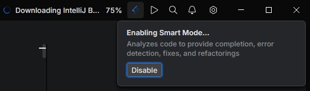
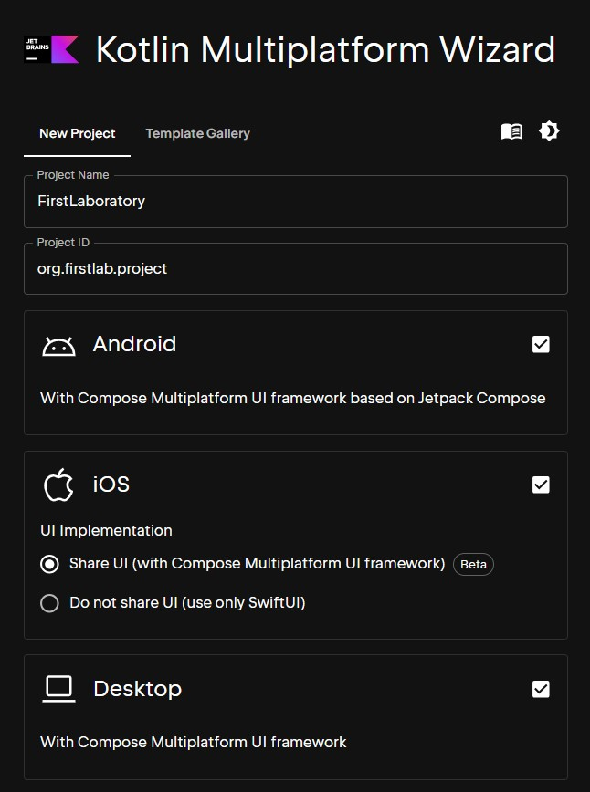
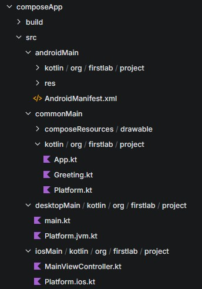
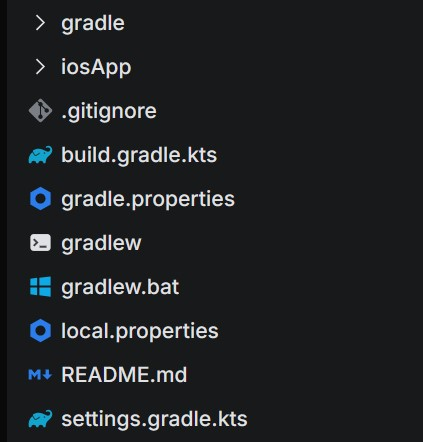
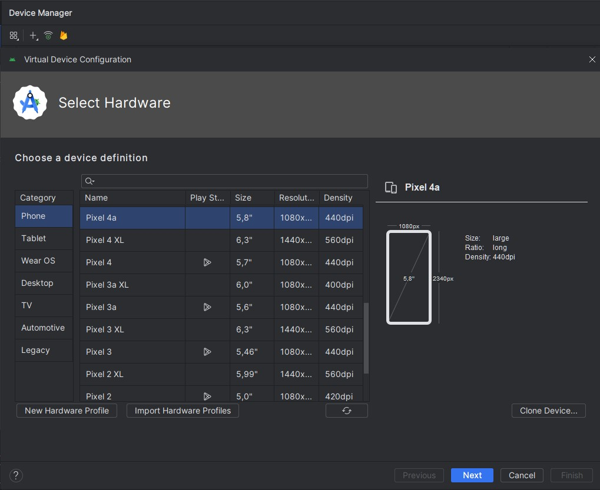
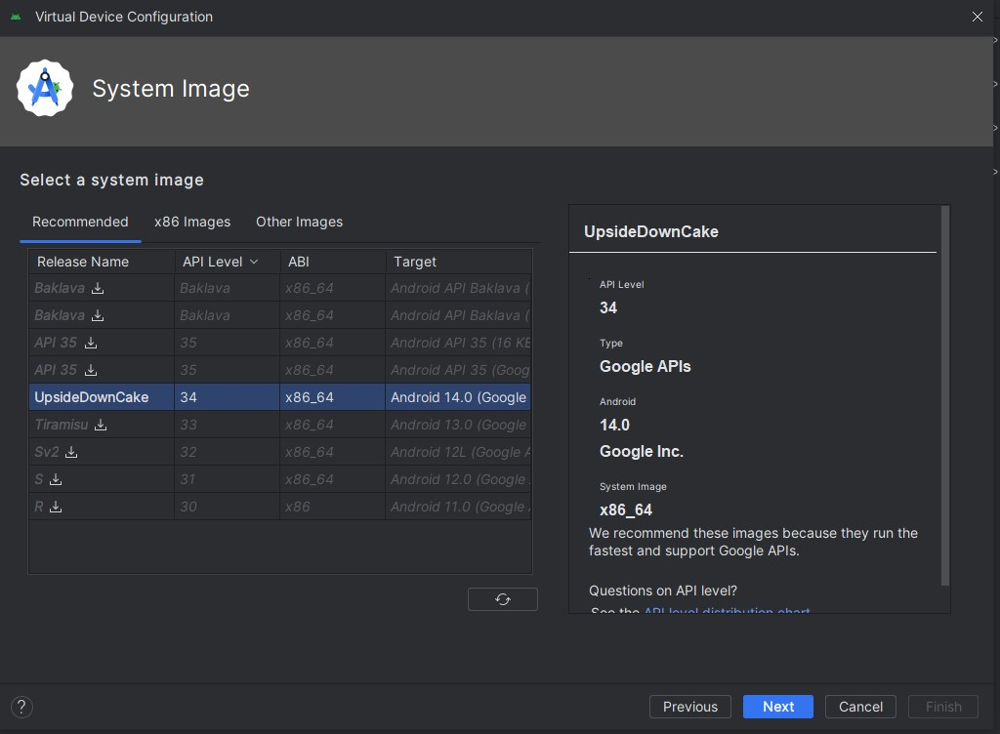
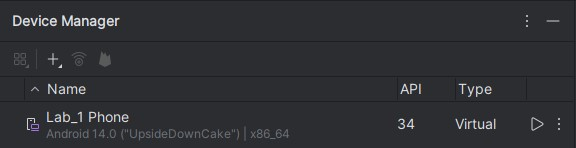
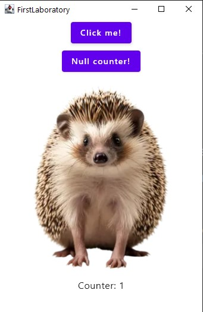
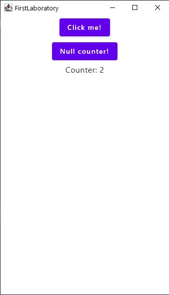

# Labor 1 - Kotlin multiplatform alapok, környezet megismerése

## Bevezető

A labor során megismerjük a Kotlin Multiplatform fejlesztésekhez használandó környezetet és megvizsgáljauk azt egy egyszerű alkalmazáson keresztül. A labor célja, hogy a későbbiekben otthonosan mozogjatok a KMP fejlesztői környezetében.


## Előkészületek

A feladatok megoldása során ne felejtsd el követni a [feladat beadás folyamatát](../../tudnivalok/github/GitHub.md).

### Git repository létrehozása és letöltése

1. Moodle-ben keresd meg a laborhoz tartozó meghívó URL-jét és annak segítségével hozd létre a saját repository-dat.

2. Várd meg, míg elkészül a repository, majd checkout-old ki.

    !!! tip ""
        Egyetemi laborokban, ha a checkout során nem kér a rendszer felhasználónevet és jelszót, és nem sikerül a checkout, akkor valószínűleg a gépen korábban megjegyzett felhasználónévvel próbálkozott a rendszer. Először töröld ki a mentett belépési adatokat (lásd [itt](../../tudnivalok/github/GitHub-credentials.md)), és próbáld újra.

3. Hozz létre egy új ágat `megoldas` néven, és ezen az ágon dolgozz.

4. A `neptun.txt` fájlba írd bele a Neptun kódodat. A fájlban semmi más ne szerepeljen, csak egyetlen sorban a Neptun kód 6 karaktere.

## Fejlesztői környezet kialakítása

Első lépésként a töltsd le a [_Fleet_](https://www.jetbrains.com/fleet/download/#section=windows) fejlesztőkörnyezetet, a Jetbrains Toolbox használatával.

!!!info "Fleet"
       A _Fleet_ egy fejlett kódszerkesztő alkalmazás - korábban a VS Code-dal dolgozhattatok, ami hasonló tulajdonságokkal bír. Az alkalmazás a Jetbrains fejlsztése, akihez a Kotlin Multiplatform is köthető, emiatt dolgozunk ezen a felületen a tárgy folyamán. A Fleet a Smart Mode használata nélkül egyszerű szövegszerkesztővé egyszerűsödik.
    <p align="center">
    
    </p>


## Mintaalkalmazás létrehozása

Nyissátok meg a [KMP projektvarázslót](https://kmp.jetbrains.com/) és hozzatok létre egy projektet a képen látottak szerint!
<p align="center">

</p>

A kiválasztott célplatformot az Android az IOS és az asztali alkalmazás lesznek.

A letöltött alkalmazást csomagoljátok ki a repositoryba és nyissátok meg _Fleet_-ben a gyökér mappát, mint projektet.

### Tudnivalók a Gradle-ről

A projektet megnyitva láthatjátok, hogy Android alkalmazásokhoz hasonlóan a KMP projektet is a _Gradle_ 'fogja össze'. A _Gradle_ egy projektautomatizációs eszköz, ennek használatával végezhetjük el a függőségek kezelését, a buildelést és a futtatást.

## Mappaszerkezet áttekintése

A projekt struktúrájára ránézve számos fájl és mappa sorakozik fel, nézzük is végig ezeket, melyiknek milyen helye van a projektben.

<p align="center">

</p>

A `composeApp/src` könyvtárban látunk célplatrform-specifikus mappákat (pl: androidMain). Ezek tartalmazzák azt a forráskódot, ami az adott platformra fordul.
a `/commonmain` pedig azt a kódot, ahol az összes platformra érvényes kódot írjuk. A mintaalkalmazás lényegi kódjának áttekintéséhez az `App.kt` fájl érdemes szemügyre venni.
Említés érdemel még a `composeResources/drawable` mappa, ugyanis ide kerülnek a szükséges kép jellegű erőforrások.

A composeApp gyökerében található még egy build szempontjából kiemelten fontos fájl, ezt nézzük meg kicsit részletesebben:

`build.gradle.kts`:

```

plugins {
    alias(libs.plugins.kotlinMultiplatform)
    ...
}

kotlin {
    androidTarget {
        @OptIn(ExperimentalKotlinGradlePluginApi::class)
        compilerOptions {
            jvmTarget.set(JvmTarget.JVM_11)
        }
    }

    listOf(
        iosX64(),
        iosArm64(),
        iosSimulatorArm64()
    ).forEach { iosTarget ->
        iosTarget.binaries.framework {
            baseName = "ComposeApp"
            isStatic = true
        }
    }

    jvm("desktop")

    sourceSets {
        val desktopMain by getting

        androidMain.dependencies {
            implementation(compose.preview)
            ...
        }
        commonMain.dependencies {
            implementation(compose.runtime)
            implementation(compose.foundation)
            ...
        }
        desktopMain.dependencies {
            implementation(compose.desktop.currentOs)
            ...
        }
    }
}

android {
    namespace = "org.firstlab.project"
    compileSdk = libs.versions.android.compileSdk.get().toInt()

    defaultConfig {
        applicationId = "org.firstlab.project"
        minSdk = libs.versions.android.minSdk.get().toInt()
        targetSdk = libs.versions.android.targetSdk.get().toInt()
        versionCode = 1
        versionName = "1.0"
    }
    packaging {
        resources {
            excludes += "/META-INF/{AL2.0,LGPL2.1}"
        }
    }
    buildTypes {
        getByName("release") {
            isMinifyEnabled = false
        }
    }
    compileOptions {
        sourceCompatibility = JavaVersion.VERSION_11
        targetCompatibility = JavaVersion.VERSION_11
    }
}
...
compose.desktop {
    application {
        mainClass = "org.firstlab.project.MainKt"

        nativeDistributions {
            targetFormats(TargetFormat.Dmg, TargetFormat.Msi, TargetFormat.Deb)
            packageName = "org.firstlab.project"
            packageVersion = "1.0.0"
        }
    }
}

```

Ez a fájl több külön-külön fontos részből áll

* A Gradle pluginok felsorolása után a _'kotlin'_ részben konfiguráljuk a projektet.
    * Ennek elején felsoroljuk a célplatformokat (androidTarget, iosX64(), jvm("desktop"))
    * Ezt követően a különböző célplatform-specikus függőséget soroljuk fel, valamint a közös kód által használt függőségeket.
* Következőnek a platformspecifikus build információk találhatóak meg a fáljban (pl.: compose.desktop)

<p align="center">

</p>


!!!example "BEADANDÓ (1 pont)"
	Készíts egy **képernyőképet**, melyen látszanak a kizárólag asztali app-hoz tartozó függőségek. A képet a megoldásban a repository-ba f1.png néven töltsd föl!

Nézzük végig a többi Gradle-höz kapcsolódó fájlt

* `gradle.properties`: Rendszerszintű beállításokat adhatunk meg a build-folyamattal, memória használattal és a
* `gardlew`, `gradlew.bat`: Ezek biztosítják, hogy a Gradle megfelelően legyen telepítve a komponensek esetében és használhassuk hozzá kapcsolódó parancsokat (pl.: _gradle build_ ), ezeket a parancsokat - pontosabban a parancsok futtatásához szükséges wrappert a gyökérben található `/gradle` könyvtár tartalmazza
* `settings.gradle.kts` Itt találhatóak a projekt alapvető beállításai (pl. a projekt neve)

Végül vessünk egy pillantást az iosApp mappára: ez egy XCode projekt, mely Swiftben kódot tartalmaz, ami az IOS app futtatásához szükséges. A projekt felhasználja forráskódként a iosMain-ben található kódot. Amennyiben nem shared UI-t használnánk itt kellene megírni az IOS app UI kódját.

<p align="center">

</p>

!!! info "shared mappa"
       Amennyiben nem a béta-verziós osztott UI-al hoztuk volna létre a projektet, létjerött volna egy _shared_ mappa is. Ebbe kerültek volna a célplatformok _main_ mappái. Ami lényeges eltérés, hogy ebben a esetben az IOS alkalmazásunk felületétmi írtuk volna meg Swift kódban, azonban erre a béta-verzió funkciónak köszönhetően nincsen szükség.


## Alkalmazás futtatása

!!! warning "JDK verzió"
       Ellenőrizzétek le, hogy rendelkeztek-e a megfelelő java verzióval! (parancssorban java -version parancs), amennyiben nem, telepítsetek egy 17.0, vagy frissebb JDK-t, és annak megfelelően frissítsétek a környezeti változókat is:

    * JAVA_HOME a JDK könyvtárra legyen állítva
    * PATH-ben pedig szerepeljen (a korábban már telepített java JDK-k előtt) a JDK `\bin` mappája


#### Asztali verzió futtatása

A futtás a jobb felső sávban lévő "Run" gombbal történik, ezt követően ki kell választani a célplatformot.
Egyelőre csak az asztali verzió futtatása lehetséges, de ez egyelőre megfelel nekünk.

!!!note "Mi is a futtatási parancs?"
    A `/.fleet/run.json` fájlban az is látszik, hogy ilyenkor milyen paraméterekkel fut le az adott gradle parancs - ebben az esetben a desktopRun került futtatásra

!!!example "BEADANDÓ (1 pont)"
	Készíts egy **képernyőképet**, amelyen a kiinduló alkalmazás fut és látszik "Hello {Platform} {Neptun-kód}" felirat. A képet a megoldásban a repository-ba f2.png néven töltsd föl!

#### Futtatás Androidon

Az Androidon történő futtatás igényel egy kis előkészületet:

- [x] Töltsd le az Android Studio-t - ezt szintén megteheted a JetBrains ToolBoxon keresztül, vagy a [honlapjáról](https://developer.android.com/studio)
- [x] Hozz létre egy új emulátort. Ehhez az Android Studio-ban nyisd meg a Device Managert: Ez a jobboldali menüsorban találod, vagy a _View > Tool Windows > Device Manager_ úton éred el.
- [x] Hozz létre egy új emulátort és válassz ki egy szimpatikus készüléket!
<p align="center">

</p>

- [x] Válassz ki hozzá egy Android verziót is (lehetőleg >=32 API szinttel), és el is készült az emulátor!
<p align="center">

</p>

- [x] Indítsd el az emulátort! Ezután a Running Devices fülön láthatod is az eszköz futását.
<p align="center">

</p>

- [x] Indítsd el programot Fleet-ben is! Már nem csak az asztali futtatás látszik, mint opció, hanem a mobileszköz is. A Android Studio-ban kiprobálhatod az alkalmazás működését az emulátoron.

!!!example "BEADANDÓ (2 pont)"
	Készíts egy **képernyőképet**, az emulátor képernyőjéről, amelyen a kiinduló alkalmazás fut látszik "Hello {Platform} {Neptun-kód}" felirat. A képet a megoldásban a repository-ba f3.png néven töltsd föl!

???question "Melyik fájl kell módosítanod, ha azt szeretnéd elérni, hogy csak az Android eszközön látszódjon Neptun-kódod?"
    Erre például gyors megoldás, ha az AndroidMain mappán belül található `Platform.Android.kt` fájlban a kiírást úgy módosítod hogy a végére fűzöd a Neptun kódod.

#### Futtatás IOS-en

Ehhez az XCode letöltése szükséges. Egy abban létrehozott és elindított emulátoron lehet futtatni az alkalmazás IOS-verzióját az Androidos verzióhoz hasonlóan. Ez jelenleg csak MAC-en lehet végrehajtani, emiatt ezen a laboron ezt nem tsszük meg.

### Egyszerű számoló alkalmazás elkészítése

A következőekben alakítsd át a meglévő alkalmazást egy másik minta alkalmazásássá, ehhez két apróbb változtatást kell végrehajtanod az appon:

1. Cseréld ki a KMP logóját egy általad választott állat képére, ez az eddigi logó megnyomásához hasonlóan működjön: tűnjön el és jelenjen meg minden megnyomásnál!
2. Az üdvözlőszöveget cseréld ki egy számlálóra, ami a fenti gomb lenyomásait számlálja!
3. Helyezz el egy új gombot a meglévő mellé, ami nullázza a számlálót.
Valahogy így kellene kinéznie a végeredménynek:

<p align="center">


</p>
<p align="center">

</p>


??? tip "Segítség"
    A megoldáshoz a következőek kellenek

    1. Egy, a showContenthez hasonló számláló változó, ami a meglévő nyomására növekszik
    2. Egy új gomb, ami megnyomás hatására nullázza az előbb létrehozott változót
    3. A számláló állását megjelenítő szöveg kivétele az animált részből
    4. Kiválasztott kép feltöltése a `commonMain/drawable`  mappába, majd annak használata az eddigi logó helyett


!!!example "BEADANDÓ (2 pont)"
	Készíts egy **képernyőképet**, az a futó alkalmazásról, melyen a számláló a NEPTUN-kódod első számjegyével egyező értéket mutat felirat (Amennyiben nincs számjegy a NEPTUN-kódodban, a felirat mutasson 10-t). A képet a megoldásban a repository-ba f4.png néven töltsd föl!


