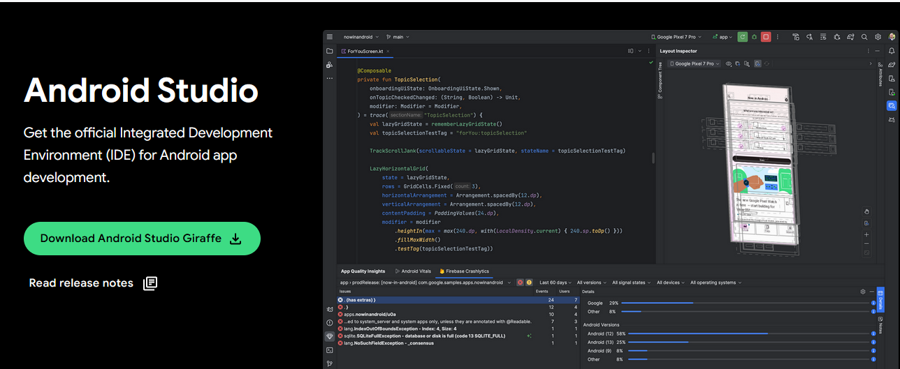
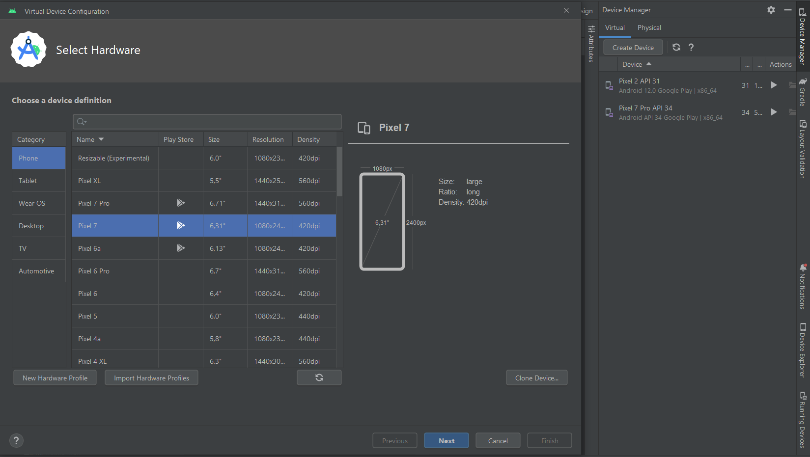
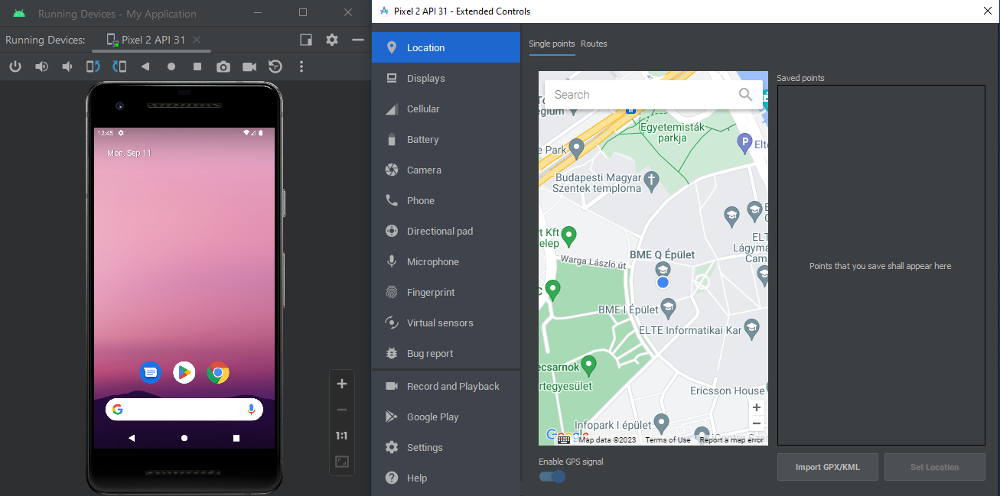
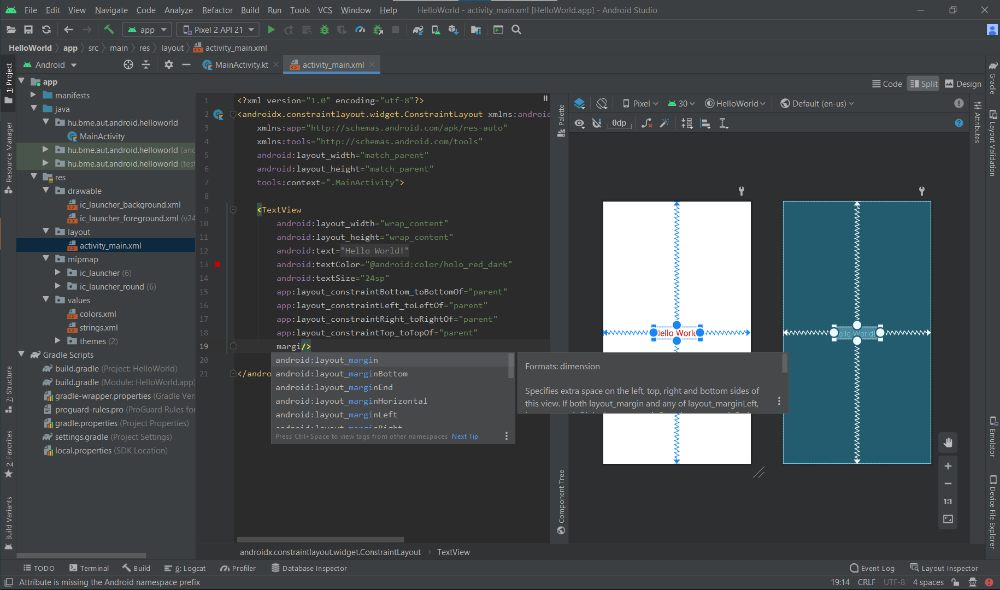
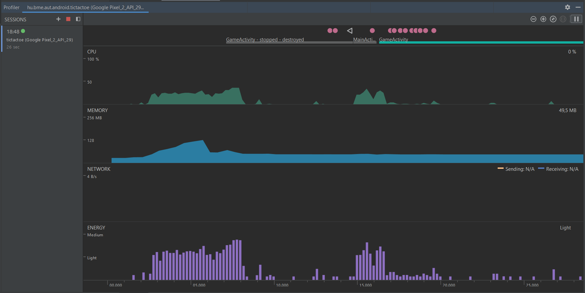
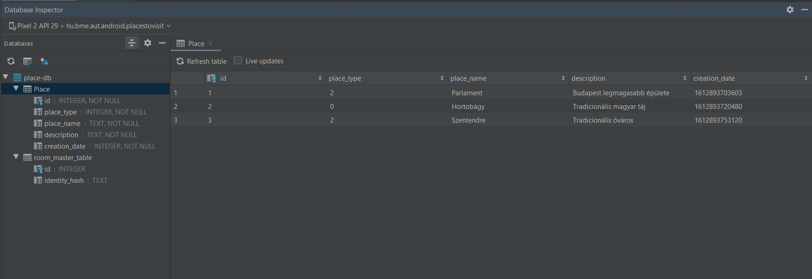
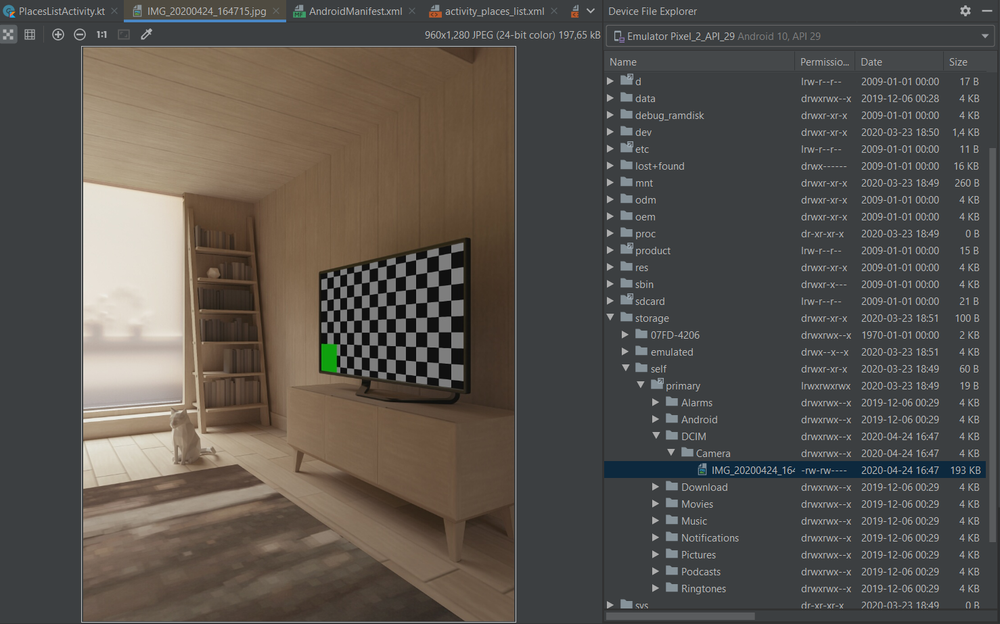
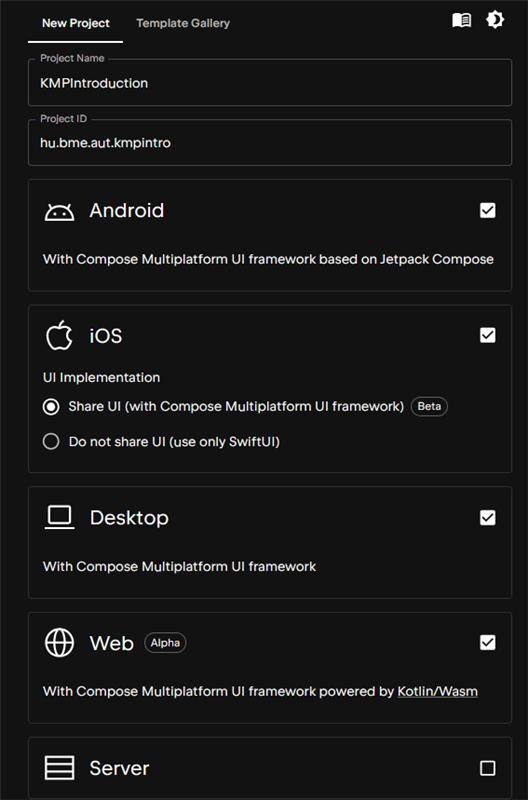

# Labor 1 - Kotlin Multiplatform alapok, környezet megismerése

## Bevezető

A labor során megismerjük a Kotlin Multiplatform (KMP) alapú alkalmazások fejlesztéséhez használandó környezetet és megvizsgáljuk azt egy egyszerű alkalmazáson keresztül. A labor célja, hogy a későbbiekhez alapul szolgáljon a fejlesztőkörnyezet és a KMP projektek felépítése, konfigurálása és futtatása szempontjából.


## Előkészületek

A feladatok megoldása során ne felejtsük el követni a [feladat beadás folyamatát](../../tudnivalok/github/GitHub.md).

### Git repository létrehozása és letöltése

1. Moodle-ben keressük meg a laborhoz tartozó meghívó URL-jét és annak segítségével hozzuk létre a saját repositoryt.

2. Várjuk meg, míg elkészül a repository, majd checkout-oljuk ki.

3. Hozzunk létre egy új ágat `megoldas` néven, és ezen az ágon dolgozzunk.

4. A `neptun.txt` fájlba írjuk bele a Neptun kódunkat. A fájlban semmi más ne szerepeljen, csak egyetlen sorban a Neptun kód 6 karaktere.

## Fejlesztői környezet kialakítása

Kotlin Multiplatform alkalmazások fejlesztéséhez a JetBrains hivatalosan az Android Studiot javasolja, de használhatjuk például az Intellij Ideat is. Képességben és fókuszban minimális a különbség közöttük, ezért preferencia szerint tetszőlegesen bármelyik használható. Mivel Android platformra való futtatáshoz szükség lesz emulátorra (vagy saját fizikai eszközre), ezért kényelmes választás az Android Studio (bár Idea-ban vagy akár parancssorból is megoldható az emulátorok kezelése és futtatása).

!!!info "Verziószámok"
		A későbbiekben problémákat okozhatnak a régebbi verziójú fejlesztőkörnyezetek a tárgyban kiadott segédanyagokkal és laborokkal kapcsolatban, ezért célszerű a legújabb stabil releaset használni. Ez az útmutató készítésének pillanatában Android Studio Ladybug Feature Drop | 2024.2.2, illetve Intellij Community Edition 2024.3.4.1, Build: 243.25659.59.

!!!note "Fleet"
        Régebben a Kotlin Multiplatform fejlesztéshez a JetBrains egy kifejezetten erre a célra fejlesztett standalone fejlesztőkörnyezetet, a _Fleet_-et javasolta. Ennek támogatottsága azonban nemrég megszűnt, ezért a jövőben Android Studio vagy Intellij Idea használata javasolt.


Amennyiben még nincs telepítve megfelelő verziójú fejlesztőkörnyezet, töltsük le és telepítsük az [_Android Studiot_](https://developer.android.com/studio/releases) vagy az [_Intellij Ideat_](https://www.jetbrains.com/idea/download/?section=windows).

Android Studioban telepítsük a _Kotlin Multiplatform_ plugint, amely számos funkcionalitást nyújt Android Studioban Kotlin Multiplatform projektek kényelmesebb fejlesztéséhez. Intellij Ideaban a _Kotlin_ plugin legfrissebb verziója legyen telepítve.

## Android alapok (kiegészítő anyag)

A következőkben az Android alapjairól, a fordítás folyamatáról, az SDK telepítéséről, az AVD használatáról és az Android Studio felépítéséről és eszközeiről olvashatunk. Mindezek közül számunkra a továbbiakban közvetlenül az emulátorok használata a legfontosabb, hiszen ezen tudjuk elsősorban futtatni a Kotlin Multiplatform projektünket Android platformon, de ha nem találkoztunk még androiddal, célszerű legalább egyszer átfutni a többi részét is. Amennyiben mindezt már ismerjük, ugorjuk át ezt a szekciót és folytassuk a _Kiinduló alkalmazás generálása_ pontnál.

### Fordítás menete Android platformon

Egy android projekt létrehozása után a forráskód az `src` könyvtárban van. A felhasználói felület leírására régebben XML-t használtak, manapság már Jetpack Compose használata javasolt, azonban előfordulhatnak még régebbi rendszerek vagy egyéb szélsőséges esetek miatt XML alapú felületleírók is. Ezek az esetleges XML állományok a `res` könyvtárban találhatók, amennyiben vannak ilyenek. Az erőforrás állományokat egy `R.java` állomány köti össze a forráskóddal, így könnyedén elérhetjük Java/Kotlin oldalról az XML-ben definiált felületi elemeket. Az Android projekt fordításának eredménye egy APK állomány, melyet közvetlenül telepíthetünk mobil eszközre.


*Fordítás menete Android platformon*

1.  A fejlesztő elkészíti a Kotlin forráskódot, valamint az esetleges XML alapú felhasználói felület leírást a szükséges erőforrás állományokkal.

2.  A fejlesztőkörnyezet az erőforrás állományokból folyamatosan naprakészen tartja az `R.java` erőforrás fájlt a fejlesztéshez és a fordításhoz. 

    !!! danger "FONTOS"
     	**Az `R.java` állomány generált, kézzel SOHA ne módosítsuk!** (Az Android Studio egyébként nem is hagyja.)

3.  A fejlesztő a Manifest állományban beállítja az alkalmazás hozzáférési jogosultságait (pl. Internet elérés, szenzorok használata, stb.), illetve ha futás idejű jogosultságok szükségesek, ezt kezeli.

4.  A fordító a forráskódból, az erőforrásokból és a külső könyvtárakból előállítja az [**ART**](https://source.android.com/docs/core/dalvik) virtuális gép gépi kódját.

5.  A gépi kódból és az erőforrásokból előáll a nem aláírt APK állomány.

6.  Végül a rendszer végrehajtja az aláírást és előáll a készülékekre telepíthető, aláírt APK.

Az Android Studio a [Gradle](https://gradle.org/) build rendszert használja ezeknek a lépéseknek az elvégézéséhez.

!!! note "Megjegyzések"
	*	A teljes folyamat a fejlesztői gépen megy végbe, a készülékekre már csak bináris állomány jut el.

	*   A külső könyvtárak általában JAR állományként, vagy egy másik projekt hozzáadásával illeszthetők az aktuális projekthez (de ezt nem kell kézzel megtennünk, a függőségek kezelésében is a Gradle fog segíteni).
	
	*   Az APK állomány leginkább a Java világban ismert JAR állományokhoz hasonlítható.
	
	*   A Manifest állományban meg kell adni a támogatni kívánt Android verziót, mely felfele kompatibilis az újabb verziókkal, ennél régebbi verzióra azonban az alkalmazás már nem telepíthető.
	
	*   Az Android folyamatosan frissülő verzióival folymatosan lépést kell tartaniuk a fejlesztőknek.
	
	*   Az Android alkalmazásokat tipikusan a Google Play Store-ban szokták publikálni, így az APK formátumban való terjesztés nem annyira elterjedt.


### SDK és könyvtárai

A [developer.android.com/studio](https://developer.android.com/studio) oldalról külön is letölthető az SDK. Ennek fontosabb mappáit, eszközeit tekintsük át!



SDK szerkezet:

*   `docs:` Dokumentáció
*   `extras:` Különböző extra szoftverek helye. Maven repository, support libes anyagok, analytics SDK, Google [Android USB driver](https://developer.android.com/studio/run/win-usb.html) (amennyiben SDK managerrel ezt is letöltöttük) stb.
*   `platform-tools:` Fastboot és ADB binárisok helye (legtöbbet használt eszközök)
*   `platforms`, `samples`, `sources`, `system-images:` Minden API levelhez külön almappában a platform anyagok, források, példaprojektek, OS image-ek
*   `tools:` Fordítást és tesztelést segítő eszközök, SDK manager, 9Patch drawer, emulátor binárisok stb.

### AVD és SDK manager

Az SDK kezelésére az SDK managert használjuk, ezzel lehet letölteni és frissen tartani az eszközeinket. Indítása az Android Studion keresztül lehetséges.

Az SDK Manager ikonja a fenti toolbaron (vagy Tools -> SDK Manager):


vagy


SDK manager felülete:


!!! note "Megjegyzés"
	Korábban létezett egy standalone SDK manager de ennek használata mára deprecated lett. Ha online forrásokban ilyet látunk ne lepődjünk meg.

Indítsuk el az AVD managert!

### AVD

Az AVD az Android Virtual Device rövidítése. Nem csak valódi eszközön futtathatjuk a kódunkat, hanem emulátoron is. Az AVD indítása a fejlesztői környezeten keresztül lehetséges, illetve parancssorból is.

Az AVD Manager ikonja:


vagy




A fenti képen jobb oldalon, a kinyíló panelben, a létező virtuális eszközök listáját találjuk, bal oldalon pedig az ún. eszköz definíciókét. Itt néhány előre elkészített sablon áll rendelkezésre. Magunk is készíthetünk ilyet, ha tipikusan egy adott eszközre szeretnénk fejleszteni (pl. Galaxy S4). Készítsünk új emulátort! Értelemszerűen csak olyan API szintű eszközt készíthetünk, amilyenek rendelkezésre állnak az SDK manageren keresztül.

1. A jobb oldali panelon kattintsunk a fent található *Create Virtual Device...* gombra!
2. Válasszunk az előre definiált készülék sablonokból (pl. *Pixel 7 Pro*), majd nyomjuk meg a *Next* gombot.
3. Döntsük el, hogy milyen Android verziójú emulátort kívánunk használni. CPU/ABI alapvetően x86_64 legyen, mivel ezekhez kapunk [hardveres gyorsítást](https://developer.android.com/studio/run/emulator-acceleration) is. Itt válasszunk a rendelkezésre állók közül egyet, majd *Next*.
4. Az eszköz részletes konfigurációja.

    - A virtuális eszköz neve legyen például `Labor_1`.
    - Válasszuk ki az alapértelmezett orientációt, tetszés szerint kapcsoljuk ki vagy be a készülék keretének megjelenítését.

    A *Show Advanced Settings* alatt további opciókat találunk:

    - Kamera opciók:
        - *WebcamX*, hardveres kamera, ami a számítógépre van csatlakoztatva
        - *Emulated*, egy egyszerű szoftveres megoldás, **most legalább az egyik kamera legyen ilyen**.
        - *VirtualScene*, egy kifinomultabb szoftveres megoldás, amelyben egy 3D világban mozgathatjuk a kamerát.
    - Hálózat: Állíthatjuk a sebességét és a késleltetését is kommunikációs technológiák szerint.
    - *Boot Option*: Nemrég jelent meg az Android emulátor állapotáról való pillanatkép elmentésének lehetősége. Ez azt takarja, hogy a virtuális operációs rendszer csak felfüggesztésre kerül az emulátor bezáráskor (például a megnyitott alkalmazás is megmarad, a teljes állapotával), és *Quick boot* esetben a teljes OS indítása helyett másodperceken belül elindul az emulált rendszer. *Cold Boot* esetben minden alkalommal leállítja és újra indítja a virtális eszköz teljes operációs rendszerét.
    - Memória és tárhely: 
        - RAM: Ha kevés a rendszermemóriánk, nem érdemes 768 MB-nál többet adni, mert könnyen futhatunk problémákba. Ha az emulátor lefagy, vagy az egész OS megáll működés közben, akkor állítsuk alacsonyabbra ezt az értéket. 16 GB vagy több rendszermemória mellett nyugodtan állíthatjuk az emulátor memóriáját jóval magasabb értékekre.
        - VM heap: az alkalmazások virtuális gépének szól, maradhat az alapérték. Tudni kell, hogy készülékek esetében gyártónként változik.
        - Belső flash memória és SD kártya mérete, alapvetően jók az alapértelmezett beállításai.

    - Ha mindent rendben talál az ablak, akkor *Finish*!


Az Android Virtual Device Manager-ben megjelent az imént létrehozott eszközünk. Itt lehetőség van a korábban megadott paraméterek szerkesztésére, a "készülékről" a felhasználói adatok törlésére (*Wipe Data* - Teljes visszaállítás), illetve az emulátor példány duplikálására vagy törlésére.

A Play gombbal indítsuk el az új emulátort!

Az elindított emulátoron próbáljuk ki az *API Demos* és *Dev Tools* alkalmazásokat!

!!! note "Megjegyzés"
	A gyári emulátoron kívül több alternatíva is létezik, mint pl. a [Genymotion](https://www.genymotion.com/fun-zone/) vagy a [BigNox](https://www.bignox.com/), viszont a Google féle emulátor a legelterjedtebb, így amennyiben ezzel nem jelentkeznek problémáink, maradjunk ennél.

Tesztelés céljából nagyon jól használható az emulátor, amely az alábbi képen látható plusz funkciókat is adja. Lehetőség van többek között egyedi hely beállítására, bejövő hívás szimulálására, stb. A panelt a futó emulátor jobb oldalán található vezérlő gombok közül a *...* gombbal lehet megnyitni:



### Android Studio hasznos tudnivalók

#### Android Studio

Tekintsük át az Android Studio alapvető funkcióit.

*   **Import régi projektekből:** Android Studioban lehetséges a projekt importálása régebbi verziójú projektekből és a régi Eclipse projektekből is.
*   **Projektstruktúra:** Az Android Studio Gradle-lel fordít. Projekten belül:
    *   `.idea`: IDE fájlok
    *   `app`: forrás
        *   `build`: fordított állományok
        *   `libs`: libraryk
        *   `src`: forráskód, azon belül is külön projekt a tesztnek, és azon belül pedig `res` könyvtár, illetve `java`. Utóbbin belül már a csomagok vannak.
    *   `gradle`: Gradle fájlok

*   **Hasznos funkciók:**
    *   IntelliSense, fejlett refaktorálás támogatás
    *   Ha egy sorban színre, vagy képi erőforrásra hivatkozunk, a sor elejére kitesz egy miniatűr változatot.
    *   Ha közvetve hivatkozott erőforrást (akár `resources.get...`, akár `R...`) adunk meg, összecsukja a hivatkozást és a tényleges értéket mutatja. Ha rávisszük az egeret felfedi, ha kattintunk kibontja a hivatkozást.
    *   Névtelen belső osztályokkal is hasonlót tud, javítva a kód olvashatóságát.
    *   Kódkiegészítésnél szabad a kereső, a szótöredéket keresi, nem pedig a szóval kezdődő lehetőségeket (lásd képen)
    *   Változónév ajánlás: amikor változónévre van szükségünk, nyomjunk *Ctrl+Space*-t. Ha adottak a körülmények, a Studio egész jó neveket tud felajánlani.
    *   Szigorú lint. A Studio megengedi a warningot. Ezért szigorúbb a lint, több mindenre figyelmeztet (olyan apróságra is, hogy egy View egyik oldalán van padding, a másikon nincs)
    *   Layout szerkesztés. A grafikus layout építés lehetséges.
    *   CTRL-t lenyomva navigálhatunk a kódban, pl. osztályra, metódushívásra kattintva. Ezt a navigációt (és az egyszerű másik osztályba kattintást is) rögzíti, és a historyban előre-hátra gombokkal lehet lépkedni. Ha van az egerünkön/billentyűzetünkön ilyen gomb, és netes böngészés közben aktívan használjuk, ezt a funkciót nagyon hasznosnak fogjuk találni.



*Szín ikonja a sor elején; kiemelve jobb oldalon, hogy melyik nézeten vagyunk; szabadszavas kiegészítés; a "Hello world" igazából `@string/very_very_very_long_hello_world`.*


#### Billentyűkombinációk

*   <kbd>CTRL</kbd> + <kbd>ALT</kbd> + <kbd>L</kbd>: Kódformázás
*   <kbd>CTRL</kbd> + <kbd>SPACE</kbd>: Kódkiegészítés
*   <kbd>SHIFT</kbd> + <kbd>F6</kbd> Átnevezés (Mindenhol)
*   <kbd>F2</kbd>: A következő error-ra ugrik. Ha nincs error, akkor warningra.
*   <kbd>CTRL</kbd> + <kbd>Z</kbd> illetve <kbd>CTRL</kbd> + <kbd>SHIFT</kbd> + <kbd>Z</kbd>: Visszavonás és Mégis
*   <kbd>CTRL</kbd> + <kbd>P</kbd>: Paraméterek mutatása
*   <kbd>ALT</kbd> + <kbd>INSERT</kbd>: Metódus generálása
*   <kbd>CTRL</kbd> + <kbd>O</kbd>: Metódus felüldefiniálása
*   <kbd>CTRL</kbd> + <kbd>F9</kbd>: Fordítás
*   <kbd>SHIFT</kbd> + <kbd>F10</kbd>: Fordítás és futtatás
*   <kbd>SHIFT</kbd> <kbd>SHIFT</kbd>: Keresés mindenhol
*   <kbd>CTRL</kbd> + <kbd>N</kbd>: Keresés osztályokban
*   <kbd>CTRL</kbd> + <kbd>SHIFT</kbd> + <kbd>N</kbd>: Keresés fájlokban
*   <kbd>CTRL</kbd> + <kbd>ALT</kbd> + <kbd>SHIFT</kbd> + <kbd>N</kbd>: Keresés szimbólumokban (például függvények, property-k)
*   <kbd>CTRL</kbd> + <kbd>SHIFT</kbd> + <kbd>A</kbd>: Keresés a beállításokban, kiadható parancsokban.

#### Eszközök, szerkesztők

A *View* menü *Tool Windows* menüpontjában lehetőség van különböző ablakok ki- és bekapcsolására. Próbáljuk ki és nézzük meg a következő ablakokat!

*   Project
*   Structure
*   TODO
*   Logcat
*   Terminal
*   Event Log
*   Gradle

Lehetőség van felosztani a szerkesztőablakot, ehhez kattinsunk egy megnyitott fájl tabfülére jobb gombbal, *Split Vertically/Horizontally*!

#### Hasznos beállítások

*   kis- nagybetű érzékenység kikapcsolása a kódkiegészítőben (settingsben keresés: *sensitive*)
*   "laptop mód" ki- és bekapcsolása (*File -> Power Save Mode*)
*   sorszámozás bekapcsolása (kód melletti részen bal oldalt: jobb egérgomb, *Show Line Numbers*)

#### Generálható elemek

A Studio sok sablont tartalmaz, röviden tekintsük át a lehetőségeket:

*   Projektfában, projektre jobb gombbal kattintva -> new -> module
*   Projektfában, modulon belül, "java"-ra kattintva jobb gombbal -> new
*   Forráskódban <kbd>ALT</kbd>+<kbd>INSERT</kbd> billentyűkombinációra

#### Android Profiler

A készülék erőforráshasználata [monitorozható](https://developer.android.com/studio/profile/android-profiler) ezen a felületen, amelyet az említett *View -> Tool Windows*-ból érhetünk el.



Például részletes információt kaphatunk a hálózati forgalomról:


#### Database Inspector

A készüléken debuggolt alkalmazásunknak az [adatbázisát](https://developer.android.com/studio/inspect/database) is meg tudjuk tekinteni.



#### Device File Explorer

A készüléken lévő fájlrendszert is [böngészhetjük](https://developer.android.com/studio/debug/device-file-explorer).



## Kiinduló alkalmazás generálása
Kotlin Multiplatform projektek generálására az ajánlott módszer a KMP projektvarázsló (https://kmp.jetbrains.com/) használata. 

!!!note "Pluginek használata KMP projekt létrehozásához"
	Android Studioban vagy Intellij IDEA-ban is van lehetőség a megfelelő pluginek telepítése után (lásd korábban) KMP projektek létrehozására. Android Studioban például a szokásos módon (File > New > New Project) választhatjuk a Kotlin Multiplatform projekt templatet.
	
	
Nyissuk ezt meg! Itt néhány pre-konfigurált template közül is válogathatunk, válasszunk most egy új projektet (New Project) és hozzuk létre az alábbiaknak megfelelően:

1. A projekt neve _KMPIntroduction_ legyen
2. Pipáljuk be az Android, iOS, Desktop és Web platformokat, iOS esetén válasszuk a megosztott UI-t (Share UI with Compose Multiplatform)
3. Server-re most nem lesz szükségünk, ne pipáljuk be

<p align="center">

</p>


Ha minden kész, Download. Ez letölti nekünk a generált alkalmazást egy ZIP-ben. Helyezzük a kicsomagolt alkalmazást a git repositorynkba, és nyissuk meg a fejlesztőkörnyezetünkben a gyökér mappát, mint projektet (File > Open).

## Projekt szerkezetének áttekintése

Tekintsük most át, hogyan épül fel egy Kotlin Multiplatform projekt. A letöltött projektet megnyitva a következőhöz hasonlót kell látnunk (Android Studioban a szokásos _Android_ nézet helyett  a _Project_ nézetet válasszuk):

<p align="center">

</p>

- `.fleet/`: A JetBrains Fleet szerkesztőhöz tartozó konfigurációs fájlokat tartalmaz. Mivel a Fleet támogatottsága megszűnt, nincs jelentősége számunkra.
- `build.gradle.kts`: A projekt fő Gradle build szkriptje.
- `composeApp/`: A Compose Multiplatform alkalmazás forráskódját és build fájlját tartalmazza. Itt láthatjuk az egyes SourceSeteket (pl. commonMain, androidMain), bennük az adott targetekre vonatkozó forrásfájlokkal és erőforrásfájlokkal (lásd később).
- `gradle/`: A Gradle beállításait és verzióinformációit tartalmazza.
- `iosApp/`: Az iOS alkalmazás mappája, amely egy XCode projekt. Swift kódot tartalmaz, ami az IOS app futtatásához szükséges. A projekt felhasználja forráskódként az iosMain SourceSetben található forráskódot. Amennyiben nem shared UI-t használnánk az iOS alkalmazásokhoz, itt kellene megírni az iOS alkalmazés UI kódját is.
<p align="center">

</p>
- `composeApp/commonMain/composeResources`: Ide kerülnek a  megosztott kép jellegű erőforrások.

## Kotlin Multiplatform projektek konfigurálása Gradle-vel

Láthatjuk, hogy Android alkalmazásokhoz hasonlóan a KMP projektek kezelésére is a _Gradle_ keretrendszert használhatjuk. A _Gradle_ egy projektautomatizációs eszköz, ennek használatával végezhetjük el a függőségek kezelését, a fordítással és a futtatással kapcsolatos műveleteket.

A composeApp folder gyökerében található az alkalmazás gradle konfigurációs fájlja (build.gradle.kts), nyissuk ezt meg és tekintsük át a legfontosabb részeit!

A _plugins_ blokkban adjuk meg a használt Gradle pluginokat. Esetünkben:

- `kotlinMultiplatform`: Engedélyezi a Kotlin Multiplatform támogatást, lehetővé téve kód megosztását különböző platformok között. Segítségével definiálhatunk közös kódot, platform specifikus source seteket adhatunk meg (androidMain, iOSMain stb.), könnyedén konfigurálhatjuk a különböző targeteket, illetve lehetővé teszi az expected-actual mechanizmus használatát platformfüggő implementációkhoz.
- `androidApplication`: Az Android alkalmazás buildeléséhez szükséges Gradle plugin.
- `composeMultiplatform`: Lehetővé teszi a Jetpack Compose használatát több platformon.
- `composeCompiler`: A Compose komponensek megfelelő fordításához szükséges.

A _kotlin_ blokkban definiáljuk a támogatott platformokat és a hozzájuk tartozó konfigurációkat:

- `Android`: Beállítjuk a JVM target verzióját.
- `iOS`: Többféle iOS architektúrát támogatunk (iosX64, iosArm64, iosSimulatorArm64).
- `Desktop`: JVM alapú desktop támogatás.
- `Web (WASM)`: A WebAssembly támogatása, amely lehetővé teszi a Kotlin alkalmazások futtatását böngészőben.

 A _sourceSets_ blokk határozza meg a különböző platformokhoz és a közös kódhoz tartozó forrásokat. Itt adhatjuk meg az adott SourceSetre vonatkozó függőségeket is. A projektben található source setek:
 
 - `commonMain`: A közös kódot tartalmazza.
 - `androidMain, iosMain, desktopMain, webMain`: A platform-specifikus kódokat tartalmazzák az adott platformra.
 
!!!note "Intermediate SourceSet"
	A projektünk SourceSetjei valójában úgynevezett intermediate (köztes) SourceSetek, mert különböző, elemi SourceSetekre vonatkozó közös kódot fognak össze. Például az iosMain intermediate source set, mert az iOS-specifikus kódot közös helyen tartja a különböző architektúrák számára (iosX64, iosArm64, iosSimulatorArm64). Ha valamilyen okból fogva ezeket külön akarnánk kezelni, azt is megtehetjük, ez esetben saját, csak az adott targetre címkézett SourceSetet kellene létrehoznunk. Saját SourceSetet szintén itt, a _sourceSets_ blokkon belül definiálhatunk az eddigiekhez hasonló módon.

Az _android_ blokk tartalmazza az Android-specifikus konfigurációkat:

- namespace: Az alkalmazás egyedi azonosítója.
- compileSdk, minSdk, targetSdk: A támogatott Android SDK verziók.
- buildTypes: A release és debug build konfigurációk.

A _compose.desktop_ blokk a Jetpack Compose Desktop alkalmazások beállításait tartalmazza. Például megadhatjuk:

- A fő belépési pontot (mainClass).
- A natív disztribúciós beállításokat (pl. .dmg, .msi, .deb fájlformátumokat a különböző operációs rendszerekhez).


Vessünk egy pillantást a composeApp > gradle > libs.versions.toml fájlra is. Ez egy deklaratív módja a projektben használt függőségek és verziók áttekinhető kezelésének. Segítségével központilag kezelhetjük a verziókat, így könnyebb frissíteni azokat. A build.gradle.kts fájlok ezáltal tisztábbak és átláthatóbbak lesznek, illetve elejét vehetjük az eltérő verziók használatából adódó problémáknak is.

- A versions blokkban a különböző könyvtárak pontos verzióit adjuk meg.
- A libraries blokkban az egyes függőségeket definiáljuk, amelyek egy adott verzióra hivatkoznak a versions blokkból.
- A plugins blokkban a Gradle pluginokat és azok verzióit konfiguráljuk.

Nézzük végig a többi Gradle-höz kapcsolódó fájlt is:

* `gradle.properties`: Rendszerszintű beállításokat adhatunk meg a build-folyamattal, memória használattal és egyebekkel kapcsolatban.
* `gradlew`, `gradlew.bat`: Ezek biztosítják, hogy a Gradle megfelelően legyen telepítve a komponensek esetében és használhassunk hozzá kapcsolódó parancsokat (pl. _gradle build_ ), ezeket a parancsokat - pontosabban a parancsok futtatásához szükséges wrappert a gyökérben található `/gradle` könyvtár tartalmazza
* `settings.gradle.kts` Itt találhatóak a projekt alapvető beállításai (pl. a projekt neve)

!!!example "BEADANDÓ (1 pont)"
	Készítsünk egy **képernyőképet**, melyen látszanak a kizárólag Desktop targethez tartozó függőségek! A kép a megoldásban a repositoryban f1.png néven szerepeljen!

## Az alkalmazás futtatása

Lássuk most, hogyan tudjuk futtatni az alkalmazásunkat a különböző platformokon.

!!! warning "JDK verzió"
       Ellenőrizzük, hogy rendelkezünk-e megfelelő verziójú JDK-val! Ennek legegyszerűbb módja parancssorban a `java -version` parancs kiadása. Amennyiben nem található JDK a pathen vagy 17.0-nál régebbi, telepítsünk egy legalább 17.0 vagy annál frissebb JDK-t, és frissítsük a környezeti változókat is:
	   
    * JAVA_HOME a JDK könyvtárra legyen állítva
    * PATH-ben pedig szerepeljen (a korábban már telepített java JDK-k előtt) a JDK `\bin` mappája
	
Mielőtt futtatnánk az alkalmazást, tekintsük át a Gradle importálás során felismert Gradle taskokat. A gradle ablakot lenyitva az alábbihoz hasonló run configurationöket kell látnunk:

<p align="center">

</p>

A futtatható taskokról parancssorból is kaphatunk egy listát, ha kiadjuk a projekt gyökerében a következő parancsot:

`./gradlew tasks`

Láthatjuk, hogy az egyes platformokhoz tartozó taskok külön kategóriákban vannak kezelve: android, compose desktop (JVM desktop platformra), kotlin browser (WASM web), illetve nodejs (JS alapú web). Figyeljük meg, hogy iOS-hez tartozó taskokat nem látunk. Ennek oka az, hogy iOS-re való fordítás és futtatás csak macOS-en, XCode-on keresztül történhet. Találhatunk általánosabb taskokat is, mint például a _verification_ alatti teszteket futtató taskok.

Desktopon való futtatáshoz futtassuk a gradle taskok közül a `compose desktop > run` taskot (parancssorból `./gradlew run`). WASM futtatásához a `kotlin browser > wasmJsBrowserRun` taskot futtassuk (parancssorból `./gradlew wasmJsBrowserRun`).

Ahhoz, hogy Androidon futtassuk, szükségünk van egy csatlakoztatott emulátorra, vagy fizikailag csatlakoztatott Androidos eszközre. A korábbiak alapján hozzunk létre egy emulátort (amennyiben még nem volt). A fejlesztőkörnyezet felismerte a projektben a composeApp modult, azt futtatva tudjuk az androidos alkalmazásunkat futtatni a csatlakoztatott eszközön. Ehhez a taskBar-on válasszuk a `composeApp` runConfigot, és futtassuk. Ennek hatására az alkalmazás települ az eszközre, majd automatikusan el is indul.

Futtassuk az alkalmazást, próbáljuk ki mindhárom platformot! Indítás után egy gombot látunk, amire ha rákattintunk, megjelenik egy kép. A következőhöz hasonlót kell látnunk:


<p align="center">

</p>

!!!note "Futtatás iOS-en"
	Ehhez az XCode letöltése szükséges. Egy abban létrehozott és elindított emulátoron lehet futtatni az alkalmazás IOS-verzióját az Androidos verzióhoz hasonlóan. Ezt kizárólag macOS-en lehet végrehajtani, emiatt ezen a laboron ezt most nem tesszük meg.

## Forráskód áttekintése

Tekintsük át röviden, milyen kiinduló kódot generált nekünk a varázsló. A korábbiaknak megfelelően az egyes SourceSetekben találjuk az adott platformhoz tartozó kódot, a közös kódot pedig a commonMain SourceSetben. Nézzük meg először ezt!

!!! info "Függőségek használata SourceSetekben"
	Fontos megjegyezni, hogy az egy adott SourceSetben használható függőségeket a Gradle-ben definiált függőségeken felül az határozza meg, hogy a SourceSet milyen platformokat céloz. Csak és kizárólag olyan API-kat használhatunk egy SourceSetben, ami minden targeten elérhető. Mivel a commonMain minden platformra közös kódot tartalmaz, ezért csak olyan függőségeket használhatunk, amik mindegyiken elérhetőek. Emiatt szigorúan véve nem használhatunk platform-specifikus függőségeket common kódban. Ha például megpróbáljuk a java.util.Random osztályt használni, a fejlesztőkörnyezet nem ismeri fel és automatikusan kijavítja nekünk egy másik, hasonló importra. Ahhoz, hogy tudjuk használni a megszokott sztenderd könyvtárak által szolgáltatott API-kat (pl. fájlkezelés, matematikai műveletek stb) common kódból, a kotlin package megfelelő API-jait használhatjuk (pl. java.util.Random helyett kotlin.random.Random).

A _kotlin_ mappán belül a _hu.bme.aut.intro_ packageben találjuk a kiinduló kódunkat. Az App.kt fájlban találjuk az alkalmazásunk közös felhasználói felületét, amely ComposeMultiplatform segítségével van leírva (ennek áttekintése későbbi labor feladata lesz). Itt definiáljuk a felületen megjelenő gombot is, illetve annak megnyomása esetén megjelenítjük / eltüntetjük a képünket.

```
@Composable
@Preview
fun App() {
    MaterialTheme {
        var showContent by remember { mutableStateOf(false) }
        Column(Modifier.fillMaxWidth(), horizontalAlignment = Alignment.CenterHorizontally) {
            Button(onClick = { showContent = !showContent }) {
                Text("Click me!")
            }
            AnimatedVisibility(showContent) {
                val greeting = remember { Greeting().greet() }
                Column(Modifier.fillMaxWidth(), horizontalAlignment = Alignment.CenterHorizontally) {
                    Image(painterResource(Res.drawable.compose_multiplatform), null)
                    Text("Compose: $greeting")
                }
            }
        }
    }
}
```

Az App felhasználja a Greeting osztályt (Greeting.kt) arra, hogy platformspecifikus üdvözletet írjon ki a felhasználó számára. Ehhez a Platform.kt-ban definiált következő metódust hívja meg:

`expect fun getPlatform(): Platform`

Kotlin Multiplatformon expect-actual függvényekkel tudunk platformspeficikus viselkedést leírni az alkalmazásban. Bár a platformspecifikus viselkedést nem tudjuk megvalósítani közös kódban (nem is szeretnénk), annak konkrét megvalósítását rábízhatjuk a platform-függő SourceSetekre és közös kódon belül úgy használhatjuk ezeket a függvényeket, mintha ismert lenne a megvalósítása. A közös kódban definiált, _expect_ kulcsszóval ellátott függvény meghívható közös kódon belül bárhol, és futás közben a Kotlin Multiplatform automatikusan fogja a megfelelő platform által megvalósított implementációt meghívni.

Minden, expect kulcsszóval deklarált metódushoz tartoznia kell minden platformon egy olyan _actual_ kulcsszóval ellátott metódusnak, amelynek megegyezik a szignatúrája az expect megfelelőjével. A platform-specifikus SourceSetjeinkben ezt meg is figyelhetjük, például android esetén a megvalósítása a következő, de minden más platformon is hasonlóan járunk el:

```
class AndroidPlatform : Platform {
    override val name: String = "Android ${Build.VERSION.SDK_INT}"
}

actual fun getPlatform(): Platform = AndroidPlatform()
```

A platform-függő SourceSetjeink-ben természetesen fel tudunk használni minden olyan kódot, amit a common kódban valósítottunk meg. Ezt láthatjuk az előző példán is, ahol az _AndroidPlatform_ osztályunk a közös kódban definiált _Platform_ osztály leszármazottja.

Végezetül figyeljük meg, hogy a platform-függő kódunk belépési pontjaiban a közös kódban definiált _App_ fájlt használjuk fel úgy, hogy "belehívunk" (erről pontosabban későbbi laboron olvashatunk majd) abba az adott modul belépési pontjában. Android esetén például a következő módon:

```
class MainActivity : ComponentActivity() {
    override fun onCreate(savedInstanceState: Bundle?) {
        super.onCreate(savedInstanceState)

        setContent {
            App()
        }
    }
}
```

Nézzük meg a többi alkalmazás belépési pontját is!

Végezetül módosítsuk az alkalmazásunkat úgy, hogy a Greeting által kiírt üdvözlő szöveghez fűzzük hozzá a neptun kódunkat! Ügyeljünk arra, hogy a megoldásunk minden platformon működjön, kódduplikáció nélkül! Például, AAA000 neptun kód esetén a következőt kell kapnunk:

```
"Hello, {Platform} - AAA000!"
```

!!!example "BEADANDÓ (1 pont)"
	Készítsünk egy **képernyőképet**, amelyen a kiinduló alkalmazás fut tetszőleges platformon, és látszik a "Hello {Platform} - {Neptun-kód}" felirat. A kép a megoldásban a repositoryban f2.png néven szerepeljen! 
	
	Készítsünk egy **képernyőképet**, amelyen a módosított forráskód megfelelő része látszik. A kép a megoldásban a repositoryban f3.png néven szerepeljen!

???question "Melyik SourceSet melyik fájlját kell módosítanunk ahhoz, hogy minden platformon látszódjon a változás? Hogyan tudnánk elérni, ha csak például Android platformon szereténk látni a Neptun-kódot?"

## Forráskód bővítése

Bővítsük ki a kiinduló kódot úgy, hogy a Platform információ helyett jelenítsük meg a futtató eszköz tényleges operációs rendszerének nevét és verzióját!
Ehhez vegyünk fel a közös kódba egy _DeviceInfo_ osztályt, amely tartalmazni fogja ezt a két információt, majd hozzunk létre egy expect függvényt, amely visszaadja azokat:
```
data class DeviceInfo(
    val osName: String,
    val osVersion: String
)

expect fun getDeviceInfo(): DeviceInfo
```
Vegyük észre, hogy a fejlesztőkörnyezet fordítási hibával jelzi, hogy az expect függvényünknek még nincs actual megvalósítása egyik platformon se. Ezt megkönnyíti nekünk azzal, hogy felajánlja automatikusan az actual függvény generálását a hiányzó platformokra (alt+enter a pirossal aláhúzott függvényen), éljünk is ezzel a lehetőséggel. Ügyeljünk rá, hogy mind a 4 sourceSet be legyen pipálva (és más nem): desktopMain, androidMain, iOSMain, és wasmJsMain.


<p align="center">

</p>

A fejlesztőkörnyezet az expect-actual függvények közötti könnyű navigációban is segít minket. A függvény sorának száma melletti kis ikonra kattintva azonnal oda tudunk navigálni egy expect függvény actual megvalósításaihoz, vagy fordított irányban is egy actual függvény expect párjához.

Használjuk fel ezt a függvényt az App-ban úgy, hogy a korábbi Platform információk helyett a DeviceInfo által visszaadott adatokat jelenítsük meg.

```
@Composable
@Preview
fun App() {
    MaterialTheme {
        var showContent by remember { mutableStateOf(false) }
        Column(Modifier.fillMaxWidth(), horizontalAlignment = Alignment.CenterHorizontally) {
            Button(onClick = { showContent = !showContent }) {
                Text("Click me!")
            }
            AnimatedVisibility(showContent) {
                // val greeting = remember { Greeting().greet() }
				val deviceInfo = remember { getDeviceInfo() }
                Column(Modifier.fillMaxWidth(), horizontalAlignment = Alignment.CenterHorizontally) {
                    Image(painterResource(Res.drawable.compose_multiplatform), null)
                    Text("OS name: ${deviceInfo.osName}, OS version: ${deviceInfo.osVersion}")
                }
            }
        }
    }
}
```

Végül töltsük ki a DeviceInfo actual függvényeit a különböző platformokon.

Androidon:

```
import android.os.Build

actual fun getDeviceInfo() = DeviceInfo(osName = "Android", osVersion = Build.VERSION.RELEASE)
```

iOS-en:

```
import platform.UIKit.UIDevice

actual fun getDeviceInfo() = DeviceInfo(osName = UIDevice.currentDevice.systemName(), osVersion = UIDevice.currentDevice.systemVersion)
```

Desktopon:

```
actual fun getDeviceInfo() = DeviceInfo (osName = System.getProperty("os.name") ?: "Unknown", osVersion = System.getProperty("os.version") ?: "Unknown")
```

Weben:
```
// A böngészőben nincs közvetlen hozzáférés az operációs rendszer verziójához 
actual fun getDeviceInfo() = DeviceInfo(osName = "Web", osVersion = "Unknown")
```


Futtassuk az alkalmazást tetszőleges platformon! A gomb megnyomása után a kép alatt látszódnia kell az új feliratnak. Amennyiben a felirat egyáltalán nem látszódik, az nagyítási problémák miatt lehet, ekkor kijjebb kell zoomolni az alkalmazásban. Ezt legkönnyebben weben tudjuk megtenni, böngészőben.

!!!example "BEADANDÓ (1 pont)"
	Készítsünk egy **képernyőképet**, amelyen az alkalmazás fut tetszőleges platformon, és látszik az új, OS nevét és verzióját kiíró felirat!  A kép a megoldásban a repositoryban f4.png néven szerepeljen!
	
## Önálló feladat - Calculator osztály hozzáadása

1. Készítsünk egy Calculator osztályt a közös kódban, amely képes a 4 alapműveletet elvégezni 2 operanduson!
2. Az alkalmazás a korábbiakhoz hasonlóan jelenítsen meg 4 feliratot, amely mindegyike a Calculator egy-egy műveletére mutat példát, tetszőleges paraméterekkel!
3. A 4 felirat legvégén jelenítsünk meg egy platform-függő üzenetet, amelyben szerepel a platform neve, a neptun kódunk, és a végén egy szám, amit a Calculator felhasználásával számol ki a platform, tetszőleges számítás végrehajtásával! A számítási művelet platformonként legyen különböző!

A feliratok formátuma tehát a következőhöz hasonló legyen:
```
2 * 2 = 4
3 + 2 = 5
6 / 2 = 3
7 - 1 = 6
Calculator running on Web... AAA000 - 13!
```

??? tip "Segítség"
    Több feliratot egyszerűen el tudunk egymás alá helyezni úgy, hogy az App-ban a meglévő Text mellé felhelyezünk további Text-eket:
	```
       Text("...")
       Text("...")
       Text("...")
       Text("...")
	```
	A platform-függő üzenetet a korábbiakhoz hasonlóan expect-actual függvényekkel oldjuk meg, ahol az üzenet végén egy Calculator osztályt példányosítva és tetszőleges műveletét meghívva hozzá tudjuk fűzni az eredményt.

!!!example "BEADANDÓ (2 pont)"
	Készítsünk egy **képernyőképet**, amelyen az alkalmazás fut tetszőleges platformon, és látszik az összes új felirat! A kép a megoldásban a repositoryban f5.png néven szerepeljen!


