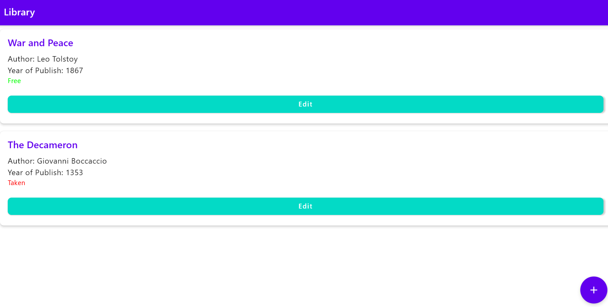
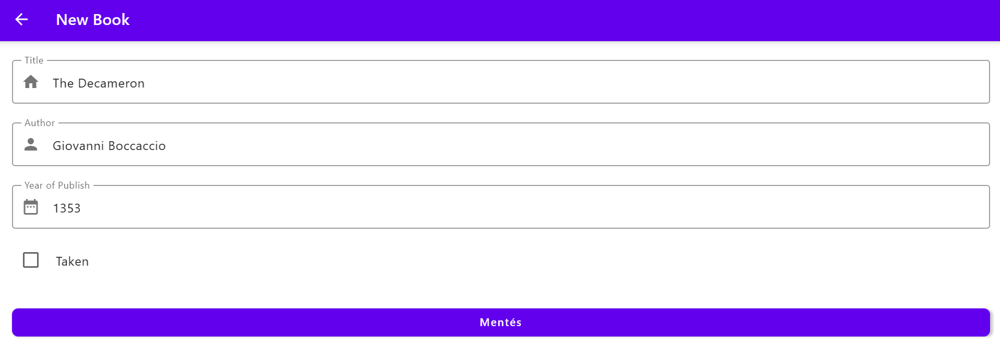

# Labor 2 - Egyszerű felhasználói felület fejlesztése Kotlin Multiplatformon

## Bevezető

A labor során egy egyszerű cross-platform alkalmazást készítünk el Kotlin Multiplatformon. A felhasználói felület teljes egészében megosztott lesz minden támogatott platformon a Compose Multiplatform használatával. A labor egy része vezetett, a hátralévő részben pedig önálló feladatok megoldásával gyakorolhatjuk a cross-platform felhasználói felület fejlesztésének alapjait.


## Előkészületek

A feladatok megoldása során ne felejtsük el követni a [feladat beadás folyamatát](../../tudnivalok/github/GitHub.md).

### Git repository létrehozása és letöltése

1. Moodle-ben keressük meg a laborhoz tartozó meghívó URL-jét és annak segítségével hozzuk létre a saját repositoryt.

2. Várjuk meg, míg elkészül a repository, majd checkout-oljuk ki.

3. Hozzunk létre egy új ágat `megoldas` néven, és ezen az ágon dolgozzunk.

4. A `neptun.txt` fájlba írjuk bele a Neptun kódunkat. A fájlban semmi más ne szerepeljen, csak egyetlen sorban a Neptun kód 6 karaktere.

## A labor kontextusa és kiinduló projekt

A labor során egy könyvek adatait kezelni képes alkalmazást készítünk el desktop, android és iOS platformokra. 

!!!note "Webre miért nem?"
        Kotlin Multiplatformon a webassembly alapú webes platform támogatottsága még alfa verzióban van, mert az még nagyon friss, folyamatosan fejlődő állapotot mutat. Ennek eredményeképp sok, amúgy elterjedt külső könyvtár nem támogatja még annak újszerűsége miatt. Esetünkben a Koin könyvtárat fogjuk használni Dependency Injection-re, amely közvetlenül nem támogatja a webassembly alapú webes platformot. Bár ettől függetlenül megoldható, hogy webes környezetben is használjunk Dependency Injectiont, az egyszerűség kedvéért most nem foglalkozunk vele.

Az alkalmazásban fel tudunk venni új könyveket alapvető adataik megadásával, azokat listaszerűen meg tudjuk jeleníteni, illetve szerkeszteni tudjuk őket. Az alkalmazás a vezetett rész végére a következő(höz hasonló) módon fog kinézni desktop platformon:


<p align="center">

</p>


Az első képernyőn tekinthetjük meg a felvett könyveinket.

<p align="center">

</p>

A második képernyő könyvek felvételéért, illetve meglévő könyvek szerkesztéséért felel.

Az alkalmazásban az MVVM (de még nem MVI) architektúrát fogjuk használni, a ViewModel-ek képernyőkhöz való példányosítását pedig Dependency Injection segítségével oldjuk meg.

A kiinduló projektünket megtaláljuk az elkészült saját repositorynkban, _LibraryManager_ néven. Nyissuk ezt meg a fejlesztőkörnyezetünkben projektként!
Láthatjuk, hogy nem tartalmaz még semmi érdemi kódot, a projekt függőségei viszont konfigurálva vannak benne. Az alapvető függőségeken felül a következőkre lesz szükségünk a laboron, ezeket tartalmazza a kiinduló projekt:

*   org.jetbrains.androidx.navigation:navigation-compose: Az androidx.navigation Jetpack Compose könyvtár Compose Multiplatformra elkészített, a JetBrains által támogatott verziója.
*   org.jetbrains.kotlinx:kotlinx-coroutines-core: A coroutineok cross-platform használatára.
*   org.jetbrains.androidx.lifecycle:lifecycle-viewmodel-compose: Hasonlóan a navigációhoz, a Jetpack Compose lifecycle-aware ViewModel-jének használatára.
*   io.insert-koin:koin-compose és io.insert-koin:koin-core: A Koin dependency injection megfelelő moduljai.

!!!info "Gradle függőségek verziószámai"
		A projekt több olyan függőséget is használ (pl. navigation, lifecycle viewmodel), amelyek nem az elérhető legfrissebb verziót használják. Erre figyelmeztet is warning formájában az Android Studio. Vigyázat: nem minden függőség esetén célszerű mindig a legfrissebb verziót használni, amennyiben az nem stabil, alfa állapotban van, akkor fordítási, vagy akár futási idejű hibákat is okozhat. Például az org.jetbrains.androidx.lifecycle:lifecycle-viewmodel-compose függőség legújabb elérhető, de nem stable release verziója (az útmutató készülésének pillanatában 2.9.0-alpha05) desktop platformon futási hibát okoz.
		
A projektünk tartalmaz továbbá néhánypackaget is, amelyek az alkalmazás különböző részeinek jól elkülönített tárolásáért lesznek felelősek. Nézzük meg ezeket röviden, melyik mit fog tartalmazni:

*   component: Újrahasználható composable elemek.
*   model: Az alkalmazás modell osztályai.
*   navigation: A navigációval kapcsolatos kód.
*   screen: Az alkalmazás Composable képernyői.
*   util: Egyéb segédosztályok és metódusok gyűjteménye, esetünkben egy nevesített konstant fog idekerülni.
*   viewmodel: Az alkalmazás viewmodeljei.


## Az alkalmazás alapjai és navigáció (1 pont)

Készítsük el az említett funkciókkal és felhasználói felülettel az alkalmazást Compose Multiplatform segítségével! A továbbiakban végig a közös kódban, a commonMain source seten belül dolgozzunk.

Kezdjük a navigáció kialakításával! Ehhez célszerű először felvenni a két képernyőnk Composable függvényeit, egyelőre üres tartalommal. Vegyünk fel tehát a _screen_ packagebe egy _BookListScreen.kt_ és egy _BookDetailScreen.kt_ fájlt, bennük a megfelelő Composable függvényekkel. A listázó képernyőnk a navigációhoz szükséges NavController példányt, a részletező képernyő azon felül a szerkesztendő könyv esetleges ID-ját is paraméterként kapja:

```
import androidx.compose.runtime.Composable
import androidx.navigation.NavController

@Composable
fun BookListScreen(navController: NavController) {}
```

```
import androidx.compose.runtime.Composable
import androidx.navigation.NavController

@Composable
fun BookDetailScreen(navController: NavController, bookId: Int?) {}
```

Az alkalmazásunk navigációját egy NavigationGraph formájában adjuk meg. Minden képernyőhöz egy elérési út tartozik, a NavGraph pedig az egyes elérési útakhoz definiálja, milyen composable elemet kell megjelenítenünk, milyen paraméterekkel. Vegyünk fel egy NavGraph.kt fájlt a _navigation_ packagen belül.

Az útvonalak áttekinthető kezeléséért hozzunk létre itt egy-egy azokért felelős segédosztályt:

```
import androidx.compose.runtime.Composable
import androidx.navigation.NavHostController
import androidx.navigation.compose.NavHost
import androidx.navigation.compose.composable
import hu.bme.aut.librarymanager.screen.BookDetailScreen
import hu.bme.aut.librarymanager.screen.BookListScreen

sealed class Screen(val route: String) {
    data object BookList : Screen("booklist")
    data object BookDetails : Screen("bookDetails/{bookId}") {
        fun createRoute(bookId: String) = "bookDetails/$bookId"
    }
}
```
Minden képernyőnkhöz egy útvonal tartozik, a részletező képernyő az útvonal paramétereként a szerkesztendő könyv azonosítóját is átveszi, majd annak felhasználásával képes előállítani a konkrét útvonalat.

Vegyük fel most a NavGraph-unkat is:

```
@Composable
fun NavGraph(navController: NavHostController) {
    NavHost(navController, startDestination = Screen.BookList.route) {
        composable(Screen.BookList.route) { BookListScreen(navController) }
        composable(Screen.BookDetails.route) { backStackEntry ->
            val bookId = backStackEntry.arguments?.getString("bookId") ?: return@composable
            BookDetailScreen(navController, bookId.toInt())
        }
    }
}
```

A NavHost segítségével megadjuk, melyik útvonal esetén melyik képernyőt kell megjelenítenünk. A részletező képernyő esetén az útvonalból a paramétert kiszedjük, majd amennyiben nem null, átadjuk a Composable függvény meghívásakor.

Végezetül nyissuk meg az alkalmazásunk belépési pontjaként szolgáló MainApp.kt fájlt, és vegyük fel az elkészített NavGraph-unkat az App() függvényünkbe:

```
import androidx.compose.material.MaterialTheme
import androidx.compose.runtime.Composable
import androidx.navigation.compose.rememberNavController
import hu.bme.aut.librarymanager.navigation.NavGraph
import org.jetbrains.compose.ui.tooling.preview.Preview

@Composable
@Preview
fun App() {
    MaterialTheme {
        val navController = rememberNavController()
        NavGraph(navController)
    }
}
```

Ehhez a feladathoz nem kell képernyőképet készítenünk, amennyiben elkészültünk, folytassuk a következő résszel!

## MVVM architektúra és dependency injection (1 pont)

A következőkben az MVVM architektúrát fogjuk használni. Az MVVM-ről részletesebben a vonatkozó előadás anyagában (is) tájékozódhatunk.

Az MVVM (Model-View-ViewModel) egy szoftvertervezési architektúra, amelyet elsősorban grafikus felhasználói felületek (GUI) fejlesztésére használnak. Az MVVM célja, hogy elválassza az üzleti logikát a felhasználói felülettől, megkönnyítve ezzel a kód karbantartását, tesztelhetőségét és újrafelhasználhatóságát.

Az MVVM architektúra három fő komponensből áll:

*   Model: Az alkalmazás adatmodellje, amely tartalmazza az üzleti logikát és az adatokat. Ez felelős az adatok kezeléséért és tárolásáért, gyakran egy adatbázisból vagy API-ból nyeri az információkat. Esetünkben ez egy, a könyvek adatait tároló data class lesz.
*   View: A felhasználói interfész (UI), amely a képernyőn megjelenő elemeket és azok elrendezését határozza meg. A View nem tartalmaz üzleti logikát, hanem kizárólag a megjelenítésért felelős műveleteket végzi. Esetünkben a Viewk a Composable Screen függvényeink.
*   ViewModel: A közvetítő réteg a Model és a View között. A ViewModel tartalmazza az alkalmazás logikáját, kezeli az adatok előkészítését és biztosítja a View számára szükséges adatokat, kezeli a View-hoz tartozó állapotot. Általában valamilyen formában adatkötést (data binding) használunk, amely lehetővé teszi, hogy a View automatikusan frissüljön, amikor a ViewModelben lévő adatok megváltoznak.


<p align="center">

</p>

!!!note "ViewModel-ek száma?"
        Felmerülhet a kérdés, hogy egy alkalmazáson belül mennyi ViewModel-re van szükségünk. Alapvetően minden View-hoz külön saját ViewModel tartozik, azonban logikailag összetartozó View-k esetén közös ViewModel használható (most mi is így jártunk el).


Vegyük fel a _viewmodel_ packagebe a BookViewModel osztályunkat!

```
import androidx.lifecycle.ViewModel
import hu.bme.aut.librarymanager.model.Book
import kotlinx.coroutines.flow.MutableStateFlow
import kotlinx.coroutines.flow.StateFlow
import kotlinx.coroutines.flow.asStateFlow

class BookViewModel : ViewModel() {

    private val _books = MutableStateFlow<List<Book>>(emptyList())
    val books: StateFlow<List<Book>> = _books.asStateFlow()

    fun addBook(book: Book) {
        _books.value += book
    }

    fun updateBook(book: Book) {
        _books.value = _books.value.map {
            if (it.id == book.id) book else it
        }
    }
}
```

A ViewModel fogja tárolni a könyvek kezeléséért felelős képernyőkhöz tartozó állapotot, nevezetesen az alkalmazásban lévő könyvek listáját, és biztosít azok módosítására műveleteket. A listát egy nem módosítható StateFlow segítségével teszi származtatottan elérhetővé a Viewk számára, ugyanakkor csak a viewmodelen belül ez a lista módosítható is (private MutableStateFlow).

Használjuk most a Koin-t a ViewModel-ek képernyőkbe való injektálására! A Dependency Injection-ről részletesen a vonatkozó előadás anyagában (is) tájékozódhatunk. A dependency injection (DI) egy tervezési minta, amelynek célja az objektumok közötti függőségek lazább összekapcsolása. Ahelyett, hogy egy osztály maga hozná létre a szükséges függőségeket, ezeket kívülről adják át neki, például egy injektor vagy egy DI konténer segítségével. Az MVVM mintában a dependency injection segít abban, hogy a ViewModel ne legyen szorosan összekapcsolva a Modellel vagy más szolgáltatásokkal, illetve a ViewModel szintén lazán legyen csatolva a hozzá tartozó View-hoz.

A Koin konfigurálásához tartozó kódot kiszervezhetnénk egy külön packagebe is, azonban esetünkben annyira egyszerű, hogy tehetjük a MainApp-ba is:

```
import hu.bme.aut.librarymanager.viewmodel.BookViewModel
import org.koin.core.context.startKoin
import org.koin.dsl.module

val appModule = module {
    single { BookViewModel() }
}
```

Az alkalmazáshoz tartozó koin modulban definiáljuk, hogy a BookViewModel-t Singletonként injektáljuk. Ez azt jelenti, hogy a kód minden olyan helyén, ahol egy BookViewModel példányra van szükség, a Koin automatikusan be fog injektálni egy BookViewModel példányt, és minden ilyen helyen ugyanazt a példányt fogja használni. Esetünkben ez fontos, hiszen ugyanezt a ViewModelt használja mindkét képernyőnk. Amennyiben nem ugyanazt a példányt kapnák meg, az állapotuk nem lenne szinkronizált, ami hibás működéshez vezetne.

Az App függvényünkön belül incializáljuk a Koint a létrehozott modulunkkal:

```
@Composable
@Preview
fun App() {
    startKoin {
        modules(appModule)
    }

    MaterialTheme {
        val navController = rememberNavController()
        NavGraph(navController)
    }
}
```

Végül vegyük fel a képernyőkbe a hozzájuk tartozó ViewModelt, használjuk pl. a Koin _koinInject_ függvényét a konkrét példány injektálására!

```
import org.koin.compose.koinInject
import hu.bme.aut.librarymanager.viewmodel.BookViewModel

@Composable
fun BookDetailScreen(navController: NavController, bookId: Int?) {
    val viewModel: BookViewModel = koinInject() // Retrieve the ViewModel using koinInject()
}
```

```
import org.koin.compose.koinInject
import hu.bme.aut.librarymanager.viewmodel.BookViewModel

@Composable
fun BookListScreen(navController: NavController) {
    val viewModel: BookViewModel = koinInject() // Retrieve the ViewModel using koinInject()
}
```

Ehhez a feladathoz nem kell képernyőképet készítenünk, amennyiben elkészültünk, folytassuk a következő résszel!

## A felhasználói felület elkészítése (1 pont)

A továbbikaban fejezzük be az alkalmazásunkat, készítsük el a 2 képernyőnket!

Vegyük fel a könyvek adatait tároló data classt a _model_ packagebe:
```
data class Book(
    val id: Int,
    val title: String,
    val author: String,
    val year: Int,
    val isAvailable: Boolean
)
```

Készítsük el az egy könyv megjelenítéséért felelős Composable elemünket! Bár esetünkben erre csak a listázó képernyőn lesz szükségünk, ezt célszerű egy külön, később bárhol újrafelhasználható composableként megvalósítanunk, mert később új képernyőkön szükségünk lehet rá.

Hozzunk létre egy BookCard.kt fájlt a _component_ packagen belül az alábbi tartalommal:
```
import androidx.compose.foundation.layout.Column
import androidx.compose.foundation.layout.Spacer
import androidx.compose.foundation.layout.fillMaxWidth
import androidx.compose.foundation.layout.height
import androidx.compose.foundation.layout.padding
import androidx.compose.foundation.shape.RoundedCornerShape
import androidx.compose.material.Button
import androidx.compose.material.ButtonDefaults
import androidx.compose.material.Card
import androidx.compose.material.MaterialTheme
import androidx.compose.material.Text
import androidx.compose.runtime.Composable
import androidx.compose.ui.Modifier
import androidx.compose.ui.graphics.Color
import androidx.compose.ui.unit.dp
import hu.bme.aut.librarymanager.model.Book


@Composable
fun BookCard(book: Book, onEdit: () -> Unit) {
    Card(
        modifier = Modifier
            .fillMaxWidth()
            .padding(8.dp),
        elevation = 4.dp,
        shape = RoundedCornerShape(8.dp)
    ) {
        Column(modifier = Modifier.padding(16.dp)) {
            Text(
                text = book.title,
                style = MaterialTheme.typography.h6,
                color = MaterialTheme.colors.primary
            )
            Spacer(modifier = Modifier.height(8.dp))
            Text(
                text = "Author: ${book.author}",
                style = MaterialTheme.typography.body1
            )
            Text(
                text = "Year of Publish: ${book.year}",
                style = MaterialTheme.typography.body1
            )
            Text(
                text = if (book.isAvailable) "Free" else "Taken",
                style = MaterialTheme.typography.body2,
                color = if (book.isAvailable) Color.Green else Color.Red
            )
            Spacer(modifier = Modifier.height(16.dp))
            Button(
                onClick = onEdit,
                modifier = Modifier.fillMaxWidth(),
                shape = RoundedCornerShape(8.dp),
                colors = ButtonDefaults.buttonColors(backgroundColor = MaterialTheme.colors.secondary)
            ) {
                Text("Edit", color = Color.White)
            }
        }
    }
}

```

A szebb és konvencionálisabb megjelenésért a material megfelelő elemeit használjuk (pl. Card, Button). A composable elemünk átveszi paraméterként a könyvet, amelynek az adatait megjeleníti, illetve egy callback metódust is, amelyet a szerkesztő gomb onClick eseményén használ fel.

!!!note "Szöveges erőforrások kezelése"
        Valós alkalmazásokban soha ne használjunk beégetett stringeket, azokat mindig szöveges erőforrásként kezeljük a projektünkben. Androidhoz hasonlóan Kotlin Multiplatform projektekben is lehetőségünk van erre, bár némivel bonyolultabban kell eljárnunk. Az egyszerűség kedvéért a labor során ezzel nem foglalkozunk, azonban részletesebben pl. itt olvashatunk róla: https://medium.com/@mohaberabi98/localization-in-compose-multiplatform-a53dccf49327
		
		A követendő lépések nagyvonalakban:
		
		1. Platform-specifikus erőforrások beállítása (android, iOS)
		2. Lokalizált sztring erőforrások használata a közös kódban
		3. Lokalizáció platform-specifikus kezelése
		

Mielőtt megvalósítjuk a Screeneket, hozzunk létre a _util_ packageben egy Constants.kt fájlt, benne egyetlen konstanssal:
```
const val NEW_BOOK_ID = -1
```

Ezt arra fogjuk használni, hogy a részletező képernyő meg tudja különböztetni, hogy éppen új könyv felvételét, vagy meglévő módosítását kell végrehajtania. Amennyiben a NEW_BOOK_ID konstanstól különböző ID-t kap, akkor meglévő könyv szerkesztéséről van szó, egyéb esetben pedig új könyvet kell fevennünk.

Valósítsuk most meg a képernyőinket is. Kezdjük a listázó képernyővel:

```
import androidx.compose.foundation.layout.padding
import androidx.compose.foundation.lazy.LazyColumn
import androidx.compose.foundation.lazy.items
import androidx.compose.material.FloatingActionButton
import androidx.compose.material.Icon
import androidx.compose.material.MaterialTheme
import androidx.compose.material.Scaffold
import androidx.compose.material.Text
import androidx.compose.material.TopAppBar
import androidx.compose.material.icons.Icons
import androidx.compose.material.icons.filled.Add
import androidx.compose.runtime.Composable
import androidx.compose.runtime.collectAsState
import androidx.compose.runtime.getValue
import androidx.compose.ui.Modifier
import androidx.compose.ui.graphics.Color
import androidx.navigation.NavController
import hu.bme.aut.librarymanager.component.BookCard
import hu.bme.aut.librarymanager.navigation.Screen
import hu.bme.aut.librarymanager.util.NEW_BOOK_ID
import hu.bme.aut.librarymanager.viewmodel.BookViewModel
import org.koin.compose.koinInject

@Composable
fun BookListScreen(navController: NavController) {
    val viewModel: BookViewModel = koinInject()
    val books by viewModel.books.collectAsState()

    Scaffold(
        topBar = { TopAppBar(title = { Text("Library") }) },
        floatingActionButton = {
            FloatingActionButton(
                onClick = { navController.navigate(Screen.BookDetails.createRoute(NEW_BOOK_ID.toString())) },
                backgroundColor = MaterialTheme.colors.primary
            ) {
                Icon(Icons.Default.Add, contentDescription = "Add Book", tint = Color.White)
            }
        }
    ) { padding ->
        LazyColumn(modifier = Modifier.padding(padding)) {
            items(books) { book ->
                BookCard(book, onEdit = { navController.navigate(Screen.BookDetails.createRoute(book.id.toString())) })
            }
        }
    }
}
```

Figyeljük meg a következőket:

*   A Scaffold topBar-jával jelenítjük meg a képernyő tetején az alkalmazás TopAppBar-ját.
*   A könyvek listáját kompozíciókor a ViewModel-től kérjük el, a _collectAsState_ segítségével megfigyeljük a StateFlow változásait, így automatikusan értesülünk róla, ha megváltozik a könyvlista.
*   Új könyv felvételéhez egy FloatingActionButton-t használunk, amelynek onClick eseményében a navController segítségével navigálunk a részletező képernyőre, a korábban felvett konstanst átadva paraméterként. Ezzel jelezzük a részletező képernyőnek, hogy új könyv hozzáadásáról van szó.
*   LazyColumn segítségével jelenítjük meg a könyvek listáját, ahol felhasználjuk az előbb elkészített BookCard Composable elemünket.

Implementáljuk végül a részletező képernyőt:

```
import androidx.compose.foundation.layout.Arrangement
import androidx.compose.foundation.layout.Column
import androidx.compose.foundation.layout.Row
import androidx.compose.foundation.layout.fillMaxSize
import androidx.compose.foundation.layout.fillMaxWidth
import androidx.compose.foundation.layout.padding
import androidx.compose.foundation.shape.RoundedCornerShape
import androidx.compose.material.Button
import androidx.compose.material.ButtonDefaults
import androidx.compose.material.Checkbox
import androidx.compose.material.Icon
import androidx.compose.material.IconButton
import androidx.compose.material.MaterialTheme
import androidx.compose.material.OutlinedTextField
import androidx.compose.material.Scaffold
import androidx.compose.material.Text
import androidx.compose.material.TopAppBar
import androidx.compose.material.icons.Icons
import androidx.compose.material.icons.automirrored.filled.ArrowBack
import androidx.compose.material.icons.filled.DateRange
import androidx.compose.material.icons.filled.Home
import androidx.compose.material.icons.filled.Person
import androidx.compose.runtime.Composable
import androidx.compose.runtime.LaunchedEffect
import androidx.compose.runtime.mutableStateOf
import androidx.compose.runtime.remember
import androidx.compose.ui.Alignment
import androidx.compose.ui.Modifier
import androidx.compose.ui.graphics.Color
import androidx.compose.ui.unit.dp
import androidx.navigation.NavController
import hu.bme.aut.librarymanager.model.Book
import hu.bme.aut.librarymanager.util.NEW_BOOK_ID
import hu.bme.aut.librarymanager.viewmodel.BookViewModel
import org.koin.compose.koinInject

@Composable
fun BookDetailScreen(navController: NavController, bookId: Int?) {
    val viewModel: BookViewModel = koinInject() // Retrieve the ViewModel using koinInject()
    val book = remember { mutableStateOf(Book(0, "", "", 0, true)) }

    if (bookId != null && bookId != NEW_BOOK_ID) {
        LaunchedEffect(bookId) {
            viewModel.books.value.find { it.id == bookId }?.let {
                book.value = it
            }
        }
    }

    Scaffold(
        topBar = {
            TopAppBar(
                title = { Text(if (bookId == -1) "New Book" else "Edit Book") },
                navigationIcon = {
                    IconButton(onClick = { navController.popBackStack() }) {
                        Icon(Icons.AutoMirrored.Filled.ArrowBack, contentDescription = "Back")
                    }
                }
            )
        }
    ) { padding ->
        Column(
            modifier = Modifier
                .padding(padding)
                .fillMaxSize()
                .padding(16.dp),
            verticalArrangement = Arrangement.spacedBy(16.dp)
        ) {
            // Title Field
            OutlinedTextField(
                value = book.value.title,
                onValueChange = { book.value = book.value.copy(title = it) },
                label = { Text("Title") },
                modifier = Modifier.fillMaxWidth(),
                singleLine = true,
                leadingIcon = { Icon(Icons.Default.Home, contentDescription = "Title") }
            )

            // Author Field
            OutlinedTextField(
                value = book.value.author,
                onValueChange = { book.value = book.value.copy(author = it) },
                label = { Text("Author") },
                modifier = Modifier.fillMaxWidth(),
                singleLine = true,
                leadingIcon = { Icon(Icons.Default.Person, contentDescription = "Author") }
            )

            // Year Field
            OutlinedTextField(
                value = book.value.year.toString(),
                onValueChange = { book.value = book.value.copy(year = it.toIntOrNull() ?: 0) },
                label = { Text("Year of Publish") },
                modifier = Modifier.fillMaxWidth(),
                singleLine = true,
                leadingIcon = { Icon(Icons.Default.DateRange, contentDescription = "Year") }
            )

            // Availability Checkbox
            Row(
                modifier = Modifier.fillMaxWidth(),
                verticalAlignment = Alignment.CenterVertically
            ) {
                Checkbox(
                    checked = book.value.isAvailable,
                    onCheckedChange = { book.value = book.value.copy(isAvailable = it) },
                    modifier = Modifier.padding(end = 8.dp)
                )
                Text(
                    text = if (book.value.isAvailable) "Free" else "Taken",
                    style = MaterialTheme.typography.body1
                )
            }

            // Save Button
            Button(
                onClick = {
                    if (bookId == NEW_BOOK_ID) {
                        viewModel.addBook(book.value.copy(id = viewModel.books.value.size + 1))
                    } else {
                        viewModel.updateBook(book.value)
                    }
                    navController.popBackStack()
                },
                modifier = Modifier
                    .fillMaxWidth()
                    .padding(top = 16.dp),
                shape = RoundedCornerShape(8.dp),
                colors = ButtonDefaults.buttonColors(backgroundColor = MaterialTheme.colors.primary)
            ) {
                Text(
                    text = "Save",
                    style = MaterialTheme.typography.button,
                    color = Color.White
                )
            }
        }
    }
}
```

Figyeljük meg a következőket:

*   A képernyőhöz tartozó, éppen szerkesztendő / létrehozott könyv adatait a Compose _remember_ mechanizmusa segítségével jegyezzük meg rekompozíció esetén.
*   Amennyiben a kapott könyv azonosító létező könyvhöz tartozik (nem null és nem -1), LaunchedEffect használatával inicializáljuk a szerkesztendő könyvet, ahol a ViewModel-től kérjük le a megadott azonosítóhoz tartozó könyv adatait.
*   A Scaffold topBar-jára elhelyezünk egy visszafelé vezető gombot (nyilat) is, amely megnyomása esetén a navController _popBackStack_ metódusát használva térhetünk vissza arra a képernyőre, amiről a részletező képernyőre navigáltunk.
*   A mentés gombra kattintva megvizsgáljuk, hogy szerkesztés módban voltunk-e, vagy új könyvet vettünk fel, és ennek megfelelően hívjuk meg a ViewModel megfelelő metódusát a könyv módosítására vagy új könyv felvételére.

Ezzel elkészültünk, futtassuk az alkalmazást! Nézzük meg és próbáljuk ki Android és Desktop (és iOS, ha lehetőségünk engedi) platformon is!


!!!example "BEADANDÓ (1 pont)"
	Készítsünk egy **képernyőképet**, amelyen a listázó nézet látszik tetszőleges platformon, rajta legalább 2 felvett könyvvel! Az egyik könyv címe legyen a Neptun kódunk. A kép a megoldásban a repositoryban f3_1.png néven szerepeljen! 
	
	Készítsünk egy **képernyőképet**, amelyen a részletező képernyő látszik tetszőleges platformon és minden beviteli vezérlő ki van töltve valamilyen értékkel! A címhez tartozó mező értéke legyen a Neptun kódunk.  A kép a megoldásban a repositoryban f3_2.png néven szerepeljen! 


## További feladatok

A következőkben önállóan dolgozunk. Minden felsorolt feladat 1 pontot ér, tehát nem szükséges az összes feladatot megoldani 4-es vagy 5-ös érdemjegyért. Szándékosan több feladat szerepel annak érdekében, hogy gyakorlási lehetőséget biztosítson és bemutasson több olyan elemet is, amely a laboron eddig nem szerepelt.

### Keresési funkció (1 pont)

Valósítsunk meg keresési funkciót (tartalmazott kifejezés, nem pontos egyezés) a listázó képernyőn! Bővítsük ki a könyvlistát egy keresőmezővel a képernyő tetején a lista előtt, ami alapján szűrhető a könyvek listája cím vagy szerző alapján. Azt, hogy mi alapján keresünk, szintén a felhasználó adhassa meg egy alkalmas vezérlő használatával (pl. DropDownMenu, MultiChoiceButtonRow)!

??? tip "Segítség"
    A megoldás menete a következő:
	
	1. A BookListScreen-hez adjunk hozzá pl. egy OutlinedTextField-et!
	2. A keresés fajtájának kiválasztásához használhatunk pl. ExposedDropDownMenuBox-ot, vagy MultiChoiceSegmentedButtonRow-t! Ezek használatához a material3-at meg kell adnunk függőségként a Gradle konfigurációs fájlunkban.
	3. A BookViewModel-ben vegyünk fel egy searchQuery-t (mi legyen a típusa?).
	4. A books listát szűrjük a searchQuery alapján!
	
	
!!!example "BEADANDÓ (1 pont)"
	Készítsünk egy **képernyőképet**, amelyen látszik a keresőmező és a keresés fajtáját kiválasztó vezérlő! A könyvlistában pontosan azok a könyvek jelenjenek meg, amelyek teljesítik a keresési feltételt, és legyen legalább 1 ilyen! A kép a megoldásban a repositoryban f4.png néven szerepeljen! 

### Kedvencek kezelése (1 pont)

Bővítsük ki a könyveket egy "kedvenc" funkcióval, és hozzunk létre egy külön képernyőt a kedvencek megjelenítéséhez! A könyveket lehessen kedvenc-nek jelölni, a listázó nézetről legyen lehetőség átnavigálni a kedvenceket megjelenítő képernyőre, ahol listázva láthatjuk őket! A kedvencnek jelöléshez és a navigáláshoz is tetszőleges UI megoldás elfogadható, tetszőleges vezérlőket használhatunk.

??? tip "Segítség"
    A megoldás menete a következő:
	
	1. Bővítsük ki a Book adatmodellünket egy isFavorite: Boolean mezővel.
	2. A ViewModel-ben implementáljuk a kedvenc állapot váltását és a kedvencnek jelölt könyvek lekérdezését!
	3. Vegyük fel a megfelelő UI elemeket a listázó képernyőnkre (pl. csillag ikon a könyvön, ami színt vált ha megnyomják, kedvencekre navigáló gomb a képernyő alján stb).
	4. Készítsünk egy új képernyőt, ami mindig pontosan a kedvencnek jelölt könyveket mutatja! Itt felhasználhatjuk a korábban készített BookCard Composable elemünket.
	5. Bővítsük ki a navigációt, hogy a kedvencek képernyőre megfelelően navigálhassunk a listázó képernyőről!
	
	
!!!example "BEADANDÓ (1 pont)"

	Készítsünk egy **képernyőképet**, amelyen látszik a listázó nézeten legalább 2 könyv, amely közül az egyik kedvencnek van jelölve, a másik pedig nem! A kép a megoldásban a repositoryban f5_1.png néven szerepeljen! 

	Készítsünk egy **képernyőképet**, amelyen látszik a kedvencek képernyő, ahol pontosan a kedvencnek jelölt könyvek vannak megjelenítve! A kép a megoldásban a repositoryban f5_2.png néven szerepeljen! 

### Drawer alapú navigáció használata (1 pont)

Valsítsunk meg Drawer alapú navigációt az alkalmazásban! Ahhoz, hogy a feladatnak értelme legyen, ehhez legalább 2 navigálható képernyőre lesz szükségünk (a részletező képernyőt nyilván nem tudjuk használni). Amennyiben másik önálló feladatból van már új képernyőnk, használhatjuk azt. Amennyiben nincs, hozzunk létre egy új képernyőt, ami lehet akár teljesen üres is.

??? tip "Segítség"
    A megoldás menete a következő:
	
	1. Használjuk pl. a ModalNavigationDrawer-t!  Ennek használatához a material3-at meg kell adnunk függőségként a Gradle konfigurációs fájlunkban.
	2. Helyezzük el a NavigationDrawer-t a MainApp-ban! 
	3. Töltsük ki a szükséges tulajdonságait, mint pl. drawerContent, drawerState!
	4. A Drawer elemeinek onClick eseményén használjuk továbbra is a navControllerünket a megfelelő navigáció megvalósításához! Amennyiben új üres képernyőt vettünk fel, bővítsük a navigációt is, hogy az új képernyőnek is legyen megfelelő útvonala!
	
	
!!!example "BEADANDÓ (1 pont)"	
	Készítsünk egy **képernyőképet**, amelyen látszik a kinyitott NavigationDrawer, rajta a képernyőkhöz tartozó bejegyzésekkel! A kép a megoldásban a repositoryban f6.png néven szerepeljen! 

### Swipe-to-dismiss törlés (1 pont)

Oldjuk meg, hogy könyveken való Swipeolással (oldalra tetszőlegesen választott irányban) lehessen törölni az adott könyvet a listából a listanézet képernyőn!

??? tip "Segítség"
    A megoldás menete a következő:
	
	1. Módosítsuk a BookItem Composablet, csomagoljuk be egy SwipeToDismiss Composable-be!
	2. Vegyünk át a BookItem-ben egy callback metódust paraméterként, hívjuk meg ezt, ha Swipe történt!
	3. Módosítsuk a BookViewModel-t, hogy lehessen könyvet törölni is!
	4. A BookCard Composable használatakor a listázó képernyőn paraméterként a Swipe-on hívott callback metódusnak adjunk át egy lambda kifejezést, amely meghívja a ViewModel megfelelő törlő metódusát!
	
	
!!!example "BEADANDÓ (1 pont)"
	A feladathoz nem kell képernyőképet készítenünk, azonban amennyiben megoldottuk, mellékeljük a pullrequestben a kiinduló repositoryban szereplő f7.png üres képet.
	
### Staggered Grid használata (1 pont)

Jelenítsük meg a könyveket a listázó képernyőn Pinterest-szerű, eltérő magasságú kártyákkal, 2 oszlopban! Amennyiben egy könyvnek a címe legalább 20 karakter hosszú, akkor a könyvhöz tartozó Card magassága legyen 50%-al nagyobb, mint a 20-nál kevesebb karaktert tartalmazó című könyveknek!

??? tip "Segítség"
    A megoldás menete a következő:
	
	1. LazyColumn helyett használjunk LazyVerticalStaggeredGrid-et! Az oszlopok számát állítsuk fix 2-re!
	2. A BookCard-ok magassága (Modifier.height) függjön a könyv címének hosszától! Használhatunk fix dp értékeket (pl. 150.dp és 100.dp).
	
	
!!!example "BEADANDÓ (1 pont)"
	Készítsünk egy **képernyőképet**, amelyen látszik listázó nézeten a 2 oszlopos, eltérő magasságú megjelenítés! A kép a megoldásban a repositoryban f8.png néven szerepeljen! 


