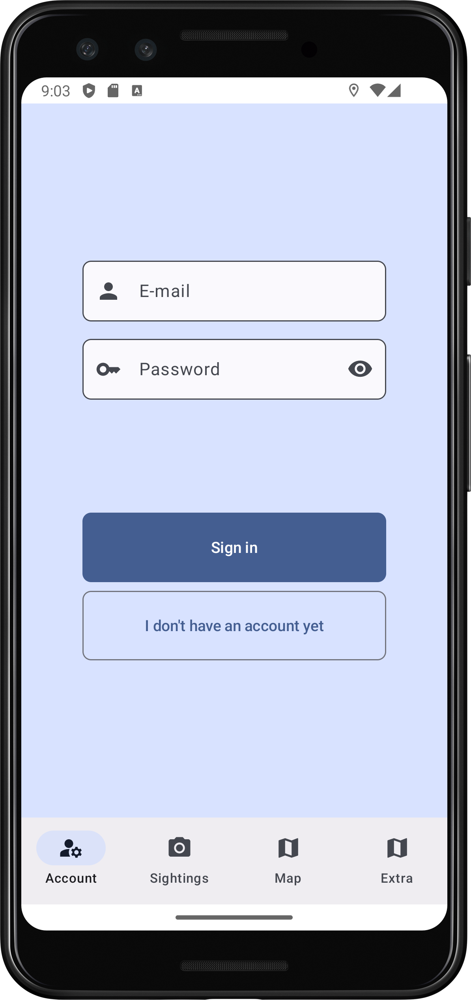
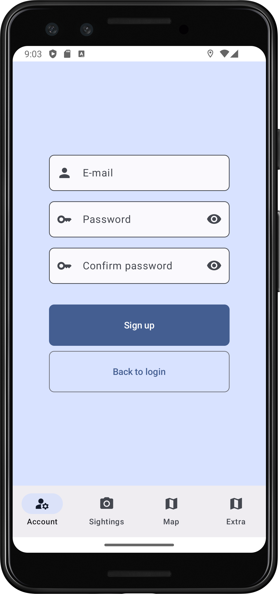
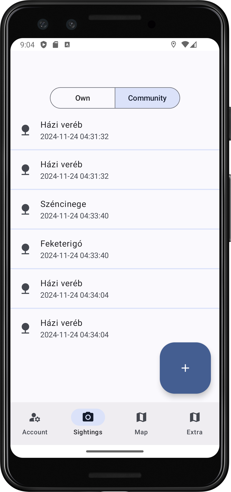
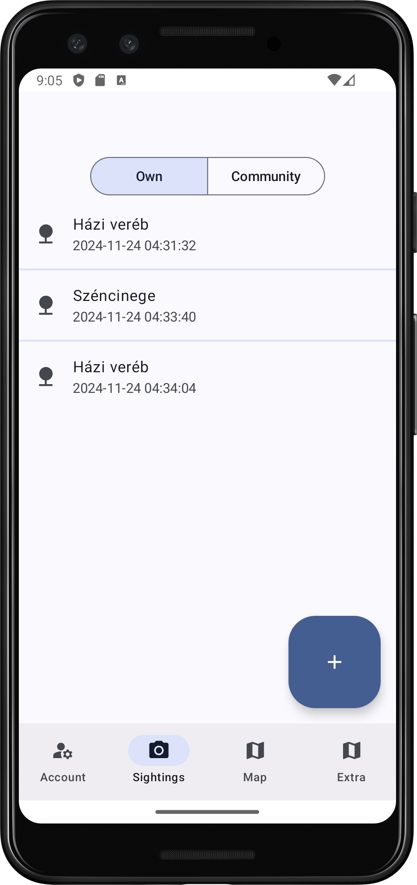
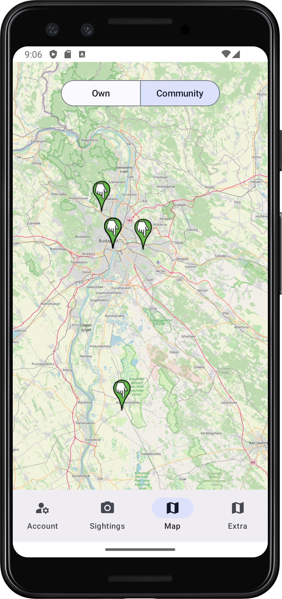
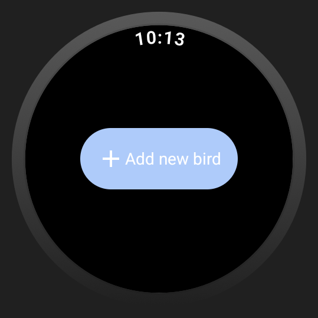
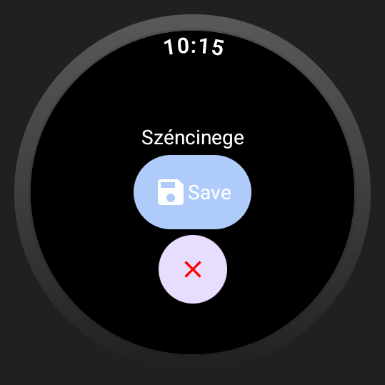

# Labor 4 - Maps & Wear - TODO

## Bevezető

A labor során egy madár megfigyelő alkalmazást fogunk készíteni. 

Az alkalmazás az elmentett bejegyzéseket Firebase adatbázisban tárolja, illetve térképen is képes megjeleníteni több formában is. A megfigyelések hozzáadására nem csak a telefonos alkalmazásból, hanem okosóráról is lehetőség van szöveges és hang formában is. Az alkalmazás a Clean Architecture elveit követi.

!!!info "REST"
    REST = [Representational State Transfer](https://en.wikipedia.org/wiki/Representational_state_transfer)

Felhasznált technológiák: 

- [`Firebase Authentication`](https://firebase.google.com/docs/auth)
- [`Firebase CloudFirestore`](https://firebase.google.com/docs/firestore)
- [`Hilt`](https://developer.android.com/training/dependency-injection/hilt-android)
- [`OpenStreetMap - OSMDroid`](https://github.com/osmdroid/osmdroid)
- [`Accompanist`](https://github.com/google/accompanist)
- [`Fused Location Provider`](https://developer.android.com/develop/sensors-and-location/location/retrieve-current)
- [`WearOS`](https://developer.android.com/wear)
- [`Wear IME`](https://developer.android.com/training/wearables/user-input/wear-ime)
- [`Data Layer API`](https://developer.android.com/training/wearables/data/overview)
- [`Maps SDK for Android Utility Library`](https://developers.google.com/maps/documentation/android-sdk/utility)
- [Secrets Gradle Plugin](https://developers.google.com/maps/documentation/places/android-sdk/secrets-gradle-plugin)


<p align="center">




</p>
<p align="center">



</p>
<p align="center">


</p>


## Laborfeladatok

A labor során az alábbi feladatokat kell megvalósítani:

1. Pozíciómeghatározás megvalósítása: 1 pont
1. Térképes nézet megvalósítása: 2 pont
1. Wear alkalmazás megvalósítása: 2 pont
1. Extra: Google maps funkciók megvalósítása


## Előkészületek

A feladatok megoldása során ne felejtsd el követni a [feladat beadás folyamatát](../../tudnivalok/github/GitHub.md).


### Git repository létrehozása és letöltése

1. Moodle-ben keresd meg a laborhoz tartozó meghívó URL-jét és annak segítségével hozd létre a saját repository-dat.

2. Várd meg, míg elkészül a repository, majd checkout-old ki.

    !!! tip ""
        Egyetemi laborokban, ha a checkout során nem kér a rendszer felhasználónevet és jelszót, és nem sikerül a checkout, akkor valószínűleg a gépen korábban megjegyzett felhasználónévvel próbálkozott a rendszer. Először töröld ki a mentett belépési adatokat (lásd [itt](../../tudnivalok/github/GitHub-credentials.md)), és próbáld újra.

3. Hozz létre egy új ágat `megoldas` néven, és ezen az ágon dolgozz.

4. A `neptun.txt` fájlba írd bele a Neptun kódodat. A fájlban semmi más ne szerepeljen, csak egyetlen sorban a Neptun kód 6 karaktere.

5. Indítsuk el az Android Studio-t, majd nyissuk meg a projektet.

6. Ellenőrízzük, hogy a létrejött projekt lefordul és helyesen működik!

### A projekt áttekintése

A kezdő projektben az egyszerűség kedvéért már megtalálhatók a *Firebase* -hez szükséges függőségek is, hogy a projekt rögtön fordítható legyen. 

Az alkalmazás küveti a *Clean Architecture* irányelveit, ami alapján a *viewModel* lekbe a *useCase*-ek vannak injektálja, amik majd szintén *dependency injectiont* használva továbbítják a kérést a *repositoryknak*.

Az alkalmazás jelenlegi verziójában megtalálható egy bejelentkező valamint egy regisztrációs képernyő, illetve egy megfigyeléseket megjelenítő lista. Az új bejegyzés felvétele gomb hatására még nem történik semmi, hiszen az alkalmazásunk nincs összekötve a *Firestore* adatbázissal.

A navigáció egy alsó *Navigation Bar*-ral történik.

!!!warning "Áttekintés"
	Már a kezdő projekt is igen sokmindent tartalmaz, és igen komplex architektúrával bír. Szánjunk pár percet a teljes áttekintésére és megértésére, hogy a labor során elkészítendő új funkciók helyét és mikéntjét könnyebben feldolgozzuk!


## Az alkalmazás összekötése a Firebase-szel

Először is hozzunk létre egy projektet a [Firebase Console](https://console.firebase.google.com/)-on, és kössük azt össze az alkalmazásunkkal. A labor során az *authentikáció* és a *Firestore Database* funkciókat fogjuk használni. (A folyamatot részletesen lásd a [Firebase](https://viauav21.github.io/laborok/laborok/firebase/) laborban. A jelenlegi projekt tartalmaz egy *dummy* google-services.json fájlt a hibamentes futás érdekében, ezt eltávolítva a folyamat nulláról újrakezdhető.)

Az összekapcsolás után a regisztrációnak, a bejelentkezésnek és az új tétel felvételének is működnie kell.


## Pozíciómeghatározás ( 1 pont)

Az újonnan felvett madaraink egyelőre 0,0 koordinátával kerülnek be az adatbázisba. Ahhoz, hogy a saját helyzetünket adjuk hozzá a megfigyeléshez, használnunk kell a telefon pozíciómeghatározását.

### Engedélykezelés

Ehhez először is vegyük fel a szükséges (`ACCESS_FINE_LOCATION`, `ACCESS_COARSE_LOCATION`) engedélyeket a `Manifest`be.

Mivel ezek veszélyes engedélyek, futásidőben is kezelnünk kell őket. Ehhez az [`Accompanist`](https://github.com/google/accompanist) könyvtárat fogjuk használni. A referenciák már szerepelnek a `libs.versions.toml` fájlban, így csak a `build.gradle.kts`-be kell felvennünk a függőséget:

```gradle
    //Accompanist
    implementation (libs.accompanist.permissions)
```

A könyvtár segítségével a `util` *package*-ben készísünk el egy `PermissionUtils.kt` osztályt, ami az engedélyek szövegezésében fog segíteni:

```kotlin
package hu.bme.aut.android.birdwatchingapp.util

import android.content.Context
import com.google.accompanist.permissions.ExperimentalPermissionsApi
import com.google.accompanist.permissions.PermissionState
import hu.bme.aut.android.birdwatchingapp.R

object PermissionsUtil {
    @ExperimentalPermissionsApi
    fun getTextToShowGivenPermissions(
        permissions: List<PermissionState>,
        shouldShowRationale: Boolean,
        context: Context
    ): String {
        val revokedPermissionsSize = permissions.size
        if (revokedPermissionsSize == 0) return ""
        val textToShow = StringBuilder()

        with(context) {
            textToShow.apply {
                append(getString(R.string.permission_grant_ask_beginning))
            }

            for (i in permissions.indices) {
                val permission = permissions[i].permission
                    .replace(Regex("[a-z]|[.]"), "")
                textToShow.append(" $permission")
                when {
                    revokedPermissionsSize > 1 && i == revokedPermissionsSize - 2 -> {
                        textToShow.append(getString(R.string.permission_grant_ask_separator_before_last_permission))
                    }
                    else -> {
                        textToShow.append(getString(R.string.permission_grant_ask_separator))
                    }
                }
            }
            textToShow.append(
                if (revokedPermissionsSize == 1) {
                    getString(R.string.permission_grant_ask_singular_permission)
                } else getString(R.string.permission_grant_ask_multiple_permissions)
            )
            textToShow.append(
                if (shouldShowRationale) {
                    getString(R.string.permission_grant_ask_rationale)
                } else {
                    getString(R.string.permission_grant_ask_denied)
                }
            )
        }

        return textToShow.toString()
    }
}
```

A pozícióhemhatározást akkor fogjuk megkezdeni, amikor a felhasználó a *Floating Action Buttonre* kattint, tehát a `BirdScreen`en van szükségünk az engedélykezelésre. Vegyük föl a szükséges engedélyeket egy listába, majd pedig tegyük bele egy `MultiplePermissionsState` állapotba. Ha ez az állapot megfelelő, akkor megkezdjük a pozíciómeghatározást és megjelenítjük a dialógust, ha nem, akkor elkérjük az engedélyt.

```kotlin
if (state.isDialogOpen) {
    val locationPermissions = rememberMultiplePermissionsState(
        permissions = listOf(
            android.Manifest.permission.ACCESS_COARSE_LOCATION,
            android.Manifest.permission.ACCESS_FINE_LOCATION
        )
    )
    if (locationPermissions.allPermissionsGranted) {
        viewModel.onEvent(SightingsEvent.StartLocationMonitoring)

        StringInputDialog(
            title = stringResource(id = R.string.label_new_sighting),
            label = stringResource(id = R.string.label_bird_name),
            onDismiss = { viewModel.onEvent(SightingsEvent.CancelButtonClicked) },
            onConfirm = {
                viewModel.onEvent(SightingsEvent.NewBirdNameChanged(it))
                viewModel.onEvent(SightingsEvent.SaveButtonClicked)
            }

        )
    } else {
        AlertDialog(
            onDismissRequest = { viewModel.onEvent(SightingsEvent.CancelButtonClicked) },
            confirmButton = {
                Button(
                    onClick = { locationPermissions.launchMultiplePermissionRequest() },
                    shape = RoundedCornerShape(8.dp)
                ) {
                    Text(stringResource(id = R.string.button_label_request_permission))
                }
            },
            text = {
                Text(
                    getTextToShowGivenPermissions(
                        locationPermissions.revokedPermissions,
                        locationPermissions.shouldShowRationale,
                        context
                    )
                )
            }
        )
    }
}
```

Ezek után vegyük föl a hiányzó `StartLocationMonitoring`eseményt a `SightingsEvent` osztályba, és kezeljük is le az eseményt az `onEvent` függvényben:

```kotlin
is SightingsEvent.StartLocationMonitoring -> {
    ///TODO start location monitoring
}
```

### Fused Location Provider

Először vegyük föl a pozíciómeghatározást tartalmazó függőséget.A referenciák már szerepelnek a `libs.versions.toml` fájlban, így csak a `build.gradle.kts`-be kell felvennünk a függőséget:

```gradle
    //Location
    implementation(libs.play.services.location)
```

Ezek után már elkészíthetjük a szükséges osztályokat a *repository* rétegben egy `location` *package*-ben. Először egy *interface*-t készítünk:

`ILocationService.kt`:

```kotlin
package hu.bme.aut.android.birdwatchingapp.data.location

import com.google.android.gms.maps.model.LatLng
import kotlinx.coroutines.flow.Flow

interface ILocationService {

    fun requestLocationUpdates(): Flow<LatLng?>

    fun requestCurrentLocation(): Flow<LatLng?>
}
```

Majd pedig azt a megvalósítást, ami a `FusedLocationProviderClient` segítségével egy `callbackFlow`-ban visszaadja nekünk az aktuális pozíciót:

`LocationService.kt`:

```
package hu.bme.aut.android.birdwatchingapp.data.location

import android.Manifest
import android.content.Context
import android.content.pm.PackageManager
import android.os.Build
import android.os.Looper
import android.util.Log
import androidx.annotation.RequiresApi
import androidx.core.content.ContextCompat
import com.google.android.gms.location.FusedLocationProviderClient
import com.google.android.gms.location.LocationCallback
import com.google.android.gms.location.LocationRequest
import com.google.android.gms.location.LocationResult
import com.google.android.gms.location.Priority
import com.google.android.gms.maps.model.LatLng
import kotlinx.coroutines.channels.awaitClose
import kotlinx.coroutines.flow.Flow
import kotlinx.coroutines.flow.callbackFlow
import javax.inject.Inject

class LocationService @Inject constructor(
    private val context: Context,
    private val locationClient: FusedLocationProviderClient
): ILocationService {

    @RequiresApi(Build.VERSION_CODES.S)
    override fun requestLocationUpdates(): Flow<LatLng?> = callbackFlow {

        if (ContextCompat.checkSelfPermission(
                context,
                Manifest.permission.ACCESS_FINE_LOCATION
            ) != PackageManager.PERMISSION_GRANTED && ContextCompat.checkSelfPermission(
                context,
                Manifest.permission.ACCESS_COARSE_LOCATION
            ) != PackageManager.PERMISSION_GRANTED) {
            trySend(null)
            return@callbackFlow
        }

        val request = LocationRequest.Builder(10000L)
            .setIntervalMillis(10000L)
            .setPriority(Priority.PRIORITY_HIGH_ACCURACY)
            .build()

        val locationCallback = object : LocationCallback() {
            override fun onLocationResult(locationResult: LocationResult) {
                locationResult.locations.lastOrNull()?.let {
                    trySend(LatLng(it.latitude, it.longitude))
                    Log.i("locationExample", "onLocationResult: $it")
                }
            }
        }

        locationClient.requestLocationUpdates(
            request,
            locationCallback,
            Looper.getMainLooper()
        )

        awaitClose {
            locationClient.removeLocationUpdates(locationCallback)
        }
    }

    override fun requestCurrentLocation(): Flow<LatLng?> {
        TODO("Not yet implemented")
    }

}
```

A `LocationService`-nek szüksége van a `FusedLocationProviderClient` injektálására. Készítsünk erre egy DI modult:

```kotlin
package hu.bme.aut.android.birdwatchingapp.domain.di

import android.content.Context
import com.google.android.gms.location.FusedLocationProviderClient
import com.google.android.gms.location.LocationServices
import dagger.Module
import dagger.Provides
import dagger.hilt.InstallIn
import dagger.hilt.android.qualifiers.ApplicationContext
import dagger.hilt.components.SingletonComponent
import hu.bme.aut.android.birdwatchingapp.data.location.ILocationService
import hu.bme.aut.android.birdwatchingapp.data.location.LocationService
import javax.inject.Singleton

@Module
@InstallIn(SingletonComponent::class)
object LocationModule {

    @Singleton
    @Provides
    fun provideLocationService(
        @ApplicationContext context: Context
    ): ILocationService = LocationService(
        context,
        LocationServices.getFusedLocationProviderClient(context)
    )

    @Singleton
    @Provides
    fun provideFusedLocationProviderClient(
        @ApplicationContext context: Context
    ): FusedLocationProviderClient =
        LocationServices.getFusedLocationProviderClient(context)
}
```

Ezek után illesszük be az architektúrába az új funkciót először a `RequestLocationUpdatesUseCase` majd a `RequestLocationUpdateUseCaseModule` megvalósításával.

Ha ezzel megvagyunk, már használhatjuk is a pozíciómeghatározásunkat. A `BirdsViewModel` konstruktorába injektáljuk be a `RequestLocationUpdatesUseCase`-t és írjuk meg a pozíciómeghatározásért felelős függvényünket:

```kotlin
private fun onStartLocationMonitoring() {
    if (state.value.currentLocation == null)
        viewModelScope.launch {
            locationUseCase().collectLatest { pos ->
                _state.update { it.copy(currentLocation = pos) }
            }
        }
}
```

Majd az `onEvent` függvényben hívjuk is ezt meg.

Próbáljuk ki az alkalmazást!

Most már a *Floating Action Button* megnyomására megkapjuk az engedélykérést, majd ezen továbblépve ha felvesszük az új bejegyzést, ahhoz már pozíció adat is társul.

!!!example "BEADANDÓ (1 pont)"
	Készíts egy **képernyőképet**, amelyen látszik a **Firestore-ba bevitt adat, amelynek a neve a NEPTUN kódod**, valamint egy **pozíciómeghatározáshoz használt kódrészlet**! A képet a megoldásban a repository-ba f1.png néven töltsd föl!

	A képernyőkép szükséges feltétele a pontszám megszerzésének.

## Térkép megvalósítása (2 pont)

Most, hogy már el tudjuk menteni a pozíciót is a megfigyeléseinkhez, célszerű lenne a megjelenítésüket is megoldani. Hozzunk létre ehhez egy térkép nézetet `OSMapScreen` néven, majd a hozzá tartozó *viewModelt* is `OSMapViewModel` néven a `feature.osm` *package*-ben.

Illesszük be az új felületet a navigációba! (Screen osztály kiegészítése, NavGraph kiegészítése, BottomNavigationItems kiegészítése)

A térképes nézetet [Google Maps](https://developers.google.com/maps/documentation/android-sdk/overview) helyett, [OpenStreetMap](https://www.openstreetmap.org/)pel fogjuk megvalósítani. A Google megoldása az API kulcshoz bankkártya adatok megadását igényli, ami miatt csak extra feladatként nézzük meg.

Az OSM-nek nincs hivatalos Androidos könyvtára, de számos *3rd party* megoldás található. A legelterjedtebb talán az [`OSMDroid`](https://github.com/osmdroid/osmdroid), azonban ennek is sajnos már abba hagyták a fejlesztését, így a *Jetpack Compose* technológiára nem készítették föl. Ennek ellenére megbízhatósága és könnyű kezelhetősége miatt ezt a könyvtárat fogjuk használni, és beilleszteni a *Compose* kódba.

Először is vegyük fel a szükséges függőséget. A referenciák már szerepelnek a `libs.versions.toml` fájlban, így csak a `build.gradle.kts`-be kell felvennünk a függőséget:

```gradle
    //OpenStreetMap
   implementation(libs.osmdroid.android)
```

Először valósítsuk meg az `OSMapViewModel`t, ami nem különbözik nagyban a korábbi `BirdsViewModel`től:

```kotlin
package hu.bme.aut.android.birdwatchingapp.feature.osm

import androidx.lifecycle.ViewModel
import androidx.lifecycle.viewModelScope
import com.google.firebase.firestore.GeoPoint
import dagger.hilt.android.lifecycle.HiltViewModel
import hu.bme.aut.android.birdwatchingapp.data.bird.model.Bird
import hu.bme.aut.android.birdwatchingapp.domain.usecases.auth.CurrentUserUseCase
import hu.bme.aut.android.birdwatchingapp.domain.usecases.bird.AllBirdsUseCases
import kotlinx.coroutines.flow.MutableStateFlow
import kotlinx.coroutines.flow.asStateFlow
import kotlinx.coroutines.flow.update
import kotlinx.coroutines.launch
import javax.inject.Inject

@HiltViewModel
class OSMapViewModel @Inject constructor(
    private val currentUser: CurrentUserUseCase,
    private val birdsUseCases: AllBirdsUseCases
) : ViewModel() {

    private val _state = MutableStateFlow(OSMapState())
    val state = _state.asStateFlow()

    fun onEvent(event: OSMapEvent) {
        when (event) {
            is OSMapEvent.CommunityModeChanged -> {
                _state.update { it.copy(isCommunityModeOn = event.switchState) }
                loadSightings()
            }
        }
    }

    fun loadSightings() {

        viewModelScope.launch {
            _state.update { it.copy(isLoading = true) }
            try {
                checkSignInState()
                if (state.value.isCommunityModeOn) {
                    birdsUseCases.birds().collect {
                        val sightings = it.sortedBy { it.time }
                        _state.update { it.copy(isLoading = false, birds = sightings) }
                    }
                } else {
                    birdsUseCases.userBirds().collect {
                        val sightings = it.sortedBy { it.time }
                        _state.update { it.copy(isLoading = false, birds = sightings) }
                    }
                }
            } catch (e: Exception) {
                _state.update { it.copy(isLoading = false, error = e) }
            }
        }
    }

    private fun checkSignInState() =
        _state.update { it.copy(isLoggedIn = currentUser() != null) }

}

data class OSMapState(
    val cameraPosition: GeoPoint = GeoPoint(47.0, 19.0),
    val cameraZoom: Double = 10.0,
    val isCommunityModeOn: Boolean = true,
    val isLoggedIn: Boolean = false,
    val isLoading: Boolean = false,
    val error: Throwable? = null,
    val isError: Boolean = error != null,
    val birds: List<Bird> = emptyList()
)

sealed class OSMapEvent {
    data class CommunityModeChanged(val switchState: Boolean) : OSMapEvent()
}
```

Az `OSMapScreen`-en az állapot beállítása és a bejegyzések betöltése után egy `Box`-ba helyezzük el a térképet, majd egy ugyan olyan `SingleChoiceSegmentedButtonRow`-t, mint a `BirdScreen`en.

A térképnek, mint már említettük, nincs *Compose*-os változata, így egy `AndroidView`-ba fogjuk ágyazni:

```kotlin
AndroidView(
    modifier = Modifier.fillMaxSize(),
    factory = { context ->
        val mapView = MapView(context, MapTileProviderBasic(context)).apply {
            val osmConf = Configuration.getInstance()
            val basePath = File(context.cacheDir.absolutePath, "osmdroid")
            osmConf.osmdroidBasePath = basePath
            val tileCache = File(osmConf.osmdroidBasePath.absolutePath, "tile")
            osmConf.osmdroidTileCache = tileCache

            val policy = ThreadPolicy.Builder().permitAll().build()
            StrictMode.setThreadPolicy(policy)
            Configuration.getInstance().userAgentValue =
                "hu.bme.aut.android.birdwatchingapp"

            Configuration.getInstance()
                .load(context, PreferenceManager.getDefaultSharedPreferences(context))

            setTileSource(TileSourceFactory.MAPNIK)

            val mapController: IMapController = controller
            mapController.setZoom(state.cameraZoom)
            mapController.setCenter(
                GeoPoint(
                    state.cameraPosition.latitude,
                    state.cameraPosition.longitude
                )
            )
            setMultiTouchControls(true)
        }
        mapView
    },
    update = { mapView ->
        // Any updates to the map can be handled here
        mapView.overlays.clear()
        state.birds.forEach { item ->
            val marker = Marker(mapView)
            marker.position =
                GeoPoint(item.position.latitude, item.position.longitude)
            marker.title = item.name
            mapView.overlays.add(marker)
        }

        mapView.invalidate()
    }
)
```

Próbáljuk ki az alkalmazást!

Most már megjelenik a térkép felületünk és rajta a megfigyeléseink.

Változtassuk meg a markerek kinézetét!

!!!example "BEADANDÓ (2 pont)"
	Készíts egy **képernyőképet**, amelyen látszik a **térkép a megváltoztatott markerekkel** (emulátoron, készüléket tükrözve vagy képernyőfelvétellel), az **OSMapScreen** kódja, valamint a **neptun kódod a kódban valahol kommentként**! A képet a megoldásban a repository-ba f2.png néven töltsd föl! 

	A képernyőkép szükséges feltétele a pontszám megszerzésének.

## Wear OS (2 pont)

Most már akár teljesnek is mondhatnánk az alkalmazásunk funkcionalitását. Tudunk madármegfigyeléseket felvenni a saját pozíciónkra, illetve azokat térképen vissza is nézhetjük. Azonban néha akár kellemetlen is lehet elővenni a telefonunkat egy-egy bejegyzés miatt, mennyivel könnyebb lenne, ha a hozzáadást akár óráról is elvégezhetnénk. Adjunk hozzá a projektünkhöz egy új `Wear OS` modult `BirdWearApp` néven. (Ezt az alkalmazást ez esetben akár külön projektben is megvalósíthatnánk, de az összetartozó alkalmazásokat gyakran szerencsésebb egy projektben fejleszteni, hiszen ha van közös kódbázisuk, az egy *common* modulba kiemelve mindkét helyen használható lenne.)

!!!danger "package név"
	Fontos, hogy a Wear alkalmazásnak is ugyan azt a *package* nevet adjuk, hiszen biztonsági okokból csak így tud egy mással kommunikálni a telefonos és az órás alkalmazás.


1. Válasszuk az *Empty Wear App* lehetőséget,
2. Az *Activity*-nk neve legyen `WearActivity`
3. az *Activity*-nk legyen *launcher activity*

Kezdésnek emeljük föl a *compileSdk* és a *targetSdk* szintjét 35-re, és adjuk hozzá a modulhoz a szükséges *Material* függőségeket:

```gradle

    //Wear Material3
    implementation(libs.androidx.compose.material3)
    //Material Icons
    implementation(libs.androidx.material.icons.extended)
```

Ezek után adjuk hozzá a *stringeket* is:

```xml
<resources>
    <string name="app_name">BirdWearApp</string>
    <string name="label_add_new_bird">Add new bird</string>
    <string name="label_save">Save</string>
</resources>
```

A *Wear* alkalmazásban egy gombot szeretnénk megjeleníteni, amit megnyomva a felhasználó be tudja vinni az új megfigyelését akár billentyűzetről akár hangban. Aztán ezt egy megerősítő gombbal átküldheti a telefonnak, ami továbbítja az adatbázisba. Ezt az alkalmazást is a *Clean Architecture* szerint szeretnénk megvalósítani így vegyük fel a megfelelő *Hilt* *pluginokat* és függőségeket. A referenciák már szerepelnek a `libs.versions.toml` fájlban, így csak a `build.gradle.kts`-be kell felvennünk a függőséget:

```gradle
plugins {
    alias(libs.plugins.google.devtools.ksp)
    alias(libs.plugins.google.dagger.hilt.android)
}

dependencies {

    // Hilt
    implementation(libs.hilt.android)
    implementation(libs.hilt.navigation.compose)
    ksp(libs.hilt.compiler)
}
```

Ezek után a szokásoknak megfelelően készítsük el az `Application` osztályunkat, lássuk el a `@HiltAndroidApp` *annotációval* és regisztráljuk a `Manifest` fájlban. *Annotáljuk* fel az *Activity*-nket is.

### A felület elkészítése

Készítsük el a `NewBirdScreen` képernyőnket a `hu.bme.aut.android.birdwatchingapp.presentation.newbird` *package*-ben:

```kotlin
package hu.bme.aut.android.birdwatchingapp.presentation.newbird


import androidx.compose.foundation.background
import androidx.compose.foundation.layout.Box
import androidx.compose.foundation.layout.Row
import androidx.compose.foundation.layout.fillMaxSize
import androidx.compose.foundation.layout.size
import androidx.compose.foundation.shape.CircleShape
import androidx.compose.material.icons.Icons
import androidx.compose.material.icons.filled.Add
import androidx.compose.material.icons.filled.Clear
import androidx.compose.material.icons.filled.Save
import androidx.compose.runtime.Composable
import androidx.compose.runtime.getValue
import androidx.compose.ui.Alignment
import androidx.compose.ui.Modifier
import androidx.compose.ui.graphics.Color
import androidx.compose.ui.res.stringResource
import androidx.hilt.navigation.compose.hiltViewModel
import androidx.lifecycle.compose.collectAsStateWithLifecycle
import androidx.wear.compose.foundation.lazy.ScalingLazyColumn
import androidx.wear.compose.material.ButtonDefaults
import androidx.wear.compose.material.Chip
import androidx.wear.compose.material.MaterialTheme
import androidx.wear.compose.material3.AppScaffold
import androidx.wear.compose.material3.Button
import androidx.wear.compose.material3.Icon
import androidx.wear.compose.material3.Text
import hu.bme.aut.android.birdwatchingapp.R
import hu.bme.aut.android.birdwatchingapp.presentation.newbird.NewBirdViewModel.NewBirdScreenEvent

@Composable
fun NewBirdScreen(
    viewModel: NewBirdViewModel = hiltViewModel()
) {
    val state by viewModel.state.collectAsStateWithLifecycle()


    AppScaffold(
        modifier = Modifier
            .fillMaxSize()
            .background(color = MaterialTheme.colors.background),
    ) {
        Box(
            modifier = Modifier
                .fillMaxSize(),
            contentAlignment = Alignment.Center
        ) {
            ScalingLazyColumn {

                if (state.userInput.isEmpty())
                    item {
                        Chip(
                            onClick = { ///TODO
                            },
                            modifier = Modifier
                                .align(Alignment.Center),
                            label = {
                                Row() {
                                    Icon(
                                        imageVector = Icons.Default.Add,
                                        contentDescription = null
                                    )
                                    Text(
                                        text = stringResource(id = R.string.label_add_new_bird),
                                        modifier = Modifier.align(Alignment.CenterVertically)
                                    )
                                }
                            }
                        )
                    }
                else {

                    item { Text(text = state.userInput) }

                    item {
                        Chip(
                            onClick = {
                                viewModel.onEvent(NewBirdScreenEvent.SaveButtonClicked)
                            },
                            modifier = Modifier
                                .align(Alignment.Center),
                            label = {
                                Row() {
                                    Icon(
                                        imageVector = Icons.Default.Save,
                                        contentDescription = null
                                    )
                                    Text(
                                        text = stringResource(id = R.string.label_save),
                                        modifier = Modifier.align(Alignment.CenterVertically)
                                    )
                                }
                            }
                        )
                    }

                    item {
                        Button(
                            onClick = { viewModel.onEvent(NewBirdScreenEvent.ClearButtonClicked) },
                            shape = CircleShape,
                            modifier = Modifier
                                .size(ButtonDefaults.SmallButtonSize)
                                .align(Alignment.Center)
                        ) {
                            Icon(
                                imageVector = Icons.Default.Clear,
                                tint = Color.Red,
                                contentDescription = null
                            )
                        }
                    }
                }
            }
        }
    }
}
```

Ezen a képernyőn a bevivendő szöveget jelenítjük meg. Amennyiben ez üres, akkor csak egy hozzáadó *chipet* jelenítünk meg, amennyiben nem üres, akkor a szöveget valamint a mentés és törlés *chipeket*.

A *viewModel* ennek megfelelően a következőképpen alakul:

`NewBirdViewModel`:

```kotlin
@HiltViewModel
class NewBirdViewModel @Inject constructor(
) : ViewModel() {

    private val _state = MutableStateFlow(NewBirdScreenState())
    val state = _state.asStateFlow()

    fun onEvent(event: NewBirdScreenEvent) {
        when (event) {

            is NewBirdScreenEvent.SaveButtonClicked -> {
                _state.update { it.copy(userInput = "") }
            }

            is NewBirdScreenEvent.ClearButtonClicked -> {
                _state.update { it.copy(userInput = "") }
            }

            is NewBirdScreenEvent.UserInputChanged -> {
                _state.update { it.copy(userInput = event.userInput) }
            }

        }
    }

    data class NewBirdScreenState(
        val userInput: String = ""
    )

    sealed class NewBirdScreenEvent {
        object SaveButtonClicked : NewBirdScreenEvent()
        object ClearButtonClicked : NewBirdScreenEvent()
        data class UserInputChanged(val userInput: String) : NewBirdScreenEvent()
    }

    companion object {
        val inputTextKey = "new_bird_name"
    }
}
```

### A bevitel megvalósítása

A bevitelt *Wear* eszközön csak a billentyűzetre bízni nem szerencsés. Ilyen kis felületen a gépelés nehézkes, ezért a platform támogatja az egyszerű szöveg bevitelt is. Valósítsuk meg ennek a kezelését a `NewBirdScreen`ben.

Vegyük föl a szükséges függőséget a modulba. A referenciák már szerepelnek a `libs.versions.toml` fájlban, így csak a `build.gradle.kts`-be kell felvennünk a függőséget:

```gradle
    //Wear Input
    implementation(libs.androidx.wear.input)
```

`NewBirdScreen`:

```kotlin
val remoteInputs: List<RemoteInput> = listOf(
    RemoteInput.Builder(inputTextKey)
        .setLabel(stringResource(id = R.string.label_add_new_bird))
        .wearableExtender {
            setEmojisAllowed(false)
            setInputActionType(EditorInfo.IME_ACTION_DONE)
        }.build(),
)

val launcher = rememberLauncherForActivityResult(
    ActivityResultContracts.StartActivityForResult()
) {
    it.data?.let { data ->
        val results: Bundle = RemoteInput.getResultsFromIntent(data)
        val newInputText: CharSequence? = results.getCharSequence(inputTextKey)
        viewModel.onEvent(NewBirdScreenEvent.UserInputChanged(newInputText?.toString() ?: ""))
    }
}

val intent: Intent = RemoteInputIntentHelper.createActionRemoteInputIntent()
RemoteInputIntentHelper.putRemoteInputsExtra(intent, remoteInputs)
```

A kérés összerakása után a beviteli gomb eseménykezelőjében ezt a kérést kell elküldeni:

```kotlin
onClick = { launcher.launch(input = intent)}
```

Rakjuk föl a `WearActivity`-re a `NewBirdScreen`t és próbáljuk ki az alkalmazást! 

Most már működik a bevitelünk, csak a szöveg telefonra való átküldését kell megoldanunk.

### A kommunikáció megvalósítása

#### Wear

A telefon és a *Wear* eszköz között egyszerű adatküldésre ad lehetőséget a [`Data Layer API`](https://developer.android.com/training/wearables/data/overview). Használjuk ennek a funkcionalitását a `hu.bme.aut.android.birdwatchingapp.data` *package*-ben:

`ISendDataRepository`:

```kolin
package hu.bme.aut.android.birdwatchingapp.data

interface ISendDataRepository {
    fun sendMessage(message: String)
}
```

`SendDataRepository`:

```kotlin
package hu.bme.aut.android.birdwatchingapp.data

import android.content.Context
import android.util.Log
import com.google.android.gms.wearable.Wearable
import javax.inject.Inject

class SendDataRepository @Inject constructor(
    private val context: Context
) : ISendDataRepository {
    companion object {
        const val MESSAGE_PATH_SEND = "/send_message"
        const val MESSAGE_PATH_RECEIVE = "/receive_message"
    }

    override fun sendMessage(message: String) {
        Wearable.getNodeClient(context).connectedNodes.addOnSuccessListener { nodes ->
            for (node in nodes) {
                if (node.isNearby) {  // Check if the node is reachable
                    Wearable.getMessageClient(context).sendMessage(
                        node.id,
                        MESSAGE_PATH_SEND,
                        message.toByteArray(Charsets.UTF_8)
                    )
                        .addOnSuccessListener {
                            // Handle success here with a toast
                            Log.d("WearOSLog", "Message sent successfully to ${node.id}")
                        }
                        .addOnFailureListener { exception ->
                            // Handle failure here with a toast
                            Log.e("WearOSLog", "Failed to send message to ${node.id}", exception)
                        }
                } else {
                    Log.d("WearOSLog", "Node ${node.id} is not reachable")
                }
            }
        }.addOnFailureListener { exception ->
            // Handle failure to get connected nodes here
            Log.e("WearOSLog", "Failed to get connected nodes", exception)
        }
    }
}
```

Vezessük végig az architektúrán ezt a funkciót is, vagyis készítsük el a hozzá tartozó `SendMessageUseCase`-t, illetve az injektálandó kontextushoz a `ContextModule`-t, a *usecase*-hez pedig a `SendMessageUseCaseModule`-t.

Ha megvagyunk, már fel is használhatjuk ezeket a `NewBirdViewModel`ben:

```kotlin
class NewBirdViewModel @Inject constructor(
    private val context: Context,
    private val sendMessageUseCase: SendMessageUseCase
) : ViewModel()
...
			is NewBirdScreenEvent.SaveButtonClicked -> {
                if (state.value.userInput.isNotEmpty())
                    sendMessageUseCase(state.value.userInput)
                _state.update { it.copy(userInput = "") }
            }
```

Ezzel az óra oldaláról már elküldjük az üzenetet, már csak el kell kapnunk azt a telefonon.

#### Telefon

A `BirdPhoneApp` modulba visszatérve vegyük föl ide is a *Wear* függőséget.

```gradle
    //Wearable
    implementation(libs.play.services.wearable)
```

A `domain` *package*-ben készítsük el az üzeneteket feldolgozó *viewModellünket*:

```kotlin
package hu.bme.aut.android.birdwatchingapp.domain

import android.util.Log
import androidx.lifecycle.ViewModel
import androidx.lifecycle.viewModelScope
import com.google.android.gms.maps.model.LatLng
import com.google.android.gms.wearable.MessageClient
import com.google.android.gms.wearable.MessageEvent
import com.google.firebase.firestore.GeoPoint
import dagger.hilt.android.lifecycle.HiltViewModel
import hu.bme.aut.android.birdwatchingapp.data.bird.model.Bird
import hu.bme.aut.android.birdwatchingapp.domain.usecases.auth.CurrentUserUseCase
import hu.bme.aut.android.birdwatchingapp.domain.usecases.bird.SaveBirdUseCase
import hu.bme.aut.android.birdwatchingapp.domain.usecases.location.RequestLocationUpdatesUseCase
import kotlinx.coroutines.flow.collectLatest
import kotlinx.coroutines.launch
import javax.inject.Inject

@HiltViewModel
class ClientDataViewModel @Inject constructor(
    private val locationUseCases: RequestLocationUpdatesUseCase,
    private val saveBirdUseCase: SaveBirdUseCase,
    private val authentication: CurrentUserUseCase
) :
    ViewModel(),
    MessageClient.OnMessageReceivedListener {

    private var currentPosition: LatLng? = null

    override fun onMessageReceived(messageEvent: MessageEvent) {

        val message = String(messageEvent.data, Charsets.UTF_8)
        Log.d("ClientDataViewModel", "Received message: $message")

        viewModelScope.launch {

            try {
                val position = if (currentPosition == null)
                    GeoPoint(0.0, 0.0)
                else
                    GeoPoint(
                        currentPosition!!.latitude,
                        currentPosition!!.longitude
                    )
                if (currentPosition != null && authentication()!=null)
                    saveBirdUseCase(
                        Bird(
                            name = message,
                            description = "",
                            imageUrl = "",
                            position = position
                        )
                    )


            } catch (e: Exception) {
                Log.e("ClientDataViewModel", "Error saving bird: $e")
            }
        }
    }

    fun startLocationMonitoring() {
        viewModelScope.launch {
            locationUseCases().collectLatest { pos ->
                currentPosition = pos
            }
        }
    }

}
```

A *viewModel* inicializálását pedig, hogy az egész alkalmazásban elérhető legyen, végezzük el a `MainActivity`-ben:

```kotlin
@AndroidEntryPoint
class MainActivity : ComponentActivity() {


    private val messageClient by lazy { Wearable.getMessageClient(this) }
    private val clientDataViewModel by viewModels<ClientDataViewModel>()

    override fun onCreate(savedInstanceState: Bundle?) {
        super.onCreate(savedInstanceState)
        enableEdgeToEdge()
        setContent {
            BirdWatchingAppTheme {
                Box(modifier = Modifier.safeDrawingPadding()) {
                    AppNavigation()
                }
            }
        }

        messageClient.addListener(clientDataViewModel)

        clientDataViewModel.startLocationMonitoring()
    }

    override fun onDestroy() {
        messageClient.removeListener(clientDataViewModel)
        super.onDestroy()
    }

}
```

[Kapcsoljuk össze](https://developer.android.com/training/wearables/get-started/connect-phone) az órát a telefonnal, és próbáljuk ki az almalmazást! 

!!!example "BEADANDÓ (2 pont)"
	Készíts egy **képernyőképet**, amelyen látszik a **wear alkalmazás a bevitt adattal, ami a neptun jódod** (emulátoron, készüléket tükrözve vagy képernyőfelvétellel), a **ClientDataViewModel** kódja, valamint a **neptun kódod a kódban valahol kommentként**! A képet a megoldásban a repository-ba f3.png néven töltsd föl! 

	A képernyőkép szükséges feltétele a pontszám megszerzésének.

## Google Maps

Először is vegyük föl a szükséges függőséget a `BirdPhoneApp` modul `build.gradle.kts` fájljában. A referenciák már szerepelnek a `libs.versions.toml` fájlban, így csak a `build.gradle.kts`-be kell felvennünk a függőséget:

```gradle
    implementation(libs.maps.compose.utils)
```

### API kulcs


A [`Maps SDK for Android Utility Library`](https://developers.google.com/maps/documentation/android-sdk/utility) használatához szükségünk van egy API kulcsra, amelynek megszerzéséhez itt találunk információkat: [API kulcsok](https://developers.google.com/maps/documentation/android-sdk/get-api-key).

Amint megvan az API kulcs, ne felejtsük el korlátozni a használatát, és elrejteni a projektben. Erre egy remek megoldás, ha titokként kezeljük, és használjuk a [Secrets Gradle Plugin](https://developers.google.com/maps/documentation/places/android-sdk/secrets-gradle-plugin)-t.

Helyezzük el a projektünk `build.gradle.kts` fájljában a következő plugint. A referenciák már szerepelnek a `libs.versions.toml` fájlban, így csak a `build.gradle.kts`-be kell felvennünk a függőséget:


```gradle
plugins {
    alias(libs.plugins.gradle.secrets.plugin) apply false
	...
}
```

Majd a `BirdPhoneApp` modul `build.gradle.kts` fájljában a következőt:

```gradle
plugins {
    alias(libs.plugins.gradle.secrets.plugin)
	...
}
```

Ez után hozzunk létre egy `secrets.properties` fájlt a `local.properties` fájl mellé, és írjuk bele az API kulcsunkat:

```
MAPS_API_KEY=AIz..........................
```

Ha ez megvan, a `BirdPhoneApp` modul `build.gradle.kts` fájljában vegyük fel a `secrets` *property*-t

```gradle
secrets {
    propertiesFileName = "secrets.properties"
}
```

Végezetül, az így már biztonságosan tárolt *API kulcsot* illesszük be a `Mainfest` fájlba az *application tagen* belülre:

```xml
<meta-data
    android:name="com.google.android.geo.API_KEY"
    android:value="${MAPS_API_KEY}" />
```

Ezek után már használhatjuk a `Google Maps`-et a projektünkben.

### Felület

Vegyük fel a `hu.bme.aut.android.birdwatchingapp.feature.googlemap` *package*-ben a `GoogleMapScreen`-t valamint a `GoogleMapViewModel`-t és illesszük be őket a navigációba.

A felületen több funkciót is szeretnénk megvelósítani:

1. Az egyszerű megjelenítés helyett, amit már láttunk, hogy minden *marker* külön jelenik meg, ezen a térképen ezeket csoportosítva szeretnénk megjeleníteni. 
1. Szeretnénk egy bekapcsolható hőtérképet is megvalósítani.
1. Egy keresőmezőt is szeretnénk implementálni.

A csoportosításhoz `ClusterItem`-ekre van szükségünk. Valósítsuk meg ezt a `hu.bme.aut.android.birdwatchingapp.ui.model` *package*-ben.

```kotlin
package hu.bme.aut.android.birdwatchingapp.ui.model

import com.google.android.gms.maps.model.LatLng
import com.google.maps.android.clustering.ClusterItem

class MyClusterItem(
    private val position: LatLng,
    private val title: String,
    private val snippet: String
) : ClusterItem {
    override fun getPosition(): LatLng = position

    override fun getTitle(): String = title

    override fun getSnippet(): String = snippet

    override fun getZIndex(): Float = 0.0F
}
``` 

A `GoogleMapScreen`-en helyezzük el a térképet, egy beviteli mezőt, és egy kapcsolót. Ha a hőtérkép be van kapcsolva akkor azt, ha nem, akkor a csoportosítást jelenítjük meg:

```kotlin
package hu.bme.aut.android.birdwatchingapp.feature.googlemap

import androidx.compose.foundation.clickable
import androidx.compose.foundation.layout.Box
import androidx.compose.foundation.layout.fillMaxSize
import androidx.compose.foundation.layout.padding
import androidx.compose.material.icons.Icons
import androidx.compose.material.icons.filled.Clear
import androidx.compose.material3.Icon
import androidx.compose.material3.MaterialTheme
import androidx.compose.material3.OutlinedTextField
import androidx.compose.material3.Switch
import androidx.compose.material3.TextFieldDefaults
import androidx.compose.runtime.Composable
import androidx.compose.runtime.getValue
import androidx.compose.ui.Alignment
import androidx.compose.ui.Modifier
import androidx.compose.ui.unit.dp
import androidx.hilt.navigation.compose.hiltViewModel
import androidx.lifecycle.compose.collectAsStateWithLifecycle
import com.google.maps.android.compose.GoogleMap
import com.google.maps.android.compose.MapProperties
import com.google.maps.android.compose.MapType
import com.google.maps.android.compose.MapUiSettings
import com.google.maps.android.compose.MapsComposeExperimentalApi
import com.google.maps.android.compose.TileOverlay
import com.google.maps.android.compose.clustering.Clustering
import com.google.maps.android.compose.rememberCameraPositionState
import com.google.maps.android.heatmaps.HeatmapTileProvider

@OptIn(MapsComposeExperimentalApi::class)
@Composable
fun GoogleMapScreen(
    viewModel: GoogleMapViewModel = hiltViewModel()
) {

    val state by viewModel.state.collectAsStateWithLifecycle()

    Box(modifier = Modifier.fillMaxSize()) {
        GoogleMap(
            modifier = Modifier.fillMaxSize(),

            cameraPositionState = rememberCameraPositionState { position = state.cameraPosition },
            properties = MapProperties(
                mapType = MapType.HYBRID,
                isMyLocationEnabled = true
            ),
            uiSettings = MapUiSettings(
                zoomControlsEnabled = true,
                zoomGesturesEnabled = true,
                scrollGesturesEnabled = true,
                compassEnabled = true,
                mapToolbarEnabled = false,
                myLocationButtonEnabled = true,
            )
        ) {
            if (state.isHeatMapOn) {
                val latLngs = viewModel.collectLatLngs()
                if (latLngs.isNotEmpty()) {
                    val provider = HeatmapTileProvider.Builder()
                        .data(latLngs)
                        .build()
                    TileOverlay(
                        tileProvider = provider
                    )
                }
            } else {
                Clustering(items = state.birds)
            }
        }

        OutlinedTextField(
            trailingIcon = {
                Icon(
                    imageVector = Icons.Default.Clear,
                    contentDescription = null,
                    modifier = Modifier.clickable {
                        viewModel.onEvent(GoogleMapEvent.SearchTermChanged(""))
                    })
            },
            value = state.searchTerm,
            onValueChange = { viewModel.onEvent(GoogleMapEvent.SearchTermChanged(it)) },
            modifier = Modifier
                .align(Alignment.TopCenter)
                .padding(top = 16.dp),
            colors = TextFieldDefaults.colors().copy(
                unfocusedContainerColor = MaterialTheme.colorScheme.primaryContainer,
                focusedContainerColor = MaterialTheme.colorScheme.primaryContainer
            )
        )

        Switch(
            checked = state.isHeatMapOn,
            enabled = true,
            onCheckedChange = { viewModel.onEvent(GoogleMapEvent.GoogleMapModeChanged(it)) },
            modifier = Modifier
                .align(Alignment.BottomStart)
                .padding(bottom = 16.dp, start = 16.dp),
        )
    }
}
```

A `GoogleMapViewModel`-ben ennek megfelleően vegyük fön az alábbi függvényeket, majd egészítsük ki őket:

```kotlin
package hu.bme.aut.android.birdwatchingapp.feature.googlemap

import androidx.lifecycle.ViewModel
import androidx.lifecycle.viewModelScope
import com.google.android.gms.maps.model.CameraPosition
import com.google.android.gms.maps.model.LatLng
import dagger.hilt.android.lifecycle.HiltViewModel
import hu.bme.aut.android.birdwatchingapp.domain.usecases.bird.AllBirdsUseCases
import hu.bme.aut.android.birdwatchingapp.ui.model.MyClusterItem
import kotlinx.coroutines.flow.MutableStateFlow
import kotlinx.coroutines.flow.asStateFlow
import kotlinx.coroutines.flow.update
import kotlinx.coroutines.launch
import javax.inject.Inject

@HiltViewModel
class GoogleMapViewModel @Inject constructor(
    private val sightingsUseCases: AllBirdsUseCases
) : ViewModel() {

    private val _state = MutableStateFlow(GoogleMapState())
    val state = _state.asStateFlow()

    init {
        onSearchThermChanged("")
    }

    fun onEvent(event: GoogleMapEvent) {
        when (event) {
            is GoogleMapEvent.SearchTermChanged -> {
                val name = event.name.trim()
                _state.update { it.copy(searchTerm = name) }
                onSearchThermChanged(name)
            }

            is GoogleMapEvent.GoogleMapModeChanged -> {
                _state.update { it.copy(isHeatMapOn = event.switchState) }
            }
        }
    }

    private fun onSearchThermChanged(name: String) {
        viewModelScope.launch {
            _state.update { it.copy(isLoading = true) }
            try {
                ///TODO elemek betöltése
            } catch (e: Exception) {
                _state.update { it.copy(isLoading = false, error = e) }
            }
        }
    }

    fun collectLatLngs(): List<LatLng> {
        val list: MutableList<LatLng> = mutableListOf()
        for (bird in state.value.birds) {
            list.add(LatLng(bird.position.latitude, bird.position.longitude))
        }
        return list
    }
}

data class GoogleMapState(
    val cameraPosition: CameraPosition = CameraPosition.fromLatLngZoom(LatLng(47.0, 19.0), 10f),
    val searchTerm: String = "",
    val isHeatMapOn: Boolean = false,
    val isLoading: Boolean = false,
    val error: Throwable? = null,
    val isError: Boolean = error != null,
    val birds: List<MyClusterItem> = emptyList()
)

sealed class GoogleMapEvent {
    data class SearchTermChanged(val name: String) : GoogleMapEvent()
    data class GoogleMapModeChanged(val switchState: Boolean) : GoogleMapEvent()
}
```

Ha kiegészítettük a függvényeket, próbáljuk ki az alkalmazást!


!!!example "BEADANDÓ"
	Készíts egy **képernyőképet**, amelyen látszik a **térkép a clusterezett pontokkal** (emulátoron, készüléket tükrözve vagy képernyőfelvétellel), az **onSearchThermChanged függvény** kódja, valamint a **neptun kódod a kódban valahol kommentként**! A képet a megoldásban a repository-ba f4.png néven töltsd föl! 

	Készíts egy **képernyőképet**, amelyen látszik a **hőtérkép egy kereséssel** (emulátoron, készüléket tükrözve vagy képernyőfelvétellel)! A képet a megoldásban a repository-ba f5.png néven töltsd föl! 